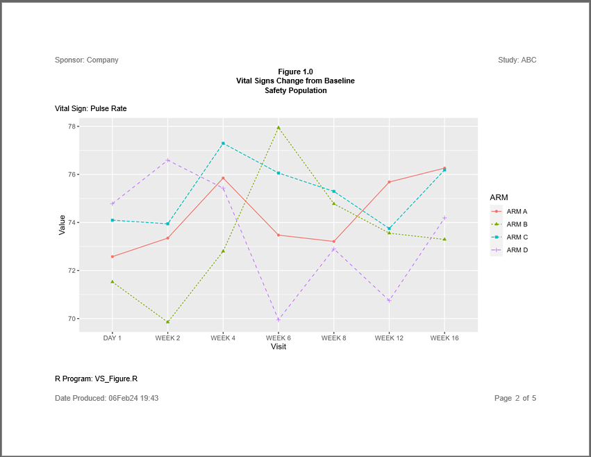

# sassy 

<!-- badges: start -->

[](https://cran.r-project.org/package=sassy)
[](https://cran.r-project.org/package=sassy)
[](https://cran.r-project.org/package=sassy)
[](https://travis-ci.com/dbosak01/sassy)

<!-- badges: end -->

The **sassy** package is a meta-package that aims to make R easier for SAS®
programmers.  The package brings several familiar SAS® concepts to R, including
data libraries, formats and format catalogs, data dictionaries, a data step,
a traceable log, and a reporting package with a variety of printable report types.

The **sassy** family of packages is meant to compliment, not replace, the 
**tidyverse**.  While the **tidyverse** focuses mainly on data manipulation, 
the **sassy** packages are focused more on formatting and reporting. 
For most projects, it is expected that users will load both the 
**tidyverse** and **sassy** meta-packages.  Between these two, 
the user will typically have everything they need to easily manipulate and 
report on their data.  

Note that the **sassy** meta-package and sub-packages were written 
independently, and the authors have no association
with, approval of, or endorsement by SAS® Institute or RStudio®.  

## Included Packages
The **sassy** meta-package contains the following packages:

* **logr**: Produces a traceable log
* **fmtr**: Provides functions for formatting data and a creating a format catalog
* **libr**: Gives you the ability to define a libname, generate 
a data dictionary, and simulate a data step
* **reporter**: A reporting package with easy layout capabilities and the 
ability to write reports in TXT, RTF, and PDF file formats

## How to use **sassy**
All combined, the above set of packages constitute a system of functions
that make working in R much easier. With the **sassy** system, you
can define a library in one step, save and re-use formats, step through
data row-by-row, and get a report out easily, without depending on RMarkdown.
Importantly, all of the above activities can be recorded in a traceable log.

### Example #1: Listing
Here is an example of a simple listing using the **sassy** system of 
functions.  The data used for these examples is included in the **sassy**
package, and also available for download 
<a href="https://github.com/dbosak01/sassy/tree/master/inst/extdata/sassy_data.zip">here</a>.  

Note the following about this example:
  * The **logr** package combined with **tidylog** provides (mostly) automatic 
  logging. 
  * The `sep()` function creates a nice separator in the log to help keep it 
  organized and readable. 
  * The `put()` function will write anything you want to the log, similar to a 
  SAS® `%put()` statement.
  * The `libname()` function loads an entire directory of data files in one step.
  * The `lib_load()` function loads the data into the workspace for easy access.
  * The **reporter** package provides simple, declarative reporting and a 
  choice of printable output formats.

```
library(tidyverse)
library(sassy)
library(tidylog, warn.conflicts = FALSE)

options("tidylog.display" = list(log_print),
        "logr.notes" = FALSE)

# Get path to temp directory
tmp <- tempdir() 

# Get path to sample data
pkg <- system.file("extdata", package = "sassy")

# Open log
lgpth <- log_open(file.path(tmp, "example1.log"))

sep("Get Data")

# Define data library
libname(sdtm, pkg, "csv") %>% put()

# Load library into workspace
lib_load(sdtm)

sep("Write Report")

# Define table object
tbl <- create_table(sdtm.DM) %>% 
  define(USUBJID, id_var = TRUE)
  
# Construct report path
pth <- file.path(tmp, "output/l_dm.rtf") %>% put()

# Define report object
rpt <- create_report(pth, , output_type = "RTF") %>% 
  page_header("Sponsor: Company", "Study: ABC") %>% 
  titles("Listing 1.0", "SDTM Demographics") %>% 
  add_content(tbl, align = "left") %>% 
  page_footer(Sys.time(), "CONFIDENTIAL", "Page [pg] of [tpg]")
  
# Write report to file system
write_report(rpt) %>% put()

# Unload data
lib_unload(sdtm)

# Close log
log_close()

# Disconnect from tidylog
options("tidylog.display" = NULL)

```


Here is the log produced by the above listing example:

```
=========================================================================
Log Path: C:/Users/User/AppData/Local/Temp/RtmpsRnVcf/log/example1.log
Working Directory: C:/packages/sassy
User Name: User
R Version: 4.0.3 (2020-10-10)
Machine: ZB15-5CD00276ZY x86-64
Operating System: Windows 10 x64 build 18363
Log Start Time: 2020-12-13 17:27:21
=========================================================================

=========================================================================
Get Data
=========================================================================

# library 'sdtm': 10 items
- attributes: csv not loaded
- path: data
- items:
     Name Extension  Rows Cols     Size        LastModified
1      AE       csv   150   27    88 Kb 2020-09-18 14:30:23
2      DA       csv  3587   18 527.8 Kb 2020-09-18 14:30:23
3      DM       csv    87   24  45.1 Kb 2020-09-18 14:30:23
4      DS       csv   174    9  33.6 Kb 2020-09-18 14:30:23
5      EX       csv    84   11  25.9 Kb 2020-09-18 14:30:23
6      IE       csv     2   14  12.9 Kb 2020-09-18 14:30:23
7      PE       csv  1854   17 277.7 Kb 2020-09-18 14:30:24
8  SUPPEX       csv   639   10  63.5 Kb 2020-09-18 14:30:24
9      SV       csv   685   10  69.8 Kb 2020-09-18 14:30:24
10     VS       csv  3358   17 466.9 Kb 2020-09-18 14:30:24

=========================================================================
Write Report
=========================================================================

C:\Users\User\AppData\Local\Temp\RtmpsRnVcf/output/l_dm.rtf

# A report specification: 9 pages
- file_path: 'C:\Users\User\AppData\Local\Temp\RtmpsRnVcf/output/l_dm.rtf'
- output_type: RTF
- units: inches
- orientation: landscape
- line size/count: 108/48
- page_header: left=Sponsor: Company right=Study: ABC
- title 1: 'Listing 1.0'
- title 2: 'SDTM Demographics'
- page_footer: left=2020-12-13 17:27:41 center=CONFIDENTIAL right=Page [pg] of [tpg]
- content:
# A table specification:
- data: tibble 'sdtm.DM' 87 rows 24 cols
- show_cols: all
- use_attributes: all
- define: USUBJID id_var='TRUE'

=========================================================================
Log End Time: 2020-12-13 17:27:45
Log Elapsed Time: 0 00:00:23
=========================================================================


```

Here is an image of the first page of the RTF report produced by the
above listing example:


### Example 2: Summary Table

The second example produces a summary table of selected Vital Signs for Placebo
vs. Treated groups.  The report shows statistics for both baseline 
and after-treatment time points.   

Note the following about this example:
  * The `datastep()` function allows for a complex conditional in the middle
  of a **dplyr** pipeline.  
  * The `%eq%` operator allows comparing of a variable that contains many NA
  values, without error.
  * The **fmtr** package provides several convenient functions for 
  calculating and formatting summary statistics.
  * The **reporter** package supports spanning headers and 'N=' population
  counts in the header labels.

```
library(tidyverse)
library(sassy)
library(tidylog, warn.conflicts = FALSE)

options("tidylog.display" = list(log_print),
        "logr.notes" = FALSE)

# Get path to temp directory
tmp <- tempdir() 

# Get path to sample data
pkg <- system.file("extdata", package = "sassy")

# Open log
lgpth <- log_open(file.path(tmp, "example2.log"))

sep("Prepare Data")

# Create libname for csv data
libname(sdtm, pkg, "csv") %>% put()

# Load data into workspace
lib_load(sdtm)

# Join and prepare data
prep <- sdtm.DM %>% 
  left_join(sdtm.VS, by = c("USUBJID" = "USUBJID")) %>% 
  select(USUBJID, VSTESTCD, VISIT, VISITNUM, VSSTRESN, ARM, VSBLFL) %>% 
  filter(VSTESTCD %in% c("PULSE", "RESP", "TEMP", "DIABP", "SYSBP"), 
    !(VISIT == "SCREENING" & VSBLFL != "Y")) %>% 
  arrange(USUBJID, VSTESTCD, VISITNUM) %>% 
  group_by(USUBJID, VSTESTCD) %>% 
  datastep(retain = list(BSTRESN = 0), {
  
    # Combine treatment groups
    # And distingish baseline time points
    if (ARM == "ARM A") {
      
      if (VSBLFL %eq% "Y") {
        GRP <- "A_BASE"
      } else {
        GRP <- "A_TRT"
      }
      
    } else {
    
      if (VSBLFL %eq% "Y") {
        GRP <- "O_BASE"
      } else {
        GRP <- "O_TRT"
      }
      
    }
  
    # Populate baseline value
    if (first.)
      BSTRESN = VSSTRESN
      
  }) %>% 
  ungroup() %>% 
  put()

# Get population counts
pop_A <- prep %>% select(USUBJID, GRP) %>% filter(GRP == "A_BASE") %>% 
  distinct() %>% count() %>% deframe() 
pop_O <- prep %>% select(USUBJID, GRP) %>% filter(GRP == "O_BASE") %>% 
  distinct() %>% count() %>% deframe() 

# Prepare final data frame
final <- prep %>% 
  select(VSTESTCD, GRP, VSSTRESN, BSTRESN) %>% 
  group_by(VSTESTCD, GRP) %>% 
  summarize(Mean = fmt_mean_sd(VSSTRESN),
            Median = fmt_median(VSSTRESN),
            Quantiles = fmt_quantile_range(VSSTRESN),
            Range = fmt_range(VSSTRESN)) %>% 
  ungroup() %>% 
  pivot_longer(cols = c(Mean, Median, Quantiles, Range),
               names_to = "stats",
               values_to = "values") %>% 
  pivot_wider(names_from = GRP,
              values_from = values) %>% 
  put()
  

sep("Create Report")

# Set up labels 
lbls <- c(PULSE = "Pulse", 
          TEMP = "Temperature °C", 
          RESP = "Respirations/min", 
          SYSBP = "Systolic Blood Pressure", 
          DIABP = "Diastolic Blood Pressure")

# Apply sort
final <- final %>% 
  mutate(VSTESTCD = factor(VSTESTCD, levels = names(lbls))) %>% 
  arrange(VSTESTCD)

# Define table object
tbl <- create_table(final) %>% 
  spanning_header(A_BASE, A_TRT, "Placebo", n = pop_A) %>% 
  spanning_header(O_BASE, O_TRT, "Treated", n = pop_O) %>% 
  column_defaults(width = 1.25, align = "center") %>% 
  stub(c(VSTESTCD, stats), width = 2.5) %>% 
  define(VSTESTCD, "Vital Sign", format = lbls, 
         blank_after = TRUE, dedupe = TRUE, label_row = TRUE) %>% 
  define(stats, indent = .25) %>% 
  define(A_BASE, "Baseline") %>% 
  define(A_TRT, "After Treatment") %>% 
  define(O_BASE, "Baseline") %>% 
  define(O_TRT, "After Treatment")

# Construct output path
pth <- file.path(tmp, "output/t_vs.rtf")

# Define report object
rpt <- create_report(pth, output_type = "RTF") %>% 
  page_header("Sponsor: Company", "Study: ABC") %>% 
  titles("Table 4.0", "Selected Vital Signs") %>% 
  add_content(tbl, align = "center") %>% 
  page_footer(Sys.time(), "CONFIDENTIAL", "Page [pg] of [tpg]")
  
# Write report to file system  
write_report(rpt) %>% put()

# Unload data from workspace
lib_unload(sdtm)

# Close log
log_close()

# Disconnect logr from tidylog
options("tidylog.display" = FALSE)

```

Here is the log from the above example:

```
========================================================================= 
Log Path: C:/Users/User/AppData/Local/Temp/RtmpsRnVcf/log/example2.log 
Working Directory: C:/packages/sassy 
User Name: User 
R Version: 4.0.3 (2020-10-10) 
Machine: ZB15-5CD00276ZY x86-64 
Operating System: Windows 10 x64 build 18363 
Log Start Time: 2020-12-13 22:27:46 
========================================================================= 

========================================================================= 
Prepare Data 
========================================================================= 

# library 'sdtm': 10 items
- attributes: csv not loaded
- path: data
- items:
     Name Extension  Rows Cols     Size        LastModified
1      AE       csv   150   27    88 Kb 2020-09-18 14:30:23
2      DA       csv  3587   18 527.8 Kb 2020-09-18 14:30:23
3      DM       csv    87   24  45.1 Kb 2020-09-18 14:30:23
4      DS       csv   174    9  33.6 Kb 2020-09-18 14:30:23
5      EX       csv    84   11  25.9 Kb 2020-09-18 14:30:23
6      IE       csv     2   14  12.9 Kb 2020-09-18 14:30:23
7      PE       csv  1854   17 277.7 Kb 2020-09-18 14:30:24
8  SUPPEX       csv   639   10  63.5 Kb 2020-09-18 14:30:24
9      SV       csv   685   10  69.8 Kb 2020-09-18 14:30:24
10     VS       csv  3358   17 466.9 Kb 2020-09-18 14:30:24

left_join: added 18 columns (STUDYID.x, DOMAIN.x, STUDYID.y, DOMAIN.y, VSSEQ, …)

           > rows only in x       0

           > rows only in y  (    0)

           > matched rows     3,358    (includes duplicates)

           >                 =======

           > rows total       3,358

select: dropped 33 variables (STUDYID.x, DOMAIN.x, SUBJID, RFSTDTC, RFENDTC, …)

filter: removed 590 rows (18%), 2,768 rows remaining

group_by: 2 grouping variables (USUBJID, VSTESTCD)

ungroup: no grouping variables

# A tibble: 2,768 x 9
   USUBJID    VSTESTCD VISIT   VISITNUM VSSTRESN ARM   VSBLFL BSTRESN GRP   
   <chr>      <chr>    <chr>      <dbl>    <dbl> <chr> <chr>    <dbl> <chr> 
 1 ABC-01-049 DIABP    DAY 1          1       76 ARM D Y           76 O_BASE
 2 ABC-01-049 DIABP    WEEK 2         2       66 ARM D <NA>        76 O_TRT 
 3 ABC-01-049 DIABP    WEEK 4         4       84 ARM D <NA>        76 O_TRT 
 4 ABC-01-049 DIABP    WEEK 6         6       68 ARM D <NA>        76 O_TRT 
 5 ABC-01-049 DIABP    WEEK 8         8       80 ARM D <NA>        76 O_TRT 
 6 ABC-01-049 DIABP    WEEK 12       12       70 ARM D <NA>        76 O_TRT 
 7 ABC-01-049 DIABP    WEEK 16       16       70 ARM D <NA>        76 O_TRT 
 8 ABC-01-049 PULSE    DAY 1          1       84 ARM D Y           84 O_BASE
 9 ABC-01-049 PULSE    WEEK 2         2       84 ARM D <NA>        84 O_TRT 
10 ABC-01-049 PULSE    WEEK 4         4       76 ARM D <NA>        84 O_TRT 
# ... with 2,758 more rows

select: dropped 7 variables (VSTESTCD, VISIT, VISITNUM, VSSTRESN, ARM, …)

filter: removed 2,669 rows (96%), 99 rows remaining

distinct: removed 79 rows (80%), 20 rows remaining

count: now one row and one column, ungrouped

select: dropped 7 variables (VSTESTCD, VISIT, VISITNUM, VSSTRESN, ARM, …)

filter: removed 2,435 rows (88%), 333 rows remaining

distinct: removed 266 rows (80%), 67 rows remaining

count: now one row and one column, ungrouped

select: dropped 5 variables (USUBJID, VISIT, VISITNUM, ARM, VSBLFL)

group_by: 2 grouping variables (VSTESTCD, GRP)

summarize: now 20 rows and 6 columns, one group variable remaining (VSTESTCD)

ungroup: no grouping variables

pivot_longer: reorganized (Mean, Median, Quantiles, Range) into (stats, values) [was 20x6, now 80x4]

pivot_wider: reorganized (GRP, values) into (A_BASE, A_TRT, O_BASE, O_TRT) [was 80x4, now 20x6]

# A tibble: 20 x 6
   VSTESTCD stats     A_BASE        A_TRT         O_BASE        O_TRT        
   <chr>    <chr>     <chr>         <chr>         <chr>         <chr>        
 1 DIABP    Mean      77.2 (10.7)   77.1 (8.1)    77.5 (8.1)    76.9 (9.2)   
 2 DIABP    Median    78.5          78.0          78.0          78.0         
 3 DIABP    Quantiles 70.0 - 82.5   72.0 - 82.0   70.2 - 82.0   70.0 - 83.8  
 4 DIABP    Range     54 - 96       50 - 98       61 - 95       50 - 104     
 5 PULSE    Mean      72.8 (10.1)   74.6 (10.2)   73.6 (9.7)    74.0 (9.9)   
 6 PULSE    Median    72.0          74.0          72.0          72.0         
 7 PULSE    Quantiles 66.0 - 76.0   67.0 - 80.0   67.5 - 79.5   66.0 - 80.0  
 8 PULSE    Range     60 - 103      54 - 102      52 - 100      50 - 109     
 9 RESP     Mean      16.5 (2.5)    15.8 (3.4)    16.0 (3.1)    15.4 (3.4)   
10 RESP     Median    16.0          16.0          16.0          16.0         
11 RESP     Quantiles 16.0 - 18.0   16.0 - 18.0   15.5 - 18.0   12.0 - 18.0  
12 RESP     Range     12 - 20       8 - 24        8 - 22        8 - 24       
13 SYSBP    Mean      128.2 (16.7)  130.4 (17.6)  126.7 (15.5)  125.9 (15.2) 
14 SYSBP    Median    125.5         126.0         123.0         124.0        
15 SYSBP    Quantiles 117.5 - 140.0 118.0 - 140.0 116.0 - 138.0 115.2 - 135.0
16 SYSBP    Range     98 - 161      95 - 184      100 - 164     82 - 180     
17 TEMP     Mean      36.5 (0.4)    36.5 (0.3)    36.4 (0.5)    36.3 (0.4)   
18 TEMP     Median    36.4          36.5          36.4          36.3         
19 TEMP     Quantiles 36.2 - 36.9   36.2 - 36.6   36.2 - 36.6   36.1 - 36.5  
20 TEMP     Range     35.9 - 37.4   35.8 - 37.3   35.3 - 39.8   34.4 - 38.2  

========================================================================= 
Create Report 
========================================================================= 

mutate: converted 'VSTESTCD' from character to factor (0 new NA)

# A report specification: 1 pages
- file_path: 'C:\Users\User\AppData\Local\Temp\RtmpsRnVcf/output/t_vs.rtf'
- output_type: RTF
- units: inches
- orientation: landscape
- line size/count: 108/48
- page_header: left=Sponsor: Company right=Study: ABC
- title 1: 'Table 4.0'
- title 2: 'Selected Vital Signs'
- page_footer: left=2020-12-13 22:28:37 center=CONFIDENTIAL right=Page [pg] of [tpg]
- content: 
# A table specification:
- data: tibble 'final' 20 rows 6 cols
- show_cols: all
- use_attributes: all
- spanning_header: from='A_BASE' to='A_TRT' 'Placebo' level=1 
- spanning_header: from='O_BASE' to='O_TRT' 'Treated' level=1 
- stub: VSTESTCD stats width=2.5 align='left' 
- define: VSTESTCD 'Vital Sign' dedupe='TRUE' 
- define: stats 
- define: A_BASE 'Baseline' 
- define: A_TRT 'After Treatment' 
- define: O_BASE 'Baseline' 
- define: O_TRT 'After Treatment' 

========================================================================= 
Log End Time: 2020-12-13 22:28:37 
Log Elapsed Time: 0 00:00:50 
========================================================================= 


```

And here is the output report:


### Example #3: Figure with Page By

The **sassy** system of functions also supports reports with graphics.  Plots
from the popular **ggplot2** package can be added to a report.
The following example illustrates such a report. 

Note the following about this example:
* The plot is created as a single plot with no by-groups
* The plot is added to the report with the `add_content()` function, just
like the tables in the previous examples.
* The `page_by()` function on the `create_report()` statement generates the 
paging for both the report and plots.
* Few other R packages support this type of reporting capability.

```
library(tidyverse)
library(sassy)
library(tidylog, warn.conflicts = FALSE)

options("tidylog.display" = list(log_print),
        "logr.notes" = FALSE)

# Get path to temp directory
tmp <- tempdir() 

# Get path to sample data
pkg <- system.file("extdata", package = "sassy")

# Open log
lgpth <- log_open(file.path(tmp, "example3.log"))

sep("Prepare Data")

# Create libname for csv data
libname(sdtm, pkg, "csv") %>% put()

# Load data into workspace
lib_load(sdtm)

put("Perform joins and basic filters")
prep <- sdtm.DM %>% 
  left_join(sdtm.VS, by = c("USUBJID" = "USUBJID")) %>% 
  select(USUBJID, ARMCD, ARM, VSTESTCD, VSTEST, VSORRES, VISITNUM, VISIT) %>% 
  filter(VSTESTCD %in% c("SYSBP", "DIABP", "PULSE", "TEMP", "RESP"), 
         ARMCD != "SCRNFAIL") %>% put()
  
put("Group and summarize")
final <- prep %>% 
  group_by(ARMCD, ARM, VSTESTCD, VSTEST, VISITNUM, VISIT) %>% 
  summarize(MEAN = mean(VSORRES, na.rm = TRUE)) %>% 
  filter(VISITNUM > 0 & VISITNUM < 20) %>% 
  mutate(VISIT = factor(VISIT, levels = c("DAY 1", "WEEK 2", "WEEK 4",
                                          "WEEK 6","WEEK 8", "WEEK 12",
                                          "WEEK 16"))) %>% 
  ungroup() %>% put()


sep("Create plots and print report")

# Create plot
p <- final %>% 
  ggplot(mapping = aes(y = MEAN, x = VISIT , group = ARM)) + 
  geom_point(aes(shape = ARM, color = ARM)) + 
  geom_line(aes(linetype = ARM, color = ARM)) +
  scale_x_discrete(name = "Visit") +
  scale_y_continuous(name = "Value")

# Construct output path
pth <- file.path(tmp, "output/f_vs.rtf")

# Define report object
rpt <- create_report(pth, output_type = "RTF") %>% 
  set_margins(top = 1, bottom = 1) %>% 
  page_header("Sponsor: Company", "Study: ABC") %>% 
  page_by(VSTEST, "Vital Sign: ", blank_row = "none") %>% 
  titles("Figure 1.0", "Vital Signs Change from Baseline", 
         "Safety Population") %>% 
  add_content(create_plot(p, 4.5, 9)) %>% 
  footnotes("R Program: VS_Figure.R") %>% 
  page_footer(paste0("Date Produced: ", fapply(Sys.time(), "%d%b%y %H:%M")), 
              right = "Page [pg] of [tpg]")

# Write report to file system
write_report(rpt) %>% put()

# Close log
log_close()

# Disconnect logr from tidylog
options("tidylog.display" = NULL)


```

Here is the log for the above report:

```

========================================================================= 
Log Path: C:/Users/User/AppData/Local/Temp/RtmpsRnVcf/log/example3.log 
Working Directory: C:/packages/sassy 
User Name: User 
R Version: 4.0.3 (2020-10-10) 
Machine: ZB15-5CD00276ZY x86-64 
Operating System: Windows 10 x64 build 18363 
Log Start Time: 2020-12-14 22:43:52 
========================================================================= 

========================================================================= 
Prepare Data 
========================================================================= 

# library 'sdtm': 10 items
- attributes: csv not loaded
- path: C:/packages/sassy/inst/extdata
- items:
     Name Extension Rows Cols     Size        LastModified
1      AE       csv  150   27  88.1 Kb 2020-09-18 14:30:23
2      DA       csv 3587   18 527.8 Kb 2020-09-18 14:30:23
3      DM       csv   87   24  45.1 Kb 2020-09-18 14:30:23
4      DS       csv  174    9  33.7 Kb 2020-09-18 14:30:23
5      EX       csv   84   11    26 Kb 2020-09-18 14:30:23
6      IE       csv    2   14    13 Kb 2020-09-18 14:30:23
7      PE       csv 1854   17 277.8 Kb 2020-09-18 14:30:24
8  SUPPEX       csv  639   10  63.6 Kb 2020-09-18 14:30:24
9      SV       csv  685   10  69.9 Kb 2020-09-18 14:30:24
10     VS       csv 3358   17   467 Kb 2020-09-18 14:30:24

Perform joins and basic filters 

left_join: added 18 columns (STUDYID.x, DOMAIN.x, STUDYID.y, DOMAIN.y, VSSEQ, …)

           > rows only in x       0

           > rows only in y  (    0)

           > matched rows     3,358    (includes duplicates)

           >                 =======

           > rows total       3,358

select: dropped 32 variables (STUDYID.x, DOMAIN.x, SUBJID, RFSTDTC, RFENDTC, …)

filter: removed 246 rows (7%), 3,112 rows remaining

# A tibble: 3,112 x 8
   USUBJID    ARMCD ARM   VSTESTCD VSTEST                   VSORRES VISITNUM VISIT    
   <chr>      <chr> <chr> <chr>    <chr>                      <dbl>    <dbl> <chr>    
 1 ABC-01-049 4     ARM D DIABP    Diastolic Blood Pressure      78        0 SCREENING
 2 ABC-01-049 4     ARM D DIABP    Diastolic Blood Pressure      76        1 DAY 1    
 3 ABC-01-049 4     ARM D DIABP    Diastolic Blood Pressure      66        2 WEEK 2   
 4 ABC-01-049 4     ARM D DIABP    Diastolic Blood Pressure      84        4 WEEK 4   
 5 ABC-01-049 4     ARM D DIABP    Diastolic Blood Pressure      68        6 WEEK 6   
 6 ABC-01-049 4     ARM D DIABP    Diastolic Blood Pressure      80        8 WEEK 8   
 7 ABC-01-049 4     ARM D DIABP    Diastolic Blood Pressure      70       12 WEEK 12  
 8 ABC-01-049 4     ARM D DIABP    Diastolic Blood Pressure      70       16 WEEK 16  
 9 ABC-01-049 4     ARM D PULSE    Pulse Rate                    92        0 SCREENING
10 ABC-01-049 4     ARM D PULSE    Pulse Rate                    84        1 DAY 1    
# ... with 3,102 more rows

Group and summarize 

group_by: 6 grouping variables (ARMCD, ARM, VSTESTCD, VSTEST, VISITNUM, …)

summarize: now 175 rows and 7 columns, 5 group variables remaining (ARMCD, ARM, VSTESTCD, VSTEST, VISITNUM)

filter (grouped): removed 35 rows (20%), 140 rows remaining

mutate (grouped): converted 'VISIT' from character to factor (0 new NA)

ungroup: no grouping variables

# A tibble: 140 x 7
   ARMCD ARM   VSTESTCD VSTEST                   VISITNUM VISIT    MEAN
   <chr> <chr> <chr>    <chr>                       <dbl> <fct>   <dbl>
 1 1     ARM A DIABP    Diastolic Blood Pressure        1 DAY 1    76.5
 2 1     ARM A DIABP    Diastolic Blood Pressure        2 WEEK 2   77.6
 3 1     ARM A DIABP    Diastolic Blood Pressure        4 WEEK 4   78.7
 4 1     ARM A DIABP    Diastolic Blood Pressure        6 WEEK 6   74.4
 5 1     ARM A DIABP    Diastolic Blood Pressure        8 WEEK 8   77.1
 6 1     ARM A DIABP    Diastolic Blood Pressure       12 WEEK 12  78.4
 7 1     ARM A DIABP    Diastolic Blood Pressure       16 WEEK 16  77.3
 8 1     ARM A PULSE    Pulse Rate                      1 DAY 1    72.6
 9 1     ARM A PULSE    Pulse Rate                      2 WEEK 2   73.4
10 1     ARM A PULSE    Pulse Rate                      4 WEEK 4   75.8
# ... with 130 more rows

========================================================================= 
Create plots and print report 
========================================================================= 

# A report specification: 5 pages
- file_path: 'C:\Users\User\AppData\Local\Temp\RtmpsRnVcf/output/f_vs.rtf'
- output_type: RTF
- units: inches
- orientation: landscape
- line size/count: 108/41
- page by: VSTEST
- page_header: left=Sponsor: Company right=Study: ABC
- title 1: 'Figure 1.0'
- title 2: 'Vital Signs Change from Baseline'
- title 3: 'Safety Population'
- footnote 1: 'R Program: VS_Figure.R'
- page_footer: left=Date Produced: 14Dec20 22:43 center= right=Page [pg] of [tpg]
- content: 
# A plot specification: 
- data: 140 rows, 7 cols
- layers: 2
- height: 4.5
- width: 9

========================================================================= 
Log End Time: 2020-12-14 22:43:56 
Log Elapsed Time: 0 00:00:04 
========================================================================= 


```

And here is the first three page of the report:





## Package Disclaimer
Note that the **sassy** family of packages is intended to be used with small and 
medium-sized data sets.  It is not recommended for big data, as big data
requires very careful control over which data is or is not loaded into memory.
The **sassy** packages, on the other hand, tend to load all data into memory 
indiscriminately.
