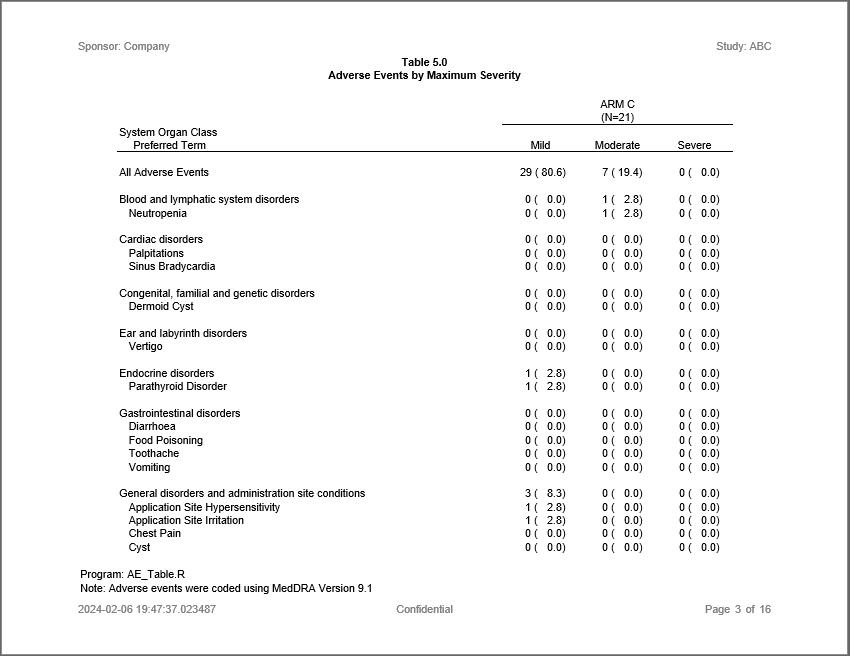

```{r setup, include = FALSE}
knitr::opts_chunk$set(
  collapse = TRUE,
  comment = "#>"
)
```
The fourth example produces an Adverse Events table by severity, with
treatment groups on separate pages. The report shows statistics for All 
Adverse Events and System Organ Class/Preferred Term.   

## Program

Note the following about this example:

  * The `libname()` function from the **[libr](https://libr.r-sassy.org)** 
  package makes it easy to load the entire data library.
  * Functions from the **[procs](https://procs.r-sassy.org)** package 
  make the code look almost like a SAS® program.   
  * The **[reporter](https://reporter.r-sassy.org)** package is 
  able to wrap treatment groups to separate pages using the _page_wrap_
  property.  
  * The **[reporter](https://reporter.r-sassy.org)** package is also
  able to easily handle page breaks, while still respecting the 
  established margins.

```{r eval=FALSE, echo=TRUE}
library(sassy)

options("logr.autolog" = TRUE, 
        "logr.notes" = FALSE,
        "logr.on" = TRUE,
        "procs.print" = FALSE)

# Get temp directory
tmp <- tempdir()

# Open log
lf <- log_open(file.path(tmp, "example4.log"))

# Get data
dir <- system.file("extdata", package = "sassy")


# Get Data ----------------------------------------------------------------

sep("Prepare Data")

# Create libname for csv data
libname(sdtm, dir, "csv", quiet = TRUE) 

# Load data into workspace
lib_load(sdtm) 

put("Filter DM data")
datastep(sdtm.DM, 
         keep = v(USUBJID, ARM, ARMCD),
         where = expression(ARM != "SCREEN FAILURE"), {}) -> dm

put("Get population counts")
proc_freq(dm, tables = ARM, 
          output = long, 
          options = v(nopercent, nonobs)) -> arm_pop 

put ("Create lookup for AE severity")
sevn <- c(MILD = 1, MODERATE = 2, SEVERE = 3) |> put()

put("Prepare table data")
datastep(sdtm.AE, merge = dm, 
         merge_by = "USUBJID",
         merge_in = v(inA, inB),
         keep = v(USUBJID, ARM, AESEV, AESEVN, AESOC, AEDECOD),
         where = expression(inB == 1 & inA != 0), 
         {
           AESEVN <- fapply(AESEV, sevn)   
         }) -> ae_sub 


# Prepare Formats ---------------------------------------------------------

sep("Prepare Formats")
fc <- fcat(CNT = "%3d",
           PCT = "(%5.1f)",
           CAT2 = c(MILD = "Mild", 
                    MODERATE = "Moderate", 
                    SEVERE = "Severe"))


# Perform Calculations ----------------------------------------------------
sep("Perform Calculations")


put("Get SOC Frequencies")
proc_freq(ae_sub, 
          tables = v(AESOC * AESEV),
          by = "ARM") -> ae_soc 


put("Combine columns for SOC")
datastep(ae_soc, 
         format = fc,
         rename = list(VAR1 = "VAR", CAT1 = "CAT"),
         drop = v(VAR2, CNT, PCT),
         {
           VARORD <- 1
           CNTPCT <- fapply2(CNT, PCT)
           CAT2 <- fapply(CAT2)
           
         }) -> ae_soc_c


put("Pivot SOC frequencies")
proc_transpose(ae_soc_c, id = v(BY, CAT2), 
               var = CNTPCT, 
               copy = v(VAR, VARORD),
               by = CAT) -> ae_soc_t 


put("Get PT Frequencies")
proc_freq(ae_sub, 
          tables = "AEDECOD * AESEV",
          by = "ARM",
          options = nonobs) -> ae_pt 

put("Get unique SOC and PT combinations")
proc_sort(ae_sub, keep = v(AESOC, AEDECOD), 
          by = v(AESOC, AEDECOD), options = nodupkey) -> evnts 

put("Combine columns for PT")
datastep(ae_pt, 
         format = fc,
         rename = list(VAR1 = "VAR", CAT1 = "CAT"),
         drop = v(VAR2, CNT, PCT),
         {
           VARORD <- 2
           CNTPCT <- fapply2(CNT, PCT)
           CAT2 <- fapply(CAT2)
           
         }) -> ae_pt_c 


put("Pivot PT frequencies")
proc_transpose(ae_pt_c, id = v(BY, CAT2), 
               var = CNTPCT, 
               copy = v(VAR, VARORD),
               by = CAT) -> ae_pt_t 

nms <- names(ae_soc_t) 

put("Join in SOC")
datastep(ae_pt_t, merge = evnts, rename = c(CAT = "CAT2", AESOC = "CAT"), 
         merge_by = c(CAT = "AEDECOD"), {
           CAT <- toTitleCase(tolower(CAT))
         }) -> ae_pt_tj 

put("Stack SOC and PT counts")
datastep(ae_soc_t, set = ae_pt_tj, 
         keep = c("VAR", "CAT", "CAT2", "VARORD", 
                  find.names(ae_pt_tj, "ARM*")), {}) -> ae_soc_pt 


aefinal <- proc_sort(ae_soc_pt, by = v( CAT, VARORD, CAT2))


# All Adverse Events ------------------------------------------------------

put("Get frequencies for all events")
proc_freq(ae_sub, tables = "AESEV", by = v(ARM)) -> allfreq 

put("Combine all events.")
datastep(allfreq, format = fc,
         drop = v(N, CNT, PCT),
         {
           
           CNTPCT <- fapply2(CNT, PCT)
           CAT <- fapply(CAT, fc$CAT2)
           
           
         }) -> allfreqm 

put("Prepare data for reporting")
proc_transpose(allfreqm, id = v(BY, CAT), 
               var = CNTPCT, copy = VAR, name = CAT) -> allfreqt 


# Final Data --------------------------------------------------------------


sep("Create final data frame")
datastep(allfreqt, set = aefinal, 
         keep = names(aefinal),
         {
           if (VAR == "AESEV")
             CAT <- "All Adverse Events"
           
         }) -> allfinal 

# Print Report ----------------------------------------------------------

sep("Create and print report")

put("Create table object")
tbl <- create_table(allfinal, first_row_blank = TRUE, width = 9) |> 
  column_defaults(from = `ARM A.Mild`, to = `ARM D.Severe`, width = 1, align = "center") |> 
  spanning_header("ARM A.Mild", "ARM A.Severe", label = "ARM A", n = arm_pop["ARM A"]) |>
  spanning_header("ARM B.Mild", "ARM B.Severe", label = "ARM B", n = arm_pop["ARM B"]) |>
  spanning_header("ARM C.Mild", "ARM C.Severe", label = "ARM C", n = arm_pop["ARM C"]) |>
  spanning_header("ARM D.Mild", "ARM D.Severe", label = "ARM D", n = arm_pop["ARM D"]) |>
  stub(vars = c("CAT", "CAT2"), label = "System Organ Class\n   Preferred Term", width = 5) |> 
  define(CAT, blank_after = TRUE) |> 
  define(CAT2, indent = .25) |> 
  define(`ARM A.Mild`, label = "Mild") |> 
  define(`ARM A.Moderate`, label = "Moderate") |> 
  define(`ARM A.Severe`, label = "Severe") |> 
  define(`ARM B.Mild`,  label = "Mild", page_wrap = TRUE) |> 
  define(`ARM B.Moderate`, label = "Moderate") |> 
  define(`ARM B.Severe`, label = "Severe") |> 
  define(`ARM C.Mild`, label = "Mild", page_wrap = TRUE) |> 
  define(`ARM C.Moderate`, label = "Moderate") |> 
  define(`ARM C.Severe`, label = "Severe") |> 
  define(`ARM D.Mild`, label = "Mild", page_wrap = TRUE) |> 
  define(`ARM D.Moderate`,label = "Moderate") |> 
  define(`ARM D.Severe`, label = "Severe") |> 
  define(VAR, visible = FALSE) |> 
  define(VARORD, visible = FALSE)


put("Create report object")
rpt <- create_report(file.path(tmp, "example4.rtf"), output_type = "RTF", font = "Arial") |> 
  options_fixed(font_size = 10) |> 
  page_header("Sponsor: Company", "Study: ABC") |> 
  titles("Table 5.0", "Adverse Events by Maximum Severity", bold = TRUE) |> 
  add_content(tbl) |> 
  footnotes("Program: AE_Table.R",
            "Note: Adverse events were coded using MedDRA Version 9.1") |> 
  page_footer(Sys.time(), "Confidential", "Page [pg] of [tpg]") 

put("Print report")
res <- write_report(rpt) 


# Clean Up ----------------------------------------------------------------
sep("Clean Up")

put("Remove library from workspace")
lib_unload(sdtm)

put("Close log")
log_close()


# Uncomment to view report
# file.show(res$modified_path)

# Uncomment to view log
# file.show(lf)

```

## Output

Here are the first three pages of the output report:





## Log

Here is part of the log from the above example:

```
=========================================================================
Log Path: C:/Users/dbosa/AppData/Local/Temp/RtmpEBPgPu/log/example4.log
Program Path: C:/packages/Testing/procs/ProcsAE.R
Working Directory: C:/packages/Testing/procs
User Name: dbosa
R Version: 4.3.1 (2023-06-16 ucrt)
Machine: SOCRATES x86-64
Operating System: Windows 10 x64 build 22621
Base Packages: stats graphics grDevices utils datasets methods base Other
Packages: tidylog_1.0.2 stringr_1.5.0 procs_1.0.3 reporter_1.4.1 libr_1.2.8
fmtr_1.5.9 logr_1.3.4 common_1.0.8 sassy_1.1.0
Log Start Time: 2023-09-05 22:26:16.754728
=========================================================================

=========================================================================
Prepare Data
=========================================================================

# library 'sdtm': 7 items
- attributes: csv not loaded
- path: C:/Users/dbosa/AppData/Local/R/win-library/4.3/sassy/extdata
- items:
  Name Extension Rows Cols     Size
1   AE       csv  150   27  88.5 Kb
2   DM       csv   87   24  45.5 Kb
3   DS       csv  174    9  34.1 Kb
4   EX       csv   84   11  26.4 Kb
5   IE       csv    2   14  13.4 Kb
6   SV       csv  685   10  70.3 Kb
7   VS       csv 3358   17 467.4 Kb
         LastModified
1 2023-08-07 17:51:40
2 2023-08-07 17:51:40
3 2023-08-07 17:51:40
4 2023-08-07 17:51:40
5 2023-08-07 17:51:40
6 2023-08-07 17:51:40
7 2023-08-07 17:51:40

lib_load: library 'sdtm' loaded

Filter DM data

datastep: columns decreased from 24 to 3

# A tibble: 85 × 3
   USUBJID    ARM   ARMCD
   <chr>      <chr> <chr>
 1 ABC-01-049 ARM D 4    
 2 ABC-01-050 ARM B 2    
 3 ABC-01-051 ARM A 1    
 4 ABC-01-052 ARM C 3    
 5 ABC-01-053 ARM B 2    
 6 ABC-01-054 ARM D 4    
 7 ABC-01-055 ARM C 3    
 8 ABC-01-056 ARM A 1    
 9 ABC-01-113 ARM D 4    
10 ABC-01-114 ARM B 2    
# ℹ 75 more rows
# ℹ Use `print(n = ...)` to see more rows

Get population counts

proc_freq: input data set 85 rows and 3 columns
           tables: ARM
           output: long
           view: TRUE
           output: 1 datasets

# A tibble: 1 × 6
  VAR   STAT  `ARM A` `ARM B` `ARM C` `ARM D`
  <chr> <chr>   <dbl>   <dbl>   <dbl>   <dbl>
1 ARM   CNT        20      21      21      23

Create lookup for AE severity

    MILD MODERATE   SEVERE 
       1        2        3 

Prepare table data

datastep: columns decreased from 27 to 6

# A tibble: 145 × 6
   USUBJID    ARM   AESEV    AESEVN AESOC   AEDECOD
   <chr>      <chr> <chr>     <dbl> <chr>   <chr>  
 1 ABC-01-049 ARM D MODERATE      2 Invest… BLOOD …
 2 ABC-01-049 ARM D MODERATE      2 Invest… BLOOD …
 3 ABC-01-049 ARM D MILD          1 Muscul… MUSCUL…
 4 ABC-01-049 ARM D MILD          1 Nervou… HEADAC…
 5 ABC-01-049 ARM D MODERATE      2 Invest… LABORA…
 6 ABC-01-050 ARM B MILD          1 Respir… UPPER …
 7 ABC-01-050 ARM B MILD          1 Skin a… RASH   
 8 ABC-01-051 ARM A MILD          1 Nervou… HEADAC…
 9 ABC-01-051 ARM A MILD          1 Nervou… HEADAC…
10 ABC-01-051 ARM A MILD          1 Genera… INFLUE…
# ℹ 135 more rows
# ℹ Use `print(n = ...)` to see more rows

=========================================================================
Prepare Formats
=========================================================================

# A format catalog: 3 formats
- $CNT: type S, "%3d"
- $PCT: type S, "(%5.1f)"
- $CAT2: type V, 3 elements

=========================================================================
Perform Calculations
=========================================================================

Get SOC Frequencies

proc_freq: input data set 145 rows and 6 columns
           tables: AESOC * AESEV
           by: ARM
           view: TRUE
           output: 1 datasets

# A tibble: 240 × 8
   BY    VAR1  VAR2  CAT1   CAT2      N   CNT   PCT
   <chr> <chr> <chr> <chr>  <chr> <dbl> <dbl> <dbl>
 1 ARM A AESOC AESEV Blood… MILD     37     0     0
 2 ARM A AESOC AESEV Blood… MODE…    37     0     0
 3 ARM A AESOC AESEV Blood… SEVE…    37     0     0
 4 ARM A AESOC AESEV Cardi… MILD     37     0     0
 5 ARM A AESOC AESEV Cardi… MODE…    37     0     0
 6 ARM A AESOC AESEV Cardi… SEVE…    37     0     0
 7 ARM A AESOC AESEV Conge… MILD     37     0     0
 8 ARM A AESOC AESEV Conge… MODE…    37     0     0
 9 ARM A AESOC AESEV Conge… SEVE…    37     0     0
10 ARM A AESOC AESEV Ear a… MILD     37     0     0
# ℹ 230 more rows
# ℹ Use `print(n = ...)` to see more rows

Combine columns for SOC

datastep: columns decreased from 8 to 7

# A tibble: 240 × 7
   BY    VAR   CAT        CAT2      N VARORD CNTPCT
   <chr> <chr> <chr>      <chr> <dbl>  <dbl> <chr> 
 1 ARM A AESOC Blood and… Mild     37      1 "  0 …
 2 ARM A AESOC Blood and… Mode…    37      1 "  0 …
 3 ARM A AESOC Blood and… Seve…    37      1 "  0 …
 4 ARM A AESOC Cardiac d… Mild     37      1 "  0 …
 5 ARM A AESOC Cardiac d… Mode…    37      1 "  0 …
 6 ARM A AESOC Cardiac d… Seve…    37      1 "  0 …
 7 ARM A AESOC Congenita… Mild     37      1 "  0 …
 8 ARM A AESOC Congenita… Mode…    37      1 "  0 …
 9 ARM A AESOC Congenita… Seve…    37      1 "  0 …
10 ARM A AESOC Ear and l… Mild     37      1 "  0 …
# ℹ 230 more rows
# ℹ Use `print(n = ...)` to see more rows

Pivot SOC frequencies

proc_transpose: input data set 240 rows and 7 columns
                by: CAT
                var: CNTPCT
                id: BY CAT2
                copy: VAR VARORD
                name: NAME
                output dataset 20 rows and 16 columns

# A tibble: 20 × 16
   VAR   CAT              VARORD NAME  `ARM A.Mild`
   <chr> <chr>             <dbl> <chr> <chr>       
 1 AESOC Blood and lymph…      1 CNTP… "  0 (  0.0…
 2 AESOC Cardiac disorde…      1 CNTP… "  0 (  0.0…
 3 AESOC Congenital, fam…      1 CNTP… "  0 (  0.0…
 4 AESOC Ear and labyrin…      1 CNTP… "  0 (  0.0…
 5 AESOC Endocrine disor…      1 CNTP… "  0 (  0.0…
 6 AESOC Gastrointestina…      1 CNTP… "  0 (  0.0…
 7 AESOC General disorde…      1 CNTP… "  2 (  5.4…
 8 AESOC Infections and …      1 CNTP… "  7 ( 18.9…
 9 AESOC Injury, poisoni…      1 CNTP… "  0 (  0.0…
10 AESOC Investigations        1 CNTP… "  4 ( 10.8…
11 AESOC Metabolism and …      1 CNTP… "  0 (  0.0…
12 AESOC Musculoskeletal…      1 CNTP… "  3 (  8.1…
13 AESOC Neoplasms benig…      1 CNTP… "  0 (  0.0…
14 AESOC Nervous system …      1 CNTP… "  7 ( 18.9…
15 AESOC Psychiatric dis…      1 CNTP… "  0 (  0.0…
16 AESOC Renal and urina…      1 CNTP… "  1 (  2.7…
17 AESOC Respiratory, th…      1 CNTP… "  2 (  5.4…
18 AESOC Skin and subcut…      1 CNTP… "  1 (  2.7…
19 AESOC Surgical and me…      1 CNTP… "  0 (  0.0…
20 AESOC Vascular disord…      1 CNTP… "  0 (  0.0…
# ℹ 11 more variables: `ARM A.Moderate` <chr>,
#   `ARM A.Severe` <chr>, `ARM B.Mild` <chr>,
#   `ARM B.Moderate` <chr>, `ARM B.Severe` <chr>,
#   `ARM C.Mild` <chr>, `ARM C.Moderate` <chr>,
#   `ARM C.Severe` <chr>, `ARM D.Mild` <chr>,
#   `ARM D.Moderate` <chr>, `ARM D.Severe` <chr>

Get PT Frequencies

proc_freq: input data set 145 rows and 6 columns
           tables: AEDECOD * AESEV
           by: ARM
           view: TRUE
           output: 1 datasets

# A tibble: 876 × 7
   BY    VAR1    VAR2  CAT1       CAT2    CNT   PCT
   <chr> <chr>   <chr> <chr>      <chr> <dbl> <dbl>
 1 ARM A AEDECOD AESEV ANXIETY    MILD      0  0   
 2 ARM A AEDECOD AESEV ANXIETY    MODE…     0  0   
 3 ARM A AEDECOD AESEV ANXIETY    SEVE…     0  0   
 4 ARM A AEDECOD AESEV APPLICATI… MILD      0  0   
 5 ARM A AEDECOD AESEV APPLICATI… MODE…     0  0   
 6 ARM A AEDECOD AESEV APPLICATI… SEVE…     0  0   
 7 ARM A AEDECOD AESEV APPLICATI… MILD      0  0   
 8 ARM A AEDECOD AESEV APPLICATI… MODE…     0  0   
 9 ARM A AEDECOD AESEV APPLICATI… SEVE…     0  0   
10 ARM A AEDECOD AESEV BACK PAIN  MILD      2  5.41
# ℹ 866 more rows
# ℹ Use `print(n = ...)` to see more rows

Get unique SOC and PT combinations

proc_sort: input data set 73 rows and 6 columns
           by: AESOC AEDECOD
           keep: AESOC AEDECOD
           order: a a
           options: nodupkey
           output data set 73 rows and 2 columns

# A tibble: 73 × 2
   AESOC                                    AEDECOD
   <chr>                                    <chr>  
 1 Blood and lymphatic system disorders     NEUTRO…
 2 Cardiac disorders                        PALPIT…
 3 Cardiac disorders                        SINUS …
 4 Congenital, familial and genetic disord… DERMOI…
 5 Ear and labyrinth disorders              VERTIGO
 6 Endocrine disorders                      PARATH…
 7 Gastrointestinal disorders               DIARRH…
 8 Gastrointestinal disorders               FOOD P…
 9 Gastrointestinal disorders               TOOTHA…
10 Gastrointestinal disorders               VOMITI…
# ℹ 63 more rows
# ℹ Use `print(n = ...)` to see more rows

Combine columns for PT

datastep: columns decreased from 7 to 6

# A tibble: 876 × 6
   BY    VAR     CAT            CAT2  VARORD CNTPCT
   <chr> <chr>   <chr>          <chr>  <dbl> <chr> 
 1 ARM A AEDECOD ANXIETY        Mild       2 "  0 …
 2 ARM A AEDECOD ANXIETY        Mode…      2 "  0 …
 3 ARM A AEDECOD ANXIETY        Seve…      2 "  0 …
 4 ARM A AEDECOD APPLICATION S… Mild       2 "  0 …
 5 ARM A AEDECOD APPLICATION S… Mode…      2 "  0 …
 6 ARM A AEDECOD APPLICATION S… Seve…      2 "  0 …
 7 ARM A AEDECOD APPLICATION S… Mild       2 "  0 …
 8 ARM A AEDECOD APPLICATION S… Mode…      2 "  0 …
 9 ARM A AEDECOD APPLICATION S… Seve…      2 "  0 …
10 ARM A AEDECOD BACK PAIN      Mild       2 "  2 …
# ℹ 866 more rows
# ℹ Use `print(n = ...)` to see more rows

Pivot PT frequencies

proc_transpose: input data set 876 rows and 6 columns
                by: CAT
                var: CNTPCT
                id: BY CAT2
                copy: VAR VARORD
                name: NAME
                output dataset 73 rows and 16 columns

# A tibble: 73 × 16
   VAR     CAT            VARORD NAME  `ARM A.Mild`
   <chr>   <chr>           <dbl> <chr> <chr>       
 1 AEDECOD ANXIETY             2 CNTP… "  0 (  0.0…
 2 AEDECOD APPLICATION S…      2 CNTP… "  0 (  0.0…
 3 AEDECOD APPLICATION S…      2 CNTP… "  0 (  0.0…
 4 AEDECOD BACK PAIN           2 CNTP… "  2 (  5.4…
 5 AEDECOD BASAL CELL CA…      2 CNTP… "  0 (  0.0…
 6 AEDECOD BLOOD GLUCOSE…      2 CNTP… "  0 (  0.0…
 7 AEDECOD BLOOD PARATHY…      2 CNTP… "  0 (  0.0…
 8 AEDECOD BLOOD PARATHY…      2 CNTP… "  0 (  0.0…
 9 AEDECOD BLOOD PRESSUR…      2 CNTP… "  1 (  2.7…
10 AEDECOD BLOOD TRIGLYC…      2 CNTP… "  0 (  0.0…
# ℹ 63 more rows
# ℹ 11 more variables: `ARM A.Moderate` <chr>,
#   `ARM A.Severe` <chr>, `ARM B.Mild` <chr>,
#   `ARM B.Moderate` <chr>, `ARM B.Severe` <chr>,
#   `ARM C.Mild` <chr>, `ARM C.Moderate` <chr>,
#   `ARM C.Severe` <chr>, `ARM D.Mild` <chr>,
#   `ARM D.Moderate` <chr>, `ARM D.Severe` <chr>
# ℹ Use `print(n = ...)` to see more rows

Join in SOC

datastep: columns increased from 16 to 17

# A tibble: 73 × 17
   VAR     CAT2           VARORD NAME  `ARM A.Mild`
   <chr>   <chr>           <dbl> <chr> <chr>       
 1 AEDECOD Anxiety             2 CNTP… "  0 (  0.0…
 2 AEDECOD Application S…      2 CNTP… "  0 (  0.0…
 3 AEDECOD Application S…      2 CNTP… "  0 (  0.0…
 4 AEDECOD Back Pain           2 CNTP… "  2 (  5.4…
 5 AEDECOD Basal Cell Ca…      2 CNTP… "  0 (  0.0…
 6 AEDECOD Blood Glucose…      2 CNTP… "  0 (  0.0…
 7 AEDECOD Blood Parathy…      2 CNTP… "  0 (  0.0…
 8 AEDECOD Blood Parathy…      2 CNTP… "  0 (  0.0…
 9 AEDECOD Blood Pressur…      2 CNTP… "  1 (  2.7…
10 AEDECOD Blood Triglyc…      2 CNTP… "  0 (  0.0…
# ℹ 63 more rows
# ℹ 12 more variables: `ARM A.Moderate` <chr>,
#   `ARM A.Severe` <chr>, `ARM B.Mild` <chr>,
#   `ARM B.Moderate` <chr>, `ARM B.Severe` <chr>,
#   `ARM C.Mild` <chr>, `ARM C.Moderate` <chr>,
#   `ARM C.Severe` <chr>, `ARM D.Mild` <chr>,
#   `ARM D.Moderate` <chr>, …
# ℹ Use `print(n = ...)` to see more rows

Stack SOC and PT counts

datastep: columns started with 16 and ended with 16

# A tibble: 93 × 16
   VAR   CAT              CAT2  VARORD `ARM A.Mild`
   <chr> <chr>            <chr>  <dbl> <chr>       
 1 AESOC Blood and lymph… <NA>       1 "  0 (  0.0…
 2 AESOC Cardiac disorde… <NA>       1 "  0 (  0.0…
 3 AESOC Congenital, fam… <NA>       1 "  0 (  0.0…
 4 AESOC Ear and labyrin… <NA>       1 "  0 (  0.0…
 5 AESOC Endocrine disor… <NA>       1 "  0 (  0.0…
 6 AESOC Gastrointestina… <NA>       1 "  0 (  0.0…
 7 AESOC General disorde… <NA>       1 "  2 (  5.4…
 8 AESOC Infections and … <NA>       1 "  7 ( 18.9…
 9 AESOC Injury, poisoni… <NA>       1 "  0 (  0.0…
10 AESOC Investigations   <NA>       1 "  4 ( 10.8…
# ℹ 83 more rows
# ℹ 11 more variables: `ARM A.Moderate` <chr>,
#   `ARM A.Severe` <chr>, `ARM B.Mild` <chr>,
#   `ARM B.Moderate` <chr>, `ARM B.Severe` <chr>,
#   `ARM C.Mild` <chr>, `ARM C.Moderate` <chr>,
#   `ARM C.Severe` <chr>, `ARM D.Mild` <chr>,
#   `ARM D.Moderate` <chr>, `ARM D.Severe` <chr>
# ℹ Use `print(n = ...)` to see more rows

proc_sort: input data set 93 rows and 16 columns
           by: CAT VARORD CAT2
           keep: VAR CAT CAT2 VARORD ARM A.Mild ARM A.Moderate ARM A.Severe ARM B.Mild ARM B.Moderate ARM B.Severe ARM C.Mild ARM C.Moderate ARM C.Severe ARM D.Mild ARM D.Moderate ARM D.Severe
           order: a a a
           output data set 93 rows and 16 columns

# A tibble: 93 × 16
   VAR     CAT            CAT2  VARORD `ARM A.Mild`
   <chr>   <chr>          <chr>  <dbl> <chr>       
 1 AESOC   Blood and lym… <NA>       1 "  0 (  0.0…
 2 AEDECOD Blood and lym… Neut…      2 "  0 (  0.0…
 3 AESOC   Cardiac disor… <NA>       1 "  0 (  0.0…
 4 AEDECOD Cardiac disor… Palp…      2 "  0 (  0.0…
 5 AEDECOD Cardiac disor… Sinu…      2 "  0 (  0.0…
 6 AESOC   Congenital, f… <NA>       1 "  0 (  0.0…
 7 AEDECOD Congenital, f… Derm…      2 "  0 (  0.0…
 8 AESOC   Ear and labyr… <NA>       1 "  0 (  0.0…
 9 AEDECOD Ear and labyr… Vert…      2 "  0 (  0.0…
10 AESOC   Endocrine dis… <NA>       1 "  0 (  0.0…
# ℹ 83 more rows
# ℹ 11 more variables: `ARM A.Moderate` <chr>,
#   `ARM A.Severe` <chr>, `ARM B.Mild` <chr>,
#   `ARM B.Moderate` <chr>, `ARM B.Severe` <chr>,
#   `ARM C.Mild` <chr>, `ARM C.Moderate` <chr>,
#   `ARM C.Severe` <chr>, `ARM D.Mild` <chr>,
#   `ARM D.Moderate` <chr>, `ARM D.Severe` <chr>
# ℹ Use `print(n = ...)` to see more rows

Get frequencies for all events

proc_freq: input data set 145 rows and 6 columns
           tables: AESEV
           by: ARM
           view: TRUE
           output: 1 datasets

# A tibble: 12 × 6
   BY    VAR   CAT          N   CNT   PCT
   <chr> <chr> <chr>    <dbl> <dbl> <dbl>
 1 ARM A AESEV MILD        37    27 73.0 
 2 ARM A AESEV MODERATE    37    10 27.0 
 3 ARM A AESEV SEVERE      37     0  0   
 4 ARM B AESEV MILD        32    24 75   
 5 ARM B AESEV MODERATE    32     6 18.8 
 6 ARM B AESEV SEVERE      32     2  6.25
 7 ARM C AESEV MILD        36    29 80.6 
 8 ARM C AESEV MODERATE    36     7 19.4 
 9 ARM C AESEV SEVERE      36     0  0   
10 ARM D AESEV MILD        40    31 77.5 
11 ARM D AESEV MODERATE    40     9 22.5 
12 ARM D AESEV SEVERE      40     0  0   

Combine all events.

datastep: columns decreased from 6 to 4

# A tibble: 12 × 4
   BY    VAR   CAT      CNTPCT       
   <chr> <chr> <chr>    <chr>        
 1 ARM A AESEV Mild     " 27 ( 73.0)"
 2 ARM A AESEV Moderate " 10 ( 27.0)"
 3 ARM A AESEV Severe   "  0 (  0.0)"
 4 ARM B AESEV Mild     " 24 ( 75.0)"
 5 ARM B AESEV Moderate "  6 ( 18.8)"
 6 ARM B AESEV Severe   "  2 (  6.2)"
 7 ARM C AESEV Mild     " 29 ( 80.6)"
 8 ARM C AESEV Moderate "  7 ( 19.4)"
 9 ARM C AESEV Severe   "  0 (  0.0)"
10 ARM D AESEV Mild     " 31 ( 77.5)"
11 ARM D AESEV Moderate "  9 ( 22.5)"
12 ARM D AESEV Severe   "  0 (  0.0)"

Prepare data for reporting

proc_transpose: input data set 12 rows and 4 columns
                var: CNTPCT
                id: BY CAT
                copy: VAR
                name: CAT
                output dataset 1 rows and 14 columns

# A tibble: 1 × 14
  VAR   CAT    `ARM A.Mild`  `ARM A.Moderate`
  <chr> <chr>  <chr>         <chr>           
1 AESEV CNTPCT " 27 ( 73.0)" " 10 ( 27.0)"   
# ℹ 10 more variables: `ARM A.Severe` <chr>,
#   `ARM B.Mild` <chr>, `ARM B.Moderate` <chr>,
#   `ARM B.Severe` <chr>, `ARM C.Mild` <chr>,
#   `ARM C.Moderate` <chr>, `ARM C.Severe` <chr>,
#   `ARM D.Mild` <chr>, `ARM D.Moderate` <chr>,
#   `ARM D.Severe` <chr>

=========================================================================
Create final data frame
=========================================================================

datastep: columns increased from 14 to 16

# A tibble: 94 × 16
   VAR     CAT            CAT2  VARORD `ARM A.Mild`
   <chr>   <chr>          <chr>  <dbl> <chr>       
 1 AESEV   All Adverse E… <NA>      NA " 27 ( 73.0…
 2 AESOC   Blood and lym… <NA>       1 "  0 (  0.0…
 3 AEDECOD Blood and lym… Neut…      2 "  0 (  0.0…
 4 AESOC   Cardiac disor… <NA>       1 "  0 (  0.0…
 5 AEDECOD Cardiac disor… Palp…      2 "  0 (  0.0…
 6 AEDECOD Cardiac disor… Sinu…      2 "  0 (  0.0…
 7 AESOC   Congenital, f… <NA>       1 "  0 (  0.0…
 8 AEDECOD Congenital, f… Derm…      2 "  0 (  0.0…
 9 AESOC   Ear and labyr… <NA>       1 "  0 (  0.0…
10 AEDECOD Ear and labyr… Vert…      2 "  0 (  0.0…
# ℹ 84 more rows
# ℹ 11 more variables: `ARM A.Moderate` <chr>,
#   `ARM A.Severe` <chr>, `ARM B.Mild` <chr>,
#   `ARM B.Moderate` <chr>, `ARM B.Severe` <chr>,
#   `ARM C.Mild` <chr>, `ARM C.Moderate` <chr>,
#   `ARM C.Severe` <chr>, `ARM D.Mild` <chr>,
#   `ARM D.Moderate` <chr>, `ARM D.Severe` <chr>
# ℹ Use `print(n = ...)` to see more rows

=========================================================================
Create and print report
=========================================================================

Create table object

Create report object

Print report

# A report specification: 16 pages
- file_path: 'C:\Users\dbosa\AppData\Local\Temp\RtmpEBPgPu/example4.rtf'
- output_type: RTF
- units: inches
- orientation: landscape
- margins: top 0.5 bottom 0.5 left 1 right 1
- line size/count: 9/42
- page_header: left=Sponsor: Company right=Study: ABC
- title 1: 'Table 5.0'
- title 2: 'Adverse Events by Maximum Severity'
- footnote 1: 'Program: AE_Table.R'
- footnote 2: 'Note: Adverse events were coded using MedDRA Version 9.1'
- page_footer: left=2023-09-05 22:26:19.941609 center=Confidential right=Page [pg] of [tpg]
- content: 
# A table specification:
- data: tibble 'allfinal' 94 rows 16 cols
- show_cols: all
- use_attributes: all
- width: 9
- spanning_header: from='ARM A.Mild' to='ARM A.Severe' 'ARM A' level=1 
- spanning_header: from='ARM B.Mild' to='ARM B.Severe' 'ARM B' level=1 
- spanning_header: from='ARM C.Mild' to='ARM C.Severe' 'ARM C' level=1 
- spanning_header: from='ARM D.Mild' to='ARM D.Severe' 'ARM D' level=1 
- stub: CAT CAT2 'System Organ Class
   Preferred Term' width=5 align='left' 
- define: CAT 
- define: CAT2 
- define: ARM A.Mild 'Mild' 
- define: ARM A.Moderate 'Moderate' 
- define: ARM A.Severe 'Severe' 
- define: ARM B.Mild 'Mild' page_wrap='TRUE' 
- define: ARM B.Moderate 'Moderate' 
- define: ARM B.Severe 'Severe' 
- define: ARM C.Mild 'Mild' page_wrap='TRUE' 
- define: ARM C.Moderate 'Moderate' 
- define: ARM C.Severe 'Severe' 
- define: ARM D.Mild 'Mild' page_wrap='TRUE' 
- define: ARM D.Moderate 'Moderate' 
- define: ARM D.Severe 'Severe' 
- define: VAR visible='FALSE' 
- define: VARORD visible='FALSE' 

=========================================================================
Clean Up
=========================================================================

Remove library from workspace

lib_sync: synchronized data in library 'sdtm'

lib_unload: library 'sdtm' unloaded

Close log

=========================================================================
Log End Time: 2023-09-05 22:26:20.855023
Log Elapsed Time: 0 00:00:04
=========================================================================


```

Next: [Example 5: Vital Signs Table](sassy-vs.html)
