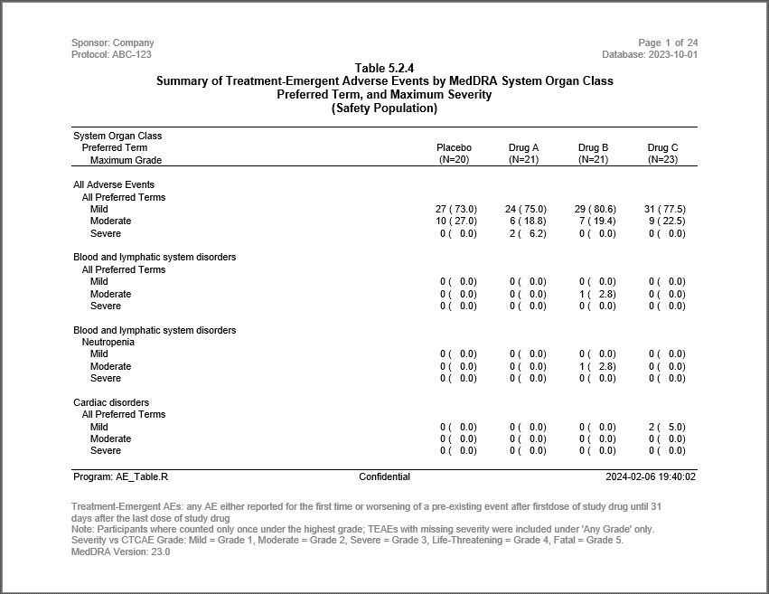

```{r setup, include = FALSE}
knitr::opts_chunk$set(
  collapse = TRUE,
  comment = "#>"
)
```
The 14th example is similar to the Adverse Events table produced in Example 4.
In this example, however, the severity grades are shown in rows instead of columns. 
This table is somewhat easier to read than the previous example,
because the pages do not wrap.  

## Program

Note the following about this example:

  * Functions from the **[procs](https://procs.r-sassy.org)** package 
  make the code look almost like a SAS® program. 
  * Page breaking is controlled by the user variable PG.  This variable allows 
  you to control when the page breaks occur.  Identify the paging variable using
  the _page_break_ parameter on the `define()` function.
  * Complexity of the stub column forced this example to perform the indenting
  in the data preparation steps.  You can always create the stub column
  yourself if the `stub()` function is not allowing you to do what you need.

```{r eval=FALSE, echo=TRUE}
library(sassy)

options("logr.autolog" = TRUE, 
        "logr.notes" = FALSE,
        "logr.on" = TRUE,
        "procs.print" = FALSE)

# Get temp directory
tmp <- tempdir()

# Open log
lf <- log_open(file.path(tmp, "example14.log"))

# Get data
dir <- system.file("extdata", package = "sassy")


# Get Data ----------------------------------------------------------------

sep("Prepare Data")

# Create libname for csv data
libname(sdtm, dir, "csv", quiet = TRUE) 

put("Filter DM data")
datastep(sdtm$DM, 
         keep = v(USUBJID, ARM, ARMCD),
         where = expression(ARM != "SCREEN FAILURE"), {}) -> dm

put("Get population counts")
proc_freq(dm, tables = ARM, 
          output = long, 
          options = v(nopercent, nonobs)) -> arm_pop 


put("Prepare table data")
datastep(sdtm$AE, merge = dm, 
         merge_by = "USUBJID",
         merge_in = v(inA, inB),
         keep = v(USUBJID, ARM, AESEV, AESOC, AEDECOD),
         where = expression(inB == 1 & inA != 0), 
         {}) -> ae_sub 


# Prepare Formats ---------------------------------------------------------

sep("Prepare Formats")
fc <- fcat(CNT = "%3d",
           PCT = "(%5.1f)",
           CAT2 = c(MILD = "Mild", 
                    MODERATE = "Moderate", 
                    SEVERE = "Severe"),
           SEVN = c(Mild = 1, Moderate = 2, Severe = 3))


# Perform Calculations ----------------------------------------------------
sep("Perform Calculations")


put("Get SOC Frequencies")
proc_freq(ae_sub, 
          tables = v(AESOC * AESEV),
          by = "ARM") -> ae_soc 


put("Combine columns for SOC")
datastep(ae_soc, 
         format = fc,
         rename = list(VAR1 = "VAR", CAT1 = "CAT"),
         drop = v(VAR2, CNT, PCT),
         {
           VARORD <- 1
           CNTPCT <- fapply2(CNT, PCT)
           CAT2 <- fapply(CAT2)
           
         }) -> ae_soc_c


put("Pivot SOC frequencies")
proc_transpose(ae_soc_c, id = v(BY), 
               var = CNTPCT, 
               copy = v(VAR, VARORD),
               by = v(CAT, CAT2)) |> 
  datastep(rename = c(CAT = "AESOC", CAT2 = "SEVERITY"), 
           drop = "NAME", {
             
               AEDECOD <- NA_character_
             }) -> ae_soc_t 


put("Get PT Frequencies")
proc_freq(ae_sub, 
          tables = "AEDECOD * AESEV",
          by = "ARM",
          options = nonobs) -> ae_pt 

put("Get unique SOC and PT combinations")
proc_sort(ae_sub, keep = v(AESOC, AEDECOD), 
          by = v(AESOC, AEDECOD), options = nodupkey) -> evnts 

put("Combine columns for PT")
datastep(ae_pt, 
         format = fc,
         rename = list(VAR1 = "VAR", CAT1 = "CAT"),
         drop = v(VAR2, CNT, PCT),
         {
           VARORD <- 2
           CNTPCT <- fapply2(CNT, PCT)
           CAT2 <- fapply(CAT2)
           
         }) -> ae_pt_c 


put("Pivot PT frequencies")
proc_transpose(ae_pt_c, id = v(BY), 
               var = CNTPCT, 
               copy = v(VAR, VARORD),
               by = v(CAT, CAT2)) -> ae_pt_t 

nms <- names(ae_soc_t) 


put("Join in SOC")
datastep(ae_pt_t, merge = evnts, rename = c(CAT2 = "SEVERITY", CAT = "AEDECOD"), 
         merge_by = c(CAT = "AEDECOD"), {
           CAT <- toTitleCase(tolower(CAT))
           AESEVN <- fapply(CAT2, fc$SEVN) 
         }) -> ae_pt_tj 


# All Adverse Events ------------------------------------------------------

put("Get frequencies for all events")
proc_freq(ae_sub, tables = "AESEV", by = v(ARM)) -> allfreq

put("Combine all events.")
datastep(allfreq, format = fc,
         drop = v(N, CNT, PCT, CAT),
         {
           
           CNTPCT <- fapply2(CNT, PCT)
           SEVERITY <- fapply(CAT, fc$CAT2)
           VARORD <- 0
           
         }) -> allfreqm

put("Prepare data for reporting")
proc_transpose(allfreqm, id = v(BY),
               var = CNTPCT, by = v(SEVERITY),
               copy = v(VAR, VARORD)) -> allfreqt

put("Clean up")
datastep(allfreqt, drop = NAME, {
  
  AESOC <- "All Adverse Events"
  AEDECOD <- "All Preferred Terms "
  
}) -> allfreqtc


# Prepare Final Dataframe -------------------------------------------------


put("Stack SOC and PT counts")
datastep(ae_soc_t, set = list(allfreqtc, ae_pt_tj), 
         keep = c("VAR", "AESOC", "AEDECOD", "SEVERITY", "AESEVN", "VARORD", 
                  find.names(ae_pt_tj, "ARM*")), {
                    AESEVN <- fapply(SEVERITY, fc$SEVN) 
                    if (is.na(AEDECOD))
                      AEDECOD <- "All Preferred Terms"
                    }) -> ae_soc_pt

put("Select desired columns")
datastep(ae_soc_pt, keep = c("AESOC", "AEDECOD", "AESEVN", "VARORD"), 
         where = expression(AESEVN == 1), {
  
}) -> ae_prep

put("Output extra rows")
datastep(ae_prep, {
  
  AESEVN <- 0
  output()
  
  AESEVN <- -1
  output()
  
}) -> ae_soc_rows


put("Set additonal rows")
datastep(ae_soc_pt, set = ae_soc_rows, {}) -> ae_all

put("Sort combined rows")
aecombined <- proc_sort(ae_all, by = v( AESOC, VARORD, AEDECOD, AESEVN))


put("Create stub and paging.")
datastep(aecombined, retain = list(PG = 1, RWNM = 0), {
  
  if (AESEVN == -1) {
    VAR <- AESOC
  } else if (AESEVN == 0) {
    VAR <- "  " %p% AEDECOD
  } else { 
    VAR <- "    " %p% SEVERITY
  }
  
  RWNM <- RWNM + 1
  
  if (RWNM == 21) {
    PG <- PG + 1
    RWNM <- 1
  }
  
  
}) -> aefinal


# Print Report ----------------------------------------------------------

sep("Create and print report")

put("Create table object")
tbl <- create_table(aefinal, first_row_blank = TRUE, width = 9, show_cols = "none") |> 
  column_defaults(from = `ARM A`, to = `ARM D`, width = 1, align = "center") |> 
  define(VAR, label = "System Organ Class\n  Preferred Term\n    Maximum Grade") |> 
  define(AEDECOD, visible = FALSE, blank_after = TRUE) |>
  define(`ARM A`, label = "Placebo", n = arm_pop["ARM A"]) |> 
  define(`ARM B`,  label = "Drug A", n = arm_pop["ARM B"]) |> 
  define(`ARM C`, label = "Drug B", n = arm_pop["ARM C"]) |> 
  define(`ARM D`, label = "Drug C", n = arm_pop["ARM D"]) |> 
  define(PG, visible = FALSE, page_break = TRUE)


put("Create report object")
rpt <- create_report(file.path(tmp, "example14.rtf"), output_type = "RTF", 
                     font_size = 10, font = "Arial") |> 
  page_header(left = c("Sponsor: Company", "Protocol: ABC-123"), 
              right = c("Page [pg] of [tpg]", "Database: 2023-10-01")) |> 
  titles("Table 5.2.4", "Summary of Treatment-Emergent Adverse Events by MedDRA System Organ Class",
  "Preferred Term, and Maximum Severity", "(Safety Population)", font_size = 12, 
  bold = TRUE, borders = "bottom") |> 
  add_content(tbl) |> 
  footnotes("Program: AE_Table.R",
            "Confidential", fapply(Sys.time(), "%Y-%m-%d %H:%M:%S"), 
            columns = 3,  borders = "top", blank_row = "none") |> 
  footnotes("Treatment-Emergent AEs: any AE either reported for the first time or " %p%
              "worsening of a pre-existing event after firstdose of study drug " %p%
              "until 31 days after the last dose of study drug",
            "Note: Participants where counted only once under the highest grade; " %p%
              "TEAEs with missing severity were included under 'Any Grade' only.",
            "Severity vs CTCAE Grade: Mild = Grade 1, Moderate = Grade 2, " %p% 
              "Severe = Grade 3, Life-Threatening = Grade 4, Fatal = Grade 5.",
            "MedDRA Version: 23.0", footer = TRUE)

put("Print report")
res <- write_report(rpt) 


# Clean Up ----------------------------------------------------------------
sep("Clean Up")

put("Close log")
log_close()


# Uncomment to view report
# file.show(res$modified_path)

# Uncomment to view log
# file.show(lf)

```

## Output

Here are the first page of the output report:




## Log

Here is the log from the above example:

```
=========================================================================
Log Path: C:/Users/dbosa/AppData/Local/Temp/Rtmp4q58ap/log/example13.log
Program Path: C:/packages/Testing/incyte/newcode/aeflipped.R
Working Directory: C:/packages/Testing
User Name: dbosa
R Version: 4.3.1 (2023-06-16 ucrt)
Machine: SOCRATES x86-64
Operating System: Windows 10 x64 build 22621
Base Packages: stats graphics grDevices utils datasets methods base Other
Packages: tidylog_1.0.2 procs_1.0.3 reporter_1.4.2 libr_1.2.8 logr_1.3.4
fmtr_1.6.0 common_1.0.9 sassy_1.2.1
Log Start Time: 2023-10-14 14:26:59.112062
=========================================================================

=========================================================================
Prepare Data
=========================================================================

# library 'sdtm': 7 items
- attributes: csv not loaded
- path: C:/Users/dbosa/AppData/Local/R/win-library/4.3/sassy/extdata
- items:
  Name Extension Rows Cols     Size        LastModified
1   AE       csv  150   27  88.5 Kb 2023-09-30 23:58:49
2   DM       csv   87   24  45.5 Kb 2023-09-30 23:58:49
3   DS       csv  174    9  34.1 Kb 2023-09-30 23:58:49
4   EX       csv   84   11  26.4 Kb 2023-09-30 23:58:49
5   IE       csv    2   14  13.4 Kb 2023-09-30 23:58:49
6   SV       csv  685   10  70.3 Kb 2023-09-30 23:58:49
7   VS       csv 3358   17 467.4 Kb 2023-09-30 23:58:49

Filter DM data

datastep: columns decreased from 24 to 3

# A tibble: 85 × 3
   USUBJID    ARM   ARMCD
   <chr>      <chr> <chr>
 1 ABC-01-049 ARM D 4    
 2 ABC-01-050 ARM B 2    
 3 ABC-01-051 ARM A 1    
 4 ABC-01-052 ARM C 3    
 5 ABC-01-053 ARM B 2    
 6 ABC-01-054 ARM D 4    
 7 ABC-01-055 ARM C 3    
 8 ABC-01-056 ARM A 1    
 9 ABC-01-113 ARM D 4    
10 ABC-01-114 ARM B 2    
# ℹ 75 more rows
# ℹ Use `print(n = ...)` to see more rows

Get population counts

proc_freq: input data set 85 rows and 3 columns
           tables: ARM
           output: long
           view: TRUE
           output: 1 datasets

# A tibble: 1 × 6
  VAR   STAT  `ARM A` `ARM B` `ARM C` `ARM D`
  <chr> <chr>   <dbl>   <dbl>   <dbl>   <dbl>
1 ARM   CNT        20      21      21      23

Prepare table data

datastep: columns decreased from 27 to 5

# A tibble: 145 × 5
   USUBJID    ARM   AESEV    AESOC                                           AEDECOD
   <chr>      <chr> <chr>    <chr>                                           <chr>  
 1 ABC-01-049 ARM D MODERATE Investigations                                  BLOOD …
 2 ABC-01-049 ARM D MODERATE Investigations                                  BLOOD …
 3 ABC-01-049 ARM D MILD     Musculoskeletal and connective tissue disorders MUSCUL…
 4 ABC-01-049 ARM D MILD     Nervous system disorders                        HEADAC…
 5 ABC-01-049 ARM D MODERATE Investigations                                  LABORA…
 6 ABC-01-050 ARM B MILD     Respiratory, thoracic and mediastinal disorders UPPER …
 7 ABC-01-050 ARM B MILD     Skin and subcutaneous tissue disorders          RASH   
 8 ABC-01-051 ARM A MILD     Nervous system disorders                        HEADAC…
 9 ABC-01-051 ARM A MILD     Nervous system disorders                        HEADAC…
10 ABC-01-051 ARM A MILD     General disorders and administration site cond… INFLUE…
# ℹ 135 more rows
# ℹ Use `print(n = ...)` to see more rows

=========================================================================
Prepare Formats
=========================================================================

# A format catalog: 4 formats
- $CNT: type S, "%3d"
- $PCT: type S, "(%5.1f)"
- $CAT2: type V, 3 elements
- $SEVN: type V, 3 elements

=========================================================================
Perform Calculations
=========================================================================

Get SOC Frequencies

proc_freq: input data set 145 rows and 5 columns
           tables: AESOC * AESEV
           by: ARM
           view: TRUE
           output: 1 datasets

# A tibble: 240 × 8
   BY    VAR1  VAR2  CAT1                                    CAT2      N   CNT   PCT
   <chr> <chr> <chr> <chr>                                   <chr> <dbl> <dbl> <dbl>
 1 ARM A AESOC AESEV Blood and lymphatic system disorders    MILD     37     0     0
 2 ARM A AESOC AESEV Blood and lymphatic system disorders    MODE…    37     0     0
 3 ARM A AESOC AESEV Blood and lymphatic system disorders    SEVE…    37     0     0
 4 ARM A AESOC AESEV Cardiac disorders                       MILD     37     0     0
 5 ARM A AESOC AESEV Cardiac disorders                       MODE…    37     0     0
 6 ARM A AESOC AESEV Cardiac disorders                       SEVE…    37     0     0
 7 ARM A AESOC AESEV Congenital, familial and genetic disor… MILD     37     0     0
 8 ARM A AESOC AESEV Congenital, familial and genetic disor… MODE…    37     0     0
 9 ARM A AESOC AESEV Congenital, familial and genetic disor… SEVE…    37     0     0
10 ARM A AESOC AESEV Ear and labyrinth disorders             MILD     37     0     0
# ℹ 230 more rows
# ℹ Use `print(n = ...)` to see more rows

Combine columns for SOC

datastep: columns decreased from 8 to 7

# A tibble: 240 × 7
   BY    VAR   CAT                                        CAT2       N VARORD CNTPCT
   <chr> <chr> <chr>                                      <chr>  <dbl>  <dbl> <chr> 
 1 ARM A AESOC Blood and lymphatic system disorders       Mild      37      1 "  0 …
 2 ARM A AESOC Blood and lymphatic system disorders       Moder…    37      1 "  0 …
 3 ARM A AESOC Blood and lymphatic system disorders       Severe    37      1 "  0 …
 4 ARM A AESOC Cardiac disorders                          Mild      37      1 "  0 …
 5 ARM A AESOC Cardiac disorders                          Moder…    37      1 "  0 …
 6 ARM A AESOC Cardiac disorders                          Severe    37      1 "  0 …
 7 ARM A AESOC Congenital, familial and genetic disorders Mild      37      1 "  0 …
 8 ARM A AESOC Congenital, familial and genetic disorders Moder…    37      1 "  0 …
 9 ARM A AESOC Congenital, familial and genetic disorders Severe    37      1 "  0 …
10 ARM A AESOC Ear and labyrinth disorders                Mild      37      1 "  0 …
# ℹ 230 more rows
# ℹ Use `print(n = ...)` to see more rows

Pivot SOC frequencies

proc_transpose: input data set 240 rows and 7 columns
                by: CAT CAT2
                var: CNTPCT
                id: BY
                copy: VAR VARORD
                name: NAME
                output dataset 60 rows and 9 columns

# A tibble: 60 × 9
   VAR   CAT                      CAT2  VARORD NAME  `ARM A` `ARM B` `ARM C` `ARM D`
   <chr> <chr>                    <chr>  <dbl> <chr> <chr>   <chr>   <chr>   <chr>  
 1 AESOC Blood and lymphatic sys… Mild       1 CNTP… "  0 (… "  0 (… "  0 (… "  0 (…
 2 AESOC Cardiac disorders        Mild       1 CNTP… "  0 (… "  0 (… "  0 (… "  2 (…
 3 AESOC Congenital, familial an… Mild       1 CNTP… "  0 (… "  1 (… "  0 (… "  0 (…
 4 AESOC Ear and labyrinth disor… Mild       1 CNTP… "  0 (… "  0 (… "  0 (… "  0 (…
 5 AESOC Endocrine disorders      Mild       1 CNTP… "  0 (… "  0 (… "  1 (… "  0 (…
 6 AESOC Gastrointestinal disord… Mild       1 CNTP… "  0 (… "  4 (… "  0 (… "  2 (…
 7 AESOC General disorders and a… Mild       1 CNTP… "  2 (… "  0 (… "  3 (… "  2 (…
 8 AESOC Infections and infestat… Mild       1 CNTP… "  7 (… "  7 (… "  6 (… "  6 (…
 9 AESOC Injury, poisoning and p… Mild       1 CNTP… "  0 (… "  0 (… "  0 (… "  1 (…
10 AESOC Investigations           Mild       1 CNTP… "  4 (… "  1 (… "  2 (… "  5 (…
# ℹ 50 more rows
# ℹ Use `print(n = ...)` to see more rows

datastep: columns started with 9 and ended with 9

# A tibble: 60 × 9
   VAR   AESOC               SEVERITY VARORD `ARM A` `ARM B` `ARM C` `ARM D` AEDECOD
   <chr> <chr>               <chr>     <dbl> <chr>   <chr>   <chr>   <chr>   <chr>  
 1 AESOC Blood and lymphati… Mild          1 "  0 (… "  0 (… "  0 (… "  0 (… <NA>   
 2 AESOC Cardiac disorders   Mild          1 "  0 (… "  0 (… "  0 (… "  2 (… <NA>   
 3 AESOC Congenital, famili… Mild          1 "  0 (… "  1 (… "  0 (… "  0 (… <NA>   
 4 AESOC Ear and labyrinth … Mild          1 "  0 (… "  0 (… "  0 (… "  0 (… <NA>   
 5 AESOC Endocrine disorders Mild          1 "  0 (… "  0 (… "  1 (… "  0 (… <NA>   
 6 AESOC Gastrointestinal d… Mild          1 "  0 (… "  4 (… "  0 (… "  2 (… <NA>   
 7 AESOC General disorders … Mild          1 "  2 (… "  0 (… "  3 (… "  2 (… <NA>   
 8 AESOC Infections and inf… Mild          1 "  7 (… "  7 (… "  6 (… "  6 (… <NA>   
 9 AESOC Injury, poisoning … Mild          1 "  0 (… "  0 (… "  0 (… "  1 (… <NA>   
10 AESOC Investigations      Mild          1 "  4 (… "  1 (… "  2 (… "  5 (… <NA>   
# ℹ 50 more rows
# ℹ Use `print(n = ...)` to see more rows

Get PT Frequencies

proc_freq: input data set 145 rows and 5 columns
           tables: AEDECOD * AESEV
           by: ARM
           view: TRUE
           output: 1 datasets

# A tibble: 876 × 7
   BY    VAR1    VAR2  CAT1                              CAT2       CNT   PCT
   <chr> <chr>   <chr> <chr>                             <chr>    <dbl> <dbl>
 1 ARM A AEDECOD AESEV ANXIETY                           MILD         0  0   
 2 ARM A AEDECOD AESEV ANXIETY                           MODERATE     0  0   
 3 ARM A AEDECOD AESEV ANXIETY                           SEVERE       0  0   
 4 ARM A AEDECOD AESEV APPLICATION SITE HYPERSENSITIVITY MILD         0  0   
 5 ARM A AEDECOD AESEV APPLICATION SITE HYPERSENSITIVITY MODERATE     0  0   
 6 ARM A AEDECOD AESEV APPLICATION SITE HYPERSENSITIVITY SEVERE       0  0   
 7 ARM A AEDECOD AESEV APPLICATION SITE IRRITATION       MILD         0  0   
 8 ARM A AEDECOD AESEV APPLICATION SITE IRRITATION       MODERATE     0  0   
 9 ARM A AEDECOD AESEV APPLICATION SITE IRRITATION       SEVERE       0  0   
10 ARM A AEDECOD AESEV BACK PAIN                         MILD         2  5.41
# ℹ 866 more rows
# ℹ Use `print(n = ...)` to see more rows

Get unique SOC and PT combinations

proc_sort: input data set 73 rows and 5 columns
           by: AESOC AEDECOD
           keep: AESOC AEDECOD
           order: a a
           options: nodupkey
           output data set 73 rows and 2 columns

# A tibble: 73 × 2
   AESOC                                      AEDECOD             
   <chr>                                      <chr>               
 1 Blood and lymphatic system disorders       NEUTROPENIA         
 2 Cardiac disorders                          PALPITATIONS        
 3 Cardiac disorders                          SINUS BRADYCARDIA   
 4 Congenital, familial and genetic disorders DERMOID CYST        
 5 Ear and labyrinth disorders                VERTIGO             
 6 Endocrine disorders                        PARATHYROID DISORDER
 7 Gastrointestinal disorders                 DIARRHOEA           
 8 Gastrointestinal disorders                 FOOD POISONING      
 9 Gastrointestinal disorders                 TOOTHACHE           
10 Gastrointestinal disorders                 VOMITING            
# ℹ 63 more rows
# ℹ Use `print(n = ...)` to see more rows

Combine columns for PT

datastep: columns decreased from 7 to 6

# A tibble: 876 × 6
   BY    VAR     CAT                               CAT2     VARORD CNTPCT       
   <chr> <chr>   <chr>                             <chr>     <dbl> <chr>        
 1 ARM A AEDECOD ANXIETY                           Mild          2 "  0 (  0.0)"
 2 ARM A AEDECOD ANXIETY                           Moderate      2 "  0 (  0.0)"
 3 ARM A AEDECOD ANXIETY                           Severe        2 "  0 (  0.0)"
 4 ARM A AEDECOD APPLICATION SITE HYPERSENSITIVITY Mild          2 "  0 (  0.0)"
 5 ARM A AEDECOD APPLICATION SITE HYPERSENSITIVITY Moderate      2 "  0 (  0.0)"
 6 ARM A AEDECOD APPLICATION SITE HYPERSENSITIVITY Severe        2 "  0 (  0.0)"
 7 ARM A AEDECOD APPLICATION SITE IRRITATION       Mild          2 "  0 (  0.0)"
 8 ARM A AEDECOD APPLICATION SITE IRRITATION       Moderate      2 "  0 (  0.0)"
 9 ARM A AEDECOD APPLICATION SITE IRRITATION       Severe        2 "  0 (  0.0)"
10 ARM A AEDECOD BACK PAIN                         Mild          2 "  2 (  5.4)"
# ℹ 866 more rows
# ℹ Use `print(n = ...)` to see more rows

Pivot PT frequencies

proc_transpose: input data set 876 rows and 6 columns
                by: CAT CAT2
                var: CNTPCT
                id: BY
                copy: VAR VARORD
                name: NAME
                output dataset 219 rows and 9 columns

# A tibble: 219 × 9
   VAR     CAT                    CAT2  VARORD NAME  `ARM A` `ARM B` `ARM C` `ARM D`
   <chr>   <chr>                  <chr>  <dbl> <chr> <chr>   <chr>   <chr>   <chr>  
 1 AEDECOD ANXIETY                Mild       2 CNTP… "  0 (… "  0 (… "  0 (… "  1 (…
 2 AEDECOD APPLICATION SITE HYPE… Mild       2 CNTP… "  0 (… "  0 (… "  1 (… "  0 (…
 3 AEDECOD APPLICATION SITE IRRI… Mild       2 CNTP… "  0 (… "  0 (… "  1 (… "  1 (…
 4 AEDECOD BACK PAIN              Mild       2 CNTP… "  2 (… "  0 (… "  0 (… "  1 (…
 5 AEDECOD BASAL CELL CARCINOMA   Mild       2 CNTP… "  0 (… "  1 (… "  0 (… "  0 (…
 6 AEDECOD BLOOD GLUCOSE INCREAS… Mild       2 CNTP… "  0 (… "  0 (… "  0 (… "  0 (…
 7 AEDECOD BLOOD PARATHYROID HOR… Mild       2 CNTP… "  0 (… "  1 (… "  0 (… "  0 (…
 8 AEDECOD BLOOD PARATHYROID HOR… Mild       2 CNTP… "  0 (… "  0 (… "  0 (… "  0 (…
 9 AEDECOD BLOOD PRESSURE INCREA… Mild       2 CNTP… "  1 (… "  0 (… "  0 (… "  1 (…
10 AEDECOD BLOOD TRIGLYCERIDES I… Mild       2 CNTP… "  0 (… "  0 (… "  0 (… "  0 (…
# ℹ 209 more rows
# ℹ Use `print(n = ...)` to see more rows

Join in SOC

datastep: columns increased from 9 to 11

# A tibble: 219 × 11
   VAR    AEDECOD SEVERITY VARORD NAME  `ARM A` `ARM B` `ARM C` `ARM D` AESOC AESEVN
   <chr>  <chr>   <chr>     <dbl> <chr> <chr>   <chr>   <chr>   <chr>   <chr>  <dbl>
 1 AEDEC… Anxiety Mild          2 CNTP… "  0 (… "  0 (… "  0 (… "  1 (… Psyc…      1
 2 AEDEC… Anxiety Severe        2 CNTP… "  0 (… "  0 (… "  0 (… "  0 (… Psyc…      3
 3 AEDEC… Anxiety Moderate      2 CNTP… "  0 (… "  0 (… "  0 (… "  0 (… Psyc…      2
 4 AEDEC… Applic… Severe        2 CNTP… "  0 (… "  0 (… "  0 (… "  0 (… Gene…      3
 5 AEDEC… Applic… Moderate      2 CNTP… "  0 (… "  0 (… "  0 (… "  0 (… Gene…      2
 6 AEDEC… Applic… Mild          2 CNTP… "  0 (… "  0 (… "  1 (… "  0 (… Gene…      1
 7 AEDEC… Applic… Mild          2 CNTP… "  0 (… "  0 (… "  1 (… "  1 (… Gene…      1
 8 AEDEC… Applic… Severe        2 CNTP… "  0 (… "  0 (… "  0 (… "  0 (… Gene…      3
 9 AEDEC… Applic… Moderate      2 CNTP… "  0 (… "  0 (… "  0 (… "  0 (… Gene…      2
10 AEDEC… Back P… Severe        2 CNTP… "  0 (… "  0 (… "  0 (… "  0 (… Musc…      3
# ℹ 209 more rows
# ℹ Use `print(n = ...)` to see more rows

Get frequencies for all events

proc_freq: input data set 145 rows and 5 columns
           tables: AESEV
           by: ARM
           view: TRUE
           output: 1 datasets

# A tibble: 12 × 6
   BY    VAR   CAT          N   CNT   PCT
   <chr> <chr> <chr>    <dbl> <dbl> <dbl>
 1 ARM A AESEV MILD        37    27 73.0 
 2 ARM A AESEV MODERATE    37    10 27.0 
 3 ARM A AESEV SEVERE      37     0  0   
 4 ARM B AESEV MILD        32    24 75   
 5 ARM B AESEV MODERATE    32     6 18.8 
 6 ARM B AESEV SEVERE      32     2  6.25
 7 ARM C AESEV MILD        36    29 80.6 
 8 ARM C AESEV MODERATE    36     7 19.4 
 9 ARM C AESEV SEVERE      36     0  0   
10 ARM D AESEV MILD        40    31 77.5 
11 ARM D AESEV MODERATE    40     9 22.5 
12 ARM D AESEV SEVERE      40     0  0   

Combine all events.

datastep: columns decreased from 6 to 5

# A tibble: 12 × 5
   BY    VAR   CNTPCT        SEVERITY VARORD
   <chr> <chr> <chr>         <chr>     <dbl>
 1 ARM A AESEV " 27 ( 73.0)" Mild          0
 2 ARM A AESEV " 10 ( 27.0)" Moderate      0
 3 ARM A AESEV "  0 (  0.0)" Severe        0
 4 ARM B AESEV " 24 ( 75.0)" Mild          0
 5 ARM B AESEV "  6 ( 18.8)" Moderate      0
 6 ARM B AESEV "  2 (  6.2)" Severe        0
 7 ARM C AESEV " 29 ( 80.6)" Mild          0
 8 ARM C AESEV "  7 ( 19.4)" Moderate      0
 9 ARM C AESEV "  0 (  0.0)" Severe        0
10 ARM D AESEV " 31 ( 77.5)" Mild          0
11 ARM D AESEV "  9 ( 22.5)" Moderate      0
12 ARM D AESEV "  0 (  0.0)" Severe        0

Prepare data for reporting

proc_transpose: input data set 12 rows and 5 columns
                by: SEVERITY
                var: CNTPCT
                id: BY
                copy: VAR VARORD
                name: NAME
                output dataset 3 rows and 8 columns

# A tibble: 3 × 8
  VAR   SEVERITY VARORD NAME   `ARM A`       `ARM B`       `ARM C`       `ARM D`    
  <chr> <chr>     <dbl> <chr>  <chr>         <chr>         <chr>         <chr>      
1 AESEV Mild          0 CNTPCT " 27 ( 73.0)" " 24 ( 75.0)" " 29 ( 80.6)" " 31 ( 77.…
2 AESEV Moderate      0 CNTPCT " 10 ( 27.0)" "  6 ( 18.8)" "  7 ( 19.4)" "  9 ( 22.…
3 AESEV Severe        0 CNTPCT "  0 (  0.0)" "  2 (  6.2)" "  0 (  0.0)" "  0 (  0.…

Clean up

datastep: columns increased from 8 to 9

# A tibble: 3 × 9
  VAR   SEVERITY VARORD `ARM A`       `ARM B`       `ARM C`    `ARM D` AESOC AEDECOD
  <chr> <chr>     <dbl> <chr>         <chr>         <chr>      <chr>   <chr> <chr>  
1 AESEV Mild          0 " 27 ( 73.0)" " 24 ( 75.0)" " 29 ( 80… " 31 (… All … "All P…
2 AESEV Moderate      0 " 10 ( 27.0)" "  6 ( 18.8)" "  7 ( 19… "  9 (… All … "All P…
3 AESEV Severe        0 "  0 (  0.0)" "  2 (  6.2)" "  0 (  0… "  0 (… All … "All P…

Stack SOC and PT counts

datastep: columns increased from 9 to 10

# A tibble: 282 × 10
   VAR   AESOC        AEDECOD SEVERITY AESEVN VARORD `ARM A` `ARM B` `ARM C` `ARM D`
   <chr> <chr>        <chr>   <chr>     <dbl>  <dbl> <chr>   <chr>   <chr>   <chr>  
 1 AESOC Blood and l… All Pr… Mild          1      1 "  0 (… "  0 (… "  0 (… "  0 (…
 2 AESOC Cardiac dis… All Pr… Mild          1      1 "  0 (… "  0 (… "  0 (… "  2 (…
 3 AESOC Congenital,… All Pr… Mild          1      1 "  0 (… "  1 (… "  0 (… "  0 (…
 4 AESOC Ear and lab… All Pr… Mild          1      1 "  0 (… "  0 (… "  0 (… "  0 (…
 5 AESOC Endocrine d… All Pr… Mild          1      1 "  0 (… "  0 (… "  1 (… "  0 (…
 6 AESOC Gastrointes… All Pr… Mild          1      1 "  0 (… "  4 (… "  0 (… "  2 (…
 7 AESOC General dis… All Pr… Mild          1      1 "  2 (… "  0 (… "  3 (… "  2 (…
 8 AESOC Infections … All Pr… Mild          1      1 "  7 (… "  7 (… "  6 (… "  6 (…
 9 AESOC Injury, poi… All Pr… Mild          1      1 "  0 (… "  0 (… "  0 (… "  1 (…
10 AESOC Investigati… All Pr… Mild          1      1 "  4 (… "  1 (… "  2 (… "  5 (…
# ℹ 272 more rows
# ℹ Use `print(n = ...)` to see more rows

Select desired columns

datastep: columns decreased from 10 to 4

# A tibble: 94 × 4
   AESOC                                                AEDECOD        AESEVN VARORD
   <chr>                                                <chr>           <dbl>  <dbl>
 1 Blood and lymphatic system disorders                 All Preferred…      1      1
 2 Cardiac disorders                                    All Preferred…      1      1
 3 Congenital, familial and genetic disorders           All Preferred…      1      1
 4 Ear and labyrinth disorders                          All Preferred…      1      1
 5 Endocrine disorders                                  All Preferred…      1      1
 6 Gastrointestinal disorders                           All Preferred…      1      1
 7 General disorders and administration site conditions All Preferred…      1      1
 8 Infections and infestations                          All Preferred…      1      1
 9 Injury, poisoning and procedural complications       All Preferred…      1      1
10 Investigations                                       All Preferred…      1      1
# ℹ 84 more rows
# ℹ Use `print(n = ...)` to see more rows

Output extra rows

datastep: columns started with 4 and ended with 4

# A tibble: 188 × 4
   AESOC                                      AEDECOD             AESEVN VARORD
   <chr>                                      <chr>                <dbl>  <dbl>
 1 Blood and lymphatic system disorders       All Preferred Terms      0      1
 2 Blood and lymphatic system disorders       All Preferred Terms     -1      1
 3 Cardiac disorders                          All Preferred Terms      0      1
 4 Cardiac disorders                          All Preferred Terms     -1      1
 5 Congenital, familial and genetic disorders All Preferred Terms      0      1
 6 Congenital, familial and genetic disorders All Preferred Terms     -1      1
 7 Ear and labyrinth disorders                All Preferred Terms      0      1
 8 Ear and labyrinth disorders                All Preferred Terms     -1      1
 9 Endocrine disorders                        All Preferred Terms      0      1
10 Endocrine disorders                        All Preferred Terms     -1      1
# ℹ 178 more rows
# ℹ Use `print(n = ...)` to see more rows

Set additonal rows

datastep: columns started with 10 and ended with 10

# A tibble: 470 × 10
   VAR   AESOC        AEDECOD SEVERITY AESEVN VARORD `ARM A` `ARM B` `ARM C` `ARM D`
   <chr> <chr>        <chr>   <chr>     <dbl>  <dbl> <chr>   <chr>   <chr>   <chr>  
 1 AESOC Blood and l… All Pr… Mild          1      1 "  0 (… "  0 (… "  0 (… "  0 (…
 2 AESOC Cardiac dis… All Pr… Mild          1      1 "  0 (… "  0 (… "  0 (… "  2 (…
 3 AESOC Congenital,… All Pr… Mild          1      1 "  0 (… "  1 (… "  0 (… "  0 (…
 4 AESOC Ear and lab… All Pr… Mild          1      1 "  0 (… "  0 (… "  0 (… "  0 (…
 5 AESOC Endocrine d… All Pr… Mild          1      1 "  0 (… "  0 (… "  1 (… "  0 (…
 6 AESOC Gastrointes… All Pr… Mild          1      1 "  0 (… "  4 (… "  0 (… "  2 (…
 7 AESOC General dis… All Pr… Mild          1      1 "  2 (… "  0 (… "  3 (… "  2 (…
 8 AESOC Infections … All Pr… Mild          1      1 "  7 (… "  7 (… "  6 (… "  6 (…
 9 AESOC Injury, poi… All Pr… Mild          1      1 "  0 (… "  0 (… "  0 (… "  1 (…
10 AESOC Investigati… All Pr… Mild          1      1 "  4 (… "  1 (… "  2 (… "  5 (…
# ℹ 460 more rows
# ℹ Use `print(n = ...)` to see more rows

Sort combined rows

proc_sort: input data set 470 rows and 10 columns
           by: AESOC VARORD AEDECOD AESEVN
           keep: VAR AESOC AEDECOD SEVERITY AESEVN VARORD ARM A ARM B ARM C ARM D
           order: a a a a
           output data set 470 rows and 10 columns

# A tibble: 470 × 10
   VAR   AESOC        AEDECOD SEVERITY AESEVN VARORD `ARM A` `ARM B` `ARM C` `ARM D`
   <chr> <chr>        <chr>   <chr>     <dbl>  <dbl> <chr>   <chr>   <chr>   <chr>  
 1 <NA>  All Adverse… "All P… <NA>         -1      0  <NA>    <NA>    <NA>    <NA>  
 2 <NA>  All Adverse… "All P… <NA>          0      0  <NA>    <NA>    <NA>    <NA>  
 3 AESEV All Adverse… "All P… Mild          1      0 " 27 (… " 24 (… " 29 (… " 31 (…
 4 AESEV All Adverse… "All P… Moderate      2      0 " 10 (… "  6 (… "  7 (… "  9 (…
 5 AESEV All Adverse… "All P… Severe        3      0 "  0 (… "  2 (… "  0 (… "  0 (…
 6 <NA>  Blood and l… "All P… <NA>         -1      1  <NA>    <NA>    <NA>    <NA>  
 7 <NA>  Blood and l… "All P… <NA>          0      1  <NA>    <NA>    <NA>    <NA>  
 8 AESOC Blood and l… "All P… Mild          1      1 "  0 (… "  0 (… "  0 (… "  0 (…
 9 AESOC Blood and l… "All P… Moderate      2      1 "  0 (… "  0 (… "  1 (… "  0 (…
10 AESOC Blood and l… "All P… Severe        3      1 "  0 (… "  0 (… "  0 (… "  0 (…
# ℹ 460 more rows
# ℹ Use `print(n = ...)` to see more rows

Create stub and paging.

datastep: columns increased from 10 to 12

# A tibble: 470 × 12
   VAR    AESOC AEDECOD SEVERITY AESEVN VARORD `ARM A` `ARM B` `ARM C` `ARM D`  RWNM
   <chr>  <chr> <chr>   <chr>     <dbl>  <dbl> <chr>   <chr>   <chr>   <chr>   <dbl>
 1 "All … All … "All P… <NA>         -1      0  <NA>    <NA>    <NA>    <NA>       1
 2 "  Al… All … "All P… <NA>          0      0  <NA>    <NA>    <NA>    <NA>       2
 3 "    … All … "All P… Mild          1      0 " 27 (… " 24 (… " 29 (… " 31 (…     3
 4 "    … All … "All P… Moderate      2      0 " 10 (… "  6 (… "  7 (… "  9 (…     4
 5 "    … All … "All P… Severe        3      0 "  0 (… "  2 (… "  0 (… "  0 (…     5
 6 "Bloo… Bloo… "All P… <NA>         -1      1  <NA>    <NA>    <NA>    <NA>       6
 7 "  Al… Bloo… "All P… <NA>          0      1  <NA>    <NA>    <NA>    <NA>       7
 8 "    … Bloo… "All P… Mild          1      1 "  0 (… "  0 (… "  0 (… "  0 (…     8
 9 "    … Bloo… "All P… Moderate      2      1 "  0 (… "  0 (… "  1 (… "  0 (…     9
10 "    … Bloo… "All P… Severe        3      1 "  0 (… "  0 (… "  0 (… "  0 (…    10
# ℹ 460 more rows
# ℹ 1 more variable: PG <dbl>
# ℹ Use `print(n = ...)` to see more rows

=========================================================================
Create and print report
=========================================================================

Create table object

Create report object

Print report

# A report specification: 24 pages
- file_path: 'C:\Users\dbosa\AppData\Local\Temp\Rtmp4q58ap/example14.rtf'
- output_type: RTF
- units: inches
- orientation: landscape
- margins: top 0.5 bottom 0.5 left 1 right 1
- line size/count: 9/42
- page_header: left=Sponsor: Company, Protocol: ABC-123 right=Page [pg] of [tpg], Database: 2023-10-01
- title 1: 'Table 5.2.4'
- title 2: 'Summary of Treatment-Emergent Adverse Events by MedDRA System Organ Class'
- title 3: 'Preferred Term, and Maximum Severity'
- title 4: '(Safety Population)'
- footnote 1: 'Program: AE_Table.R'
- footnote 2: 'Confidential'
- footnote 3: '2023-10-14 14:27:04'
- content: 
# A table specification:
- data: tibble 'aefinal' 470 rows 12 cols
- show_cols: none
- use_attributes: all
- width: 9
- define: VAR 'System Organ Class
  Preferred Term
    Maximum Grade' 
- define: AEDECOD visible='FALSE' 
- define: ARM A 'Placebo' 
- define: ARM B 'Drug A' 
- define: ARM C 'Drug B' 
- define: ARM D 'Drug C' 
- define: PG visible='FALSE' page_break='TRUE' 

=========================================================================
Clean Up
=========================================================================

Close log

=========================================================================
Log End Time: 2023-10-14 14:27:06.77316
Log Elapsed Time: 0 00:00:07
=========================================================================


```

Next: [Example 15: Intext Table](sassy-intext.html)
