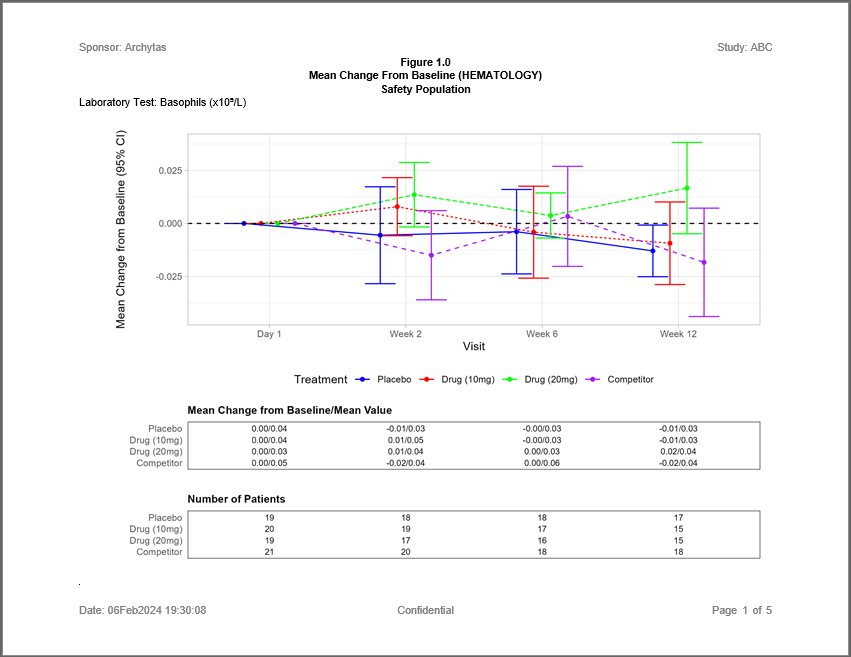

```{r setup, include = FALSE}
knitr::opts_chunk$set(
  collapse = TRUE,
  comment = "#>"
)
```
The following example shows a Mean Change from Baseline chart for Hematology 
Lab Values with supporting tables 
for the mean value and number of patients.  The figure is accomplished using 
the **ggplot** and **patchwork** packages, and data preparation that features
the **procs** package.

## Program

Note the following about this example:

  * The **[procs](https://procs.r-sassy.org)** package calculates mean values
  and confidence intervals for each treatment group and visit.
  * The **[ggplot2](https://CRAN.R-project.org/package=ggplot2)** package
  can create small tables in addition to charts. 
  * The **[patchwork](https://CRAN.R-project.org/package=patchwork)** 
  package can combine the ggplot chart and table into a single image.   
  * The patchwork images are dynamically added to a report object from the
  **[reporter](https://reporter.r-sassy.org)** package.  Titles are customized
  for each page.

```{r eval=FALSE, echo=TRUE}    
library(sassy)
library(ggplot2)
library(patchwork)

options("logr.notes" = FALSE,
        "logr.autolog" = TRUE,
        "procs.print" = FALSE)

# Get temp location for log and report output
tmp <- tempdir()

lf <- log_open(file.path(tmp, "example13.log"))

# Get data ----------------------------------------------------------------

sep("Get data")

# Get sample data path
pth <- system.file("extdata", package = "sassy")

put("Open data library")
libname(sdtm, pth, "csv")

# Create Formats ----------------------------------------------------------

sep("Create Formats")

put("Format for visits")
vfmt <- value(condition(x == "DAY 1", "Day 1"), 
              condition(x == "WEEK 2", "Week 2"),
              condition(x == "WEEK 4", "Week 4"),
              condition(x == "WEEK 6", "Week 6"),
              condition(x == "WEEK 12", "Week 12"),
              as.factor = TRUE)

put("Format for ARMs")
afmt <- value(condition(x == "ARM A", "Placebo"), 
              condition(x == "ARM B", "Drug (10mg)"), 
              condition(x == "ARM C", "Drug (20mg)"),
              condition(x == "ARM D", "Competitor"),
              as.factor = TRUE)


# Prepare data ------------------------------------------------------------

sep("Prepare data")

put("Pull out needed visits and columns")
lbsub1 <- subset(sdtm$LB, VISIT %in% toupper(levels(vfmt)), 
                v(USUBJID, VISIT, VISITNUM, LBORRES, LBCAT, LBORRESU, LBTEST, 
                  LBTESTCD, LBBLFL)) |> put()

put("Pull out baseline subset")
lbsub2 <- subset(lbsub1, LBBLFL == 'Y', 
                v(USUBJID, VISIT, LBORRES, LBCAT, LBTESTCD)) |> put()

put("Merge and calculate change from baseline")
datastep(lbsub1, merge = lbsub2, merge_by = v(USUBJID, LBCAT, LBTESTCD), 
         rename = v(LBORRES.1 = LBORRES, LBORRES.2 = BLBORES, VISIT.1 = VISIT),
         drop = VISIT.2, {
            
           # Convert to double
           LBORRES.1 <- suppressWarnings(as.double(LBORRES.1))
           
           # Convert to double
           LBORRES.2 <- suppressWarnings(as.double(LBORRES.2))
          
           # Calculate Change from baseline  
           if (!(is.na(LBORRES.1) | is.na(LBORRES.2))) {
             LBCHG <- LBORRES.1 - LBORRES.2
           } else {
             LBCHG <- NA
           }

         }) -> lbsub 

put("Pull needed ARMs and columns for DM")
dmsub <- subset(sdtm$DM, ARM != "SCREEN FAILURE", v(USUBJID, ARMCD, ARM)) |> put()

put("Merge DM with LB to get subject treatments")
datastep(lbsub, merge = dmsub, merge_by = USUBJID, 
         where = expression(toupper(VISIT) != 'SCREENING'), 
         {
           VISIT <- fapply(VISIT, vfmt)
         }) -> lbdat 


# Prepare lab test labels -------------------------------------------------

sep("Lab test labels")

put("Get lookup data for lab tests")
proc_sort(lbdat, by = v(LBTESTCD, LBTEST, LBORRESU), 
          keep = v(LBTESTCD, LBTEST, LBORRESU), 
          options = nodupkey) -> tcodes

put("Create test label with units")
datastep(tcodes, where = expression(is.na(LBORRESU) == FALSE),
         keep = v(LBTESTCD, LABEL), 
         {
                      
           LABEL <- paste0(LBTEST, " (", LBORRESU, ")") 
           
         }) -> tfmtdat 

put("Create lab value lookup") 
tfmt <- tfmtdat$LABEL
names(tfmt) <- tfmtdat$LBTESTCD

put("Apply superscripts as needed")
tfmt <- sub("(9)", supsc('9'), tfmt, fixed = TRUE) 
tfmt <- sub("(12)", supsc('12'), tfmt, fixed = TRUE) 


# Calculate statistics ----------------------------------------------------

sep("Calculate statistics")

put("Get statistics for change from baseline")
proc_means(lbdat, by = LBTESTCD, 
           class = v(ARM, VISIT), 
           var = LBCHG,
           stats = v(n, mean, std, clm),
           options = nway) -> datcl 

put("Get statistics for mean lab value")
proc_means(lbdat, by = LBTESTCD, 
           class = v(ARM, VISIT), 
           var = LBORRES,
           stats = v(n, mean),
           options = nway) -> datmn

put("Add mean lab values to change from baseline") 
datcl$MEANV <- datmn$MEAN

put("Apply formats")
datcl$BY <- fapply(datcl$BY, tfmt)
datcl$CLASS1 <- fapply(datcl$CLASS1, afmt)


# Create report -----------------------------------------------------------

sep("Create report")

put("Create output path")
pth <- file.path(tmp, "output/example13.rtf") |> put()

put("Create report first so content can be added dynamically")
rpt <- create_report(pth, output_type = "RTF",
                     font = "Arial", font_size = 10) |> 
  page_header("Sponsor: Archytas", right = "Study: ABC") |> 
  titles("Figure 1.0", "Mean Change From Baseline (HEMATOLOGY)", "Safety Population",
         bold = TRUE, blank_row = "none") |> 
  page_footer("Date: " %p% fapply(Sys.time(), "%d%b%Y %H:%M:%S"), 
              "Confidential", "Page [pg] of [tpg]") 

put("Loop through lab tests")
for (tst in unique(datcl$BY)) {
  
  put("**** Lab Test: " %p% tst %p% " ****")
  
  put("Apply subset")
  dat <- subset(datcl, BY == tst)

  put("Create plot")
  p <- ggplot(data = dat, aes(x = CLASS2, y = MEAN, group = CLASS1)) +
    geom_point(aes(color = CLASS1), size = 1.5, position = position_dodge(width = 0.5)) +
    geom_line(aes(color = CLASS1, linetype = CLASS1), position = position_dodge(width = 0.5)) + 
    geom_errorbar(aes(x = CLASS2, ymin = LCLM, ymax = UCLM, color = CLASS1),
                  position = position_dodge(width = 0.5)) + 
    theme_light() + 
    scale_linetype(guide = "none") +
    scale_color_manual(values = c("blue", "red", "green", "purple")) +
    theme(legend.position = "bottom", plot.title = element_text(size = 11, hjust = 0)) +
    guides(color = guide_legend(title = "Treatment")) +
    labs(x = 'Visit', y = '\n\nMean Change from Baseline (95% CI)') +
    geom_hline(yintercept = 0, linetype = 'dashed')
  
  put("Create table for mean change/mean value")
  t1 <- ggplot(data = dat) +
    geom_text(aes(CLASS1, x = CLASS2, label = fapply2(MEAN, MEANV, "%4.2f", "%.2f", sep = "/"), 
                  hjust = 0.5, vjust = 0.5), size = 8 / .pt) +
    ggtitle("Mean Change from Baseline/Mean Value") +
    scale_y_discrete(limits = rev) +
    theme_bw() + 
    theme(
      axis.line = element_blank(),
      panel.grid = element_blank(),
      axis.ticks = element_blank(),
      axis.title.y = element_blank(),
      axis.title.x = element_blank(),
      axis.text.x = element_text(color = "white"),
      plot.title = element_text(size =10, hjust = 0, face = "bold")
    )
  
  put("Create table for patient counts")
  t2 <- ggplot(data = dat) +
    geom_text(aes(CLASS1, x = CLASS2, label = as.character(N), 
                  hjust = 0.5, vjust = 0.5), size = 8 / .pt) +
    ggtitle("Number of Patients") +
    scale_y_discrete(limits = rev) +
    theme_bw() + 
    theme(
      axis.line = element_blank(),
      panel.grid = element_blank(),
      axis.ticks = element_blank(),
      axis.title.y = element_blank(),
      axis.title.x = element_blank(),
      axis.text.x = element_text(color = "white"),
      plot.title = element_text(size = 10, hjust = 0, face = "bold")
    )
  
  put("Patch together plot and tables")
  plts <- p + t1 + t2 + plot_layout(ncol = 1, nrow = 3, 
                                    widths = c(1, 2, 2), heights = c(8, 2, 2))
  
  put("Create plot content")
  plt1 <- create_plot(plts, height = 6, width = 9) |> 
    titles("Laboratory Test: " %p% tst, align = "left", blank_row = "below") 
    
  put("Add content to report")
  rpt <- rpt |> 
    add_content(plt1, page_break = TRUE, blank_row = "none") 

}

put("Write out report to file system")
res <- write_report(rpt)


# Clean Up ----------------------------------------------------------------

sep("Clean Up")

log_close()

# View report
# file.show(res$modified_path)

# View log
# file.show(lf)
```

## Output

Here is an image  of the RTF report produced by the above example:




## Log

Here is the log produced by the above mean change from baseline example:

```
=========================================================================
Log Path: C:/Users/dbosa/AppData/Local/Temp/RtmpuCtffJ/log/example13.log
Program Path: C:/packages/Testing/sassytests/ControlChart.R
Working Directory: C:/packages/Testing
User Name: dbosa
R Version: 4.3.2 (2023-10-31 ucrt)
Machine: SOCRATES x86-64
Operating System: Windows 10 x64 build 22621
Base Packages: stats graphics grDevices utils datasets methods base Other
Packages: tidylog_1.0.2 patchwork_1.1.3 ggplot2_3.4.4 procs_1.0.5
reporter_1.4.4 libr_1.2.9 logr_1.3.5 fmtr_1.6.2 common_1.1.1 sassy_1.2.1
Log Start Time: 2024-02-02 22:44:16.986801
=========================================================================

=========================================================================
Get data
=========================================================================

Open data library

# library 'sdtm': 15 items
- attributes: csv not loaded
- path: ./data/abc/SDTM
- items:
      Name Extension  Rows Cols     Size        LastModified
1       AE       csv   150   27  88.3 Kb 2020-09-18 14:30:23
2       DA       csv  3587   18   528 Kb 2020-09-18 14:30:23
3       DM       csv    87   24  45.3 Kb 2020-09-18 14:30:23
4       DS       csv   174    9  33.9 Kb 2020-09-18 14:30:23
5  DS_IHOR       csv   174    9  33.9 Kb 2020-09-18 14:30:23
6       EX       csv    84   11  26.2 Kb 2020-09-18 14:30:23
7       IE       csv     2   14  13.2 Kb 2020-09-18 14:30:23
8       LB       csv  2069   12 211.2 Kb 2024-02-02 22:42:43
9      LB4       csv 23607   27   5.4 Mb 2020-09-18 14:30:23
10     LB6       csv  7810   12   879 Kb 2024-02-01 00:20:30
11      PE       csv  1854   17 275.7 Kb 2020-09-18 14:30:24
12      QS       csv 13316   17   1.7 Mb 2020-09-18 14:30:24
13  SUPPEX       csv   639   10  63.8 Kb 2020-09-18 14:30:24
14      SV       csv   685   10  70.1 Kb 2020-09-18 14:30:24
15      VS       csv  3358   17 467.2 Kb 2020-09-18 14:30:24

=========================================================================
Create Formats
=========================================================================

Format for visits

# A user-defined format: 5 conditions
- as.factor: TRUE
  Name Type     Expression   Label Order
1  obj    U   x == "DAY 1"   Day 1    NA
2  obj    U  x == "WEEK 2"  Week 2    NA
3  obj    U  x == "WEEK 4"  Week 4    NA
4  obj    U  x == "WEEK 6"  Week 6    NA
5  obj    U x == "WEEK 12" Week 12    NA

Format for ARMs

# A user-defined format: 4 conditions
- as.factor: TRUE
  Name Type   Expression       Label Order
1  obj    U x == "ARM A"     Placebo    NA
2  obj    U x == "ARM B" Drug (10mg)    NA
3  obj    U x == "ARM C" Drug (20mg)    NA
4  obj    U x == "ARM D"  Competitor    NA

=========================================================================
Prepare data
=========================================================================

Pull out needed visits and columns

# A tibble: 1,578 × 9
   USUBJID    VISIT   VISITNUM LBORRES LBCAT      LBORRESU LBTEST      LBTESTCD LBBLFL
   <chr>      <chr>      <dbl>   <dbl> <chr>      <chr>    <chr>       <chr>    <chr> 
 1 ABC-01-049 DAY 1          1    0.04 HEMATOLOGY x10(9)/L Basophils   BASO     Y     
 2 ABC-01-049 WEEK 2         2    0.01 HEMATOLOGY x10(9)/L Basophils   BASO     <NA>  
 3 ABC-01-049 WEEK 6         6    0.06 HEMATOLOGY x10(9)/L Basophils   BASO     <NA>  
 4 ABC-01-049 WEEK 12       12    0.03 HEMATOLOGY x10(9)/L Basophils   BASO     <NA>  
 5 ABC-01-049 DAY 1          1    0.19 HEMATOLOGY x10(9)/L Eosinophils EOS      Y     
 6 ABC-01-049 WEEK 2         2    0.19 HEMATOLOGY x10(9)/L Eosinophils EOS      <NA>  
 7 ABC-01-049 WEEK 6         6    0.21 HEMATOLOGY x10(9)/L Eosinophils EOS      <NA>  
 8 ABC-01-049 WEEK 12       12    0.18 HEMATOLOGY x10(9)/L Eosinophils EOS      <NA>  
 9 ABC-01-049 DAY 1          1   42.6  HEMATOLOGY %        Hematocrit  HCT      Y     
10 ABC-01-049 WEEK 2         2   44.3  HEMATOLOGY %        Hematocrit  HCT      <NA>  
# ℹ 1,568 more rows
# ℹ Use `print(n = ...)` to see more rows

Pull out baseline subset

# A tibble: 409 × 5
   USUBJID    VISIT LBORRES LBCAT      LBTESTCD
   <chr>      <chr>   <dbl> <chr>      <chr>   
 1 ABC-01-049 DAY 1    0.04 HEMATOLOGY BASO    
 2 ABC-01-049 DAY 1    0.19 HEMATOLOGY EOS     
 3 ABC-01-049 DAY 1   42.6  HEMATOLOGY HCT     
 4 ABC-01-049 DAY 1   15    HEMATOLOGY HGB     
 5 ABC-01-049 DAY 1    1.91 HEMATOLOGY LYM     
 6 ABC-01-050 DAY 1    0.04 HEMATOLOGY BASO    
 7 ABC-01-050 DAY 1    0.33 HEMATOLOGY EOS     
 8 ABC-01-050 DAY 1   44.6  HEMATOLOGY HCT     
 9 ABC-01-050 DAY 1   15.7  HEMATOLOGY HGB     
10 ABC-01-050 DAY 1    1.23 HEMATOLOGY LYM     
# ℹ 399 more rows
# ℹ Use `print(n = ...)` to see more rows

Merge and calculate change from baseline

datastep: columns increased from 9 to 11

# A tibble: 1,578 × 11
   USUBJID    VISIT   VISITNUM LBORRES LBCAT   LBORRESU LBTEST LBTESTCD LBBLFL BLBORES
   <chr>      <chr>      <dbl>   <dbl> <chr>   <chr>    <chr>  <chr>    <chr>    <dbl>
 1 ABC-01-049 WEEK 12       12    0.03 HEMATO… x10(9)/L Basop… BASO     <NA>      0.04
 2 ABC-01-049 WEEK 2         2    0.01 HEMATO… x10(9)/L Basop… BASO     <NA>      0.04
 3 ABC-01-049 DAY 1          1    0.04 HEMATO… x10(9)/L Basop… BASO     Y         0.04
 4 ABC-01-049 WEEK 6         6    0.06 HEMATO… x10(9)/L Basop… BASO     <NA>      0.04
 5 ABC-01-049 WEEK 12       12    0.18 HEMATO… x10(9)/L Eosin… EOS      <NA>      0.19
 6 ABC-01-049 DAY 1          1    0.19 HEMATO… x10(9)/L Eosin… EOS      Y         0.19
 7 ABC-01-049 WEEK 2         2    0.19 HEMATO… x10(9)/L Eosin… EOS      <NA>      0.19
 8 ABC-01-049 WEEK 6         6    0.21 HEMATO… x10(9)/L Eosin… EOS      <NA>      0.19
 9 ABC-01-049 WEEK 12       12   45.3  HEMATO… %        Hemat… HCT      <NA>     42.6 
10 ABC-01-049 WEEK 2         2   44.3  HEMATO… %        Hemat… HCT      <NA>     42.6 
# ℹ 1,568 more rows
# ℹ 1 more variable: LBCHG <dbl>
# ℹ Use `print(n = ...)` to see more rows

Pull needed ARMs and columns for DM

# A tibble: 85 × 3
   USUBJID    ARMCD ARM  
   <chr>      <chr> <chr>
 1 ABC-01-049 4     ARM D
 2 ABC-01-050 2     ARM B
 3 ABC-01-051 1     ARM A
 4 ABC-01-052 3     ARM C
 5 ABC-01-053 2     ARM B
 6 ABC-01-054 4     ARM D
 7 ABC-01-055 3     ARM C
 8 ABC-01-056 1     ARM A
 9 ABC-01-113 4     ARM D
10 ABC-01-114 2     ARM B
# ℹ 75 more rows
# ℹ Use `print(n = ...)` to see more rows

Merge DM with LB to get subject treatments

datastep: columns increased from 11 to 13

# A tibble: 1,578 × 13
   USUBJID    VISIT   VISITNUM LBORRES LBCAT   LBORRESU LBTEST LBTESTCD LBBLFL BLBORES
   <chr>      <ord>      <dbl>   <dbl> <chr>   <chr>    <chr>  <chr>    <chr>    <dbl>
 1 ABC-01-049 Week 12       12    2.59 HEMATO… x10(9)/L Lymph… LYM      <NA>      1.91
 2 ABC-01-049 Week 6         6    2.35 HEMATO… x10(9)/L Lymph… LYM      <NA>      1.91
 3 ABC-01-049 Week 2         2    2.59 HEMATO… x10(9)/L Lymph… LYM      <NA>      1.91
 4 ABC-01-049 Week 6         6    0.06 HEMATO… x10(9)/L Basop… BASO     <NA>      0.04
 5 ABC-01-049 Week 12       12    0.18 HEMATO… x10(9)/L Eosin… EOS      <NA>      0.19
 6 ABC-01-049 Week 12       12   15.9  HEMATO… g/dL     Hemog… HGB      <NA>     15   
 7 ABC-01-049 Week 2         2    0.19 HEMATO… x10(9)/L Eosin… EOS      <NA>      0.19
 8 ABC-01-049 Week 6         6    0.21 HEMATO… x10(9)/L Eosin… EOS      <NA>      0.19
 9 ABC-01-049 Week 12       12   45.3  HEMATO… %        Hemat… HCT      <NA>     42.6 
10 ABC-01-049 Day 1          1    1.91 HEMATO… x10(9)/L Lymph… LYM      Y         1.91
# ℹ 1,568 more rows
# ℹ 3 more variables: LBCHG <dbl>, ARMCD <chr>, ARM <chr>
# ℹ Use `print(n = ...)` to see more rows

=========================================================================
Lab test labels
=========================================================================

Get lookup data for lab tests

proc_sort: input data set 10 rows and 13 columns
           by: LBTESTCD LBTEST LBORRESU
           keep: LBTESTCD LBTEST LBORRESU
           order: a a a
           options: nodupkey
           output data set 10 rows and 3 columns

# A tibble: 10 × 3
   LBTESTCD LBTEST      LBORRESU
   <chr>    <chr>       <chr>   
 1 BASO     Basophils   x10(9)/L
 2 BASO     Basophils   <NA>    
 3 EOS      Eosinophils x10(9)/L
 4 EOS      Eosinophils <NA>    
 5 HCT      Hematocrit  %       
 6 HCT      Hematocrit  <NA>    
 7 HGB      Hemoglobin  g/dL    
 8 HGB      Hemoglobin  <NA>    
 9 LYM      Lymphocytes x10(9)/L
10 LYM      Lymphocytes <NA>    

Create test label with units

datastep: columns decreased from 3 to 2

# A tibble: 5 × 2
  LBTESTCD LABEL                 
  <chr>    <chr>                 
1 BASO     Basophils (x10(9)/L)  
2 EOS      Eosinophils (x10(9)/L)
3 HCT      Hematocrit (%)        
4 HGB      Hemoglobin (g/dL)     
5 LYM      Lymphocytes (x10(9)/L)

Create lab value lookup

Apply superscripts as needed

=========================================================================
Calculate statistics
=========================================================================

Get statistics for change from baseline

proc_means: input data set 1578 rows and 13 columns
            by: LBTESTCD
            class: ARM VISIT
            var: LBCHG
            stats: n mean std clm
            view: TRUE
            output: 1 datasets

   CLASS1  CLASS2   BY TYPE FREQ   VAR  N          MEAN        STD         LCLM
1   ARM A   Day 1 BASO    3   19 LBCHG 19  0.000000e+00 0.00000000  0.000000000
2   ARM A  Week 2 BASO    3   19 LBCHG 18 -5.555556e-03 0.04591837 -0.028390224
3   ARM A  Week 6 BASO    3   19 LBCHG 18 -3.888889e-03 0.04002042 -0.023790575
4   ARM A Week 12 BASO    3   18 LBCHG 17 -1.294118e-02 0.02365500 -0.025103453
5   ARM B   Day 1 BASO    3   20 LBCHG 20  0.000000e+00 0.00000000  0.000000000
6   ARM B  Week 2 BASO    3   20 LBCHG 19  7.894737e-03 0.02839776 -0.005792545
7   ARM B  Week 6 BASO    3   18 LBCHG 17 -4.117647e-03 0.04213947 -0.025783766
8   ARM B Week 12 BASO    3   18 LBCHG 15 -9.333333e-03 0.03514595 -0.028796514
9   ARM C   Day 1 BASO    3   19 LBCHG 19  0.000000e+00 0.00000000  0.000000000
10  ARM C  Week 2 BASO    3   18 LBCHG 17  1.352941e-02 0.02956797 -0.001673034
11  ARM C  Week 6 BASO    3   17 LBCHG 16  3.750000e-03 0.01995829 -0.006885022
12  ARM C Week 12 BASO    3   15 LBCHG 15  1.666667e-02 0.03885259 -0.004849181
13  ARM D   Day 1 BASO    3   25 LBCHG 21  0.000000e+00 0.00000000  0.000000000
14  ARM D  Week 2 BASO    3   22 LBCHG 20 -1.500000e-02 0.04489754 -0.036012697
15  ARM D  Week 6 BASO    3   19 LBCHG 18  3.333333e-03 0.04740315 -0.020239700
16  ARM D Week 12 BASO    3   20 LBCHG 18 -1.833333e-02 0.05136375 -0.043875928
17  ARM A   Day 1  EOS    3   19 LBCHG 19  0.000000e+00 0.00000000  0.000000000
18  ARM A  Week 2  EOS    3   19 LBCHG 18  8.888889e-03 0.09177267 -0.036748584
19  ARM A  Week 6  EOS    3   19 LBCHG 18 -5.555556e-04 0.11132740 -0.055917371
20  ARM A Week 12  EOS    3   18 LBCHG 17 -2.941176e-03 0.10263800 -0.055712766
21  ARM B   Day 1  EOS    3   20 LBCHG 20  0.000000e+00 0.00000000  0.000000000
22  ARM B  Week 2  EOS    3   20 LBCHG 19 -2.052632e-02 0.06875671 -0.053665990
23  ARM B  Week 6  EOS    3   18 LBCHG 17 -7.058824e-03 0.06687345 -0.041441981
24  ARM B Week 12  EOS    3   18 LBCHG 15 -2.333333e-02 0.05924123 -0.056140035
25  ARM C   Day 1  EOS    3   19 LBCHG 19  0.000000e+00 0.00000000  0.000000000
26  ARM C  Week 2  EOS    3   18 LBCHG 17 -3.470588e-02 0.06549023 -0.068377853
27  ARM C  Week 6  EOS    3   17 LBCHG 16 -2.875000e-02 0.07237633 -0.067316625
28  ARM C Week 12  EOS    3   15 LBCHG 15 -2.533333e-02 0.10020455 -0.080824765
29  ARM D   Day 1  EOS    3   25 LBCHG 21  0.000000e+00 0.00000000  0.000000000
30  ARM D  Week 2  EOS    3   22 LBCHG 20  4.000000e-03 0.09150209 -0.038824294
31  ARM D  Week 6  EOS    3   19 LBCHG 18 -1.388889e-02 0.09437964 -0.060822779
32  ARM D Week 12  EOS    3   20 LBCHG 18 -3.111111e-02 0.13437826 -0.097935847
33  ARM A   Day 1  HCT    3   20 LBCHG 20  0.000000e+00 0.00000000  0.000000000
34  ARM A  Week 2  HCT    3   20 LBCHG 20  3.400000e-01 1.67438913 -0.443638233
35  ARM A  Week 6  HCT    3   19 LBCHG 19  4.736842e-02 2.10353365 -0.966502342
36  ARM A Week 12  HCT    3   19 LBCHG 19 -1.473684e-01 2.20185993 -1.208630934
37  ARM B   Day 1  HCT    3   21 LBCHG 21  0.000000e+00 0.00000000  0.000000000
38  ARM B  Week 2  HCT    3   20 LBCHG 20  5.150000e-01 1.67905832 -0.270823483
39  ARM B  Week 6  HCT    3   18 LBCHG 18 -4.000000e-01 2.17147280 -1.479848018
40  ARM B Week 12  HCT    3   18 LBCHG 17 -1.941176e-01 1.86395768 -1.152476254
41  ARM C   Day 1  HCT    3   19 LBCHG 19  0.000000e+00 0.00000000  0.000000000
42  ARM C  Week 2  HCT    3   18 LBCHG 17 -8.823529e-02 1.87078939 -1.050106442
43  ARM C  Week 6  HCT    3   17 LBCHG 16 -3.000000e-01 1.78848167 -1.253014608
44  ARM C Week 12  HCT    3   16 LBCHG 15 -6.066667e-01 2.42147141 -1.947632839
45  ARM D   Day 1  HCT    3   23 LBCHG 21  0.000000e+00 0.00000000  0.000000000
46  ARM D  Week 2  HCT    3   22 LBCHG 20  1.900000e-01 1.74654546 -0.627408438
47  ARM D  Week 6  HCT    3   20 LBCHG 18  7.894799e-16 1.35559841 -0.674123232
48  ARM D Week 12  HCT    3   20 LBCHG 18 -5.833333e-01 1.52286495 -1.340636255
49  ARM A   Day 1  HGB    3   20 LBCHG 20  0.000000e+00 0.00000000  0.000000000
50  ARM A  Week 2  HGB    3   20 LBCHG 20  7.000000e-02 0.49957877 -0.163810061
51  ARM A  Week 6  HGB    3   19 LBCHG 19  2.105263e-02 0.63646502 -0.285713688
52  ARM A Week 12  HGB    3   19 LBCHG 19 -1.210526e-01 0.65453881 -0.436530239
53  ARM B   Day 1  HGB    3   21 LBCHG 21  0.000000e+00 0.00000000  0.000000000
54  ARM B  Week 2  HGB    3   20 LBCHG 20  1.300000e-01 0.56110793 -0.132606593
55  ARM B  Week 6  HGB    3   18 LBCHG 18 -8.333333e-02 0.74379789 -0.453215320
56  ARM B Week 12  HGB    3   18 LBCHG 17 -3.529412e-02 0.54651301 -0.316285179
57  ARM C   Day 1  HGB    3   19 LBCHG 19  0.000000e+00 0.00000000  0.000000000
58  ARM C  Week 2  HGB    3   18 LBCHG 17  0.000000e+00 0.65383484 -0.336170855
59  ARM C  Week 6  HGB    3   17 LBCHG 16 -8.750000e-02 0.61196405 -0.413592625
60  ARM C Week 12  HGB    3   16 LBCHG 15 -1.666667e-01 0.64438971 -0.523517792
61  ARM D   Day 1  HGB    3   23 LBCHG 21  0.000000e+00 0.00000000  0.000000000
62  ARM D  Week 2  HGB    3   22 LBCHG 20 -2.500000e-02 0.55995771 -0.287068273
63  ARM D  Week 6  HGB    3   20 LBCHG 18 -1.111111e-02 0.42962212 -0.224757164
64  ARM D Week 12  HGB    3   20 LBCHG 18 -2.000000e-01 0.51449576 -0.455852720
65  ARM A   Day 1  LYM    3   19 LBCHG 19  0.000000e+00 0.00000000  0.000000000
66  ARM A  Week 2  LYM    3   19 LBCHG 18  6.166667e-02 0.44072467 -0.157500556
67  ARM A  Week 6  LYM    3   19 LBCHG 18 -5.555556e-03 0.47330157 -0.240922891
68  ARM A Week 12  LYM    3   18 LBCHG 17 -3.529412e-03 0.42161803 -0.220305401
69  ARM B   Day 1  LYM    3   20 LBCHG 20  0.000000e+00 0.00000000  0.000000000
70  ARM B  Week 2  LYM    3   20 LBCHG 19  2.278947e-01 0.44226160  0.014731470
71  ARM B  Week 6  LYM    3   18 LBCHG 17  5.588235e-02 0.19624789 -0.045019003
72  ARM B Week 12  LYM    3   18 LBCHG 15  1.166667e-01 0.30513853 -0.052313420
73  ARM C   Day 1  LYM    3   19 LBCHG 19  0.000000e+00 0.00000000  0.000000000
74  ARM C  Week 2  LYM    3   18 LBCHG 17  6.117647e-02 0.25458010 -0.069716541
75  ARM C  Week 6  LYM    3   17 LBCHG 16 -3.062500e-02 0.29862951 -0.189753433
76  ARM C Week 12  LYM    3   15 LBCHG 15 -2.133333e-02 0.25939123 -0.164979408
77  ARM D   Day 1  LYM    3   25 LBCHG 21  0.000000e+00 0.00000000  0.000000000
78  ARM D  Week 2  LYM    3   22 LBCHG 20 -6.450000e-02 0.53546315 -0.315104470
79  ARM D  Week 6  LYM    3   19 LBCHG 18 -4.333333e-02 0.43414554 -0.259228833
80  ARM D Week 12  LYM    3   20 LBCHG 18 -1.461111e-01 0.41560925 -0.352788727
            UCLM
1   0.0000000000
2   0.0172791128
3   0.0160127976
4  -0.0007788999
5   0.0000000000
6   0.0215820188
7   0.0175484714
8   0.0101298474
9   0.0000000000
10  0.0287318579
11  0.0143850220
12  0.0381825143
13  0.0000000000
14  0.0060126975
15  0.0269063663
16  0.0072092609
17  0.0000000000
18  0.0545263620
19  0.0548062599
20  0.0498304131
21  0.0000000000
22  0.0126133584
23  0.0273243337
24  0.0094733686
25  0.0000000000
26 -0.0010339117
27  0.0098166246
28  0.0301580983
29  0.0000000000
30  0.0468242940
31  0.0330450016
32  0.0357136247
33  0.0000000000
34  1.1236382332
35  1.0612391846
36  0.9138940923
37  0.0000000000
38  1.3008234830
39  0.6798480184
40  0.7642409602
41  0.0000000000
42  0.8736358538
43  0.6530146081
44  0.7342995059
45  0.0000000000
46  1.0074084379
47  0.6741232315
48  0.1739695884
49  0.0000000000
50  0.3038100615
51  0.3278189507
52  0.1944249760
53  0.0000000000
54  0.3926065932
55  0.2865486531
56  0.2456969440
57  0.0000000000
58  0.3361708555
59  0.2385926247
60  0.1901844590
61  0.0000000000
62  0.2370682730
63  0.2025349414
64  0.0558527199
65  0.0000000000
66  0.2808338892
67  0.2298117794
68  0.2132465772
69  0.0000000000
70  0.4410580040
71  0.1567837086
72  0.2856467534
73  0.0000000000
74  0.1920694820
75  0.1285034325
76  0.1223127412
77  0.0000000000
78  0.1861044703
79  0.1725621663
80  0.0605665048

Get statistics for mean lab value

proc_means: input data set 1578 rows and 13 columns
            by: LBTESTCD
            class: ARM VISIT
            var: LBORRES
            stats: n mean
            view: TRUE
            output: 1 datasets

   CLASS1  CLASS2   BY TYPE FREQ     VAR  N        MEAN
1   ARM A   Day 1 BASO    3   19 LBORRES 19  0.03789474
2   ARM A  Week 2 BASO    3   19 LBORRES 19  0.03105263
3   ARM A  Week 6 BASO    3   19 LBORRES 19  0.03473684
4   ARM A Week 12 BASO    3   18 LBORRES 18  0.02666667
5   ARM B   Day 1 BASO    3   20 LBORRES 20  0.04100000
6   ARM B  Week 2 BASO    3   20 LBORRES 20  0.04800000
7   ARM B  Week 6 BASO    3   18 LBORRES 18  0.03333333
8   ARM B Week 12 BASO    3   18 LBORRES 16  0.03250000
9   ARM C   Day 1 BASO    3   19 LBORRES 19  0.02684211
10  ARM C  Week 2 BASO    3   18 LBORRES 18  0.03944444
11  ARM C  Week 6 BASO    3   17 LBORRES 17  0.03117647
12  ARM C Week 12 BASO    3   15 LBORRES 15  0.04466667
13  ARM D   Day 1 BASO    3   25 LBORRES 21  0.05333333
14  ARM D  Week 2 BASO    3   22 LBORRES 22  0.03863636
15  ARM D  Week 6 BASO    3   19 LBORRES 19  0.06210526
16  ARM D Week 12 BASO    3   20 LBORRES 20  0.03950000
17  ARM A   Day 1  EOS    3   19 LBORRES 19  0.15947368
18  ARM A  Week 2  EOS    3   19 LBORRES 19  0.16631579
19  ARM A  Week 6  EOS    3   19 LBORRES 19  0.16578947
20  ARM A Week 12  EOS    3   18 LBORRES 18  0.17722222
21  ARM B   Day 1  EOS    3   20 LBORRES 20  0.22000000
22  ARM B  Week 2  EOS    3   20 LBORRES 20  0.19600000
23  ARM B  Week 6  EOS    3   18 LBORRES 18  0.21722222
24  ARM B Week 12  EOS    3   18 LBORRES 16  0.20250000
25  ARM C   Day 1  EOS    3   19 LBORRES 19  0.20315789
26  ARM C  Week 2  EOS    3   18 LBORRES 18  0.17944444
27  ARM C  Week 6  EOS    3   17 LBORRES 17  0.18352941
28  ARM C Week 12  EOS    3   15 LBORRES 15  0.18800000
29  ARM D   Day 1  EOS    3   25 LBORRES 21  0.29095238
30  ARM D  Week 2  EOS    3   22 LBORRES 22  0.25681818
31  ARM D  Week 6  EOS    3   19 LBORRES 19  0.25894737
32  ARM D Week 12  EOS    3   20 LBORRES 20  0.25650000
33  ARM A   Day 1  HCT    3   20 LBORRES 20 41.84000000
34  ARM A  Week 2  HCT    3   20 LBORRES 20 42.18000000
35  ARM A  Week 6  HCT    3   19 LBORRES 19 42.46315789
36  ARM A Week 12  HCT    3   19 LBORRES 19 42.26842105
37  ARM B   Day 1  HCT    3   21 LBORRES 21 42.33809524
38  ARM B  Week 2  HCT    3   20 LBORRES 20 42.86500000
39  ARM B  Week 6  HCT    3   18 LBORRES 18 42.23888889
40  ARM B Week 12  HCT    3   18 LBORRES 17 42.48823529
41  ARM C   Day 1  HCT    3   19 LBORRES 19 42.48421053
42  ARM C  Week 2  HCT    3   18 LBORRES 18 42.50000000
43  ARM C  Week 6  HCT    3   17 LBORRES 17 42.28823529
44  ARM C Week 12  HCT    3   16 LBORRES 16 41.83750000
45  ARM D   Day 1  HCT    3   23 LBORRES 21 43.05714286
46  ARM D  Week 2  HCT    3   22 LBORRES 22 43.42727273
47  ARM D  Week 6  HCT    3   20 LBORRES 20 42.91000000
48  ARM D Week 12  HCT    3   20 LBORRES 20 42.69000000
49  ARM A   Day 1  HGB    3   20 LBORRES 20 14.45000000
50  ARM A  Week 2  HGB    3   20 LBORRES 20 14.52000000
51  ARM A  Week 6  HGB    3   19 LBORRES 19 14.65789474
52  ARM A Week 12  HGB    3   19 LBORRES 19 14.51578947
53  ARM B   Day 1  HGB    3   21 LBORRES 21 14.60000000
54  ARM B  Week 2  HGB    3   20 LBORRES 20 14.74500000
55  ARM B  Week 6  HGB    3   18 LBORRES 18 14.60000000
56  ARM B Week 12  HGB    3   18 LBORRES 17 14.71176471
57  ARM C   Day 1  HGB    3   19 LBORRES 19 14.54210526
58  ARM C  Week 2  HGB    3   18 LBORRES 18 14.58333333
59  ARM C  Week 6  HGB    3   17 LBORRES 17 14.50000000
60  ARM C Week 12  HGB    3   16 LBORRES 16 14.36250000
61  ARM D   Day 1  HGB    3   23 LBORRES 21 14.83333333
62  ARM D  Week 2  HGB    3   22 LBORRES 22 14.91363636
63  ARM D  Week 6  HGB    3   20 LBORRES 20 14.83000000
64  ARM D Week 12  HGB    3   20 LBORRES 20 14.75500000
65  ARM A   Day 1  LYM    3   19 LBORRES 19  1.94631579
66  ARM A  Week 2  LYM    3   19 LBORRES 19  2.00842105
67  ARM A  Week 6  LYM    3   19 LBORRES 19  1.90578947
68  ARM A Week 12  LYM    3   18 LBORRES 18  1.93611111
69  ARM B   Day 1  LYM    3   20 LBORRES 20  1.84700000
70  ARM B  Week 2  LYM    3   20 LBORRES 20  2.00600000
71  ARM B  Week 6  LYM    3   18 LBORRES 18  1.82333333
72  ARM B Week 12  LYM    3   18 LBORRES 16  1.89625000
73  ARM C   Day 1  LYM    3   19 LBORRES 19  1.77157895
74  ARM C  Week 2  LYM    3   18 LBORRES 18  1.88111111
75  ARM C  Week 6  LYM    3   17 LBORRES 17  1.80705882
76  ARM C Week 12  LYM    3   15 LBORRES 15  1.78666667
77  ARM D   Day 1  LYM    3   25 LBORRES 21  1.94476190
78  ARM D  Week 2  LYM    3   22 LBORRES 22  1.84318182
79  ARM D  Week 6  LYM    3   19 LBORRES 19  1.85000000
80  ARM D Week 12  LYM    3   20 LBORRES 20  1.77800000

Add mean lab values to change from baseline

Apply formats

=========================================================================
Create report
=========================================================================

Create output path

C:\Users\dbosa\AppData\Local\Temp\RtmpuCtffJ/output/example13.rtf

Create report first so content can be added dynamically

Loop through lab tests

**** Lab Test: Basophils (x10⁹/L) ****

Apply subset

Create plot

Create table for mean change/mean value

Create table for patient counts

Patch together plot and tables

Create plot content

Add content to report

**** Lab Test: Eosinophils (x10⁹/L) ****

Apply subset

Create plot

Create table for mean change/mean value

Create table for patient counts

Patch together plot and tables

Create plot content

Add content to report

**** Lab Test: Hematocrit (%) ****

Apply subset

Create plot

Create table for mean change/mean value

Create table for patient counts

Patch together plot and tables

Create plot content

Add content to report

**** Lab Test: Hemoglobin (g/dL) ****

Apply subset

Create plot

Create table for mean change/mean value

Create table for patient counts

Patch together plot and tables

Create plot content

Add content to report

**** Lab Test: Lymphocytes (x10⁹/L) ****

Apply subset

Create plot

Create table for mean change/mean value

Create table for patient counts

Patch together plot and tables

Create plot content

Add content to report

Write out report to file system

# A report specification: 5 pages
- file_path: 'C:\Users\dbosa\AppData\Local\Temp\RtmpuCtffJ/output/example13.rtf'
- output_type: RTF
- units: inches
- orientation: landscape
- margins: top 0.5 bottom 0.5 left 1 right 1
- line size/count: 9/42
- page_header: left=Sponsor: Archytas right=Study: ABC
- title 1: 'Figure 1.0'
- title 2: 'Mean Change From Baseline (HEMATOLOGY)'
- title 3: 'Safety Population'
- page_footer: left=Date: 02Feb2024 22:44:23 center=Confidential right=Page [pg] of [tpg]
- content: 
# A plot specification: 
- height: 6
- width: 9
- title 1: 'Laboratory Test: Basophils (x10⁹/L)'
# A plot specification: 
- height: 6
- width: 9
- title 1: 'Laboratory Test: Eosinophils (x10⁹/L)'
# A plot specification: 
- height: 6
- width: 9
- title 1: 'Laboratory Test: Hematocrit (%)'
# A plot specification: 
- height: 6
- width: 9
- title 1: 'Laboratory Test: Hemoglobin (g/dL)'
# A plot specification: 
- height: 6
- width: 9
- title 1: 'Laboratory Test: Lymphocytes (x10⁹/L)'

=========================================================================
Clean Up
=========================================================================

=========================================================================
Log End Time: 2024-02-02 22:44:32.173356
Log Elapsed Time: 0 00:00:15
=========================================================================


```

Next: [Example 14: AE Severity in Rows](sassy-ae2.html)
