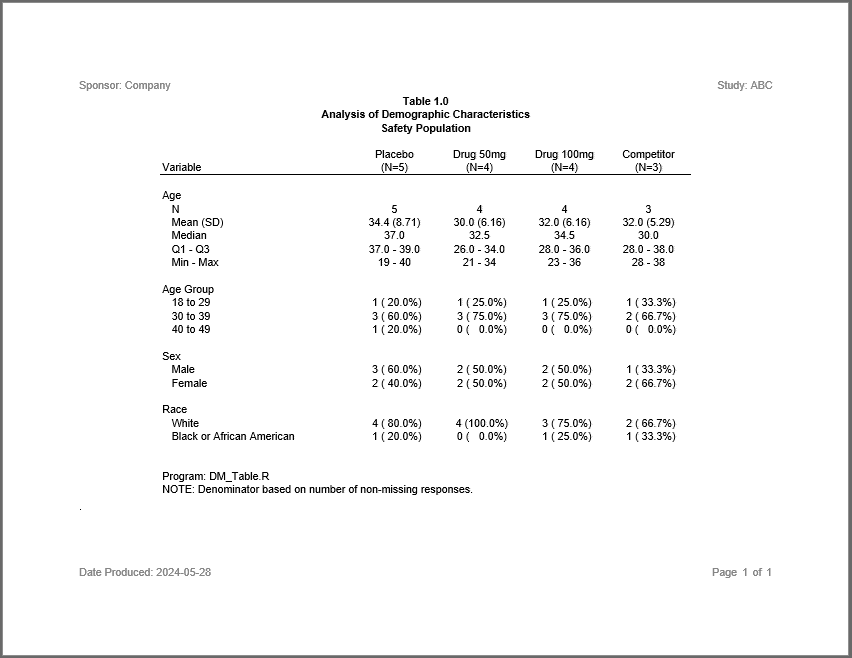

```{r setup, include = FALSE}
knitr::opts_chunk$set(
  collapse = TRUE,
  comment = "#>"
)
```
The second example produces a demographics summary table of selected variables. 
The report shows statistics for each of the four treatment groups.   

## Program

Note the following about this example:

  * The **[logr](https://logr.r-sassy.org)** package 
  provides automatic logging for many functions.
  * The `datastep()` function from the **[libr](https://libr.r-sassy.org)**
  package allows for easy data processing. 
  * The **[fmtr](https://fmtr.r-sassy.org)** package provides several 
  convenient functions for 
  calculating and formatting summary statistics.
  * Statistics from the **[procs](https://procs.r-sassy.org)** package
  match SAS® out of the box.
  * The **[reporter](https://reporter.r-sassy.org)** package supports 
  'N=' population counts in the header labels.
  * The **reporter** package also allows you to define a stub column of 
  hierarchical labels.

```{r eval=FALSE, echo=TRUE}
library(sassy)

# Prepare Log -------------------------------------------------------------


options("logr.autolog" = TRUE,
        "logr.on" = TRUE,
        "logr.notes" = FALSE,
        "procs.print" = FALSE)

# Get temp directory
tmp <- tempdir()

# Open log
lf <- log_open(file.path(tmp, "example2.log"))


# Prepare formats ---------------------------------------------------------

sep("Prepare formats")

put("Age categories")
agecat <- value(condition(x >= 18 & x <= 29, "18 to 29"),
                condition(x >=30 & x <= 39, "30 to 39"),
                condition(x >=40 & x <=49, "40 to 49"),
                condition(x >= 50, ">= 50"),
                as.factor = TRUE) 

put("Sex decodes")
fmt_sex <- value(condition(x == "M", "Male"),
                 condition(x == "F", "Female"),
                 condition(TRUE, "Other"),
                 as.factor = TRUE) 

put("Race decodes")
fmt_race <- value(condition(x == "WHITE", "White"),
                  condition(x == "BLACK", "Black or African American"),
                  condition(TRUE, "Other"),
                  as.factor = TRUE)


put("Compile format catalog")
fc <- fcat(MEAN = "%.1f", STD = "(%.2f)", 
           Q1 = "%.1f", Q3 = "%.1f",
           MIN = "%d", MAX = "%d", 
           CNT = "%2d", PCT = "(%5.1f%%)",
           AGECAT = agecat,
           SEX = fmt_sex,
           RACE = fmt_race) 


# Load and Prepare Data ---------------------------------------------------

sep("Prepare Data")


put("Create sample ADSL data.")
adsl <- read.table(header = TRUE, text = '
  SUBJID  ARM    SEX  RACE    AGE
  "001"   "ARM A" "F"  "WHITE" 19 
  "002"   "ARM B" "F"  "WHITE" 21 
  "003"   "ARM C" "F"  "WHITE" 23 
  "004"   "ARM D" "F"  "BLACK" 28 
  "005"   "ARM A" "M"  "WHITE" 37  
  "006"   "ARM B" "M"  "WHITE" 34 
  "007"   "ARM C" "M"  "WHITE" 36  
  "008"   "ARM D" "M"  "WHITE" 30   
  "009"   "ARM A" "F"  "WHITE" 39  
  "010"   "ARM B" "F"  "WHITE" 31  
  "011"   "ARM C" "F"  "BLACK" 33 
  "012"   "ARM D" "F"  "WHITE" 38 
  "013"   "ARM A" "M"  "BLACK" 37 
  "014"   "ARM B" "M"  "WHITE" 34  
  "015"   "ARM C" "M"  "WHITE" 36
  "016"   "ARM A" "M"  "WHITE" 40')  

put("Categorize AGE")
adsl$AGECAT <- fapply(adsl$AGE, agecat) 

put("Log starting dataset")
put(adsl)


put("Get ARM population counts")
proc_freq(adsl, tables = ARM, 
          output = long,
          options = v(nopercent, nonobs)) -> arm_pop

# Age Summary Block -------------------------------------------------------

sep("Create summary statistics for age")

put("Call means procedure to get summary statistics for age")
proc_means(adsl, var = AGE,
           stats = v(n, mean, std, median, q1, q3, min, max),
           by = ARM, 
           options = v(notype, nofreq)) -> age_stats 

put("Combine stats")
datastep(age_stats, 
         format = fc,
         drop = find.names(age_stats, start = 4), 
         {
           `Mean (SD)` <- fapply2(MEAN, STD)
           Median <- MEDIAN
           `Q1 - Q3` <- fapply2(Q1, Q3, sep = " - ")
           `Min - Max` <- fapply2(MIN, MAX, sep = " - ")
           
           
         }) -> age_comb

put("Transpose ARMs into columns")
proc_transpose(age_comb, 
               var = names(age_comb),
               copy = VAR, id = BY, 
               name = LABEL) -> age_block 


# Sex Block ---------------------------------------------------------------

sep("Create frequency counts for SEX")

put("Get sex frequency counts")
proc_freq(adsl, tables = SEX,
          by = ARM,
          options = nonobs) -> sex_freq 


put("Combine counts and percents.")
datastep(sex_freq, 
         format = fc, 
         rename = list(CAT = "LABEL"),
         drop = v(CNT, PCT), 
         {
           
           CNTPCT <- fapply2(CNT, PCT)
           
         }) -> sex_comb 

put("Transpose ARMs into columns")
proc_transpose(sex_comb, id = BY, 
               var = CNTPCT,
               copy = VAR, by = LABEL,
               options = noname) -> sex_trans

put("Apply formats")
datastep(sex_trans,
         {
           
           LABEL <- fapply(LABEL, fc$SEX)
           
         }) -> sex_cnts

put("Sort by label")
proc_sort(sex_cnts, by = LABEL) -> sex_block 


# Race block --------------------------------------------------------------


sep("Create frequency counts for RACE")

put("Get race frequency counts")
proc_freq(adsl, tables = RACE,
          by = ARM,
          options = nonobs) -> race_freq 


put("Combine counts and percents.")
datastep(race_freq, 
         format = fc, 
         rename = list(CAT = "LABEL"),
         drop = v(CNT, PCT), 
         {
           
           CNTPCT <- fapply2(CNT, PCT)
           
         }) -> race_comb 

put("Transpose ARMs into columns")
proc_transpose(race_comb, id = BY, var = CNTPCT,
               copy = VAR, by = LABEL, options = noname) -> race_trans

put("Clean up")
datastep(race_trans, 
         {
           LABEL <- fapply(LABEL, fc$RACE)
           
         }) -> race_cnts 

put("Sort by label")
proc_sort(race_cnts, by = LABEL) -> race_block 


# Age Group Block ----------------------------------------------------------

sep("Create frequency counts for Age Group")


put("Get age group frequency counts")
proc_freq(adsl,
          table = AGECAT,
          by = ARM,
          options = nonobs) -> ageg_freq

put("Combine counts and percents and assign age group factor for sorting")
datastep(ageg_freq,
         format = fc, 
         keep = v(VAR, LABEL, BY, CNTPCT),
         {
           CNTPCT <- fapply2(CNT, PCT)
           LABEL <- CAT
         }) -> ageg_comb


put("Sort by age group factor")
proc_sort(ageg_comb, by = v(BY, LABEL)) -> ageg_sort 

put("Tranpose age group block")
proc_transpose(ageg_sort,
               var = CNTPCT,
               copy = VAR,
               id = BY,
               by = LABEL, 
               options = noname) -> ageg_trans 

put("Combine blocks into final data frame")
datastep(age_block, 
         set = list(ageg_block, sex_block, race_block),
         {}) -> final

# Report ------------------------------------------------------------------


sep("Create and print report")

var_fmt <- c("AGE" = "Age", "AGECAT" = "Age Group", "SEX" = "Sex", "RACE" = "Race")

# Create Table
tbl <- create_table(final, first_row_blank = TRUE) |>  
  column_defaults(from = `ARM A`, to = `ARM D`, align = "center", width = 1.1) |>  
  stub(vars = c("VAR", "LABEL"), "Variable", width = 2.5) |>  
  define(VAR, blank_after = TRUE, dedupe = TRUE, label = "Variable",
         format = var_fmt,label_row = TRUE) |>  
  define(LABEL, indent = .25, label = "Demographic Category") |> 
  define(`ARM A`,  label = "Placebo", n = arm_pop["ARM A"]) |>  
  define(`ARM B`,  label = "Drug 50mg", n = arm_pop["ARM B"]) |>  
  define(`ARM C`,  label = "Drug 100mg", n = arm_pop["ARM C"]) |>  
  define(`ARM D`,  label = "Competitor", n = arm_pop["ARM D"]) |>  
  titles("Table 1.0", "Analysis of Demographic Characteristics", 
         "Safety Population", bold = TRUE) |> 
  footnotes("Program: DM_Table.R",
            "NOTE: Denominator based on number of non-missing responses.") 

rpt <- create_report(file.path(tmp, "example2.rtf"), 
                     output_type = "RTF", 
                     font = "Arial") |> 
  page_header("Sponsor: Company", "Study: ABC") |> 
  set_margins(top = 1, bottom = 1) |>  
  add_content(tbl) |> 
  page_footer("Date Produced: {Sys.Date()}", right = "Page [pg] of [tpg]")

put("Write out the report")
res <- write_report(rpt)

# Clean Up ----------------------------------------------------------------
sep("Clean Up")

put("Close log")
log_close()


# Uncomment to view report
# file.show(res$modified_path)

# Uncomment to view log
# file.show(lf)


```

## Output

Here is the output report:




## Log

And here is the log:

```
=========================================================================
Log Path: C:/Users/dbosa/AppData/Local/Temp/RtmpAXQUo8/log/example2.log
Program Path: C:/Projects/Archytas/Westat/Tutorial2/Project/sassy-dm.R
Working Directory: C:/Projects/Archytas/Westat/Tutorial2/Project
User Name: dbosa
R Version: 4.4.0 (2024-04-24 ucrt)
Machine: SOCRATES x86-64
Operating System: Windows 10 x64 build 22631
Base Packages: stats graphics grDevices utils datasets methods base
Other Packages: tidylog_1.0.2 ggplot2_3.5.1 procs_1.0.7 reporter_1.4.4
libr_1.3.3 logr_1.3.7 fmtr_1.6.4 common_1.1.3 sassy_1.2.4
Log Start Time: 2024-05-28 12:52:44.619869
=========================================================================

=========================================================================
Prepare formats
=========================================================================

Age categories

# A user-defined format: 4 conditions
- as.factor: TRUE
  Name Type        Expression    Label Order
1  obj    U x >= 18 & x <= 29 18 to 29    NA
2  obj    U x >= 30 & x <= 39 30 to 39    NA
3  obj    U x >= 40 & x <= 49 40 to 49    NA
4  obj    U           x >= 50    >= 50    NA

Sex decodes

# A user-defined format: 3 conditions
- as.factor: TRUE
  Name Type Expression  Label Order
1  obj    U   x == "M"   Male    NA
2  obj    U   x == "F" Female    NA
3  obj    U       TRUE  Other    NA

Race decodes

# A user-defined format: 3 conditions
- as.factor: TRUE
  Name Type   Expression                     Label Order
1  obj    U x == "WHITE"                     White    NA
2  obj    U x == "BLACK" Black or African American    NA
3  obj    U         TRUE                     Other    NA

Compile format catalog

# A format catalog: 11 formats
- $MEAN: type S, "%.1f"
- $STD: type S, "(%.2f)"
- $Q1: type S, "%.1f"
- $Q3: type S, "%.1f"
- $MIN: type S, "%d"
- $MAX: type S, "%d"
- $CNT: type S, "%2d"
- $PCT: type S, "(%5.1f%%)"
- $AGECAT: type U, 4 conditions
- $SEX: type U, 3 conditions
- $RACE: type U, 3 conditions

=========================================================================
Prepare Data
=========================================================================

Create sample ADSL data.

Categorize AGE

Log starting dataset

   SUBJID   ARM SEX  RACE AGE   AGECAT
1       1 ARM A   F WHITE  19 18 to 29
2       2 ARM B   F WHITE  21 18 to 29
3       3 ARM C   F WHITE  23 18 to 29
4       4 ARM D   F BLACK  28 18 to 29
5       5 ARM A   M WHITE  37 30 to 39
6       6 ARM B   M WHITE  34 30 to 39
7       7 ARM C   M WHITE  36 30 to 39
8       8 ARM D   M WHITE  30 30 to 39
9       9 ARM A   F WHITE  39 30 to 39
10     10 ARM B   F WHITE  31 30 to 39
11     11 ARM C   F BLACK  33 30 to 39
12     12 ARM D   F WHITE  38 30 to 39
13     13 ARM A   M BLACK  37 30 to 39
14     14 ARM B   M WHITE  34 30 to 39
15     15 ARM C   M WHITE  36 30 to 39
16     16 ARM A   M WHITE  40 40 to 49

Get ARM population counts

proc_freq: input data set 16 rows and 6 columns
           tables: ARM
           output: long
           view: TRUE
           output: 1 datasets

  VAR STAT ARM A ARM B ARM C ARM D
1 ARM  CNT     5     4     4     3

=========================================================================
Create summary statistics for age
=========================================================================

Call means procedure to get summary statistics for age

proc_means: input data set 16 rows and 6 columns
            by: ARM
            var: AGE
            stats: n mean std median q1 q3 min max
            view: TRUE
            output: 1 datasets

     BY VAR N MEAN      STD MEDIAN Q1 Q3 MIN MAX
1 ARM A AGE 5 34.4 8.706320   37.0 37 39  19  40
2 ARM B AGE 4 30.0 6.164414   32.5 26 34  21  34
3 ARM C AGE 4 32.0 6.164414   34.5 28 36  23  36
4 ARM D AGE 3 32.0 5.291503   30.0 28 38  28  38

Combine stats

datastep: columns decreased from 10 to 7

     BY VAR N   Mean (SD) Median     Q1 - Q3 Min - Max
1 ARM A AGE 5 34.4 (8.71)   37.0 37.0 - 39.0   19 - 40
2 ARM B AGE 4 30.0 (6.16)   32.5 26.0 - 34.0   21 - 34
3 ARM C AGE 4 32.0 (6.16)   34.5 28.0 - 36.0   23 - 36
4 ARM D AGE 3 32.0 (5.29)   30.0 28.0 - 38.0   28 - 38

Transpose ARMs into columns

proc_transpose: input data set 4 rows and 7 columns
                var: BY VAR N Mean (SD) Median Q1 - Q3 Min - Max
                id: BY
                copy: VAR
                name: LABEL
                output dataset 5 rows and 6 columns

  VAR     LABEL       ARM A       ARM B       ARM C       ARM D
1 AGE         N           5           4           4           3
2 AGE Mean (SD) 34.4 (8.71) 30.0 (6.16) 32.0 (6.16) 32.0 (5.29)
3 AGE    Median        37.0        32.5        34.5        30.0
4 AGE   Q1 - Q3 37.0 - 39.0 26.0 - 34.0 28.0 - 36.0 28.0 - 38.0
5 AGE Min - Max     19 - 40     21 - 34     23 - 36     28 - 38

=========================================================================
Create frequency counts for SEX
=========================================================================

Get sex frequency counts

proc_freq: input data set 16 rows and 6 columns
           tables: SEX
           by: ARM
           view: TRUE
           output: 1 datasets

     BY VAR CAT CNT      PCT
1 ARM A SEX   F   2 40.00000
2 ARM A SEX   M   3 60.00000
3 ARM B SEX   F   2 50.00000
4 ARM B SEX   M   2 50.00000
5 ARM C SEX   F   2 50.00000
6 ARM C SEX   M   2 50.00000
7 ARM D SEX   F   2 66.66667
8 ARM D SEX   M   1 33.33333

Combine counts and percents.

datastep: columns decreased from 5 to 4

     BY VAR LABEL      CNTPCT
1 ARM A SEX     F  2 ( 40.0%)
2 ARM A SEX     M  3 ( 60.0%)
3 ARM B SEX     F  2 ( 50.0%)
4 ARM B SEX     M  2 ( 50.0%)
5 ARM C SEX     F  2 ( 50.0%)
6 ARM C SEX     M  2 ( 50.0%)
7 ARM D SEX     F  2 ( 66.7%)
8 ARM D SEX     M  1 ( 33.3%)

Transpose ARMs into columns

proc_transpose: input data set 8 rows and 4 columns
                by: LABEL
                var: CNTPCT
                id: BY
                copy: VAR
                name: NAME
                output dataset 2 rows and 6 columns

  VAR LABEL       ARM A       ARM B       ARM C       ARM D
1 SEX     F  2 ( 40.0%)  2 ( 50.0%)  2 ( 50.0%)  2 ( 66.7%)
2 SEX     M  3 ( 60.0%)  2 ( 50.0%)  2 ( 50.0%)  1 ( 33.3%)

Apply formats

datastep: columns started with 6 and ended with 6

  VAR  LABEL       ARM A       ARM B       ARM C       ARM D
1 SEX Female  2 ( 40.0%)  2 ( 50.0%)  2 ( 50.0%)  2 ( 66.7%)
2 SEX   Male  3 ( 60.0%)  2 ( 50.0%)  2 ( 50.0%)  1 ( 33.3%)

Sort by label

proc_sort: input data set 2 rows and 6 columns
           by: LABEL
           keep: VAR LABEL ARM A ARM B ARM C ARM D
           order: a
           output data set 2 rows and 6 columns

  VAR  LABEL       ARM A       ARM B       ARM C       ARM D
2 SEX   Male  3 ( 60.0%)  2 ( 50.0%)  2 ( 50.0%)  1 ( 33.3%)
1 SEX Female  2 ( 40.0%)  2 ( 50.0%)  2 ( 50.0%)  2 ( 66.7%)

=========================================================================
Create frequency counts for RACE
=========================================================================

Get race frequency counts

proc_freq: input data set 16 rows and 6 columns
           tables: RACE
           by: ARM
           view: TRUE
           output: 1 datasets

     BY  VAR   CAT CNT       PCT
1 ARM A RACE BLACK   1  20.00000
2 ARM A RACE WHITE   4  80.00000
3 ARM B RACE BLACK   0   0.00000
4 ARM B RACE WHITE   4 100.00000
5 ARM C RACE BLACK   1  25.00000
6 ARM C RACE WHITE   3  75.00000
7 ARM D RACE BLACK   1  33.33333
8 ARM D RACE WHITE   2  66.66667

Combine counts and percents.

datastep: columns decreased from 5 to 4

     BY  VAR LABEL      CNTPCT
1 ARM A RACE BLACK  1 ( 20.0%)
2 ARM A RACE WHITE  4 ( 80.0%)
3 ARM B RACE BLACK  0 (  0.0%)
4 ARM B RACE WHITE  4 (100.0%)
5 ARM C RACE BLACK  1 ( 25.0%)
6 ARM C RACE WHITE  3 ( 75.0%)
7 ARM D RACE BLACK  1 ( 33.3%)
8 ARM D RACE WHITE  2 ( 66.7%)

Transpose ARMs into columns

proc_transpose: input data set 8 rows and 4 columns
                by: LABEL
                var: CNTPCT
                id: BY
                copy: VAR
                name: NAME
                output dataset 2 rows and 6 columns

   VAR LABEL       ARM A       ARM B       ARM C       ARM D
1 RACE BLACK  1 ( 20.0%)  0 (  0.0%)  1 ( 25.0%)  1 ( 33.3%)
2 RACE WHITE  4 ( 80.0%)  4 (100.0%)  3 ( 75.0%)  2 ( 66.7%)

Clean up

datastep: columns started with 6 and ended with 6

   VAR                     LABEL       ARM A       ARM B       ARM C       ARM D
1 RACE Black or African American  1 ( 20.0%)  0 (  0.0%)  1 ( 25.0%)  1 ( 33.3%)
2 RACE                     White  4 ( 80.0%)  4 (100.0%)  3 ( 75.0%)  2 ( 66.7%)

Sort by label

proc_sort: input data set 2 rows and 6 columns
           by: LABEL
           keep: VAR LABEL ARM A ARM B ARM C ARM D
           order: a
           output data set 2 rows and 6 columns

   VAR                     LABEL       ARM A       ARM B       ARM C       ARM D
2 RACE                     White  4 ( 80.0%)  4 (100.0%)  3 ( 75.0%)  2 ( 66.7%)
1 RACE Black or African American  1 ( 20.0%)  0 (  0.0%)  1 ( 25.0%)  1 ( 33.3%)

=========================================================================
Create frequency counts for Age Group
=========================================================================

Get age group frequency counts

proc_freq: input data set 16 rows and 6 columns
           tables: AGECAT
           by: ARM
           view: TRUE
           output: 1 datasets

      BY    VAR      CAT CNT      PCT
1  ARM A AGECAT 18 to 29   1 20.00000
2  ARM A AGECAT 30 to 39   3 60.00000
3  ARM A AGECAT 40 to 49   1 20.00000
4  ARM A AGECAT    >= 50   0  0.00000
5  ARM B AGECAT 18 to 29   1 25.00000
6  ARM B AGECAT 30 to 39   3 75.00000
7  ARM B AGECAT 40 to 49   0  0.00000
8  ARM B AGECAT    >= 50   0  0.00000
9  ARM C AGECAT 18 to 29   1 25.00000
10 ARM C AGECAT 30 to 39   3 75.00000
11 ARM C AGECAT 40 to 49   0  0.00000
12 ARM C AGECAT    >= 50   0  0.00000
13 ARM D AGECAT 18 to 29   1 33.33333
14 ARM D AGECAT 30 to 39   2 66.66667
15 ARM D AGECAT 40 to 49   0  0.00000
16 ARM D AGECAT    >= 50   0  0.00000

Combine counts and percents and assign age group factor for sorting

datastep: columns decreased from 5 to 4

      VAR    LABEL    BY      CNTPCT
1  AGECAT 18 to 29 ARM A  1 ( 20.0%)
2  AGECAT 30 to 39 ARM A  3 ( 60.0%)
3  AGECAT 40 to 49 ARM A  1 ( 20.0%)
4  AGECAT    >= 50 ARM A  0 (  0.0%)
5  AGECAT 18 to 29 ARM B  1 ( 25.0%)
6  AGECAT 30 to 39 ARM B  3 ( 75.0%)
7  AGECAT 40 to 49 ARM B  0 (  0.0%)
8  AGECAT    >= 50 ARM B  0 (  0.0%)
9  AGECAT 18 to 29 ARM C  1 ( 25.0%)
10 AGECAT 30 to 39 ARM C  3 ( 75.0%)
11 AGECAT 40 to 49 ARM C  0 (  0.0%)
12 AGECAT    >= 50 ARM C  0 (  0.0%)
13 AGECAT 18 to 29 ARM D  1 ( 33.3%)
14 AGECAT 30 to 39 ARM D  2 ( 66.7%)
15 AGECAT 40 to 49 ARM D  0 (  0.0%)
16 AGECAT    >= 50 ARM D  0 (  0.0%)

Sort by age group factor

proc_sort: input data set 16 rows and 4 columns
           by: BY LABEL
           keep: VAR LABEL BY CNTPCT
           order: a a
           output data set 16 rows and 4 columns

      VAR    LABEL    BY      CNTPCT
1  AGECAT 18 to 29 ARM A  1 ( 20.0%)
2  AGECAT 30 to 39 ARM A  3 ( 60.0%)
3  AGECAT 40 to 49 ARM A  1 ( 20.0%)
4  AGECAT    >= 50 ARM A  0 (  0.0%)
5  AGECAT 18 to 29 ARM B  1 ( 25.0%)
6  AGECAT 30 to 39 ARM B  3 ( 75.0%)
7  AGECAT 40 to 49 ARM B  0 (  0.0%)
8  AGECAT    >= 50 ARM B  0 (  0.0%)
9  AGECAT 18 to 29 ARM C  1 ( 25.0%)
10 AGECAT 30 to 39 ARM C  3 ( 75.0%)
11 AGECAT 40 to 49 ARM C  0 (  0.0%)
12 AGECAT    >= 50 ARM C  0 (  0.0%)
13 AGECAT 18 to 29 ARM D  1 ( 33.3%)
14 AGECAT 30 to 39 ARM D  2 ( 66.7%)
15 AGECAT 40 to 49 ARM D  0 (  0.0%)
16 AGECAT    >= 50 ARM D  0 (  0.0%)

Tranpose age group block

proc_transpose: input data set 16 rows and 4 columns
                by: LABEL
                var: CNTPCT
                id: BY
                copy: VAR
                name: NAME
                output dataset 4 rows and 6 columns

     VAR    LABEL       ARM A       ARM B       ARM C       ARM D
1 AGECAT 18 to 29  1 ( 20.0%)  1 ( 25.0%)  1 ( 25.0%)  1 ( 33.3%)
2 AGECAT 30 to 39  3 ( 60.0%)  3 ( 75.0%)  3 ( 75.0%)  2 ( 66.7%)
3 AGECAT 40 to 49  1 ( 20.0%)  0 (  0.0%)  0 (  0.0%)  0 (  0.0%)
4 AGECAT    >= 50  0 (  0.0%)  0 (  0.0%)  0 (  0.0%)  0 (  0.0%)

Combine blocks into final data frame

datastep: columns started with 6 and ended with 6

      VAR                     LABEL       ARM A       ARM B       ARM C       ARM D
1     AGE                         N           5           4           4           3
2     AGE                 Mean (SD) 34.4 (8.71) 30.0 (6.16) 32.0 (6.16) 32.0 (5.29)
3     AGE                    Median        37.0        32.5        34.5        30.0
4     AGE                   Q1 - Q3 37.0 - 39.0 26.0 - 34.0 28.0 - 36.0 28.0 - 38.0
5     AGE                 Min - Max     19 - 40     21 - 34     23 - 36     28 - 38
6  AGECAT                  18 to 29  1 ( 20.0%)  1 ( 25.0%)  1 ( 25.0%)  1 ( 33.3%)
7  AGECAT                  30 to 39  3 ( 60.0%)  3 ( 75.0%)  3 ( 75.0%)  2 ( 66.7%)
8  AGECAT                  40 to 49  1 ( 20.0%)  0 (  0.0%)  0 (  0.0%)  0 (  0.0%)
9     SEX                      Male  3 ( 60.0%)  2 ( 50.0%)  2 ( 50.0%)  1 ( 33.3%)
10    SEX                    Female  2 ( 40.0%)  2 ( 50.0%)  2 ( 50.0%)  2 ( 66.7%)
11   RACE                     White  4 ( 80.0%)  4 (100.0%)  3 ( 75.0%)  2 ( 66.7%)
12   RACE Black or African American  1 ( 20.0%)  0 (  0.0%)  1 ( 25.0%)  1 ( 33.3%)

=========================================================================
Create and print report
=========================================================================

Write out the report

# A report specification: 1 pages
- file_path: 'C:\Users\dbosa\AppData\Local\Temp\RtmpAXQUo8/example2.rtf'
- output_type: RTF
- units: inches
- orientation: landscape
- margins: top 1 bottom 1 left 1 right 1
- line size/count: 9/36
- page_header: left=Sponsor: Company right=Study: ABC
- page_footer: left=Date Produced: 2024-05-28 center= right=Page [pg] of [tpg]
- content: 
# A table specification:
- data: data.frame 'final' 12 rows 6 cols
- show_cols: all
- use_attributes: all
- title 1: 'Table 1.0'
- title 2: 'Analysis of Demographic Characteristics'
- title 3: 'Safety Population'
- footnote 1: 'Program: DM_Table.R'
- footnote 2: 'NOTE: Denominator based on number of non-missing responses.'
- stub: VAR LABEL 'Variable' width=2.5 align='left' 
- define: VAR 'Variable' dedupe='TRUE' 
- define: LABEL 'Demographic Category' 
- define: ARM A 'Placebo' 
- define: ARM B 'Drug 50mg' 
- define: ARM C 'Drug 100mg' 
- define: ARM D 'Competitor' 

=========================================================================
Clean Up
=========================================================================

Close log

=========================================================================
Log End Time: 2024-05-28 12:52:45.234875
Log Elapsed Time: 0 00:00:00
=========================================================================


```

Next: [Example 3: Figures](sassy-figure.html)
