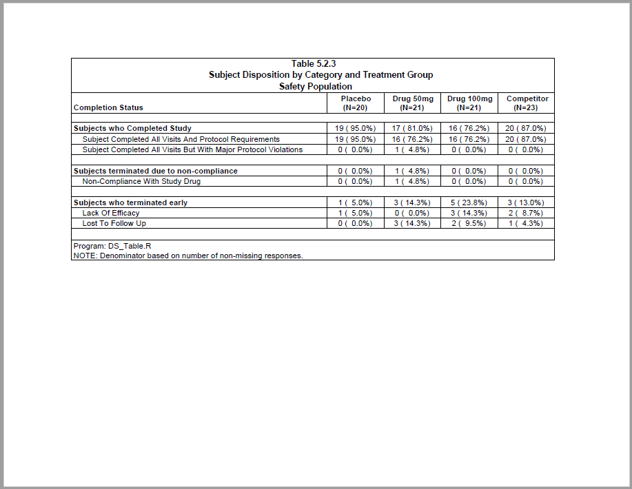

```{r setup, include = FALSE}
knitr::opts_chunk$set(
  collapse = TRUE,
  comment = "#>"
)
```
This example produces a subject disposition table.
The report features extensive data preparation using the **dplyr** package.
The example also shows how to create a stub column with summary rows.

## Program

```{r eval=FALSE, echo=TRUE}
library(tidyverse)
library(sassy)

# Prepare Log -------------------------------------------------------------

options("logr.autolog" = TRUE,
        "logr.notes" = FALSE)

# Get path to temp directory
tmp <- tempdir() 

# Get sample data directory
dir <- system.file("extdata", package = "sassy")

# Open log
lgpth <- log_open(file.path(tmp, "example10.log"))


# Load and Prepare Data ---------------------------------------------------

sep("Prepare Data")

# Define data library
libname(sdtm, dir, "csv") 

# Loads data into workspace
lib_load(sdtm)

# Prepare data
dm_mod <- sdtm.DM |> 
  select(USUBJID, ARM) |> 
  filter(ARM != "SCREEN FAILURE") |> put()


ds_mod <- sdtm.DS |>
  select(USUBJID, DSTERM, DSDECOD, DSCAT) |> 
  filter(DSCAT != "PROTOCOL MILESTONE")

put("Join DS to DM")
dmds <- inner_join(dm_mod, ds_mod) 


put("Get ARM population counts")
arm_pop <- count(dm_mod, ARM) |> deframe() |> put()


# Prepare formats ---------------------------------------------------------

# Completed Study
complete_fmt <- value(condition(x == "SUBJECT COMPLETED ALL VISITS AND PROTOCOL REQUIREMENTS",
                                str_to_title("SUBJECT COMPLETED ALL VISITS AND PROTOCOL REQUIREMENTS")),
                      condition(x == "SUBJECT COMPLETED ALL VISITS BUT WITH MAJOR PROTOCOL VIOLATIONS",
                                str_to_title("SUBJECT COMPLETED ALL VISITS BUT WITH MAJOR PROTOCOL VIOLATIONS")))

# Subject Non-compliance
noncomp_fmt <- value(condition(x == "NON-COMPLIANCE WITH STUDY DRUG",
                               str_to_title("NON-COMPLIANCE WITH STUDY DRUG")))

# Early Termination
term_fmt <- value(condition(x == "LACK OF EFFICACY",
                            str_to_title("LACK OF EFFICACY")),
                  condition(str_detect(x, "LOST"),
                            str_to_title("LOST TO FOLLOW UP")),
                  condition(TRUE, str_to_title("LACK OF EFFICACY")))

# Group labels
group_fmt <- value(condition(x == "COMPLETED", "Subjects who Completed Study"),
                   condition(x == "NONCOMPLIANCE", "Subjects terminated due to non-compliance"),
                   condition(x == "OTHER", "Subjects who terminated early"))


# Disposition Groups ------------------------------------------------------

put("Get group counts")
grps <- dmds |> select(ARM, DSDECOD) |> 
  group_by(ARM, DSDECOD) |> 
  summarize(n = n()) |> 
  ungroup() |> 
  pivot_wider(names_from = ARM,
              values_from = n,
              values_fill = 0) |> 
  transmute(group = ifelse(DSDECOD == "NON-COMPLIANCE WITH STUDY DRUG", "NONCOMPLIANCE", DSDECOD),
            cat = NA,
            catseq = 1,
            `ARM A` = fmt_cnt_pct(`ARM A`, arm_pop["ARM A"]),
            `ARM B` = fmt_cnt_pct(`ARM B`, arm_pop["ARM B"]),
            `ARM C` = fmt_cnt_pct(`ARM C`, arm_pop["ARM C"]),
            `ARM D` = fmt_cnt_pct(`ARM D`, arm_pop["ARM D"])) |> put()


# Disposition Subgroups ----------------------------------------------------

put("Pull out subjects who completed study.")
cmplt <- dmds |> filter(DSDECOD == "COMPLETED") |> 
  mutate(TERMDECOD = fapply(DSTERM, complete_fmt)) |>
  group_by(ARM, DSDECOD, TERMDECOD) |> 
  summarize(n = n()) |> 
  ungroup() |> 
  pivot_wider(names_from = ARM,
              values_from = n,
              values_fill = 0) |> 
  transmute(group = "COMPLETED",
            cat = TERMDECOD,
            catseq = 2,
            `ARM A` = fmt_cnt_pct(`ARM A`, arm_pop["ARM A"]),
            `ARM B` = fmt_cnt_pct(`ARM B`, arm_pop["ARM B"]),
            `ARM C` = fmt_cnt_pct(`ARM C`, arm_pop["ARM C"]),
            `ARM D` = fmt_cnt_pct(`ARM D`, arm_pop["ARM D"])) |> put()


put("Pull out subjects who were non-compliant")
noncompl1 <- dmds |> filter(DSDECOD == "NON-COMPLIANCE WITH STUDY DRUG") |> 
  mutate(TERMDECOD = fapply(DSTERM, noncomp_fmt)) |>
  group_by(ARM, DSDECOD, TERMDECOD) |> 
  summarize(n = n()) |> 
  ungroup() |> 
  pivot_wider(names_from = ARM,
              values_from = n,
              values_fill = 0)

nms <- names(noncompl1)

noncompl2 <- noncompl1 |> 
  transmute(group = "NONCOMPLIANCE",
            cat = TERMDECOD,
            catseq = 2,
            `ARM A` = ifelse("ARM A" %in% nms, fmt_cnt_pct(`ARM A`, arm_pop["ARM A"]), "0 (  0.0%)"),
            `ARM B` = ifelse("ARM B" %in% nms, fmt_cnt_pct(`ARM B`, arm_pop["ARM B"]), "0 (  0.0%)"),
            `ARM C` = ifelse("ARM C" %in% nms, fmt_cnt_pct(`ARM C`, arm_pop["ARM C"]), "0 (  0.0%)"),
            `ARM D` = ifelse("ARM D" %in% nms, fmt_cnt_pct(`ARM D`, arm_pop["ARM D"]), "0 (  0.0%)")) |> put()

put("Pull out subjects who terminated early")
earlyterm <- dmds |> filter(DSDECOD == "OTHER") |> 
  mutate(TERMDECOD = fapply(DSTERM, term_fmt)) |>
  group_by(ARM, DSDECOD, TERMDECOD) |> 
  summarize(n = n()) |> 
  ungroup() |> 
  pivot_wider(names_from = ARM,
              values_from = n,
              values_fill = 0) |> 
  transmute(group = "OTHER",
            cat = TERMDECOD,
            catseq = 2,
            `ARM A` = fmt_cnt_pct(`ARM A`, arm_pop["ARM A"]),
            `ARM B` = fmt_cnt_pct(`ARM B`, arm_pop["ARM B"]),
            `ARM C` = fmt_cnt_pct(`ARM C`, arm_pop["ARM C"]),
            `ARM D` = fmt_cnt_pct(`ARM D`, arm_pop["ARM D"])) |> put()

put("Combine blocks into final data frame")
final <- bind_rows(grps, cmplt, noncompl2, earlyterm) |> 
  arrange(group, catseq, cat) |> 
  mutate(lblind = ifelse(is.na(cat), TRUE, FALSE)) |> put()


# Report ------------------------------------------------------------------

sep("Create and print report")

# Create Table
tbl <- create_table(final, first_row_blank = TRUE, 
                    borders = "all", width = 8.5, header_bold = TRUE) |> 
  column_defaults(from = `ARM A`, to = `ARM D`, 
                  align = "center", width = 1) |> 
  stub(vars = v(group, cat), "Completion Status", 
       style = cell_style(bold = TRUE, indicator = "lblind")) |> 
  define(group, blank_after = TRUE, dedupe = TRUE,
         format = group_fmt) |>
  define(cat, indent = .5) |>
  define(catseq, visible = FALSE) |> 
  define(`ARM A`, label = "Placebo", n = arm_pop["ARM A"]) |> 
  define(`ARM B`, label = "Drug 50mg", n = arm_pop["ARM B"]) |> 
  define(`ARM C`, label = "Drug 100mg", n = arm_pop["ARM C"]) |> 
  define(`ARM D`, label = "Competitor", n = arm_pop["ARM D"]) |> 
  define(lblind, visible = FALSE) |> 
  titles("Table 5.2.3", "Subject Disposition by Category and Treatment Group",                                                                      
         "Safety Population", bold = TRUE, font_size = 11,
         borders = "outside", blank_row = "none") |> 
  footnotes("Program: DS_Table.R",
          "NOTE: Denominator based on number of non-missing responses.",
          borders = "outside", blank_row = "none") 

pth <- file.path(tmp, "example10.pdf")

rpt <- create_report(pth, output_type = "PDF", font = "Arial") |> 
  set_margins(top = 1, bottom = 1) |> 
  add_content(tbl) 


write_report(rpt)


# Clean Up ----------------------------------------------------------------

# Unload library from workspace
lib_unload(sdtm)

# Close log
log_close()

# Uncomment to view files
# file.show(pth)
# file.show(lgpth)
```

## Output

Here is the output report:




## Log

Here is the log:

```
=========================================================================
Log Path: C:/Users/dbosa/AppData/Local/Temp/RtmpeYEHwE/log/example10.log
Program Path: C:/packages/Testing/Disposition.R
Working Directory: C:/packages/Testing
User Name: dbosa
R Version: 4.2.1 (2022-06-23 ucrt)
Machine: SOCRATES x86-64
Operating System: Windows 10 x64 build 19044
Base Packages: stats graphics grDevices utils datasets methods base Other
Packages: tidylog_1.0.2 reporter_1.3.7 libr_1.2.6 fmtr_1.5.9 logr_1.3.3
sassy_1.0.8 forcats_0.5.2 stringr_1.4.0 dplyr_1.0.10 purrr_0.3.4 readr_2.1.2
tidyr_1.2.0 tibble_3.1.8 ggplot2_3.3.6 tidyverse_1.3.1 cranlogs_2.1.1
common_1.0.5
Log Start Time: 2022-10-09 20:51:10
=========================================================================

=========================================================================
Prepare Data
=========================================================================

# library 'sdtm': 8 items
- attributes: csv not loaded
- path: C:/Users/dbosa/AppData/Local/R/win-library/4.2/sassy/extdata
- items:
  Name Extension Rows Cols     Size        LastModified
1   AE       csv  150   27  88.5 Kb 2022-09-05 10:57:47
2   DA       csv 3587   18 528.2 Kb 2022-09-05 10:57:47
3   DM       csv   87   24  45.5 Kb 2022-09-05 10:57:47
4   DS       csv  174    9  34.1 Kb 2022-09-05 10:57:47
5   EX       csv   84   11  26.4 Kb 2022-09-05 10:57:47
6   IE       csv    2   14  13.4 Kb 2022-09-05 10:57:47
7   SV       csv  685   10  70.3 Kb 2022-09-05 10:57:47
8   VS       csv 3358   17 467.4 Kb 2022-09-05 10:57:47

lib_load: library 'sdtm' loaded

select: dropped 22 variables (STUDYID, DOMAIN, SUBJID, RFSTDTC, RFENDTC, …)

filter: removed 2 rows (2%), 85 rows remaining

# A tibble: 85 × 2
   USUBJID    ARM  
   <chr>      <chr>
 1 ABC-01-049 ARM D
 2 ABC-01-050 ARM B
 3 ABC-01-051 ARM A
 4 ABC-01-052 ARM C
 5 ABC-01-053 ARM B
 6 ABC-01-054 ARM D
 7 ABC-01-055 ARM C
 8 ABC-01-056 ARM A
 9 ABC-01-113 ARM D
10 ABC-01-114 ARM B
# … with 75 more rows
# ℹ Use `print(n = ...)` to see more rows

select: dropped 5 variables (STUDYID, DOMAIN, DSSEQ, DSSTDTC, DSSTDY)

filter: removed 87 rows (50%), 87 rows remaining

Join DS to DM

inner_join: added 3 columns (DSTERM, DSDECOD, DSCAT)

            > rows only in x  ( 0)

            > rows only in y  ( 2)

            > matched rows     85

            >                 ====

            > rows total       85

Get ARM population counts

count: now 4 rows and 2 columns, ungrouped

ARM A ARM B ARM C ARM D 
   20    21    21    23 

# A user-defined format: 2 conditions
  Name Type                                                             Expression
1  obj    U          x == "SUBJECT COMPLETED ALL VISITS AND PROTOCOL REQUIREMENTS"
2  obj    U x == "SUBJECT COMPLETED ALL VISITS BUT WITH MAJOR PROTOCOL VIOLATIONS"
                                                            Label Order
1          Subject Completed All Visits And Protocol Requirements    NA
2 Subject Completed All Visits But With Major Protocol Violations    NA

# A user-defined format: 1 conditions
  Name Type                            Expression                          Label Order
1  obj    U x == "NON-COMPLIANCE WITH STUDY DRUG" Non-Compliance With Study Drug    NA

# A user-defined format: 3 conditions
  Name Type              Expression             Label Order
1  obj    U x == "LACK OF EFFICACY"  Lack Of Efficacy    NA
2  obj    U   str_detect(x, "LOST") Lost To Follow Up    NA
3  obj    U                    TRUE  Lack Of Efficacy    NA

# A user-defined format: 3 conditions
  Name Type           Expression                                     Label Order
1  obj    U     x == "COMPLETED"              Subjects who Completed Study    NA
2  obj    U x == "NONCOMPLIANCE" Subjects terminated due to non-compliance    NA
3  obj    U         x == "OTHER"             Subjects who terminated early    NA

Get group counts

select: dropped 3 variables (USUBJID, DSTERM, DSCAT)

group_by: 2 grouping variables (ARM, DSDECOD)

summarize: now 9 rows and 3 columns, one group variable remaining (ARM)

ungroup: no grouping variables

pivot_wider: reorganized (ARM, n) into (ARM A, ARM B, ARM C, ARM D) [was 9x3, now 3x5]

transmute: dropped one variable (DSDECOD)

           new variable 'group' (character) with 3 unique values and 0% NA

           new variable 'cat' (logical) with one unique value and 100% NA

           new variable 'catseq' (double) with one unique value and 0% NA

           converted 'ARM A' from integer to character (0 new NA)

           converted 'ARM B' from integer to character (0 new NA)

           converted 'ARM C' from integer to character (0 new NA)

           converted 'ARM D' from integer to character (0 new NA)

# A tibble: 3 × 7
  group         cat   catseq `ARM A`     `ARM B`     `ARM C`     `ARM D`    
  <chr>         <lgl>  <dbl> <chr>       <chr>       <chr>       <chr>      
1 COMPLETED     NA         1 19 ( 95.0%) 17 ( 81.0%) 16 ( 76.2%) 20 ( 87.0%)
2 OTHER         NA         1 1 (  5.0%)  3 ( 14.3%)  5 ( 23.8%)  3 ( 13.0%) 
3 NONCOMPLIANCE NA         1 0 (  0.0%)  1 (  4.8%)  0 (  0.0%)  0 (  0.0%) 

Pull out subjects who completed study.

filter: removed 13 rows (15%), 72 rows remaining

mutate: new variable 'TERMDECOD' (character) with 2 unique values and 0% NA

group_by: 3 grouping variables (ARM, DSDECOD, TERMDECOD)

summarize: now 5 rows and 4 columns, 2 group variables remaining (ARM, DSDECOD)

ungroup: no grouping variables

pivot_wider: reorganized (ARM, n) into (ARM A, ARM B, ARM C, ARM D) [was 5x4, now 2x6]

transmute: dropped 2 variables (DSDECOD, TERMDECOD)

           new variable 'group' (character) with one unique value and 0% NA

           new variable 'cat' (character) with 2 unique values and 0% NA

           new variable 'catseq' (double) with one unique value and 0% NA

           converted 'ARM A' from integer to character (0 new NA)

           converted 'ARM B' from integer to character (0 new NA)

           converted 'ARM C' from integer to character (0 new NA)

           converted 'ARM D' from integer to character (0 new NA)

# A tibble: 2 × 7
  group     cat                                                           catseq `ARM A` `ARM B` `ARM C` `ARM D`
  <chr>     <chr>                                                          <dbl> <chr>   <chr>   <chr>   <chr>  
1 COMPLETED Subject Completed All Visits And Protocol Requirements             2 19 ( 9… 16 ( 7… 16 ( 7… 20 ( 8…
2 COMPLETED Subject Completed All Visits But With Major Protocol Violati…      2 0 (  0… 1 (  4… 0 (  0… 0 (  0…

Pull out subjects who were non-compliant

filter: removed 84 rows (99%), one row remaining

mutate: new variable 'TERMDECOD' (character) with one unique value and 0% NA

group_by: 3 grouping variables (ARM, DSDECOD, TERMDECOD)

summarize: now one row and 4 columns, 2 group variables remaining (ARM, DSDECOD)

ungroup: no grouping variables

pivot_wider: reorganized (ARM, n) into (ARM B) [was 1x4, now 1x3]

transmute: dropped 2 variables (DSDECOD, TERMDECOD)

           new variable 'group' (character) with one unique value and 0% NA

           new variable 'cat' (character) with one unique value and 0% NA

           new variable 'catseq' (double) with one unique value and 0% NA

           new variable 'ARM A' (character) with one unique value and 0% NA

           converted 'ARM B' from integer to character (0 new NA)

           new variable 'ARM C' (character) with one unique value and 0% NA

           new variable 'ARM D' (character) with one unique value and 0% NA

# A tibble: 1 × 7
  group         cat                            catseq `ARM A`    `ARM B`    `ARM C`    `ARM D`   
  <chr>         <chr>                           <dbl> <chr>      <chr>      <chr>      <chr>     
1 NONCOMPLIANCE Non-Compliance With Study Drug      2 0 (  0.0%) 1 (  4.8%) 0 (  0.0%) 0 (  0.0%)

Pull out subject who terminated early

filter: removed 73 rows (86%), 12 rows remaining

mutate: new variable 'TERMDECOD' (character) with 2 unique values and 0% NA

group_by: 3 grouping variables (ARM, DSDECOD, TERMDECOD)

summarize: now 6 rows and 4 columns, 2 group variables remaining (ARM, DSDECOD)

ungroup: no grouping variables

pivot_wider: reorganized (ARM, n) into (ARM A, ARM B, ARM C, ARM D) [was 6x4, now 2x6]

transmute: dropped 2 variables (DSDECOD, TERMDECOD)

           new variable 'group' (character) with one unique value and 0% NA

           new variable 'cat' (character) with 2 unique values and 0% NA

           new variable 'catseq' (double) with one unique value and 0% NA

           converted 'ARM A' from integer to character (0 new NA)

           converted 'ARM B' from integer to character (0 new NA)

           converted 'ARM C' from integer to character (0 new NA)

           converted 'ARM D' from integer to character (0 new NA)

# A tibble: 2 × 7
  group cat               catseq `ARM A`    `ARM B`    `ARM C`    `ARM D`   
  <chr> <chr>              <dbl> <chr>      <chr>      <chr>      <chr>     
1 OTHER Lack Of Efficacy       2 1 (  5.0%) 0 (  0.0%) 3 ( 14.3%) 2 (  8.7%)
2 OTHER Lost To Follow Up      2 0 (  0.0%) 3 ( 14.3%) 2 (  9.5%) 1 (  4.3%)

Combine blocks into final data frame

# A tibble: 8 × 7
  group         cat                                                       catseq `ARM A` `ARM B` `ARM C` `ARM D`
  <chr>         <chr>                                                      <dbl> <chr>   <chr>   <chr>   <chr>  
1 COMPLETED     <NA>                                                           1 19 ( 9… 17 ( 8… 16 ( 7… 20 ( 8…
2 COMPLETED     Subject Completed All Visits And Protocol Requirements         2 19 ( 9… 16 ( 7… 16 ( 7… 20 ( 8…
3 COMPLETED     Subject Completed All Visits But With Major Protocol Vio…      2 0 (  0… 1 (  4… 0 (  0… 0 (  0…
4 NONCOMPLIANCE <NA>                                                           1 0 (  0… 1 (  4… 0 (  0… 0 (  0…
5 NONCOMPLIANCE Non-Compliance With Study Drug                                 2 0 (  0… 1 (  4… 0 (  0… 0 (  0…
6 OTHER         <NA>                                                           1 1 (  5… 3 ( 14… 5 ( 23… 3 ( 13…
7 OTHER         Lack Of Efficacy                                               2 1 (  5… 0 (  0… 3 ( 14… 2 (  8…
8 OTHER         Lost To Follow Up                                              2 0 (  0… 3 ( 14… 2 (  9… 1 (  4…

=========================================================================
Create and print report
=========================================================================

# A report specification: 1 pages
- file_path: 'C:\Users\dbosa\AppData\Local\Temp\RtmpeYEHwE/example10.pdf'
- output_type: PDF
- units: inches
- orientation: landscape
- margins: top 1 bottom 1 left 1 right 1
- line size/count: 9/41
- content: 
# A table specification:
- data: tibble 'final' 8 rows 7 cols
- show_cols: all
- use_attributes: all
- width: 8.5
- title 1: 'Table 5.2.3'
- title 2: 'Subject Disposition by Category and Treatment Group'
- title 3: 'Safety Population'
- footnote 1: 'Program: DS_Table.R'
- footnote 2: 'NOTE: Denominator based on number of non-missing responses.'
- stub: group cat 'Completion Status' align='left' 
- define: group dedupe='TRUE' 
- define: cat 
- define: catseq visible='FALSE' 
- define: ARM A 'Placebo' 
- define: ARM B 'Drug 50mg' 
- define: ARM C 'Drug 100mg' 
- define: ARM D 'Competitor' 

lib_sync: synchronized data in library 'sdtm'

lib_unload: library 'sdtm' unloaded

=========================================================================
Log End Time: 2022-10-09 20:51:13
Log Elapsed Time: 0 00:00:02
=========================================================================

```

Next: [Example 11: Subject Listing](sassy-plisting.html)
