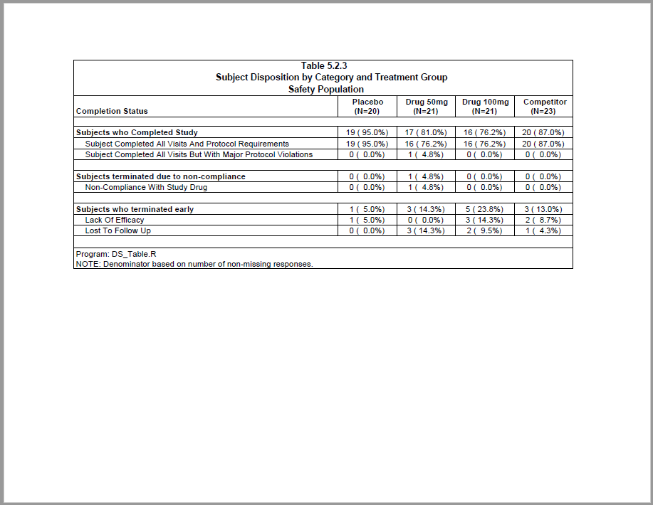

```{r setup, include = FALSE}
knitr::opts_chunk$set(
  collapse = TRUE,
  comment = "#>"
)
```
This example produces a subject disposition table.
The report features extensive data preparation using the **procs** package.
The example also shows how to create a stub column with summary rows.

## Program

```{r eval=FALSE, echo=TRUE}
library(sassy)
library(stringr)

options("logr.autolog" = TRUE, 
        "logr.notes" = FALSE,
        "logr.on" = TRUE,
        "procs.print" = FALSE)

# Get temp directory
tmp <- tempdir()

# Open log
lf <- log_open(file.path(tmp, "example10.log"))

# Get data
dir <- system.file("extdata", package = "sassy")


# Load and Prepare Data ---------------------------------------------------

sep("Prepare Data")

put("Define data library")
libname(sdtm, dir, "csv") 

put("Loads data into workspace")
lib_load(sdtm)

put("Prepare DM data")
datastep(sdtm.DM, keep = v(USUBJID, ARM), 
         where = expression(ARM != "SCREEN FAILURE"), {}) -> dm_mod

put("Prepare DS data")
datastep(sdtm.DS, keep = v(USUBJID, DSTERM, DSDECOD, DSCAT), 
         where = expression(DSCAT != "PROTOCOL MILESTONE"), {}) -> ds_mod

put("Join DM with DS to get ARMs on DS") 
datastep(dm_mod, merge = ds_mod, merge_by = USUBJID, {}) -> dmds 

put("Change ARM to factor to assist with sparse data")
dmds$ARM <- factor(dmds$ARM, levels = c("ARM A", "ARM B", "ARM C", "ARM D"))


put("Get ARM population counts")
proc_freq(dm_mod, tables = ARM, output = long, 
          options = v(nonobs, nopercent)) -> arm_pop

# Prepare formats ---------------------------------------------------------

# Completed Study
complete_fmt <- value(condition(x == "SUBJECT COMPLETED ALL VISITS AND PROTOCOL REQUIREMENTS",
                                str_to_title("SUBJECT COMPLETED ALL VISITS AND PROTOCOL REQUIREMENTS")),
                      condition(x == "SUBJECT COMPLETED ALL VISITS BUT WITH MAJOR PROTOCOL VIOLATIONS",
                                str_to_title("SUBJECT COMPLETED ALL VISITS BUT WITH MAJOR PROTOCOL VIOLATIONS")))

# Subject Non-compliance
noncomp_fmt <- value(condition(x == "NON-COMPLIANCE WITH STUDY DRUG",
                               str_to_title("NON-COMPLIANCE WITH STUDY DRUG")))

# Early Termination
term_fmt <- value(condition(x == "LACK OF EFFICACY",
                            str_to_title("LACK OF EFFICACY")),
                  condition(str_detect(x, "LOST"),
                            str_to_title("LOST TO FOLLOW UP")),
                  condition(TRUE, str_to_title("LACK OF EFFICACY")))

# Group labels
group_fmt <- value(condition(x == "COMPLETED", "Subjects who Completed Study"),
                   condition(x == "NONCOMPLIANCE", "Subjects terminated due to non-compliance"),
                   condition(x == "OTHER", "Subjects who terminated early"))


# Disposition Groups ------------------------------------------------------

put("Create vector of final dataframe columns")
cols <- v(group, cat, catseq, `ARM A`, `ARM B`, `ARM C`, `ARM D`) |> put()

put("Get group counts")
proc_freq(dmds, tables = DSDECOD, by = ARM) |> 
  datastep(keep = v(BY, CAT, CNTPCT), {
    
    CNTPCT <- fmt_cnt_pct(CNT, arm_pop[[BY]])
     
  }) |> 
  proc_transpose(var = CNTPCT, by = CAT, id = BY) |> 
  datastep(keep = cols,
    {
    
    group <- ifelse(CAT == "NON-COMPLIANCE WITH STUDY DRUG", "NONCOMPLIANCE", CAT)
    cat = NA
    catseq = 1
    
  }) -> grps


# Disposition Subgroups ----------------------------------------------------

put("Pull out subjects who completed study.")
datastep(dmds, where = expression(DSDECOD == "COMPLETED"),
         {
           TERMDECOD <- fapply(DSTERM, complete_fmt)
           
         }) |> 
  proc_freq(tables = v(DSDECOD * TERMDECOD), by = ARM) |> 
  datastep(keep = v(BY, CAT1, CAT2, CNTPCT),
    {
    
      CNTPCT <- fmt_cnt_pct(CNT, arm_pop[[BY]])
    
    }) |> 
  proc_transpose(var = CNTPCT, by = v(CAT1, CAT2), id = BY) |> 
  datastep(keep = cols,
    {
      group = CAT1
      cat = CAT2
      catseq = 2
    }) -> cmplt


put("Pull out subjects who were non-compliant")
datastep(dmds, where = expression(DSDECOD == "NON-COMPLIANCE WITH STUDY DRUG"),
         {
           TERMDECOD <- fapply(DSTERM, noncomp_fmt)
           
         }) |> 
  proc_freq(tables = v(DSDECOD * TERMDECOD), by = ARM) |> 
  datastep(keep = v(BY, CAT1, CAT2, CNTPCT),
           {
             
             CNTPCT <- fmt_cnt_pct(CNT, arm_pop[[BY]])
             
           }) |> 
  proc_transpose(var = CNTPCT, by = v(CAT1, CAT2), id = BY) |> 
  datastep(keep = cols,
           {
             group = "NONCOMPLIANCE"
             cat = CAT2
             catseq = 2
           }) -> noncompl


put("Pull out subjects who terminated early")
datastep(dmds, where = expression(DSDECOD == "OTHER"),
         {
           TERMDECOD <- fapply(DSTERM, term_fmt)
           
         }) |> 
  proc_freq(tables = v(DSDECOD * TERMDECOD), by = ARM) |> 
  datastep(keep = v(BY, CAT1, CAT2, CNTPCT),
           {
             
             CNTPCT <- fmt_cnt_pct(CNT, arm_pop[[BY]])
             
           }) |> 
  proc_transpose(var = CNTPCT, by = v(CAT1, CAT2), id = BY) |> 
  datastep(keep = cols,
           {
             group = "OTHER"
             cat = CAT2
             catseq = 2
           }) -> earlyterm


put("Combine blocks into final data frame")
datastep(grps, set = list(cmplt, noncompl, earlyterm), 
    {
      lblind <- ifelse(is.na(cat), TRUE, FALSE)
    }) |> 
  proc_sort(by = v(group, catseq, cat)) -> final


# Report ------------------------------------------------------------------

sep("Create and print report")

# Create Table
tbl <- create_table(final, first_row_blank = TRUE, 
                    borders = "all", width = 8.5, header_bold = TRUE) |> 
  column_defaults(from = `ARM A`, to = `ARM D`, 
                  align = "center", width = 1) |> 
  stub(vars = v(group, cat), "Completion Status", 
       style = cell_style(bold = TRUE, indicator = "lblind")) |> 
  define(group, blank_after = TRUE, dedupe = TRUE,
         format = group_fmt) |>
  define(cat, indent = .5) |>
  define(catseq, visible = FALSE) |> 
  define(`ARM A`, label = "Placebo", n = arm_pop["ARM A"]) |> 
  define(`ARM B`, label = "Drug 50mg", n = arm_pop["ARM B"]) |> 
  define(`ARM C`, label = "Drug 100mg", n = arm_pop["ARM C"]) |> 
  define(`ARM D`, label = "Competitor", n = arm_pop["ARM D"]) |> 
  define(lblind, visible = FALSE) |> 
  titles("Table 5.2.3", "Subject Disposition by Category and Treatment Group",                                                                      
         "Safety Population", bold = TRUE, font_size = 11,
         borders = "outside", blank_row = "none") |> 
  footnotes("Program: DS_Table.R",
            "NOTE: Denominator based on number of non-missing responses.",
            borders = "outside", blank_row = "none") 

pth <- file.path(tmp, "example10.pdf")

rpt <- create_report(pth, output_type = "PDF", font = "Arial") |> 
  set_margins(top = 1, bottom = 1) |> 
  add_content(tbl) 


write_report(rpt)


# Clean Up ----------------------------------------------------------------

# Unload library from workspace
lib_unload(sdtm)

# Close log
log_close()

# Uncomment to view files
# file.show(pth)
# file.show(lf)

```

## Output

Here is the output report:




## Log

Here is the log:

```
=========================================================================
Log Path: C:/Users/dbosa/AppData/Local/Temp/RtmpEBPgPu/log/example10.log
Program Path: C:/packages/Testing/procs/ProcsDisposition.R
Working Directory: C:/packages/Testing/procs
User Name: dbosa
R Version: 4.3.1 (2023-06-16 ucrt)
Machine: SOCRATES x86-64
Operating System: Windows 10 x64 build 22621
Base Packages: stats graphics grDevices utils datasets methods base Other
Packages: tidylog_1.0.2 stringr_1.5.0 procs_1.0.3 reporter_1.4.1 libr_1.2.8
fmtr_1.5.9 logr_1.3.4 common_1.0.8 sassy_1.1.0
Log Start Time: 2023-09-05 22:06:05.090672
=========================================================================

=========================================================================
Prepare Data
=========================================================================

Define data library

# library 'sdtm': 7 items
- attributes: csv not loaded
- path: C:/Users/dbosa/AppData/Local/R/win-library/4.3/sassy/extdata
- items:
  Name Extension Rows Cols     Size
1   AE       csv  150   27  88.5 Kb
2   DM       csv   87   24  45.5 Kb
3   DS       csv  174    9  34.1 Kb
4   EX       csv   84   11  26.4 Kb
5   IE       csv    2   14  13.4 Kb
6   SV       csv  685   10  70.3 Kb
7   VS       csv 3358   17 467.4 Kb
         LastModified
1 2023-08-07 17:51:40
2 2023-08-07 17:51:40
3 2023-08-07 17:51:40
4 2023-08-07 17:51:40
5 2023-08-07 17:51:40
6 2023-08-07 17:51:40
7 2023-08-07 17:51:40

Loads data into workspace

lib_load: library 'sdtm' loaded

Prepare DM data

datastep: columns decreased from 24 to 2

# A tibble: 85 × 2
   USUBJID    ARM  
   <chr>      <chr>
 1 ABC-01-049 ARM D
 2 ABC-01-050 ARM B
 3 ABC-01-051 ARM A
 4 ABC-01-052 ARM C
 5 ABC-01-053 ARM B
 6 ABC-01-054 ARM D
 7 ABC-01-055 ARM C
 8 ABC-01-056 ARM A
 9 ABC-01-113 ARM D
10 ABC-01-114 ARM B
# ℹ 75 more rows
# ℹ Use `print(n = ...)` to see more rows

Prepare DS data

datastep: columns decreased from 9 to 4

# A tibble: 87 × 4
   USUBJID    DSTERM                  DSDECOD DSCAT
   <chr>      <chr>                   <chr>   <chr>
 1 ABC-01-049 SUBJECT COMPLETED ALL … COMPLE… DISP…
 2 ABC-01-050 SUBJECT COMPLETED ALL … COMPLE… DISP…
 3 ABC-01-051 SUBJECT COMPLETED ALL … COMPLE… DISP…
 4 ABC-01-052 SUBJECT COMPLETED ALL … COMPLE… DISP…
 5 ABC-01-053 NON-COMPLIANCE WITH ST… NON-CO… DISP…
 6 ABC-01-054 SUBJECT COMPLETED ALL … COMPLE… DISP…
 7 ABC-01-055 SUBJECT COMPLETED ALL … COMPLE… DISP…
 8 ABC-01-056 SUBJECT COMPLETED ALL … COMPLE… DISP…
 9 ABC-01-113 SUBJECT COMPLETED ALL … COMPLE… DISP…
10 ABC-01-114 SUBJECT COMPLETED ALL … COMPLE… DISP…
# ℹ 77 more rows
# ℹ Use `print(n = ...)` to see more rows

Join DM with DS to get ARMs on DS

datastep: columns increased from 2 to 5

# A tibble: 87 × 5
   USUBJID    ARM   DSTERM            DSDECOD DSCAT
   <chr>      <chr> <chr>             <chr>   <chr>
 1 ABC-01-049 ARM D SUBJECT COMPLETE… COMPLE… DISP…
 2 ABC-01-050 ARM B SUBJECT COMPLETE… COMPLE… DISP…
 3 ABC-01-051 ARM A SUBJECT COMPLETE… COMPLE… DISP…
 4 ABC-01-052 ARM C SUBJECT COMPLETE… COMPLE… DISP…
 5 ABC-01-053 ARM B NON-COMPLIANCE W… NON-CO… DISP…
 6 ABC-01-054 ARM D SUBJECT COMPLETE… COMPLE… DISP…
 7 ABC-01-055 ARM C SUBJECT COMPLETE… COMPLE… DISP…
 8 ABC-01-056 ARM A SUBJECT COMPLETE… COMPLE… DISP…
 9 ABC-01-113 ARM D SUBJECT COMPLETE… COMPLE… DISP…
10 ABC-01-114 ARM B SUBJECT COMPLETE… COMPLE… DISP…
# ℹ 77 more rows
# ℹ Use `print(n = ...)` to see more rows

Change ARM to factor to assist with sparse data

Get ARM population counts

proc_freq: input data set 85 rows and 2 columns
           tables: ARM
           output: long
           view: TRUE
           output: 1 datasets

# A tibble: 1 × 6
  VAR   STAT  `ARM A` `ARM B` `ARM C` `ARM D`
  <chr> <chr>   <dbl>   <dbl>   <dbl>   <dbl>
1 ARM   CNT        20      21      21      23

# A user-defined format: 2 conditions
  Name Type
1  obj    U
2  obj    U
                                                              Expression
1          x == "SUBJECT COMPLETED ALL VISITS AND PROTOCOL REQUIREMENTS"
2 x == "SUBJECT COMPLETED ALL VISITS BUT WITH MAJOR PROTOCOL VIOLATIONS"
                                                            Label
1          Subject Completed All Visits And Protocol Requirements
2 Subject Completed All Visits But With Major Protocol Violations
  Order
1    NA
2    NA

# A user-defined format: 1 conditions
  Name Type                            Expression
1  obj    U x == "NON-COMPLIANCE WITH STUDY DRUG"
                           Label Order
1 Non-Compliance With Study Drug    NA

# A user-defined format: 3 conditions
  Name Type              Expression
1  obj    U x == "LACK OF EFFICACY"
2  obj    U   str_detect(x, "LOST")
3  obj    U                    TRUE
              Label Order
1  Lack Of Efficacy    NA
2 Lost To Follow Up    NA
3  Lack Of Efficacy    NA

# A user-defined format: 3 conditions
  Name Type           Expression
1  obj    U     x == "COMPLETED"
2  obj    U x == "NONCOMPLIANCE"
3  obj    U         x == "OTHER"
                                      Label Order
1              Subjects who Completed Study    NA
2 Subjects terminated due to non-compliance    NA
3             Subjects who terminated early    NA

Create vector of final dataframe columns

group
cat
catseq
ARM A
ARM B
ARM C
ARM D

Get group counts

proc_freq: input data set 87 rows and 5 columns
           tables: DSDECOD
           by: ARM
           view: TRUE
           output: 1 datasets

# A tibble: 12 × 6
   BY    VAR     CAT                  N   CNT   PCT
   <chr> <chr>   <chr>            <dbl> <dbl> <dbl>
 1 ARM A DSDECOD COMPLETED           20    19 95   
 2 ARM A DSDECOD NON-COMPLIANCE …    20     0  0   
 3 ARM A DSDECOD OTHER               20     1  5   
 4 ARM B DSDECOD COMPLETED           21    17 81.0 
 5 ARM B DSDECOD NON-COMPLIANCE …    21     1  4.76
 6 ARM B DSDECOD OTHER               21     3 14.3 
 7 ARM C DSDECOD COMPLETED           21    16 76.2 
 8 ARM C DSDECOD NON-COMPLIANCE …    21     0  0   
 9 ARM C DSDECOD OTHER               21     5 23.8 
10 ARM D DSDECOD COMPLETED           23    20 87.0 
11 ARM D DSDECOD NON-COMPLIANCE …    23     0  0   
12 ARM D DSDECOD OTHER               23     3 13.0 

datastep: columns decreased from 6 to 3

# A tibble: 12 × 3
   BY    CAT                            CNTPCT     
   <chr> <chr>                          <chr>      
 1 ARM A COMPLETED                      19 ( 95.0%)
 2 ARM A NON-COMPLIANCE WITH STUDY DRUG 0 (  0.0%) 
 3 ARM A OTHER                          1 (  5.0%) 
 4 ARM B COMPLETED                      17 ( 81.0%)
 5 ARM B NON-COMPLIANCE WITH STUDY DRUG 1 (  4.8%) 
 6 ARM B OTHER                          3 ( 14.3%) 
 7 ARM C COMPLETED                      16 ( 76.2%)
 8 ARM C NON-COMPLIANCE WITH STUDY DRUG 0 (  0.0%) 
 9 ARM C OTHER                          5 ( 23.8%) 
10 ARM D COMPLETED                      20 ( 87.0%)
11 ARM D NON-COMPLIANCE WITH STUDY DRUG 0 (  0.0%) 
12 ARM D OTHER                          3 ( 13.0%) 

proc_transpose: input data set 12 rows and 3 columns
                by: CAT
                var: CNTPCT
                id: BY
                name: NAME
                output dataset 3 rows and 6 columns

# A tibble: 3 × 6
  CAT         NAME  `ARM A` `ARM B` `ARM C` `ARM D`
  <chr>       <chr> <chr>   <chr>   <chr>   <chr>  
1 COMPLETED   CNTP… 19 ( 9… 17 ( 8… 16 ( 7… 20 ( 8…
2 NON-COMPLI… CNTP… 0 (  0… 1 (  4… 0 (  0… 0 (  0…
3 OTHER       CNTP… 1 (  5… 3 ( 14… 5 ( 23… 3 ( 13…

datastep: columns increased from 6 to 7

# A tibble: 3 × 7
  group        cat   catseq `ARM A` `ARM B` `ARM C`
  <chr>        <lgl>  <dbl> <chr>   <chr>   <chr>  
1 COMPLETED    NA         1 19 ( 9… 17 ( 8… 16 ( 7…
2 NONCOMPLIAN… NA         1 0 (  0… 1 (  4… 0 (  0…
3 OTHER        NA         1 1 (  5… 3 ( 14… 5 ( 23…
# ℹ 1 more variable: `ARM D` <chr>

Pull out subjects who completed study.

datastep: columns increased from 5 to 6

# A tibble: 74 × 6
   USUBJID    ARM   DSTERM  DSDECOD DSCAT TERMDECOD
   <chr>      <fct> <chr>   <chr>   <chr> <chr>    
 1 ABC-01-049 ARM D SUBJEC… COMPLE… DISP… Subject …
 2 ABC-01-050 ARM B SUBJEC… COMPLE… DISP… Subject …
 3 ABC-01-051 ARM A SUBJEC… COMPLE… DISP… Subject …
 4 ABC-01-052 ARM C SUBJEC… COMPLE… DISP… Subject …
 5 ABC-01-054 ARM D SUBJEC… COMPLE… DISP… Subject …
 6 ABC-01-055 ARM C SUBJEC… COMPLE… DISP… Subject …
 7 ABC-01-056 ARM A SUBJEC… COMPLE… DISP… Subject …
 8 ABC-01-113 ARM D SUBJEC… COMPLE… DISP… Subject …
 9 ABC-01-114 ARM B SUBJEC… COMPLE… DISP… Subject …
10 ABC-02-033 ARM C SUBJEC… COMPLE… DISP… Subject …
# ℹ 64 more rows
# ℹ Use `print(n = ...)` to see more rows

proc_freq: input data set 74 rows and 6 columns
           tables: DSDECOD * TERMDECOD
           by: ARM
           view: TRUE
           output: 1 datasets

# A tibble: 8 × 8
  BY    VAR1   VAR2  CAT1  CAT2      N   CNT    PCT
  <chr> <chr>  <chr> <chr> <chr> <dbl> <dbl>  <dbl>
1 ARM A DSDEC… TERM… COMP… Subj…    19    19 100   
2 ARM A DSDEC… TERM… COMP… Subj…    19     0   0   
3 ARM B DSDEC… TERM… COMP… Subj…    17    16  94.1 
4 ARM B DSDEC… TERM… COMP… Subj…    17     1   5.88
5 ARM C DSDEC… TERM… COMP… Subj…    16    16 100   
6 ARM C DSDEC… TERM… COMP… Subj…    16     0   0   
7 ARM D DSDEC… TERM… COMP… Subj…    20    20 100   
8 ARM D DSDEC… TERM… COMP… Subj…    20     0   0   

datastep: columns decreased from 8 to 4

# A tibble: 8 × 4
  BY    CAT1      CAT2                       CNTPCT
  <chr> <chr>     <chr>                      <chr> 
1 ARM A COMPLETED Subject Completed All Vis… 19 ( …
2 ARM A COMPLETED Subject Completed All Vis… 0 (  …
3 ARM B COMPLETED Subject Completed All Vis… 16 ( …
4 ARM B COMPLETED Subject Completed All Vis… 1 (  …
5 ARM C COMPLETED Subject Completed All Vis… 16 ( …
6 ARM C COMPLETED Subject Completed All Vis… 0 (  …
7 ARM D COMPLETED Subject Completed All Vis… 20 ( …
8 ARM D COMPLETED Subject Completed All Vis… 0 (  …

proc_transpose: input data set 8 rows and 4 columns
                by: CAT1 CAT2
                var: CNTPCT
                id: BY
                name: NAME
                output dataset 2 rows and 7 columns

# A tibble: 2 × 7
  CAT1  CAT2  NAME  `ARM A` `ARM B` `ARM C` `ARM D`
  <chr> <chr> <chr> <chr>   <chr>   <chr>   <chr>  
1 COMP… Subj… CNTP… 19 ( 9… 16 ( 7… 16 ( 7… 20 ( 8…
2 COMP… Subj… CNTP… 0 (  0… 1 (  4… 0 (  0… 0 (  0…

datastep: columns started with 7 and ended with 7

# A tibble: 2 × 7
  group     cat      catseq `ARM A` `ARM B` `ARM C`
  <chr>     <chr>     <dbl> <chr>   <chr>   <chr>  
1 COMPLETED Subject…      2 19 ( 9… 16 ( 7… 16 ( 7…
2 COMPLETED Subject…      2 0 (  0… 1 (  4… 0 (  0…
# ℹ 1 more variable: `ARM D` <chr>

Pull out subjects who were non-compliant

datastep: columns increased from 5 to 6

# A tibble: 1 × 6
  USUBJID    ARM   DSTERM   DSDECOD DSCAT TERMDECOD
  <chr>      <fct> <chr>    <chr>   <chr> <chr>    
1 ABC-01-053 ARM B NON-COM… NON-CO… DISP… Non-Comp…

proc_freq: input data set 1 rows and 6 columns
           tables: DSDECOD * TERMDECOD
           by: ARM
           view: TRUE
           output: 1 datasets

# A tibble: 4 × 8
  BY    VAR1    VAR2  CAT1  CAT2      N   CNT   PCT
  <chr> <chr>   <chr> <chr> <chr> <dbl> <dbl> <dbl>
1 ARM A DSDECOD TERM… NON-… Non-…     0     0   NaN
2 ARM B DSDECOD TERM… NON-… Non-…     1     1   100
3 ARM C DSDECOD TERM… NON-… Non-…     0     0   NaN
4 ARM D DSDECOD TERM… NON-… Non-…     0     0   NaN

datastep: columns decreased from 8 to 4

# A tibble: 4 × 4
  BY    CAT1                           CAT2  CNTPCT
  <chr> <chr>                          <chr> <chr> 
1 ARM A NON-COMPLIANCE WITH STUDY DRUG Non-… 0 (  …
2 ARM B NON-COMPLIANCE WITH STUDY DRUG Non-… 1 (  …
3 ARM C NON-COMPLIANCE WITH STUDY DRUG Non-… 0 (  …
4 ARM D NON-COMPLIANCE WITH STUDY DRUG Non-… 0 (  …

proc_transpose: input data set 4 rows and 4 columns
                by: CAT1 CAT2
                var: CNTPCT
                id: BY
                name: NAME
                output dataset 1 rows and 7 columns

# A tibble: 1 × 7
  CAT1  CAT2  NAME  `ARM A` `ARM B` `ARM C` `ARM D`
  <chr> <chr> <chr> <chr>   <chr>   <chr>   <chr>  
1 NON-… Non-… CNTP… 0 (  0… 1 (  4… 0 (  0… 0 (  0…

datastep: columns started with 7 and ended with 7

# A tibble: 1 × 7
  group        cat   catseq `ARM A` `ARM B` `ARM C`
  <chr>        <chr>  <dbl> <chr>   <chr>   <chr>  
1 NONCOMPLIAN… Non-…      2 0 (  0… 1 (  4… 0 (  0…
# ℹ 1 more variable: `ARM D` <chr>

Pull out subjects who terminated early

datastep: columns increased from 5 to 6

# A tibble: 12 × 6
   USUBJID    ARM   DSTERM  DSDECOD DSCAT TERMDECOD
   <chr>      <fct> <chr>   <chr>   <chr> <chr>    
 1 ABC-03-005 ARM C LOST O… OTHER   DISP… Lost To …
 2 ABC-03-008 ARM D WORSEN… OTHER   DISP… Lack Of …
 3 ABC-04-074 ARM C LACK O… OTHER   DISP… Lack Of …
 4 ABC-04-128 ARM C LOST T… OTHER   DISP… Lost To …
 5 ABC-06-069 ARM A PSORIA… OTHER   DISP… Lack Of …
 6 ABC-06-161 ARM C NON  R… OTHER   DISP… Lack Of …
 7 ABC-08-103 ARM B LOST T… OTHER   DISP… Lost To …
 8 ABC-08-105 ARM C MOTHER… OTHER   DISP… Lack Of …
 9 ABC-08-107 ARM D PATIEN… OTHER   DISP… Lack Of …
10 ABC-08-108 ARM B LOST T… OTHER   DISP… Lost To …
11 ABC-09-021 ARM B LOST T… OTHER   DISP… Lost To …
12 ABC-09-022 ARM D LOST T… OTHER   DISP… Lost To …

proc_freq: input data set 12 rows and 6 columns
           tables: DSDECOD * TERMDECOD
           by: ARM
           view: TRUE
           output: 1 datasets

# A tibble: 8 × 8
  BY    VAR1    VAR2  CAT1  CAT2      N   CNT   PCT
  <chr> <chr>   <chr> <chr> <chr> <dbl> <dbl> <dbl>
1 ARM A DSDECOD TERM… OTHER Lack…     1     1 100  
2 ARM A DSDECOD TERM… OTHER Lost…     1     0   0  
3 ARM B DSDECOD TERM… OTHER Lack…     3     0   0  
4 ARM B DSDECOD TERM… OTHER Lost…     3     3 100  
5 ARM C DSDECOD TERM… OTHER Lack…     5     3  60  
6 ARM C DSDECOD TERM… OTHER Lost…     5     2  40  
7 ARM D DSDECOD TERM… OTHER Lack…     3     2  66.7
8 ARM D DSDECOD TERM… OTHER Lost…     3     1  33.3

datastep: columns decreased from 8 to 4

# A tibble: 8 × 4
  BY    CAT1  CAT2              CNTPCT    
  <chr> <chr> <chr>             <chr>     
1 ARM A OTHER Lack Of Efficacy  1 (  5.0%)
2 ARM A OTHER Lost To Follow Up 0 (  0.0%)
3 ARM B OTHER Lack Of Efficacy  0 (  0.0%)
4 ARM B OTHER Lost To Follow Up 3 ( 14.3%)
5 ARM C OTHER Lack Of Efficacy  3 ( 14.3%)
6 ARM C OTHER Lost To Follow Up 2 (  9.5%)
7 ARM D OTHER Lack Of Efficacy  2 (  8.7%)
8 ARM D OTHER Lost To Follow Up 1 (  4.3%)

proc_transpose: input data set 8 rows and 4 columns
                by: CAT1 CAT2
                var: CNTPCT
                id: BY
                name: NAME
                output dataset 2 rows and 7 columns

# A tibble: 2 × 7
  CAT1  CAT2  NAME  `ARM A` `ARM B` `ARM C` `ARM D`
  <chr> <chr> <chr> <chr>   <chr>   <chr>   <chr>  
1 OTHER Lack… CNTP… 1 (  5… 0 (  0… 3 ( 14… 2 (  8…
2 OTHER Lost… CNTP… 0 (  0… 3 ( 14… 2 (  9… 1 (  4…

datastep: columns started with 7 and ended with 7

# A tibble: 2 × 7
  group cat          catseq `ARM A` `ARM B` `ARM C`
  <chr> <chr>         <dbl> <chr>   <chr>   <chr>  
1 OTHER Lack Of Eff…      2 1 (  5… 0 (  0… 3 ( 14…
2 OTHER Lost To Fol…      2 0 (  0… 3 ( 14… 2 (  9…
# ℹ 1 more variable: `ARM D` <chr>

Combine blocks into final data frame

datastep: columns increased from 7 to 8

# A tibble: 8 × 8
  group        cat   catseq `ARM A` `ARM B` `ARM C`
  <chr>        <chr>  <dbl> <chr>   <chr>   <chr>  
1 COMPLETED    <NA>       1 19 ( 9… 17 ( 8… 16 ( 7…
2 NONCOMPLIAN… <NA>       1 0 (  0… 1 (  4… 0 (  0…
3 OTHER        <NA>       1 1 (  5… 3 ( 14… 5 ( 23…
4 COMPLETED    Subj…      2 19 ( 9… 16 ( 7… 16 ( 7…
5 COMPLETED    Subj…      2 0 (  0… 1 (  4… 0 (  0…
6 NONCOMPLIAN… Non-…      2 0 (  0… 1 (  4… 0 (  0…
7 OTHER        Lack…      2 1 (  5… 0 (  0… 3 ( 14…
8 OTHER        Lost…      2 0 (  0… 3 ( 14… 2 (  9…
# ℹ 2 more variables: `ARM D` <chr>, lblind <lgl>

proc_sort: input data set 8 rows and 8 columns
           by: group catseq cat
           keep: group cat catseq ARM A ARM B ARM C ARM D lblind
           order: a a a
           output data set 8 rows and 8 columns

# A tibble: 8 × 8
  group        cat   catseq `ARM A` `ARM B` `ARM C`
  <chr>        <chr>  <dbl> <chr>   <chr>   <chr>  
1 COMPLETED    <NA>       1 19 ( 9… 17 ( 8… 16 ( 7…
2 COMPLETED    Subj…      2 19 ( 9… 16 ( 7… 16 ( 7…
3 COMPLETED    Subj…      2 0 (  0… 1 (  4… 0 (  0…
4 NONCOMPLIAN… <NA>       1 0 (  0… 1 (  4… 0 (  0…
5 NONCOMPLIAN… Non-…      2 0 (  0… 1 (  4… 0 (  0…
6 OTHER        <NA>       1 1 (  5… 3 ( 14… 5 ( 23…
7 OTHER        Lack…      2 1 (  5… 0 (  0… 3 ( 14…
8 OTHER        Lost…      2 0 (  0… 3 ( 14… 2 (  9…
# ℹ 2 more variables: `ARM D` <chr>, lblind <lgl>

=========================================================================
Create and print report
=========================================================================

# A report specification: 1 pages
- file_path: 'C:\Users\dbosa\AppData\Local\Temp\RtmpEBPgPu/example10.pdf'
- output_type: PDF
- units: inches
- orientation: landscape
- margins: top 1 bottom 1 left 1 right 1
- line size/count: 9/41
- content: 
# A table specification:
- data: tibble 'final' 8 rows 8 cols
- show_cols: all
- use_attributes: all
- width: 8.5
- title 1: 'Table 5.2.3'
- title 2: 'Subject Disposition by Category and Treatment Group'
- title 3: 'Safety Population'
- footnote 1: 'Program: DS_Table.R'
- footnote 2: 'NOTE: Denominator based on number of non-missing responses.'
- stub: group cat 'Completion Status' align='left' 
- define: group dedupe='TRUE' 
- define: cat 
- define: catseq visible='FALSE' 
- define: ARM A 'Placebo' 
- define: ARM B 'Drug 50mg' 
- define: ARM C 'Drug 100mg' 
- define: ARM D 'Competitor' 
- define: lblind visible='FALSE' 

lib_sync: synchronized data in library 'sdtm'

lib_unload: library 'sdtm' unloaded

=========================================================================
Log End Time: 2023-09-05 22:06:09.329367
Log Elapsed Time: 0 00:00:04
=========================================================================


```

Next: [Example 11: Subject Listing](sassy-plisting.html)
