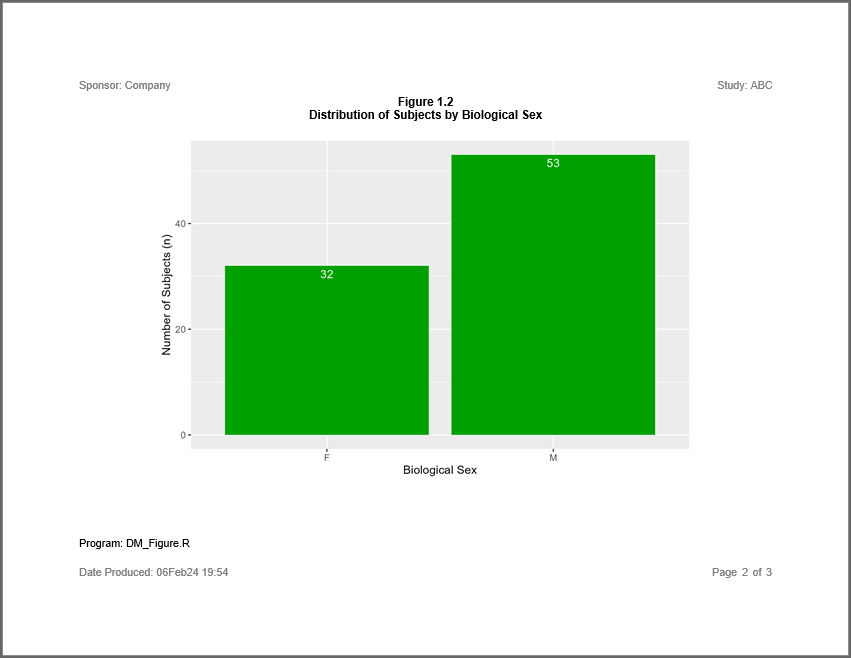
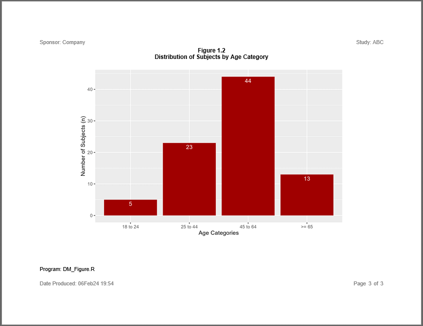

```{r setup, include = FALSE}
knitr::opts_chunk$set(
  collapse = TRUE,
  comment = "#>"
)
```

### Create a Figure 

The **sassy** system of functions also supports reports with graphics.  Plots
from the popular **ggplot2** package can be added to a report.
The following example illustrates such a report. 

#### Program

Note the following about this example:

* The plots are created using **ggplot2** and the `create_plot()` function.
* The plots are added to the report with the `add_content()` function, just
like the tables in the previous examples.
* The **[reporter](https://reporter.r-sassy.org)** package allows you 
to add multiple pieces of content to the same report.
* Titles, footnotes, and other report enhancements are added to the figure
just like previous examples.
    
```{r eval=FALSE, echo=TRUE}
library(tidyverse)
library(sassy)


# Prepare Log -------------------------------------------------------------


options("logr.autolog" = TRUE,
        "logr.notes" = FALSE)

# Get path to temp directory
tmp <- tempdir() 

# Get sample data directory
dir <- system.file("extdata", package = "sassy")

# Open log
lgpth <- log_open(file.path(tmp, "example3.log"))


# Load and Prepare Data ---------------------------------------------------

sep("Prepare Data")

# Define data library
libname(sdtm, dir, "csv") 

# Loads data into workspace
lib_load(sdtm)

# Prepare data
dm_mod <- sdtm.DM |> 
  select(USUBJID, SEX, AGE, ARM) |> 
  filter(ARM != "SCREEN FAILURE") |> 
  datastep({
                     
     if (AGE >= 18 & AGE <= 24)
       AGECAT = "18 to 24"
     else if (AGE >= 25 & AGE <= 44)
       AGECAT = "25 to 44"
     else if (AGE >= 45 & AGE <= 64)
       AGECAT <- "45 to 64"
     else if (AGE >= 65)
       AGECAT <- ">= 65"
     
   }) |> put()

put("Get population counts")
arm_pop <- count(dm_mod, ARM) |> put()
sex_pop <- count(dm_mod, SEX) |> put()
agecat_pop <- count(dm_mod, AGECAT) |> put()

# Convert agecat to factor so rows will sort correctly
agecat_pop$AGECAT <- factor(agecat_pop$AGECAT, levels = c("18 to 24", 
                                                          "25 to 44",
                                                          "45 to 64",
                                                          ">= 65"))
# Sort agecat
agecat_pop <- agecat_pop |> arrange(AGECAT)
                     

# Create Plots ------------------------------------------------------------


plt1 <- ggplot(data = arm_pop, aes(x = ARM, y = n)) +
  geom_col(fill = "#0000A0") +
  geom_text(aes(label = n), vjust = 1.5, colour = "white") +
  labs(x = "Treatment Group", y = "Number of Subjects (n)")

plt2 <- ggplot(data = sex_pop, aes(x = SEX, y = n)) +
  geom_col(fill = "#00A000") +
  geom_text(aes(label = n), vjust = 1.5, colour = "white") +
  labs(x = "Biological Sex", y = "Number of Subjects (n)")

plt3 <- ggplot(data = agecat_pop, aes(x = AGECAT, y = n)) +
  geom_col(fill = "#A00000") +
  geom_text(aes(label = n), vjust = 1.5, colour = "white") +
  labs(x = "Age Categories", y = "Number of Subjects (n)")


# Report ------------------------------------------------------------------


sep("Create and print report")


pth <- file.path(tmp, "output/example3.rtf")


page1 <- create_plot(plt1, 4.5, 7) |> 
  titles("Figure 1.1", "Distribution of Subjects by Treatment Group", 
         bold = TRUE, font_size = 11)

page2 <- create_plot(plt2, 4.5, 7) |> 
  titles("Figure 1.2", "Distribution of Subjects by Biological Sex", 
         bold = TRUE, font_size = 11)

page3 <- create_plot(plt3, 4.5, 7) |> 
  titles("Figure 1.2", "Distribution of Subjects by Age Category", 
         bold = TRUE, font_size = 11)

rpt <- create_report(pth, output_type = "RTF", font = "Arial") |> 
  set_margins(top = 1, bottom = 1) |> 
  page_header("Sponsor: Company", "Study: ABC") |> 
  add_content(page1) |> 
  add_content(page2) |> 
  add_content(page3) |> 
  footnotes("Program: DM_Figure.R") |> 
  page_footer(paste0("Date Produced: ", fapply(Sys.time(), "%d%b%y %H:%M")), 
              right = "Page [pg] of [tpg]")

write_report(rpt)


# Clean Up ----------------------------------------------------------------

# Unload library from workspace
lib_unload(sdtm)

# Close log
log_close()

# View files
# file.show(pth)
# file.show(lgpth)

```

#### Output 

Here are the three pages of the report:







#### Log

Here is the log for the above program:

```
========================================================================= 
Log Path: C:/Users/dbosa/AppData/Local/Temp/RtmpqUcwY4/log/example3.log 
Working Directory: C:/packages/Testing 
User Name: dbosa 
R Version: 4.0.5 (2021-03-31) 
Machine: SOCRATES x86-64 
Operating System: Windows 10 x64 build 19041 
Log Start Time: 2021-06-27 19:00:45 
========================================================================= 

========================================================================= 
Prepare Data 
========================================================================= 

# library 'sdtm': 4 items
- attributes: csv not loaded
- path: C:/Users/dbosa/Documents/R/win-library/4.0/sassy/extdata
- items:
  Name Extension Rows Cols    Size        LastModified
1   AE       csv  150   27 88.1 Kb 2021-04-04 11:55:58
2   DM       csv   87   24 45.2 Kb 2021-04-04 11:55:58
3   SV       csv  685   10 69.9 Kb 2021-04-04 11:55:58
4   VS       csv 3358   17  467 Kb 2021-04-04 11:55:58

lib_load: library 'sdtm' loaded 

select: dropped 20 variables (STUDYID, DOMAIN, SUBJID, RFSTDTC, RFENDTC, …)

filter: removed 2 rows (2%), 85 rows remaining

datastep: columns decreased from 4 to 5 

# A tibble: 85 x 5
   USUBJID    SEX     AGE ARM   AGECAT  
   <chr>      <chr> <dbl> <chr> <chr>   
 1 ABC-01-049 M        39 ARM D 25 to 44
 2 ABC-01-050 M        47 ARM B 45 to 64
 3 ABC-01-051 M        34 ARM A 25 to 44
 4 ABC-01-052 F        45 ARM C 45 to 64
 5 ABC-01-053 F        26 ARM B 25 to 44
 6 ABC-01-054 M        44 ARM D 25 to 44
 7 ABC-01-055 F        47 ARM C 45 to 64
 8 ABC-01-056 M        31 ARM A 25 to 44
 9 ABC-01-113 M        74 ARM D >= 65   
10 ABC-01-114 F        72 ARM B >= 65   
# ... with 75 more rows

Get population counts 

count: now 4 rows and 2 columns, ungrouped

# A tibble: 4 x 2
  ARM       n
  <chr> <int>
1 ARM A    20
2 ARM B    21
3 ARM C    21
4 ARM D    23

count: now 2 rows and 2 columns, ungrouped

# A tibble: 2 x 2
  SEX       n
  <chr> <int>
1 F        32
2 M        53

count: now 4 rows and 2 columns, ungrouped

# A tibble: 4 x 2
  AGECAT       n
  <chr>    <int>
1 >= 65       13
2 18 to 24     5
3 25 to 44    23
4 45 to 64    44

========================================================================= 
Create and print report 
========================================================================= 

# A report specification: 3 pages
- file_path: 'C:\Users\dbosa\AppData\Local\Temp\RtmpqUcwY4/output/example3.rtf'
- output_type: RTF
- units: inches
- orientation: landscape
- margins: top 1 bottom 1 left 1 right 1
- line size/count: 107/41
- page_header: left=Sponsor: Company right=Study: ABC
- footnote 1: 'Program: DM_Figure.R'
- page_footer: left=Date Produced: 27Jun21 19:00 center= right=Page [pg] of [tpg]
- content: 
# A plot specification: 
- data: 4 rows, 2 cols
- layers: 2
- height: 4.5
- width: 7
- title 1: 'Figure 1.1'
- title 2: 'Distribution of Subjects by Treatment Group'
# A plot specification: 
- data: 2 rows, 2 cols
- layers: 2
- height: 4.5
- width: 7
- title 1: 'Figure 1.2'
- title 2: 'Distribution of Subjects by Biological Sex'
# A plot specification: 
- data: 4 rows, 2 cols
- layers: 2
- height: 4.5
- width: 7
- title 1: 'Figure 1.2'
- title 2: 'Distribution of Subjects by Age Category'

lib_sync: synchronized data in library 'sdtm' 

lib_unload: library 'sdtm' unloaded 

========================================================================= 
Log End Time: 2021-06-27 19:00:46 
Log Elapsed Time: 0 00:00:00 
========================================================================= 

```

Next: [Example 4: AE Table](sassy-ae.html)
