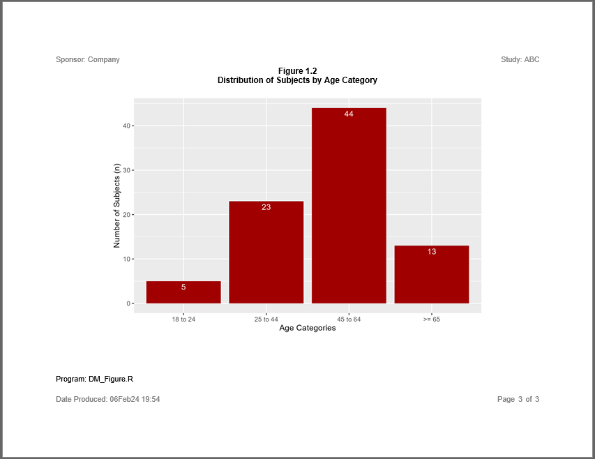

```{r setup, include = FALSE}
knitr::opts_chunk$set(
  collapse = TRUE,
  comment = "#>"
)
```
The **sassy** system of functions also supports reports with graphics.  Plots
from the popular **ggplot2** package can be added to a report.
The following example illustrates such a report. 

## Program

Note the following about this example:

* The plots are created using **ggplot2** and the `create_plot()` function.
* The plots are added to the report with the `add_content()` function, just
like the tables in the previous examples.
* The **[reporter](https://reporter.r-sassy.org)** package allows you 
to add multiple pieces of content to the same report.
* Titles, footnotes, and other report enhancements are added to the figure
just like previous examples.
    
```{r eval=FALSE, echo=TRUE}
library(ggplot2)
library(sassy)
library(procs)


# Prepare Log -------------------------------------------------------------


options("logr.autolog" = TRUE,
        "logr.notes" = FALSE)

# Get path to temp directory
tmp <- tempdir() 

# Get sample data directory
dir <- system.file("extdata", package = "sassy")

# Open log
lgpth <- log_open(file.path(tmp, "example3.log"))


# Load and Prepare Data ---------------------------------------------------

sep("Prepare Data")

# Define data library
libname(sdtm, dir, "csv") 

# Loads data into workspace
lib_load(sdtm)


put("Prepare format")
agefmt <- value(condition(x >= 18 & x <= 24, "18 to 24"),
                condition(x >= 25 & x <= 44, "25 to 44"),
                condition(x >= 45 & x <= 64, "45 to 64"),
                condition(x >= 65, ">= 65"))


put("Prepare data")
datastep(sdtm.DM, keep = v(USUBJID, SEX, AGE, ARM, AGECAT),
    where = expression(ARM != "SCREEN FAILURE"),
    {
        AGECAT <- fapply(AGE, agefmt)
      
    }) -> dm_mod 

put("Get population counts")
proc_freq(dm_mod, tables = ARM, 
          options = v(nonobs, nopercent)) -> arm_pop

proc_freq(dm_mod, tables = SEX, 
          options = v(nonobs, nopercent)) -> sex_pop

proc_freq(dm_mod, tables = AGECAT, 
          options = v(nonobs, nopercent)) -> agecat_pop


put("Convert agecat to factor so rows will sort correctly")
agecat_pop$CAT <- factor(agecat_pop$CAT, levels = levels(agefmt))

put("Sort agecat")
agecat_pop <-  proc_sort(agecat_pop, by = CAT)


# Create Plots ------------------------------------------------------------


plt1 <- ggplot(data = arm_pop, aes(x = CAT, y = CNT)) +
  geom_col(fill = "#0000A0") +
  geom_text(aes(label = CNT), vjust = 1.5, colour = "white") +
  labs(x = "Treatment Group", y = "Number of Subjects (n)")

plt2 <- ggplot(data = sex_pop, aes(x = CAT, y = CNT)) +
  geom_col(fill = "#00A000") +
  geom_text(aes(label = CNT), vjust = 1.5, colour = "white") +
  labs(x = "Biological Sex", y = "Number of Subjects (n)")

plt3 <- ggplot(data = agecat_pop, aes(x = CAT, y = CNT)) +
  geom_col(fill = "#A00000") +
  geom_text(aes(label = CNT), vjust = 1.5, colour = "white") +
  labs(x = "Age Categories", y = "Number of Subjects (n)")


# Report ------------------------------------------------------------------


sep("Create and print report")


pth <- file.path(tmp, "output/example3.rtf")


page1 <- create_plot(plt1, 4.5, 7) |> 
  titles("Figure 1.1", "Distribution of Subjects by Treatment Group", 
         bold = TRUE, font_size = 11)

page2 <- create_plot(plt2, 4.5, 7) |> 
  titles("Figure 1.2", "Distribution of Subjects by Biological Sex", 
         bold = TRUE, font_size = 11)

page3 <- create_plot(plt3, 4.5, 7) |> 
  titles("Figure 1.2", "Distribution of Subjects by Age Category", 
         bold = TRUE, font_size = 11)

rpt <- create_report(pth, output_type = "RTF", font = "Arial") |> 
  set_margins(top = 1, bottom = 1) |> 
  page_header("Sponsor: Company", "Study: ABC") |> 
  add_content(page1) |> 
  add_content(page2) |> 
  add_content(page3) |> 
  footnotes("Program: DM_Figure.R") |> 
  page_footer(paste0("Date Produced: ", fapply(Sys.time(), "%d%b%y %H:%M")), 
              right = "Page [pg] of [tpg]")

write_report(rpt)


# Clean Up ----------------------------------------------------------------

# Unload library from workspace
lib_unload(sdtm)

# Close log
log_close()

# View files
# file.show(pth)
# file.show(lgpth)
```

## Output 

Here are the three pages of the report:





## Log

Here is the log for the above program:

```
=========================================================================
Log Path: C:/Users/dbosa/AppData/Local/Temp/Rtmpo1naKK/log/example3.log
Program Path: C:/packages/Testing/procs/ProcsFigs.R
Working Directory: C:/packages/Testing/procs
User Name: dbosa
R Version: 4.3.1 (2023-06-16 ucrt)
Machine: SOCRATES x86-64
Operating System: Windows 10 x64 build 22621
Base Packages: stats graphics grDevices utils datasets methods base Other
Packages: tidylog_1.0.2 ggplot2_3.4.2 procs_1.0.3 reporter_1.4.1 libr_1.2.8
fmtr_1.5.9 logr_1.3.4 common_1.0.8 sassy_1.1.0
Log Start Time: 2023-09-06 18:32:28.438427
=========================================================================

=========================================================================
Prepare Data
=========================================================================

# library 'sdtm': 7 items
- attributes: csv not loaded
- path: C:/Users/dbosa/AppData/Local/R/win-library/4.3/sassy/extdata
- items:
  Name Extension Rows Cols     Size        LastModified
1   AE       csv  150   27  88.5 Kb 2023-08-07 17:51:40
2   DM       csv   87   24  45.5 Kb 2023-08-07 17:51:40
3   DS       csv  174    9  34.1 Kb 2023-08-07 17:51:40
4   EX       csv   84   11  26.4 Kb 2023-08-07 17:51:40
5   IE       csv    2   14  13.4 Kb 2023-08-07 17:51:40
6   SV       csv  685   10  70.3 Kb 2023-08-07 17:51:40
7   VS       csv 3358   17 467.4 Kb 2023-08-07 17:51:40

lib_load: library 'sdtm' loaded

Prepare format

# A user-defined format: 4 conditions
  Name Type        Expression    Label Order
1  obj    U x >= 18 & x <= 24 18 to 24    NA
2  obj    U x >= 25 & x <= 44 25 to 44    NA
3  obj    U x >= 45 & x <= 64 45 to 64    NA
4  obj    U           x >= 65    >= 65    NA

Prepare data

datastep: columns decreased from 24 to 5

# A tibble: 85 × 5
   USUBJID    SEX     AGE ARM   AGECAT  
   <chr>      <chr> <dbl> <chr> <chr>   
 1 ABC-01-049 M        39 ARM D 25 to 44
 2 ABC-01-050 M        47 ARM B 45 to 64
 3 ABC-01-051 M        34 ARM A 25 to 44
 4 ABC-01-052 F        45 ARM C 45 to 64
 5 ABC-01-053 F        26 ARM B 25 to 44
 6 ABC-01-054 M        44 ARM D 25 to 44
 7 ABC-01-055 F        47 ARM C 45 to 64
 8 ABC-01-056 M        31 ARM A 25 to 44
 9 ABC-01-113 M        74 ARM D >= 65   
10 ABC-01-114 F        72 ARM B >= 65   
# ℹ 75 more rows
# ℹ Use `print(n = ...)` to see more rows

Get population counts

proc_freq: input data set 85 rows and 5 columns
           tables: ARM
           view: TRUE
           output: 1 datasets

# A tibble: 4 × 3
  VAR   CAT     CNT
  <chr> <chr> <dbl>
1 ARM   ARM A    20
2 ARM   ARM B    21
3 ARM   ARM C    21
4 ARM   ARM D    23

proc_freq: input data set 85 rows and 5 columns
           tables: SEX
           view: TRUE
           output: 1 datasets

# A tibble: 2 × 3
  VAR   CAT     CNT
  <chr> <chr> <dbl>
1 SEX   F        32
2 SEX   M        53

proc_freq: input data set 85 rows and 5 columns
           tables: AGECAT
           view: TRUE
           output: 1 datasets

# A tibble: 4 × 3
  VAR    CAT        CNT
  <chr>  <chr>    <dbl>
1 AGECAT >= 65       13
2 AGECAT 18 to 24     5
3 AGECAT 25 to 44    23
4 AGECAT 45 to 64    44

Convert agecat to factor so rows will sort correctly

Sort agecat

proc_sort: input data set 4 rows and 3 columns
           by: CAT
           keep: VAR CAT CNT
           order: a
           output data set 4 rows and 3 columns

# A tibble: 4 × 3
  VAR    CAT        CNT
  <chr>  <fct>    <dbl>
1 AGECAT 18 to 24     5
2 AGECAT 25 to 44    23
3 AGECAT 45 to 64    44
4 AGECAT >= 65       13

=========================================================================
Create and print report
=========================================================================

# A report specification: 3 pages
- file_path: 'C:\Users\dbosa\AppData\Local\Temp\Rtmpo1naKK/output/example3.rtf'
- output_type: RTF
- units: inches
- orientation: landscape
- margins: top 1 bottom 1 left 1 right 1
- line size/count: 9/36
- page_header: left=Sponsor: Company right=Study: ABC
- footnote 1: 'Program: DM_Figure.R'
- page_footer: left=Date Produced: 06Sep23 18:32 center= right=Page [pg] of [tpg]
- content: 
# A plot specification: 
- data: 4 rows, 3 cols
- layers: 2
- height: 4.5
- width: 7
- title 1: 'Figure 1.1'
- title 2: 'Distribution of Subjects by Treatment Group'
# A plot specification: 
- data: 2 rows, 3 cols
- layers: 2
- height: 4.5
- width: 7
- title 1: 'Figure 1.2'
- title 2: 'Distribution of Subjects by Biological Sex'
# A plot specification: 
- data: 4 rows, 3 cols
- layers: 2
- height: 4.5
- width: 7
- title 1: 'Figure 1.2'
- title 2: 'Distribution of Subjects by Age Category'

lib_sync: synchronized data in library 'sdtm'

lib_unload: library 'sdtm' unloaded

=========================================================================
Log End Time: 2023-09-06 18:32:32.220485
Log Elapsed Time: 0 00:00:03
=========================================================================


```

Next: [Example 4: Adverse Events Table](sassy-ae.html)
