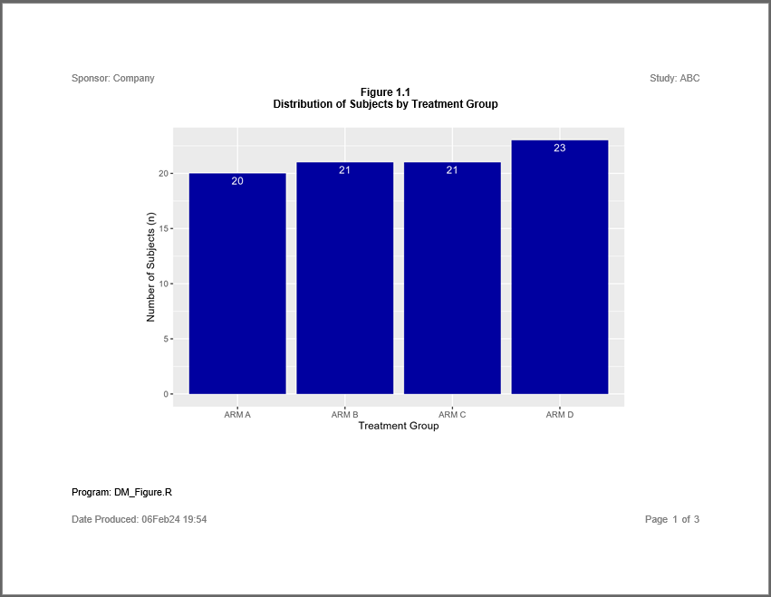

```{r setup, include = FALSE}
knitr::opts_chunk$set(
  collapse = TRUE,
  comment = "#>"
)
```
The **sassy** system of functions also supports reports with graphics.  Plots
from the popular **ggplot2** package can be added to a report.
The following example illustrates such a report. 

## Program

Note the following about this example:

* The plots are created using **ggplot2** and the `create_plot()` function.
* The plots are added to the report with the `add_content()` function, just
like the tables in the previous examples.
* The **[reporter](https://reporter.r-sassy.org)** package allows you 
to add multiple pieces of content to the same report.
* Titles, footnotes, and other report enhancements are added to the figure
just like previous examples.
    
```{r eval=FALSE, echo=TRUE}
library(sassy)
library(procs)

# Prepare Log -------------------------------------------------------------

options("logr.autolog" = TRUE,
        "logr.on" = TRUE,
        "logr.notes" = FALSE)

# Get path to temp directory
tmp <- tempdir() 

# Get sample data directory
dir <- system.file("extdata", package = "sassy")

# Open log
lf <- log_open(file.path(tmp, "example11.log"))


# Prepare formats ---------------------------------------------------------

sep("Prepare formats")

fc <- fcat(SEX = c("M" = "Male", "F" = "Female"),
           AGE = "%d Years",
           RACE = value(condition(x == "WHITE", "White"),
                        condition(x == "BLACK OR AFRICAN AMERICAN", "Black or African American"),
                        condition(x == "ASIAN OR PACIFIC ISLANDER", "Asian or Pacific Islander"),
                        condition(TRUE, "Other")),
           WEIGHT = "%6.2f kg",
           EAR = c("L" = "Left", "R" = "Right"),
           DOSE = "%4.2fug",
           ETHNIC = value(condition(x == "NOT HISPANIC OR LATINO", "Not Hispanic or Latino"),
                          condition(x == "HISPANIC OR LATINO", "Hispanic or Latino"),
                          condition(TRUE, "Unknown")), 
           ARMT = value(condition(x == "ARM A", "Placebo"),
                        condition(x == "ARM B", "Drug 50mg"),
                        condition(x == "ARM C", "Drug 100mg"),
                        condition(x == "ARM D", "Competitor"),
                        condition(TRUE, "Not Treated/Screen Failure")),
           UNITS = value(condition(x ==  "BEATS/MIN", "bpm"),
                         condition(x == "BREATHS/MIN", "brths/min"),
                         condition(x == "C", symbol("degC")),
                         condition(x == "mmHg", "")),
           VISIT = value(condition(x == "DAY 1", "Day 1"),
                         condition(x == "WEEK 2", "Week 2"),
                         condition(x == "WEEK 4", "Week 4"),
                         condition(x == "WEEK 6", "Week 6"),
                         condition(x == "WEEK 8", "Week 8"),
                         condition(x == "WEEK 12", "Week 12"),
                         condition(x == "WEEK 16", "Week 16"),
                         condition(TRUE, "Early Termination"))
) 

# Prepare Data ------------------------------------------------------------

sep("Prepare Data")

libname(sdtm, dir, "csv")

lib_load(sdtm)

put("Format desired vital signs") 
datastep(sdtm.VS, 
         keep = v(USUBJID, VSTESTCD, VSCOMB, VISITNUM, VISIT),
         where = expression(VSTESTCD != 'HEIGHT' & VISITNUM > 0),
         {
           
           if (VSORRESU == "C")
             VSCOMB <- paste0(VSORRES, fapply(VSORRESU, fc$UNITS)) 
           else 
             VSCOMB <- paste(VSORRES, fapply(VSORRESU, fc$UNITS)) 
         }) -> vso

put("Pivot vitals signs")
proc_transpose(vso, id = VSTESTCD, var = VSCOMB, 
               by = v(USUBJID, VISITNUM, VISIT)) |> 
  proc_sort(by = v(USUBJID, VISITNUM)) -> vsot


put("Assign and apply formats")               
formats(sdtm.DM) <- fc
dmf <- fdata(sdtm.DM) |> put()

put("Prepare final data for reporting")
datastep(dmf, format = fc,
         by = USUBJID,
         retain = list(PTCNT = 0, PG = 1),
         merge = vsot, merge_by = USUBJID,
         {
           
           # Combine subject info into label row
           BASELINE <- paste0(USUBJID, ", Site=", SITEID,
                              ", Age=", AGE, ", Sex=", SEX, ", Race=", RACE, 
                              ", Ethnic=", ETHNIC)
           
           # Deal with non-recorded blood pressure
           if (is.na(DIABP))
             DIABP <- "-"
           
           if (is.na(SYSBP))
             SYSBP <- "-"
           
           # Combine distolic and systolic in one column
           BP <- paste0(trimws(DIABP), "/", trimws(SYSBP), " mmHg")
           
           # Format treatment group
           if (first.)
             TREATMENT <- fapply(ARM, fc$ARMT)
           else 
             TREATMENT <- ""
           
           # Count up patients
           if (first.) {
             PTCNT <- PTCNT + 1 
           }
           
           # Create paging variable with 3 patients per page
           if (PTCNT == 4) {
             
             PTCNT <- 1
             PG <- PG + 1
           }
           
         }) -> final


# Create report -----------------------------------------------------------

sep("Create and Print Report")

tbl <- create_table(final, show_cols = "none", 
                    width = 9, first_row_blank = FALSE,
                    header_bold = TRUE) |> 
  column_defaults(from = "VISIT", to = "BP", width = 1.25) |> 
  stub(v(BASELINE, TREATMENT), label = "Subject/Treatment") |> 
  define(BASELINE, label_row = TRUE) |> 
  define(TREATMENT) |> 
  define(VISIT, label = "Visit") |> 
  define(TEMP, label = "Temperature") |> 
  define(PULSE, label = "Pulse") |> 
  define(RESP, label = "Respirations") |> 
  define(BP, label = "Blood Pressure") |> 
  define(USUBJID, blank_after = TRUE, visible = FALSE) |> 
  define(PG, page_break = TRUE, visible = FALSE)

rpt <- create_report(file.path(tmp, "example11"), font = "Courier", font_size = 9) |> 
  add_content(tbl) |> 
  set_margins(top = 1, bottom = 1) |> 
  page_header("Program:" %p% Sys.path(), right = "Draft", width = 7) |> 
  titles( "Study: ABC", "Appendix 10.2.6.1.2.1", "Source: DM, VS",
          columns = 3, header = TRUE, blank_row = "none") |> 
  titles("Subject Listing with Vital Signs by Visit{supsc('1')}",
         "All Randomized Patients", align = "center", header = TRUE, blank_row = "below") |> 
  footnotes("{supsc('1')} Baseline through completion of study or early termination.",
            "Values flagged with {symbol('dagger')} were excluded from the by-visit " %p% 
              "analysis in tables showing the qualitative test results.",
            blank_row = "none", footer = TRUE) |> 
  page_footer("Date: " %p% toupper(fapply(Sys.time(), "%d%b%Y %H:%M:%S")),
              "Archytas", "Page [pg] of [tpg]")

# Generate both RTF and PDF with same report object
res1 <- write_report(rpt, output_type = "RTF")
res2 <- write_report(rpt, output_type = "PDF")


# Uncomment to show reports
# file.show(res1$modified_path)
# file.show(res2$modified_path)

# Uncomment to show log
# file.show(lf)


# Clean Up ----------------------------------------------------------------

lib_unload(sdtm)

log_close()

```

## Output 

Here are the three pages of the report:




## Log

Here is the log for the above program:

```
=========================================================================
Log Path: C:/Users/dbosa/AppData/Local/Temp/Rtmpo1naKK/log/example11.log
Program Path: C:/packages/Testing/procs/ProcSubjectListing.R
Working Directory: C:/packages/Testing/procs
User Name: dbosa
R Version: 4.3.1 (2023-06-16 ucrt)
Machine: SOCRATES x86-64
Operating System: Windows 10 x64 build 22621
Base Packages: stats graphics grDevices utils datasets methods base Other
Packages: tidylog_1.0.2 procs_1.0.3 reporter_1.4.1 libr_1.2.8 fmtr_1.5.9
logr_1.3.4 common_1.0.8 sassy_1.1.0
Log Start Time: 2023-09-06 17:00:08.836902
=========================================================================

=========================================================================
Prepare formats
=========================================================================

# A user-defined format: 4 conditions
  Name Type                       Expression                     Label Order
1  obj    U                     x == "WHITE"                     White    NA
2  obj    U x == "BLACK OR AFRICAN AMERICAN" Black or African American    NA
3  obj    U x == "ASIAN OR PACIFIC ISLANDER" Asian or Pacific Islander    NA
4  obj    U                             TRUE                     Other    NA

# A user-defined format: 3 conditions
  Name Type                    Expression                  Label Order
1  obj    U x == "NOT HISPANIC OR LATINO" Not Hispanic or Latino    NA
2  obj    U     x == "HISPANIC OR LATINO"     Hispanic or Latino    NA
3  obj    U                          TRUE                Unknown    NA

# A user-defined format: 5 conditions
  Name Type   Expression                      Label Order
1  obj    U x == "ARM A"                    Placebo    NA
2  obj    U x == "ARM B"                  Drug 50mg    NA
3  obj    U x == "ARM C"                 Drug 100mg    NA
4  obj    U x == "ARM D"                 Competitor    NA
5  obj    U         TRUE Not Treated/Screen Failure    NA

# A user-defined format: 4 conditions
  Name Type         Expression     Label Order
1  obj    U   x == "BEATS/MIN"       bpm    NA
2  obj    U x == "BREATHS/MIN" brths/min    NA
3  obj    U           x == "C"        °C    NA
4  obj    U        x == "mmHg"              NA

# A user-defined format: 8 conditions
  Name Type     Expression             Label Order
1  obj    U   x == "DAY 1"             Day 1    NA
2  obj    U  x == "WEEK 2"            Week 2    NA
3  obj    U  x == "WEEK 4"            Week 4    NA
4  obj    U  x == "WEEK 6"            Week 6    NA
5  obj    U  x == "WEEK 8"            Week 8    NA
6  obj    U x == "WEEK 12"           Week 12    NA
7  obj    U x == "WEEK 16"           Week 16    NA
8  obj    U           TRUE Early Termination    NA

# A format catalog: 10 formats
- $SEX: type V, 2 elements
- $AGE: type S, "%d Years"
- $RACE: type U, 4 conditions
- $WEIGHT: type S, "%6.2f kg"
- $EAR: type V, 2 elements
- $DOSE: type S, "%4.2fug"
- $ETHNIC: type U, 3 conditions
- $ARMT: type U, 5 conditions
- $UNITS: type U, 4 conditions
- $VISIT: type U, 8 conditions

=========================================================================
Prepare Data
=========================================================================

# library 'sdtm': 7 items
- attributes: csv not loaded
- path: C:/Users/dbosa/AppData/Local/R/win-library/4.3/sassy/extdata
- items:
  Name Extension Rows Cols     Size        LastModified
1   AE       csv  150   27  88.5 Kb 2023-08-07 17:51:40
2   DM       csv   87   24  45.5 Kb 2023-08-07 17:51:40
3   DS       csv  174    9  34.1 Kb 2023-08-07 17:51:40
4   EX       csv   84   11  26.4 Kb 2023-08-07 17:51:40
5   IE       csv    2   14  13.4 Kb 2023-08-07 17:51:40
6   SV       csv  685   10  70.3 Kb 2023-08-07 17:51:40
7   VS       csv 3358   17 467.4 Kb 2023-08-07 17:51:40

lib_load: library 'sdtm' loaded

Format desired vital signs

datastep: columns decreased from 17 to 5

# A tibble: 2,764 × 5
   USUBJID    VSTESTCD VSCOMB   VISITNUM VISIT  
   <chr>      <chr>    <chr>       <dbl> <chr>  
 1 ABC-01-049 DIABP    "76 "           1 DAY 1  
 2 ABC-01-049 DIABP    "66 "           2 WEEK 2 
 3 ABC-01-049 DIABP    "84 "           4 WEEK 4 
 4 ABC-01-049 DIABP    "68 "           6 WEEK 6 
 5 ABC-01-049 DIABP    "80 "           8 WEEK 8 
 6 ABC-01-049 DIABP    "70 "          12 WEEK 12
 7 ABC-01-049 DIABP    "70 "          16 WEEK 16
 8 ABC-01-049 PULSE    "84 bpm"        1 DAY 1  
 9 ABC-01-049 PULSE    "84 bpm"        2 WEEK 2 
10 ABC-01-049 PULSE    "76 bpm"        4 WEEK 4 
# ℹ 2,754 more rows
# ℹ Use `print(n = ...)` to see more rows

Pivot vitals signs

proc_transpose: input data set 2764 rows and 5 columns
                by: USUBJID VISITNUM VISIT
                var: VSCOMB
                id: VSTESTCD
                name: NAME
                output dataset 554 rows and 9 columns

# A tibble: 554 × 9
   USUBJID    VISITNUM VISIT NAME   DIABP PULSE  RESP         SYSBP  TEMP  
   <chr>         <dbl> <chr> <chr>  <chr> <chr>  <chr>        <chr>  <chr> 
 1 ABC-01-049        1 DAY 1 VSCOMB "76 " 84 bpm 20 brths/min "120 " 36.4°C
 2 ABC-01-050        1 DAY 1 VSCOMB "78 " 68 bpm 18 brths/min "100 " 36.7°C
 3 ABC-01-052        1 DAY 1 VSCOMB "68 " 68 bpm 16 brths/min "100 " 36.3°C
 4 ABC-01-053        1 DAY 1 VSCOMB "78 " 62 bpm 16 brths/min "104 " 35.7°C
 5 ABC-01-054        1 DAY 1 VSCOMB  <NA> 92 bpm 16 brths/min  <NA>  36.6°C
 6 ABC-01-055        1 DAY 1 VSCOMB "80 " 76 bpm 20 brths/min "140 " 36.7°C
 7 ABC-01-056        1 DAY 1 VSCOMB "84 " 82 bpm 20 brths/min "112 " 37°C  
 8 ABC-01-113        1 DAY 1 VSCOMB "72 " 80 bpm 20 brths/min "140 " 36.1°C
 9 ABC-01-114        1 DAY 1 VSCOMB "88 " 68 bpm 20 brths/min "158 " 36.6°C
10 ABC-02-033        1 DAY 1 VSCOMB "88 " 72 bpm 8 brths/min  "122 " 36.2°C
# ℹ 544 more rows
# ℹ Use `print(n = ...)` to see more rows

proc_sort: input data set 554 rows and 9 columns
           by: USUBJID VISITNUM
           keep: USUBJID VISITNUM VISIT NAME DIABP PULSE RESP SYSBP TEMP
           order: a a
           output data set 554 rows and 9 columns

# A tibble: 554 × 9
   USUBJID    VISITNUM VISIT   NAME   DIABP PULSE  RESP         SYSBP  TEMP  
   <chr>         <dbl> <chr>   <chr>  <chr> <chr>  <chr>        <chr>  <chr> 
 1 ABC-01-049        1 DAY 1   VSCOMB "76 " 84 bpm 20 brths/min "120 " 36.4°C
 2 ABC-01-049        2 WEEK 2  VSCOMB "66 " 84 bpm 16 brths/min "128 " 36.6°C
 3 ABC-01-049        4 WEEK 4  VSCOMB "84 " 76 bpm 16 brths/min "134 " 35.7°C
 4 ABC-01-049        6 WEEK 6  VSCOMB "68 " 64 bpm 20 brths/min "100 " 36.5°C
 5 ABC-01-049        8 WEEK 8  VSCOMB "80 " 84 bpm 16 brths/min "128 " 36.4°C
 6 ABC-01-049       12 WEEK 12 VSCOMB "70 " 60 bpm 20 brths/min "120 " 36.6°C
 7 ABC-01-049       16 WEEK 16 VSCOMB "70 " 72 bpm 18 brths/min "130 " 36.2°C
 8 ABC-01-050        1 DAY 1   VSCOMB "78 " 68 bpm 18 brths/min "100 " 36.7°C
 9 ABC-01-050        2 WEEK 2  VSCOMB "64 " 68 bpm 18 brths/min "110 " 36.7°C
10 ABC-01-050        4 WEEK 4  VSCOMB "86 " 82 bpm 16 brths/min "128 " 36.6°C
# ℹ 544 more rows
# ℹ Use `print(n = ...)` to see more rows

Assign and apply formats

# A tibble: 87 × 24
   STUDYID DOMAIN USUBJID    SUBJID RFSTDTC    RFENDTC RFXSTDTC RFXENDTC RFICDTC   
   <chr>   <chr>  <chr>      <chr>  <date>     <date>  <lgl>    <lgl>    <date>    
 1 ABC     DM     ABC-01-049 049    2006-11-07 NA      NA       NA       2006-10-25
 2 ABC     DM     ABC-01-050 050    2006-11-02 NA      NA       NA       2006-10-25
 3 ABC     DM     ABC-01-051 051    2006-11-02 NA      NA       NA       2006-10-25
 4 ABC     DM     ABC-01-052 052    2006-11-06 NA      NA       NA       2006-10-31
 5 ABC     DM     ABC-01-053 053    2006-11-08 NA      NA       NA       2006-11-01
 6 ABC     DM     ABC-01-054 054    2006-11-16 NA      NA       NA       2006-11-07
 7 ABC     DM     ABC-01-055 055    2006-12-06 NA      NA       NA       2006-10-31
 8 ABC     DM     ABC-01-056 056    2006-11-28 NA      NA       NA       2006-11-21
 9 ABC     DM     ABC-01-113 113    2006-12-05 NA      NA       NA       2006-11-28
10 ABC     DM     ABC-01-114 114    2006-12-14 NA      NA       NA       2006-12-01
# ℹ 77 more rows
# ℹ 15 more variables: RFPENDTC <date>, DTHDTC <lgl>, DTHFL <lgl>, SITEID <chr>,
#   BRTHDTC <date>, AGE <chr>, AGEU <chr>, SEX <chr>, RACE <chr>, ETHNIC <chr>,
#   ARMCD <chr>, ARM <chr>, ACTARMCD <lgl>, ACTARM <lgl>, COUNTRY <lgl>
# ℹ Use `print(n = ...)` to see more rows

Prepare final data for reporting

datastep: columns increased from 24 to 37

# A tibble: 554 × 37
   STUDYID DOMAIN USUBJID    SUBJID RFSTDTC    RFENDTC RFXSTDTC RFXENDTC RFICDTC   
   <chr>   <chr>  <chr>      <chr>  <date>     <date>  <lgl>    <lgl>    <date>    
 1 ABC     DM     ABC-01-049 049    2006-11-07 NA      NA       NA       2006-10-25
 2 ABC     DM     ABC-01-049 049    2006-11-07 NA      NA       NA       2006-10-25
 3 ABC     DM     ABC-01-049 049    2006-11-07 NA      NA       NA       2006-10-25
 4 ABC     DM     ABC-01-049 049    2006-11-07 NA      NA       NA       2006-10-25
 5 ABC     DM     ABC-01-049 049    2006-11-07 NA      NA       NA       2006-10-25
 6 ABC     DM     ABC-01-049 049    2006-11-07 NA      NA       NA       2006-10-25
 7 ABC     DM     ABC-01-049 049    2006-11-07 NA      NA       NA       2006-10-25
 8 ABC     DM     ABC-01-050 050    2006-11-02 NA      NA       NA       2006-10-25
 9 ABC     DM     ABC-01-050 050    2006-11-02 NA      NA       NA       2006-10-25
10 ABC     DM     ABC-01-050 050    2006-11-02 NA      NA       NA       2006-10-25
# ℹ 544 more rows
# ℹ 28 more variables: RFPENDTC <date>, DTHDTC <lgl>, DTHFL <lgl>, SITEID <chr>,
#   BRTHDTC <date>, AGE <chr>, AGEU <chr>, SEX <chr>, RACE <chr>, ETHNIC <chr>,
#   ARMCD <chr>, ARM <chr>, ACTARMCD <lgl>, ACTARM <lgl>, COUNTRY <lgl>,
#   VISITNUM <dbl>, VISIT <chr>, NAME <chr>, DIABP <chr>, PULSE <chr>, RESP <chr>,
#   SYSBP <chr>, TEMP <chr>, BASELINE <chr>, BP <chr>, TREATMENT <chr>, PG <dbl>,
#   PTCNT <dbl>
# ℹ Use `print(n = ...)` to see more rows

=========================================================================
Create and Print Report
=========================================================================

# A report specification: 29 pages
- file_path: 'C:\Users\dbosa\AppData\Local\Temp\Rtmpo1naKK/example11.rtf'
- output_type: RTF
- units: inches
- orientation: landscape
- margins: top 1 bottom 1 left 1 right 1
- line size/count: 9/37
- page_header: left=Program:C:/packages/Testing/procs/ProcSubjectListing.R right=Draft
- page_footer: left=Date: 06SEP2023 17:00:18 center=Archytas right=Page [pg] of [tpg]
- content: 
# A table specification:
- data: tibble 'final' 554 rows 37 cols
- show_cols: none
- use_attributes: all
- width: 9
- stub: BASELINE TREATMENT 'Subject/Treatment' align='left' 
- define: BASELINE dedupe='TRUE' 
- define: TREATMENT 
- define: VISIT 'Visit' 
- define: TEMP 'Temperature' 
- define: PULSE 'Pulse' 
- define: RESP 'Respirations' 
- define: BP 'Blood Pressure' 
- define: USUBJID visible='FALSE' 
- define: PG visible='FALSE' page_break='TRUE' 

# A report specification: 29 pages
- file_path: 'C:\Users\dbosa\AppData\Local\Temp\Rtmpo1naKK/example11.pdf'
- output_type: PDF
- units: inches
- orientation: landscape
- margins: top 1 bottom 1 left 1 right 1
- line size/count: 9/42
- page_header: left=Program:C:/packages/Testing/procs/ProcSubjectListing.R right=Draft
- title 1: 'Study: ABC'
- title 2: 'Appendix 10.2.6.1.2.1'
- title 3: 'Source: DM, VS'
- title 4: 'Subject Listing with Vital Signs by Visit¹'
- title 5: 'All Randomized Patients'
- footnote 1: '¹ Baseline through completion of study or early termination.'
- footnote 2: 'Values flagged with † were excluded from the by-visit analysis in tables showing the qualitative test results.'
- page_footer: left=Date: 06SEP2023 17:00:18 center=Archytas right=Page [pg] of [tpg]
- content: 
# A table specification:
- data: tibble 'final' 554 rows 37 cols
- show_cols: none
- use_attributes: all
- width: 9
- stub: BASELINE TREATMENT 'Subject/Treatment' align='left' 
- define: BASELINE dedupe='TRUE' 
- define: TREATMENT 
- define: VISIT 'Visit' 
- define: TEMP 'Temperature' 
- define: PULSE 'Pulse' 
- define: RESP 'Respirations' 
- define: BP 'Blood Pressure' 
- define: USUBJID visible='FALSE' 
- define: PG visible='FALSE' page_break='TRUE' 

lib_sync: synchronized data in library 'sdtm'

lib_unload: library 'sdtm' unloaded

=========================================================================
Log End Time: 2023-09-06 17:00:25.947649
Log Elapsed Time: 0 00:00:17
=========================================================================


```

Next: [Example 4: Adverse Events Table](sassy-ae.html)
