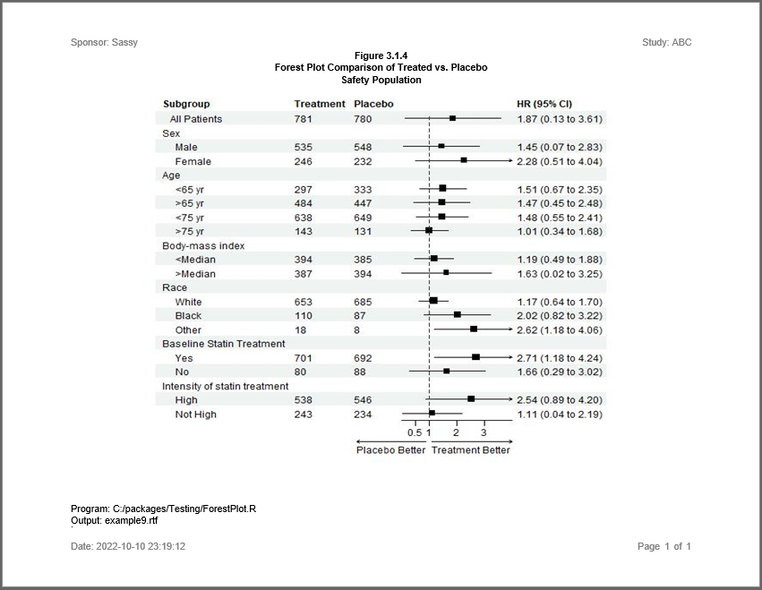

```{r setup, include = FALSE}
knitr::opts_chunk$set(
  collapse = TRUE,
  comment = "#>"
)
```
The **reporter** package is able to embed JPEG images into a report.
Here is an example using an image saved from the **forestploter** package. 
This package creates customizable forest plots.  The technique shown here 
can be used to embed images from any package. 

## Program

Note the following about this example:

  * The **[forestploter](https://CRAN.R-project.org/package=forestploter)** 
  package creates customizable forest plots.   
  * The **[reporter](https://reporter.r-sassy.org)** package can embed
  JPEG images into any output type that accepts images.  

```{r eval=FALSE, echo=TRUE}    
library(grid)
library(forestploter)
library(magrittr)
library(sassy)

options("logr.notes" = FALSE,
        "logr.autolog" = TRUE)


# Get temp directory
tmp <- tempdir()

# Open log
lf <- log_open(file.path(tmp, "example9.log"))


# Prepare Data ------------------------------------------------------------

sep("Prepare Data")

put("Read example data from forestploter package")
dt <- read.csv(system.file("extdata", "example_data.csv", package = "forestploter"))

put("Keep needed columns")
dt <- dt[,1:6] %>% put()

put("Indent the subgroup if there is a number in the placebo column")
dt$Subgroup <- ifelse(is.na(dt$Placebo), 
                      dt$Subgroup,
                      paste0("   ", dt$Subgroup)) %>% put()

put("NA to blank or NA will be transformed to character.")
dt$Treatment <- ifelse(is.na(dt$Treatment), "", dt$Treatment)
dt$Placebo <- ifelse(is.na(dt$Placebo), "", dt$Placebo)
dt$se <- (log(dt$hi) - log(dt$est))/1.96

put("Add blank column for the forest plot to display CI.")
dt$` ` <- paste(rep(" ", 20), collapse = " ")

put("Create confidence interval column to display")
dt$`HR (95% CI)` <- ifelse(is.na(dt$se), "",
                           sprintf("%.2f (%.2f to %.2f)",
                                   dt$est, dt$low, dt$hi))
put("Final data frame")
put(dt)


# Create Plot -------------------------------------------------------------

sep("Create Plot")

put("Assign Forest Properties")
p <- forest(dt[,c(1:3, 8:9)],
  est = dt$est,
  lower = dt$low,
  upper = dt$hi,
  sizes = dt$se,
  ci_column = 4,
  ref_line = 1,
  arrow_lab = c("Placebo Better", "Treatment Better"),
  xlim = c(0, 4),
  ticks_at = c(0.5, 1, 2, 3))

put("Create temp file name")
tmppth <- tempfile(fileext = ".jpg") %>% put()

put("Turn on jpeg device context")
jpeg(tmppth, width = 600, height = 500)

put("Print plot")
plot(p)

put("Turn off device context")
dev.off()


# Create Report -----------------------------------------------------------

sep("Create Report")

put("Create plot object from jpeg file")
plt <- create_plot(tmppth, 5.5, 7.5)

put("Construct report file path")
pth <- file.path(tmp, "example9.rtf")

put("Create report")
rpt <- create_report(pth, output_type = "RTF", font = "Arial") %>%
  titles("Figure 3.1.4", "Forest Plot Comparison of Treated vs. Placebo",
         "Safety Population", bold = TRUE, blank_row = "none") %>%
  add_content(plt) %>%
  footnotes("Program: {Sys.path()}", 
           "Output: {basename(pth)}", blank_row = "none") %>%
  page_header("Sponsor: Sassy", "Study: ABC") %>%
  page_footer("Date: {Sys.time()}", right = "Page [pg] of [tpg]")

put("Write report")
res <- write_report(rpt) 

# Uncomment to Show report
# file.show(res$modified_path)

# Uncomment to View Log
# file.show(lf)


# Clean Up ----------------------------------------------------------------

# Kill image file
file.remove(tmppth)

log_close()

```

## Output

Here is an image  of the RTF report produced by the above example:




## Log

Here is the log produced by the above forest plot example:

```
=========================================================================
Log Path: C:/Users/dbosa/AppData/Local/Temp/Rtmpc54HUz/log/example9.log
Program Path: C:/packages/sassy/vignettes/sassy-forest.Rmd
Working Directory: C:/packages/sassy/
User Name: dbosa
R Version: 4.2.1 (2022-06-23 ucrt)
Machine: SOCRATES x86-64
Operating System: Windows 10 x64 build 19044
Base Packages: grid stats graphics grDevices utils datasets methods base Other
Packages: tidylog_1.0.2 reporter_1.3.8 libr_1.2.6 fmtr_1.5.9 logr_1.3.3
common_1.0.4 sassy_1.0.8 magrittr_2.0.3 forestploter_0.2.1
Log Start Time: 2022-10-08 22:38:59
=========================================================================

=========================================================================
Prepare Data
=========================================================================

Read example data from forestploter package

Keep needed columns

                        Subgroup Treatment Placebo      est
1                   All Patients       781     780 1.869694
2                            Sex        NA      NA       NA
3                           Male       535     548 1.449472
4                         Female       246     232 2.275120
5                            Age        NA      NA       NA
6                         <65 yr       297     333 1.509242
7                         >65 yr       484     447 1.468828
8                         <75 yr       638     649 1.477608
9                         >75 yr       143     131 1.012617
10               Body-mass index        NA      NA       NA
11                       <Median       394     385 1.185109
12                       >Median       387     394 1.632055
13                          Race        NA      NA       NA
14                         White       653     685 1.168173
15                         Black       110      87 2.022034
16                         Other        18       8 2.622501
17     Baseline Statin Treatment        NA      NA       NA
18                           Yes       701     692 2.707430
19                            No        80      88 1.655263
20 Intensity of statin treatment        NA      NA       NA
21                          High       538     546 2.544263
22                      Not High       243     234 1.113885
          low       hi
1  0.13245636 3.606932
2          NA       NA
3  0.06834426 2.830600
4  0.50768005 4.042560
5          NA       NA
6  0.67029394 2.348190
7  0.45499227 2.482663
8  0.55014273 2.405073
9  0.34370612 1.681528
10         NA       NA
11 0.49170973 1.878509
12 0.01765042 3.246461
13         NA       NA
14 0.63731627 1.699029
15 0.82239156 3.221677
16 1.18092223 4.064081
17         NA       NA
18 1.17973879 4.235121
19 0.29133093 3.019195
20         NA       NA
21 0.88528342 4.203243
22 0.03848006 2.189290

Indent the subgroup if there is a number in the placebo column

   All Patients
Sex
     Male
     Female
Age
     <65 yr
     >65 yr
     <75 yr
     >75 yr
Body-mass index
     <Median
     >Median
Race
     White
     Black
     Other
Baseline Statin Treatment
     Yes
     No
Intensity of statin treatment
     High
     Not High

NA to blank or NA will be transformed to character.

Add blank column for the forest plot to display CI.

Create confidence interval column to display

Final data frame

                        Subgroup Treatment Placebo      est
1                   All Patients       781     780 1.869694
2                            Sex                         NA
3                           Male       535     548 1.449472
4                         Female       246     232 2.275120
5                            Age                         NA
6                         <65 yr       297     333 1.509242
7                         >65 yr       484     447 1.468828
8                         <75 yr       638     649 1.477608
9                         >75 yr       143     131 1.012617
10               Body-mass index                         NA
11                       <Median       394     385 1.185109
12                       >Median       387     394 1.632055
13                          Race                         NA
14                         White       653     685 1.168173
15                         Black       110      87 2.022034
16                         Other        18       8 2.622501
17     Baseline Statin Treatment                         NA
18                           Yes       701     692 2.707430
19                            No        80      88 1.655263
20 Intensity of statin treatment                         NA
21                          High       538     546 2.544263
22                      Not High       243     234 1.113885
          low       hi        se
1  0.13245636 3.606932 0.3352463
2          NA       NA        NA
3  0.06834426 2.830600 0.3414741
4  0.50768005 4.042560 0.2932884
5          NA       NA        NA
6  0.67029394 2.348190 0.2255292
7  0.45499227 2.482663 0.2677894
8  0.55014273 2.405073 0.2485489
9  0.34370612 1.681528 0.2587575
10         NA       NA        NA
11 0.49170973 1.878509 0.2350221
12 0.01765042 3.246461 0.3508801
13         NA       NA        NA
14 0.63731627 1.699029 0.1911307
15 0.82239156 3.221677 0.2376520
16 1.18092223 4.064081 0.2234995
17         NA       NA        NA
18 1.17973879 4.235121 0.2282715
19 0.29133093 3.019195 0.3066481
20         NA       NA        NA
21 0.88528342 4.203243 0.2561302
22 0.03848006 2.189290 0.3447568
                                                   HR (95% CI)
1                                          1.87 (0.13 to 3.61)
2                                                             
3                                          1.45 (0.07 to 2.83)
4                                          2.28 (0.51 to 4.04)
5                                                             
6                                          1.51 (0.67 to 2.35)
7                                          1.47 (0.45 to 2.48)
8                                          1.48 (0.55 to 2.41)
9                                          1.01 (0.34 to 1.68)
10                                                            
11                                         1.19 (0.49 to 1.88)
12                                         1.63 (0.02 to 3.25)
13                                                            
14                                         1.17 (0.64 to 1.70)
15                                         2.02 (0.82 to 3.22)
16                                         2.62 (1.18 to 4.06)
17                                                            
18                                         2.71 (1.18 to 4.24)
19                                         1.66 (0.29 to 3.02)
20                                                            
21                                         2.54 (0.89 to 4.20)
22                                         1.11 (0.04 to 2.19)

=========================================================================
Create Plot
=========================================================================

Assign Forest Properties

Create temp file name

C:\Users\dbosa\AppData\Local\Temp\Rtmpc54HUz\file4ce84b293714.jpg

Turn on jpeg device context

Print plot

Turn off device context

=========================================================================
Create Report
=========================================================================

Create plot object from jpeg file

Construct report file path

Create report

Write report

# A report specification: 1 pages
- file_path: 'C:\Users\dbosa\AppData\Local\Temp\Rtmpc54HUz/example9.rtf'
- output_type: RTF
- units: inches
- orientation: landscape
- margins: top 0.5 bottom 0.5 left 1 right 1
- line size/count: 9/42
- page_header: left=Sponsor: Sassy right=Study: ABC
- title 1: 'Figure 3.1.4'
- title 2: 'Forest Plot Comparison of Treated vs. Placebo'
- title 3: 'Safety Population'
- footnote 1: 'Program: C:/packages/sassy/vignettes/sassy-forest.Rmd'
- footnote 2: 'Output: example9.rtf'
- page_footer: left=Date: 2022-10-08 22:38:59 center= right=Page [pg] of [tpg]
- content: 
# A plot specification: 
- path: 'C:\Users\dbosa\AppData\Local\Temp\Rtmpc54HUz\file4ce84b293714.jpg'
- height: 5.5
- width: 7.5

=========================================================================
Log End Time: 2022-10-08 22:38:59
Log Elapsed Time: 0 00:00:00
=========================================================================


```

Next: [Example 10: Disposition Table](sassy-ds.html)
