```{r, include = FALSE}
knitr::opts_chunk$set(
  collapse = TRUE,
  comment = "#>"
)
```

To understand the system better, let's look at some examples. These examples 
will give you a feel for the overall flow of a **sassy**-enhanced program, 
and allow you to see how the functions work together.

* **[Example 1](https://gallery.r-sassy.org/articles/sassy-listing.html)**: 
Creates a simple data listing and log
<a href="https://gallery.r-sassy.org/articles/sassy-listing.html">
 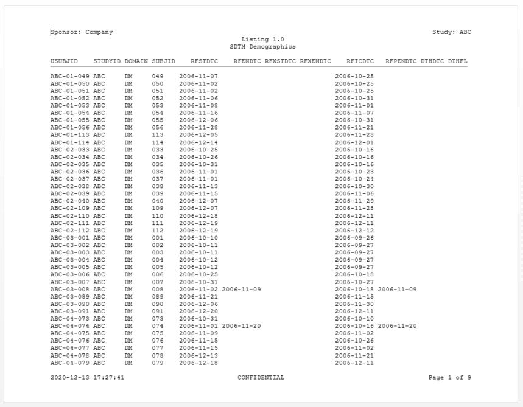
 </a>
<br>

* **[Example 2](https://gallery.r-sassy.org/articles/sassy-dm.html)**: 
Creates a table of demographic characteristics  
<a href="https://gallery.r-sassy.org/articles/sassy-dm.html">
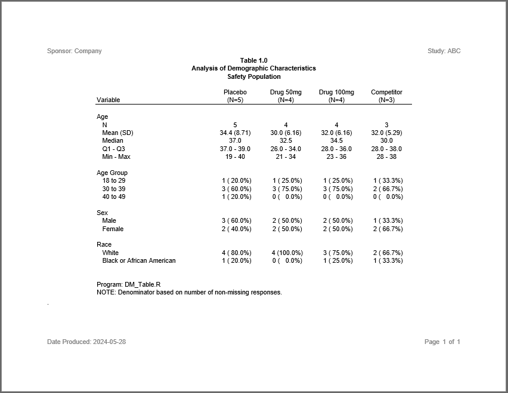
</a>
<br>

* **[Example 3](https://gallery.r-sassy.org/articles/sassy-figure.html)**: 
Creates a simple figure
<a href="https://gallery.r-sassy.org/articles/sassy-figure.html">
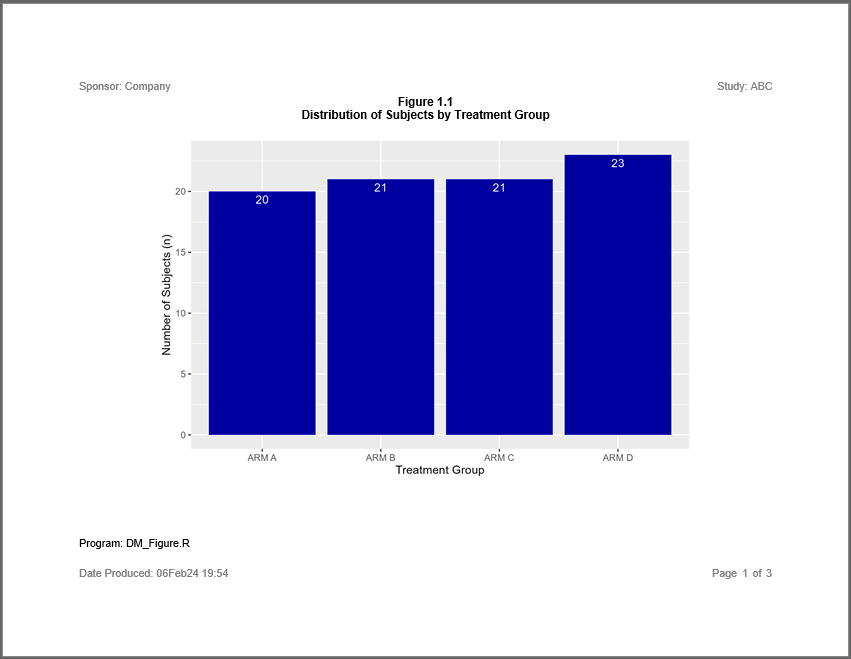
</a>
<br>

* **[Example 4](https://gallery.r-sassy.org/articles/sassy-ae.html)**: 
Creates an AE table with a page wrap
<a href="https://gallery.r-sassy.org/articles/sassy-ae.html">
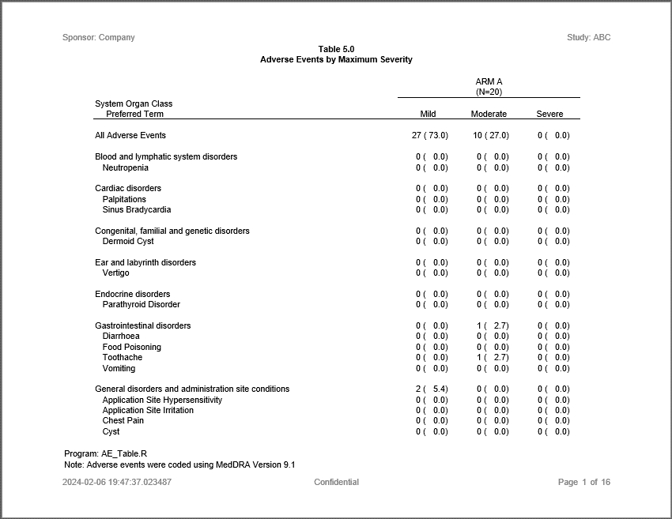
</a>
<br>

* **[Example 5](https://gallery.r-sassy.org/articles/sassy-vs.html)**: 
Creates a table of vital signs statistics
<a href="https://gallery.r-sassy.org/articles/sassy-vs.html">
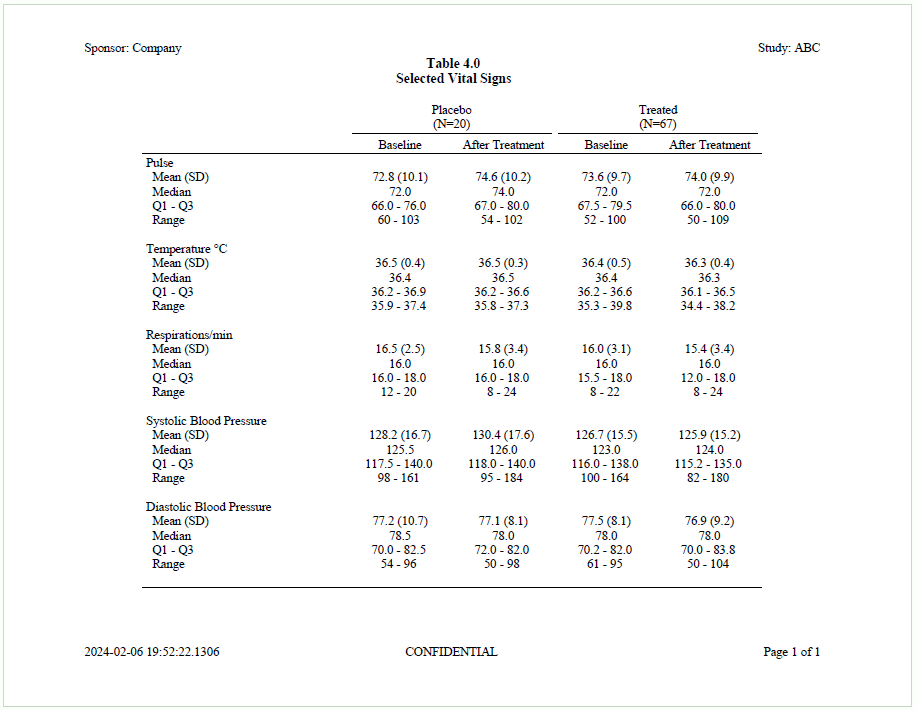
</a>
<br>

* **[Example 6](https://gallery.r-sassy.org/articles/sassy-figureby.html)**: 
Creates a figure with a by-group
<a href="https://gallery.r-sassy.org/articles/sassy-figureby.html">
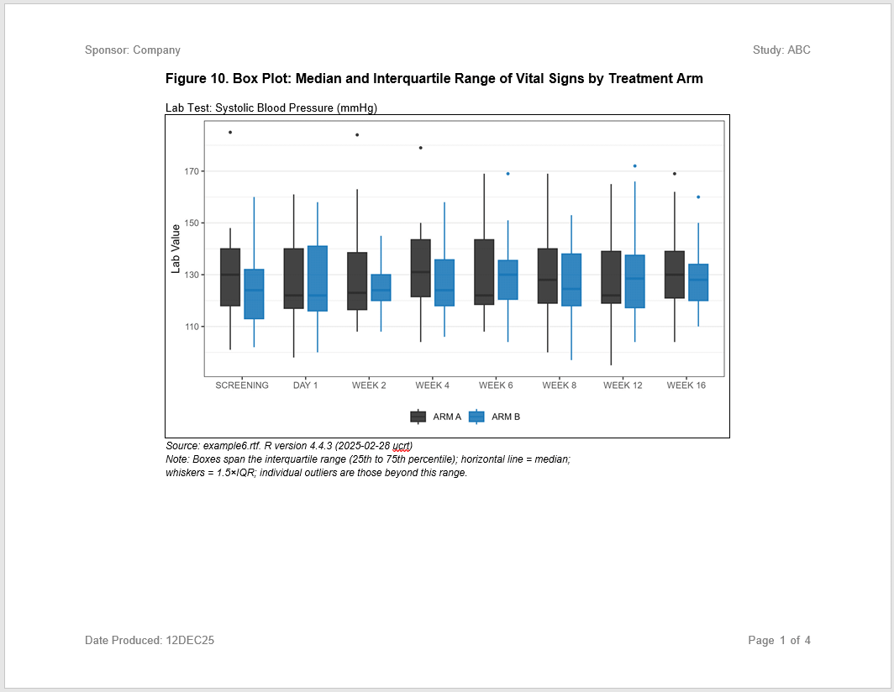
</a>
<br>

* **[Example 7](https://gallery.r-sassy.org/articles/sassy-survival.html)**: 
Perform survival analysis.
<a href="https://gallery.r-sassy.org/articles/sassy-survival.html">
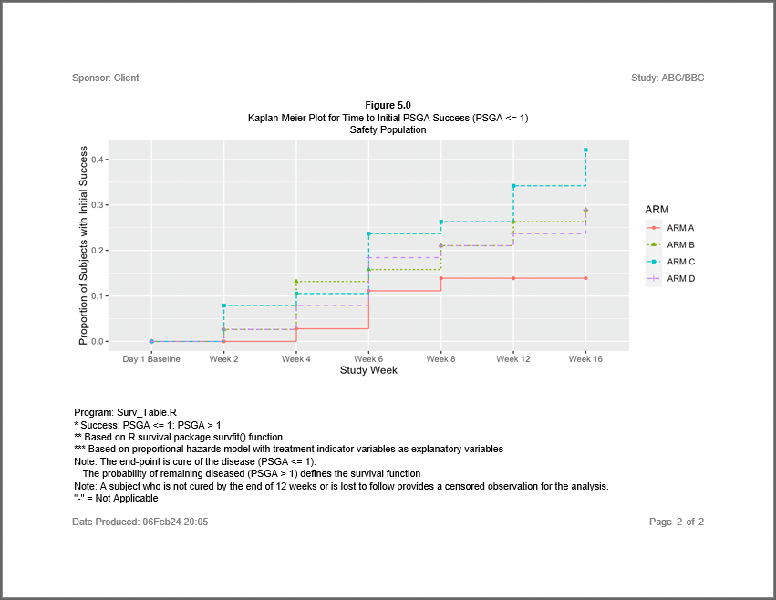
</a>
<br>

* **[Example 8](https://gallery.r-sassy.org/articles/sassy-profile.html)**: 
Creates a patient profile report.
<a href="https://gallery.r-sassy.org/articles/sassy-profile.html">
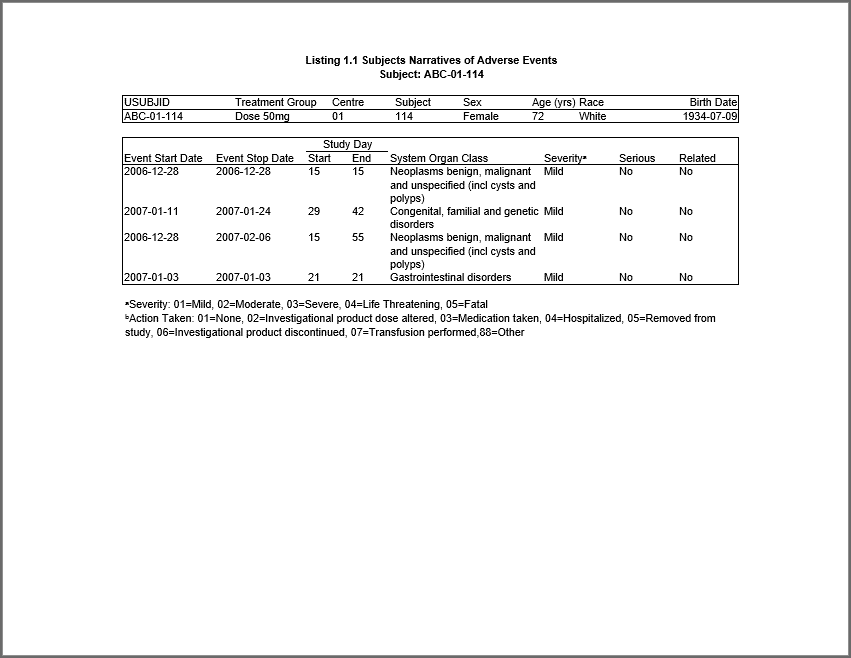
</a>
<br>

* **[Example 9](https://gallery.r-sassy.org/articles/sassy-forest.html)**: 
Creates a figure with a forest plot.
<a href="https://gallery.r-sassy.org/articles/sassy-forest.html">
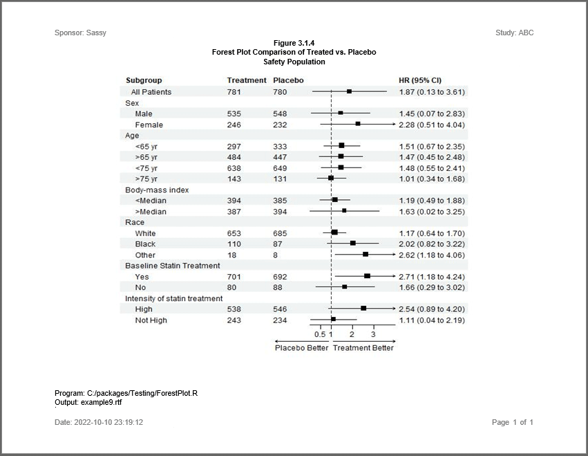
</a>
<br>

* **[Example 10](https://gallery.r-sassy.org/articles/sassy-ds.html)**: 
Creates a subject disposition table.
<a href="https://gallery.r-sassy.org/articles/sassy-ds.html">
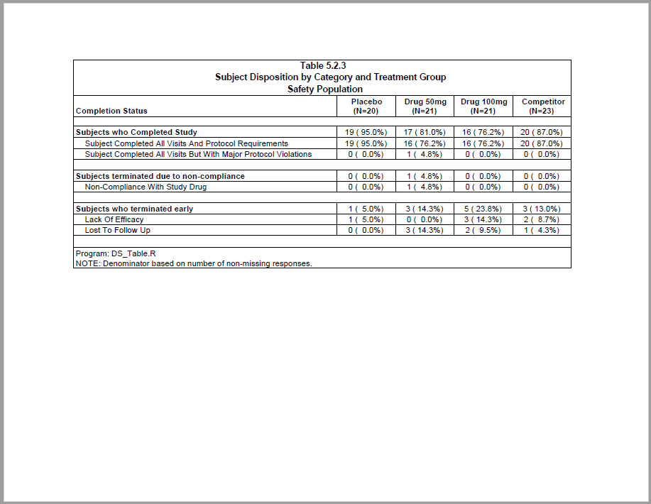
</a>
<br>

* **[Example 11](https://gallery.r-sassy.org/articles/sassy-plisting.html)**: 
Creates a subject listing with vital signs by visit.
<a href="https://gallery.r-sassy.org/articles/sassy-plisting.html">
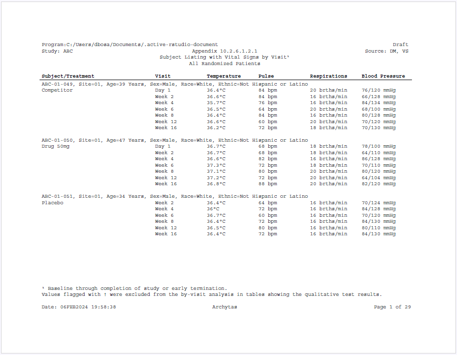
</a>
<br>

* **[Example 12](https://gallery.r-sassy.org/articles/sassy-pfigure.html)**: 
Creates a combined figure of age groups by treatment.
<a href="https://gallery.r-sassy.org/articles/sassy-pfigure.html">
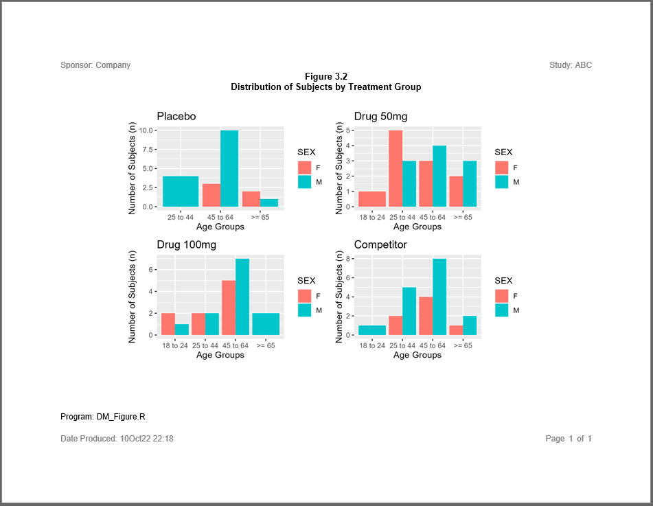
</a>
<br>

* **[Example 13](https://gallery.r-sassy.org/articles/sassy-chgbase.html)**: 
Creates a Mean Change from Baseline figure for laboratory values.
<a href="https://gallery.r-sassy.org/articles/sassy-chgbase.html">
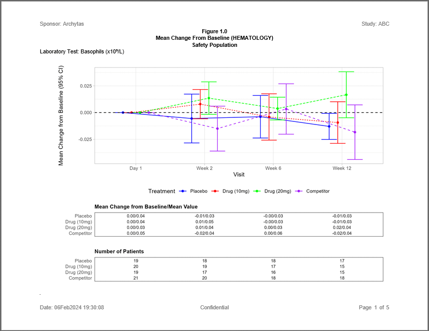
</a>
<br>

* **[Example 14](https://gallery.r-sassy.org/articles/sassy-ae2.html)**: 
Creates an AE table with severity grades in rows
<a href="https://gallery.r-sassy.org/articles/sassy-ae2.html">
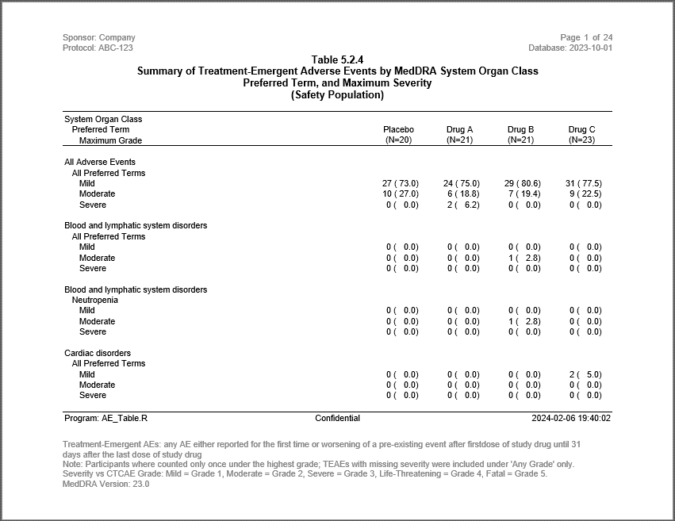
</a>
<br>

* **[Example 15](https://gallery.r-sassy.org/articles/sassy-intext.html)**: 
Creates both stand-alone and "intext" versions of a demographics table. 
<a href="https://gallery.r-sassy.org/articles/sassy-intext.html">
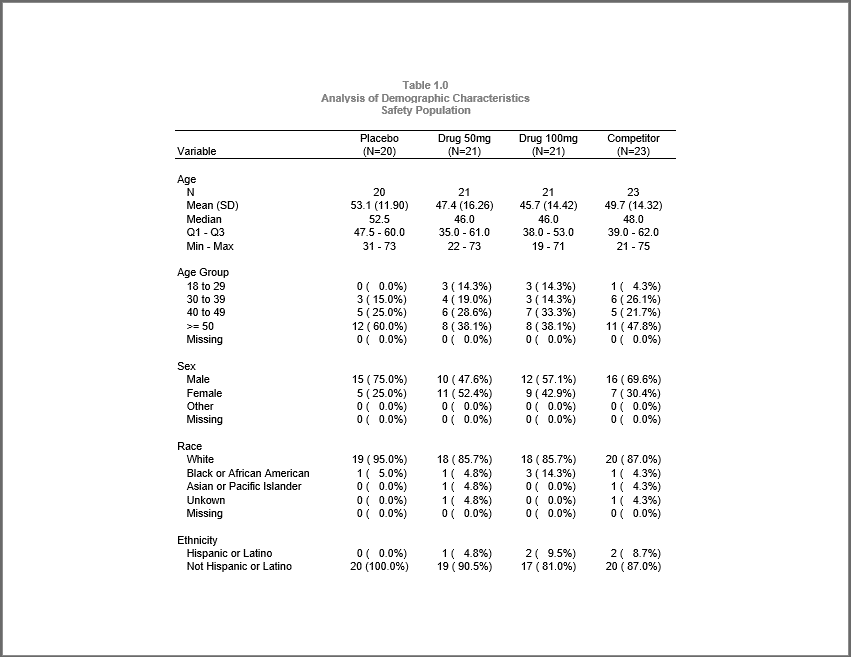
</a>
<br>


* **[Example 16](https://gallery.r-sassy.org/articles/sassy-shift.html)**: 
Creates a shift table of lab values. 
<a href="https://gallery.r-sassy.org/articles/sassy-shift.html">
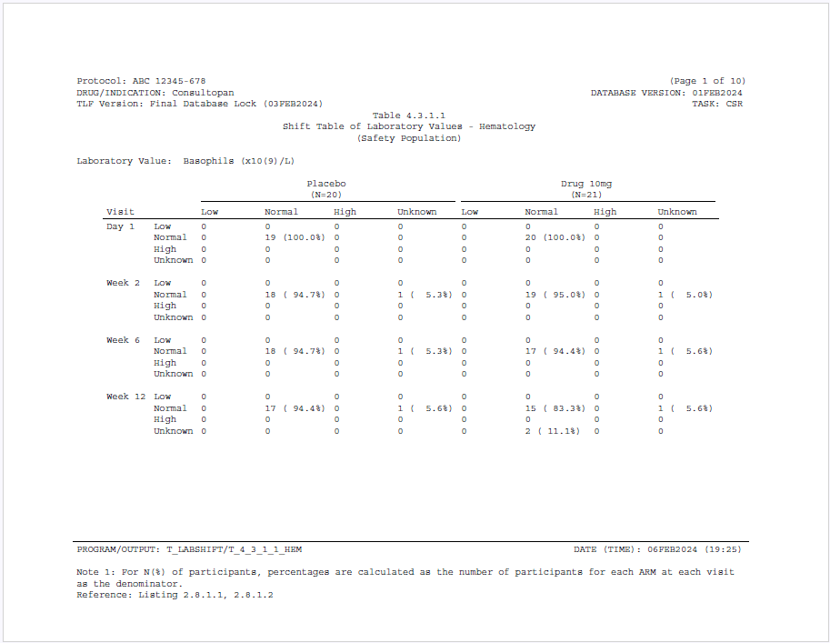
</a>
<br>

Once you review these examples, please proceed to the package links above to
explore the system further!


