```{r, include = FALSE}
knitr::opts_chunk$set(
  collapse = TRUE,
  comment = "#>"
)
```

To understand the system better, let's look at some examples. These examples 
will give you a feel for the overall flow of a **sassy**-enhanced program, 
and allow you to see how the functions work together.

## Index{#top}

* [Example 1: Listing](#listing)
* [Example 2: Demographics table](#demog)
* [Example 3: Figure](#figure)
* [Example 4: Adverse events table](#aetable)
* [Example 5: Vital signs table](#vstable)
* [Example 6: Figure with by group](#figureby)
* [Example 7: Survival analysis](#survival)
* [Example 8: Patient profile](#pprofile)
* [Example 9: Forest plot](#forest)
* [Example 10: Disposition table](#disp)
* [Example 11: Subject listing](#subjlst)
* [Example 12: Combined figure](#combfig)
* [Example 13: Mean change from baseline figure](#changefig)
* [Example 14: AE severity in rows](#aesev)
* [Example 15: Intext table](#intext)
* [Example 16: Shift table](#shift)
* [Example 17: Macro program](#macro)
* [Example 18: Chinese font](#simsun)

## Gallery

### [Example 1](https://gallery.r-sassy.org/articles/sassy-listing.html) {#listing} 
Creates a simple data listing and log. 
<a href="https://gallery.r-sassy.org/articles/sassy-listing.html">
 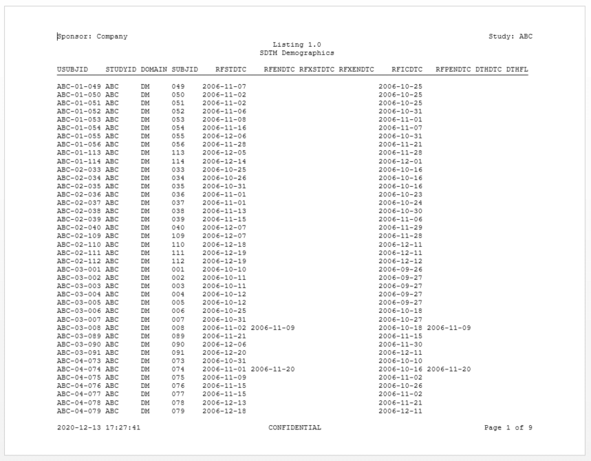
 </a> 
<br> 
[top](#top)

### [Example 2](https://gallery.r-sassy.org/articles/sassy-dm.html) {#demog}
Creates a table of demographic characteristics.
<a href="https://gallery.r-sassy.org/articles/sassy-dm.html">
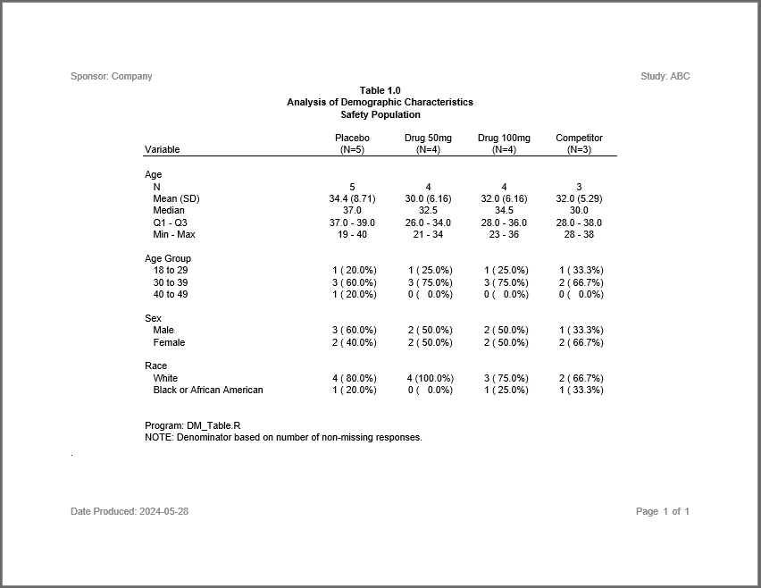
</a>
<br>
[top](#top)

### [Example 3](https://gallery.r-sassy.org/articles/sassy-figure.html) {#figure}  
Creates a simple figure. 
<a href="https://gallery.r-sassy.org/articles/sassy-figure.html">
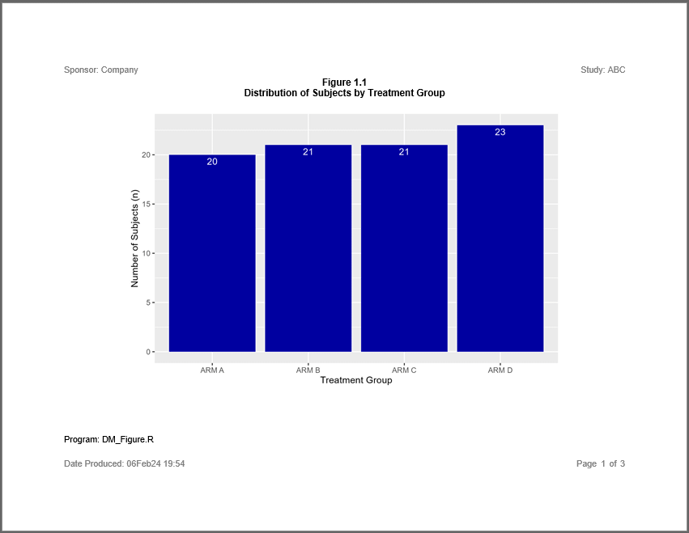
</a>
<br>
[top](#top)

### [Example 4](https://gallery.r-sassy.org/articles/sassy-ae.html) {#aetable}  
Creates an AE table with a page wrap. 
<a href="https://gallery.r-sassy.org/articles/sassy-ae.html">
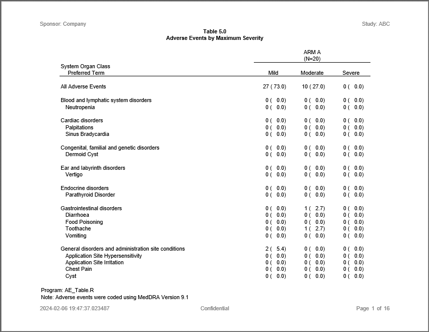
</a>
<br>
[top](#top)

### [Example 5](https://gallery.r-sassy.org/articles/sassy-vs.html) {#vstable}  
Creates a table of vital signs statistics.
<a href="https://gallery.r-sassy.org/articles/sassy-vs.html">
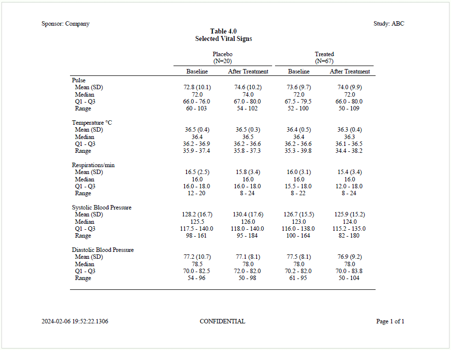
</a>
<br>
[top](#top)

### [Example 6](https://gallery.r-sassy.org/articles/sassy-figureby.html) {#figureby}
Creates a figure with a by-group. 
<a href="https://gallery.r-sassy.org/articles/sassy-figureby.html">
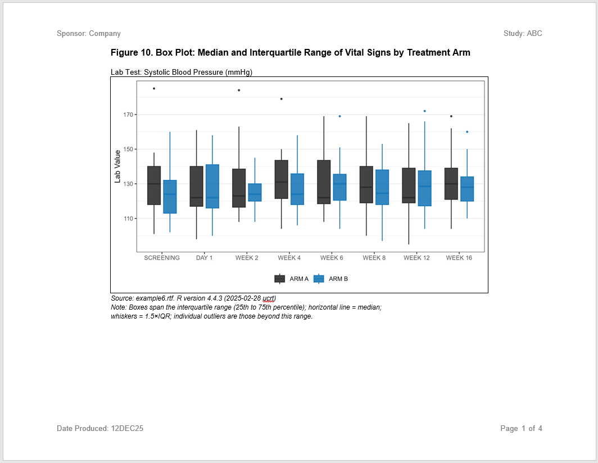
</a>
<br>
[top](#top)

### [Example 7](https://gallery.r-sassy.org/articles/sassy-survival.html) {#survival}  
Perform survival analysis. 
<a href="https://gallery.r-sassy.org/articles/sassy-survival.html">
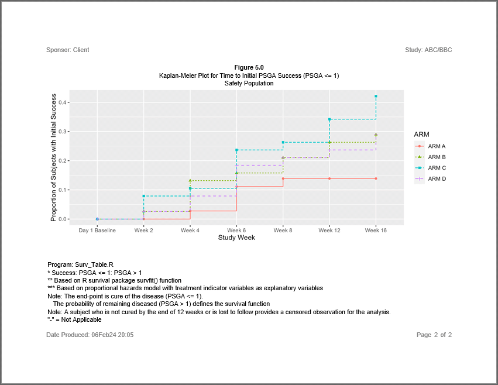
</a>
<br>
[top](#top)

### [Example 8](https://gallery.r-sassy.org/articles/sassy-profile.html) {#pprofile}
Creates a patient profile report. 
<a href="https://gallery.r-sassy.org/articles/sassy-profile.html">
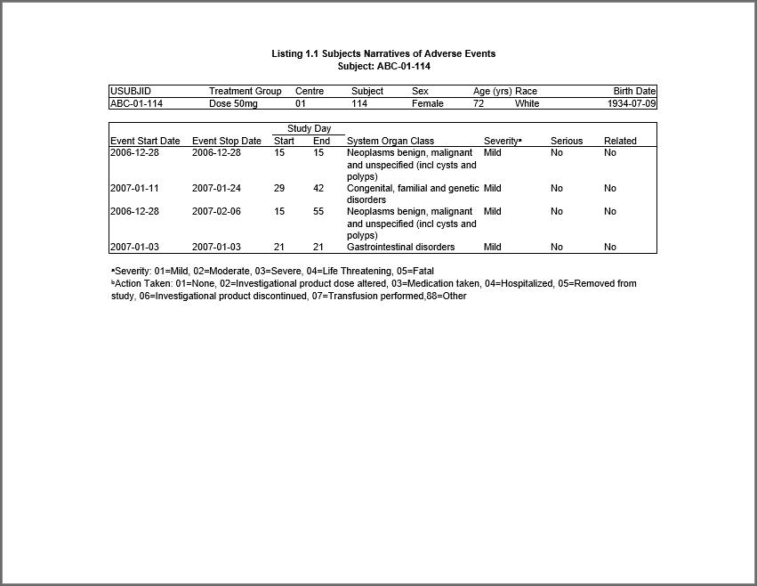
</a>
<br>
[top](#top)

### [Example 9](https://gallery.r-sassy.org/articles/sassy-forest.html) {#forest}  
Creates a figure with a forest plot.
<a href="https://gallery.r-sassy.org/articles/sassy-forest.html">
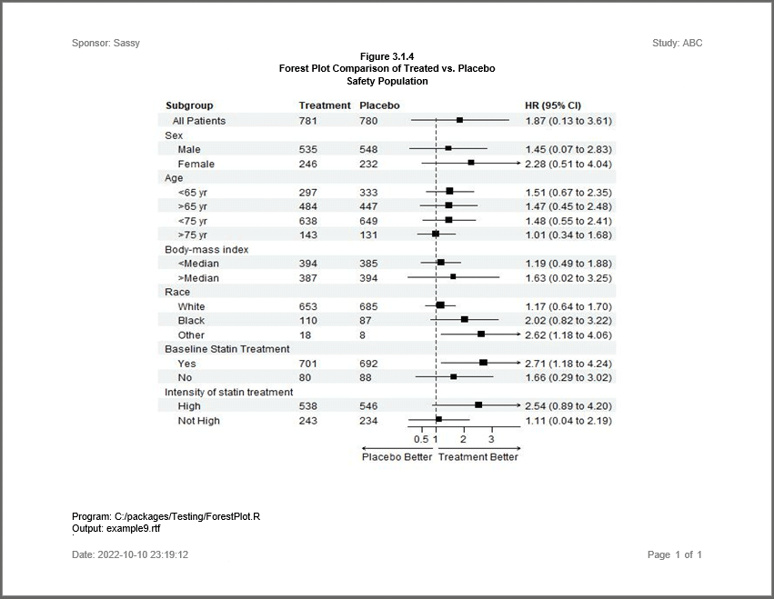
</a>
<br>
[top](#top)

### [Example 10](https://gallery.r-sassy.org/articles/sassy-ds.html) {#disp}  
Creates a subject disposition table.
<a href="https://gallery.r-sassy.org/articles/sassy-ds.html">
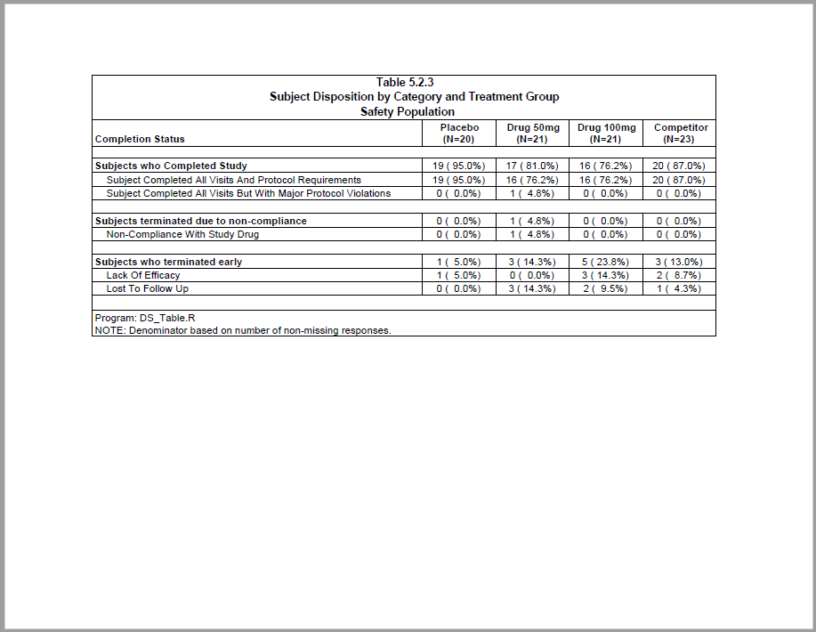
</a>
<br>
[top](#top)

### [Example 11](https://gallery.r-sassy.org/articles/sassy-plisting.html) {#subjlst}
Creates a subject listing with vital signs by visit. 
<a href="https://gallery.r-sassy.org/articles/sassy-plisting.html">
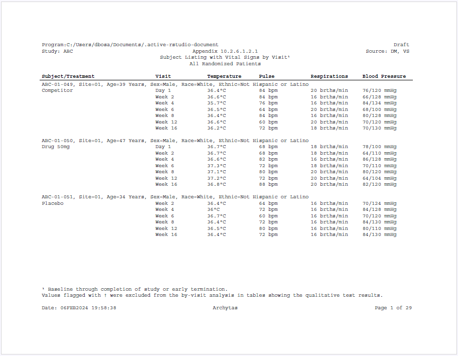
</a>
<br>
[top](#top)

### [Example 12](https://gallery.r-sassy.org/articles/sassy-pfigure.html) {#combfig}  
Creates a combined figure of age groups by treatment.
<a href="https://gallery.r-sassy.org/articles/sassy-pfigure.html">
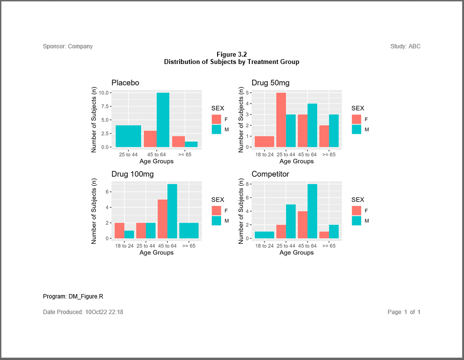
</a>
<br>
[top](#top)

### [Example 13](https://gallery.r-sassy.org/articles/sassy-chgbase.html) {#changefig}  
Creates a Mean Change from Baseline figure for laboratory values. 
<a href="https://gallery.r-sassy.org/articles/sassy-chgbase.html">
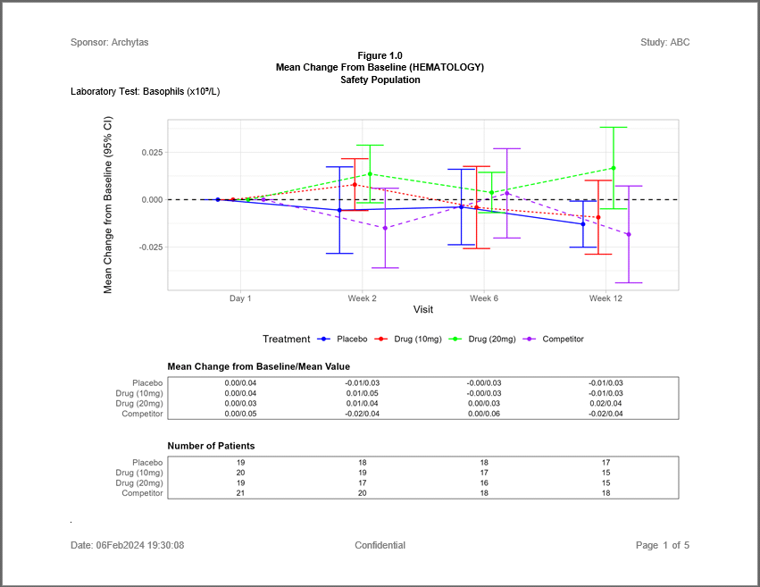
</a>
<br>
[top](#top)

### [Example 14](https://gallery.r-sassy.org/articles/sassy-ae2.html) {#aesev}  
Creates an AE table with severity grades in rows. 
<a href="https://gallery.r-sassy.org/articles/sassy-ae2.html">
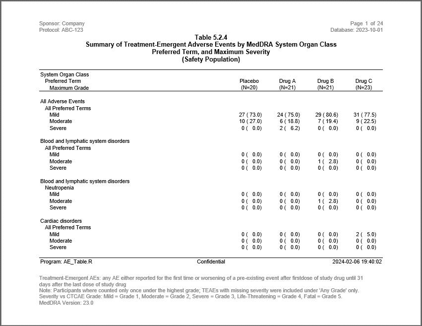
</a>
<br>
[top](#top)

### [Example 15](https://gallery.r-sassy.org/articles/sassy-intext.html) {#intext} 
Creates both stand-alone and "intext" versions of a demographics table. 
<a href="https://gallery.r-sassy.org/articles/sassy-intext.html">
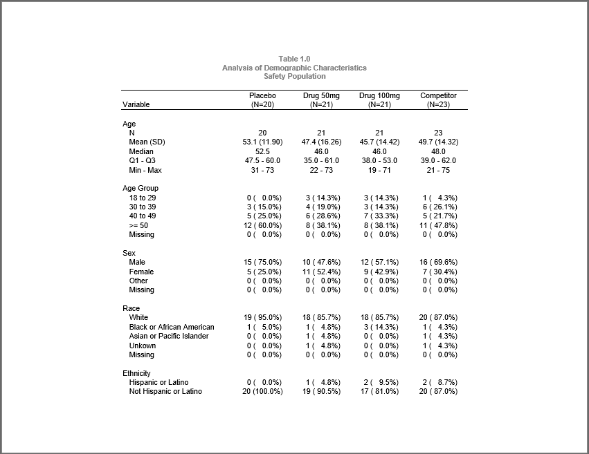
</a>
<br>
[top](#top)


### [Example 16](https://gallery.r-sassy.org/articles/sassy-shift.html) {#shift}  
Creates a shift table of lab values. 
<a href="https://gallery.r-sassy.org/articles/sassy-shift.html">
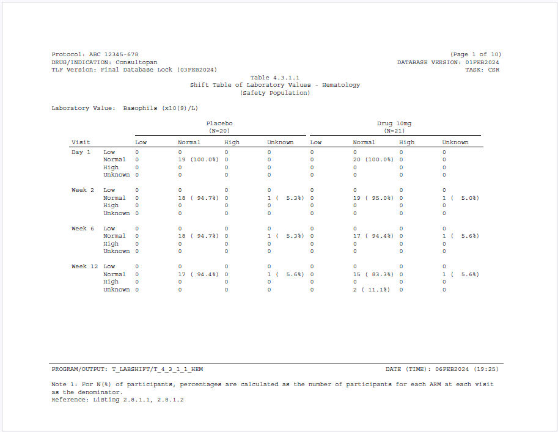
</a>
<br>
[top](#top)

### [Example 17](https://gallery.r-sassy.org/articles/sassy-macro.html) {#macro}  
Creates a change from baseline table using SASSY Macro. 
<a href="https://gallery.r-sassy.org/articles/sassy-macro.html">
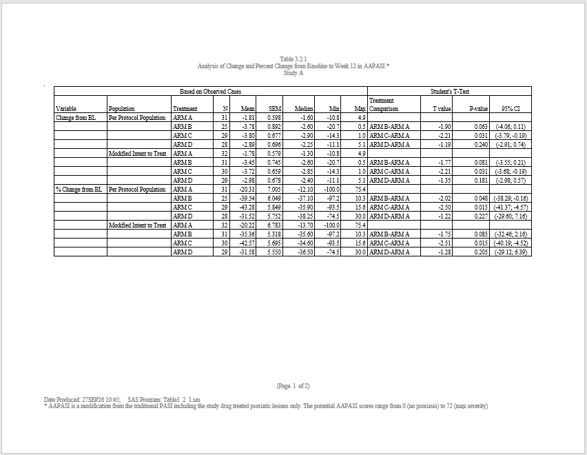
</a>
<br>
[top](#top)


### [Example 18](https://gallery.r-sassy.org/articles/sassy-simsun.html) {#simsun}  
Creates a demographics table in Chinese. 
<a href="https://gallery.r-sassy.org/articles/sassy-simsun.html">
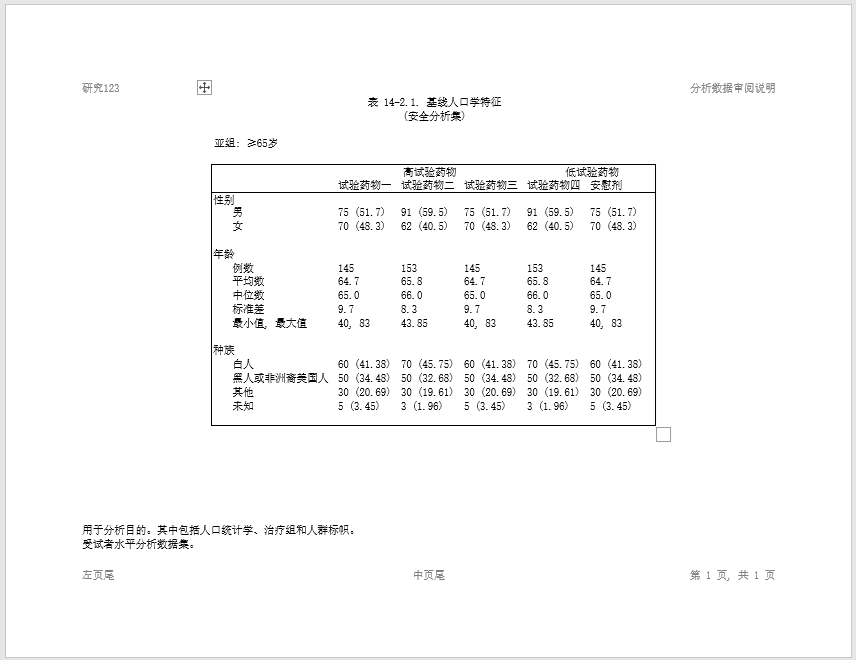
</a>
<br>
[top](#top)


