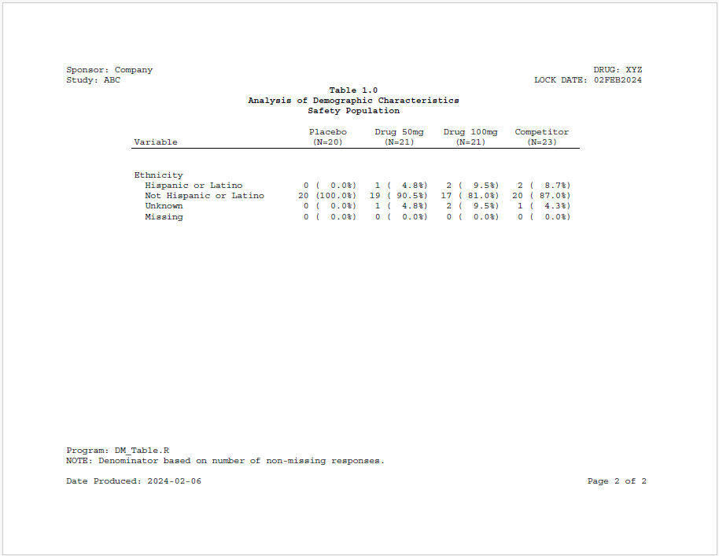
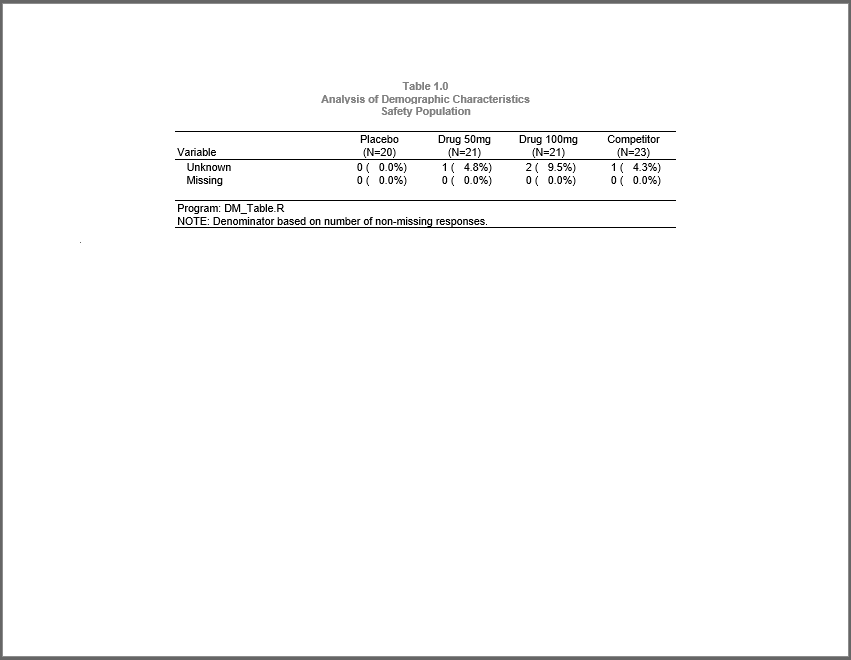

```{r setup, include = FALSE}
knitr::opts_chunk$set(
  collapse = TRUE,
  comment = "#>"
)
```
This example produces both stand-alone and "intext" versions of a simple 
demographics summary table. The stand-alone version
is created in PDF and contains page header and footer information. Also, the 
titles are in the body of the table.  The "intext" version is created in RTF
and the page headers and footers have been removed.  Additionally, the titles
have been moved to the page header.  The purpose of this arrangement is so
that the table can be easily copied to another document for medical writing.

## Program

Note the following about this example:

  * Formats are created with the `as.factor = TRUE` parameter to allow
  non-alphabetic sorting and to show all frequency categories.
  * The analysis is the same for both stand-alone and "intext" reports.
  * Separate reporting calls are performed for each version of the report
  to comply with the different layout requirements.
  * The `continuous = TRUE` parameter has been set on the "intext" table
  to create one continuous table instead of separate tables for each page.


```{r eval=FALSE, echo=TRUE}
library(sassy)

# Prepare Log -------------------------------------------------------------


options("logr.autolog" = TRUE,
        "logr.on" = TRUE,
        "logr.notes" = FALSE,
        "procs.print" = FALSE)

# Get temp directory
tmp <- tempdir()

# Open log
lf <- log_open(file.path(tmp, "example15.log"))


# Prepare formats ---------------------------------------------------------

sep("Prepare formats")

put("Age categories")
agecat <- value(condition(is.na(x), "Missing", 5),
                condition(x >= 18 & x <= 29, "18 to 29", 1),
                condition(x >=30 & x <= 39, "30 to 39", 2),
                condition(x >=40 & x <=49, "40 to 49", 3),
                condition(x >= 50, ">= 50", 4),
                as.factor = TRUE) 

put("Sex decodes")
fmt_sex <- value(condition(is.na(x), "Missing", 4),
                 condition(x == "M", "Male", 1),
                 condition(x == "F", "Female", 2),
                 condition(TRUE, "Other", 3), 
                 as.factor = TRUE) 

put("Race decodes")
fmt_race <- value(condition(is.na(x), "Missing", 5),
                  condition(x == "WHITE", "White", 1),
                  condition(x == "BLACK OR AFRICAN AMERICAN", "Black or African American", 2),
                  condition(x == "ASIAN", "Asian or Pacific Islander", 3),
                  condition(TRUE, "Unkown", 4), 
                  as.factor = TRUE)

put("Ethnic decodes")
fmt_ethnic <- value(condition(is.na(x), "Missing", 4),
                    condition(x == "HISPANIC OR LATINO", "Hispanic or Latino", 1),
                    condition(x == "NOT HISPANIC OR LATINO", "Not Hispanic or Latino", 2),
                    condition(x == "UNKNOWN", "Unknown", 3), 
                    as.factor = TRUE) 

put("ARM decodes")
fmt_arm <- value(condition(x == "ARM A", "Placebo"),
                 condition(x == "ARM B", "Drug 10mg"),
                 condition(x == "ARM C", "Drug 20mg"),
                 condition(x == "ARM D", "Competitor"))

put("Compile format catalog")
fc <- fcat(MEAN = "%.1f", STD = "(%.2f)", 
           Q1 = "%.1f", Q3 = "%.1f",
           MIN = "%d", MAX = "%d", 
           CNT = "%2d", PCT = "(%5.1f%%)") 


# Load and Prepare Data ---------------------------------------------------

sep("Prepare Data")

# Get sample data path
pth <- system.file("extdata", package = "sassy")

put("Open data library")
libname(sdtm, pth, "csv")

put("Extract DM dataset")
datdm <- subset(sdtm$DM, ARM != 'SCREEN FAILURE')

put("Apply formats")
datdm$AGECAT <- fapply(datdm$AGE, agecat) 
datdm$SEXF <- fapply(datdm$SEX, fmt_sex)
datdm$RACEF <- fapply(datdm$RACE, fmt_race)
datdm$ARMF <- fapply(datdm$ARM, fmt_arm)
datdm$ETHNICF <- fapply(datdm$ETHNIC, fmt_ethnic)

put("Get ARM population counts")
proc_freq(datdm, tables = ARM, 
          output = long,
          options = v(nopercent, nonobs)) -> arm_pop

# Age Summary Block -------------------------------------------------------

sep("Create summary statistics for age")

put("Call means procedure to get summary statistics for age")
proc_means(datdm, var = AGE,
           stats = v(n, mean, std, median, q1, q3, min, max),
           by = ARM, 
           options = v(notype, nofreq)) -> age_stats 

put("Combine stats")
datastep(age_stats, 
         format = fc,
         drop = find.names(age_stats, start = 4), 
         {
           `Mean (SD)` <- fapply2(MEAN, STD)
           Median <- MEDIAN
           `Q1 - Q3` <- fapply2(Q1, Q3, sep = " - ")
           `Min - Max` <- fapply2(MIN, MAX, sep = " - ")
           
           
         }) -> age_comb

put("Transpose ARMs into columns")
proc_transpose(age_comb, 
               var = names(age_comb),
               copy = VAR, id = BY, 
               name = LABEL) -> age_block


# Age Group Block ----------------------------------------------------------

sep("Create frequency counts for Age Group")


put("Get age group frequency counts")
proc_freq(datdm,
          table = AGECAT,
          by = ARM,
          options = nonobs) -> ageg_freq

put("Combine counts and percents and assign age group factor for sorting")
datastep(ageg_freq,
         format = fc,
         keep = v(VAR, LABEL, BY, CNTPCT),
         {
           CNTPCT <- fapply2(CNT, PCT)
           LABEL <- CAT
         }) -> ageg_comb

put("Tranpose age group block")
proc_transpose(ageg_comb,
               var = CNTPCT,
               copy = VAR,
               id = BY,
               by = LABEL, 
               options = noname) -> ageg_block

# Sex Block ---------------------------------------------------------------

sep("Create frequency counts for SEX")

put("Get sex frequency counts")
proc_freq(datdm, tables = SEXF,
          by = ARM,
          options = nonobs) -> sex_freq 


put("Combine counts and percents.")
datastep(sex_freq, 
         format = fc, 
         rename = list(CAT = "LABEL"),
         drop = v(CNT, PCT), 
         {
           
           CNTPCT <- fapply2(CNT, PCT)
           
         }) -> sex_comb 

put("Transpose ARMs into columns")
proc_transpose(sex_comb, id = BY, 
               var = CNTPCT,
               copy = VAR, by = LABEL,
               options = noname) -> sex_block


# Race block --------------------------------------------------------------


sep("Create frequency counts for RACE")

put("Get race frequency counts")
proc_freq(datdm, tables = RACEF,
          by = ARM,
          options = nonobs) -> race_freq 


put("Combine counts and percents.")
datastep(race_freq, 
         format = fc, 
         rename = list(CAT = "LABEL"),
         drop = v(CNT, PCT), 
         {
           
           CNTPCT <- fapply2(CNT, PCT)
           
         }) -> race_comb 

put("Transpose ARMs into columns")
proc_transpose(race_comb, id = BY, var = CNTPCT,
               copy = VAR, by = LABEL, 
               options = noname) -> race_block


# Ethnic Block ---------------------------------------------------------------

sep("Create frequency counts for ETHNIC")

put("Get ethnic frequency counts")
proc_freq(datdm, tables = ETHNICF,
          by = ARM,
          options = nonobs) -> ethnic_freq

put("Combine counts and percents.")
datastep(ethnic_freq, format = fc, 
         rename = list(CAT = "LABEL"),
         drop = v(CNT, PCT), 
         {
           CNTPCT <- fapply2(CNT, PCT)
         }) -> ethnic_comb

put("Transpose ARMs into columns")
proc_transpose(ethnic_comb, id = BY, 
               var = CNTPCT,
               copy = VAR, by = LABEL,
               options = noname) -> ethnic_block


# Prepare final dataset ---------------------------------------------------

put("Combine blocks into final data frame")
datastep(age_block, 
         set = list(ageg_block, sex_block, race_block, ethnic_block),
         {}) -> final

# Report ------------------------------------------------------------------


var_fmt <- c("AGE" = "Age", "AGECAT" = "Age Group", "SEXF" = "Sex", 
             "RACEF" = "Race", "ETHNICF" = "Ethnicity")

sep("Create and print stand-alone report")

# Create Table
tbl1 <- create_table(final, first_row_blank = TRUE) |>  
  column_defaults(from = `ARM A`, to = `ARM D`, align = "center", width = 1.1) |>  
  stub(vars = c("VAR", "LABEL"), "Variable", width = 2.5) |>  
  define(VAR, blank_after = TRUE, dedupe = TRUE, label = "Variable",
         format = var_fmt,label_row = TRUE) |>  
  define(LABEL, indent = .25, label = "Demographic Category") |> 
  define(`ARM A`,  label = "Placebo", n = arm_pop["ARM A"]) |>  
  define(`ARM B`,  label = "Drug 50mg", n = arm_pop["ARM B"]) |>  
  define(`ARM C`,  label = "Drug 100mg", n = arm_pop["ARM C"]) |>  
  define(`ARM D`,  label = "Competitor", n = arm_pop["ARM D"]) |>  
  titles("Table 1.0", "Analysis of Demographic Characteristics", 
         "Safety Population", bold = TRUE) |> 
  footnotes("Program: DM_Table.R",
            "NOTE: Denominator based on number of non-missing responses.",
            valign = "bottom", align = "left") 

rpt1 <- create_report(file.path(tmp, "example15s"), 
                     output_type = "PDF", 
                     font = "Courier") |> 
  page_header(c("Sponsor: Company", "Study: ABC"), 
              right = c("DRUG: XYZ", "LOCK DATE: 02FEB2024")) |> 
  set_margins(top = 1, bottom = 1) |>  
  add_content(tbl1) |> 
  page_footer("Date Produced: {Sys.Date()}", right = "Page [pg] of [tpg]")

put("Write out the report")
res1 <- write_report(rpt1)


sep("Create and print intext report")

# Create Table
tbl2 <- create_table(final, first_row_blank = TRUE, continuous = TRUE, 
                     borders = c("top"), width = 6.5) |>  
  column_defaults(from = `ARM A`, to = `ARM D`, align = "center", width = 1.1) |>  
  stub(vars = c("VAR", "LABEL"), "Variable") |>  
  define(VAR, blank_after = TRUE, dedupe = TRUE, label = "Variable",
         format = var_fmt,label_row = TRUE) |>  
  define(LABEL, indent = .25, label = "Demographic Category") |> 
  define(`ARM A`,  label = "Placebo", n = arm_pop["ARM A"]) |>  
  define(`ARM B`,  label = "Drug 50mg", n = arm_pop["ARM B"]) |>  
  define(`ARM C`,  label = "Drug 100mg", n = arm_pop["ARM C"]) |>  
  define(`ARM D`,  label = "Competitor", n = arm_pop["ARM D"]) |>  

  footnotes("Program: DM_Table.R",
            "NOTE: Denominator based on number of non-missing responses.",
            borders = c("top", "bottom"), blank_row = "none") 

rpt2 <- create_report(file.path(tmp, "example15i"), 
                     output_type = "RTF", 
                     font = "Arial", orientation = "landscape") |> 
  set_margins(top = 1, bottom = 1) |>  
  add_content(tbl2) |>   
  titles("Table 1.0", "Analysis of Demographic Characteristics", 
         "Safety Population", bold = TRUE, header = TRUE) 


put("Write out the report")
res2 <- write_report(rpt2)

# Clean Up ----------------------------------------------------------------
sep("Clean Up")

put("Close log")
log_close()


# Uncomment to view report
# file.show(res1$modified_path)

# Uncomment to view report
# file.show(res2$modified_path)

# Uncomment to view log
# file.show(lf)

```

## Output

Here is the stand-alone report:




Here is the "intext" report:





## Log

And here is the log:

```
=========================================================================
Log Path: C:/Users/dbosa/AppData/Local/Temp/RtmpiOUehg/log/example15.log
Program Path: C:/packages/Testing/sassytests/Intext.R
Working Directory: C:/packages/Testing
User Name: dbosa
R Version: 4.3.2 (2023-10-31 ucrt)
Machine: SOCRATES x86-64
Operating System: Windows 10 x64 build 22621
Base Packages: stats graphics grDevices utils datasets methods base 
Other Packages: tidylog_1.0.2 procs_1.0.5 reporter_1.4.4 libr_1.2.9 logr_1.3.5
fmtr_1.6.2 common_1.1.1 sassy_1.2.1
Log Start Time: 2024-02-03 13:05:46.15931
=========================================================================

=========================================================================
Prepare formats
=========================================================================

Age categories

# A user-defined format: 5 conditions
- as.factor: TRUE
  Name Type        Expression    Label Order
1  obj    U          is.na(x)  Missing     5
2  obj    U x >= 18 & x <= 29 18 to 29     1
3  obj    U x >= 30 & x <= 39 30 to 39     2
4  obj    U x >= 40 & x <= 49 40 to 49     3
5  obj    U           x >= 50    >= 50     4

Sex decodes

# A user-defined format: 4 conditions
- as.factor: TRUE
  Name Type Expression   Label Order
1  obj    U   is.na(x) Missing     4
2  obj    U   x == "M"    Male     1
3  obj    U   x == "F"  Female     2
4  obj    U       TRUE   Other     3

Race decodes

# A user-defined format: 5 conditions
- as.factor: TRUE
  Name Type                       Expression                     Label Order
1  obj    U                         is.na(x)                   Missing     5
2  obj    U                     x == "WHITE"                     White     1
3  obj    U x == "BLACK OR AFRICAN AMERICAN" Black or African American     2
4  obj    U                     x == "ASIAN" Asian or Pacific Islander     3
5  obj    U                             TRUE                    Unkown     4

Ethnic decodes

# A user-defined format: 4 conditions
- as.factor: TRUE
  Name Type                    Expression                  Label Order
1  obj    U                      is.na(x)                Missing     4
2  obj    U     x == "HISPANIC OR LATINO"     Hispanic or Latino     1
3  obj    U x == "NOT HISPANIC OR LATINO" Not Hispanic or Latino     2
4  obj    U                x == "UNKNOWN"                Unknown     3

ARM decodes

# A user-defined format: 4 conditions
  Name Type   Expression      Label Order
1  obj    U x == "ARM A"    Placebo    NA
2  obj    U x == "ARM B"  Drug 10mg    NA
3  obj    U x == "ARM C"  Drug 20mg    NA
4  obj    U x == "ARM D" Competitor    NA

Compile format catalog

# A format catalog: 8 formats
- $MEAN: type S, "%.1f"
- $STD: type S, "(%.2f)"
- $Q1: type S, "%.1f"
- $Q3: type S, "%.1f"
- $MIN: type S, "%d"
- $MAX: type S, "%d"
- $CNT: type S, "%2d"
- $PCT: type S, "(%5.1f%%)"

=========================================================================
Prepare Data
=========================================================================

Open data library

# library 'sdtm': 7 items
- attributes: csv not loaded
- path: C:/Users/dbosa/AppData/Local/R/win-library/4.3/sassy/extdata
- items:
  Name Extension Rows Cols     Size        LastModified
1   AE       csv  150   27  88.5 Kb 2023-09-30 23:58:49
2   DM       csv   87   24  45.5 Kb 2023-09-30 23:58:49
3   DS       csv  174    9  34.1 Kb 2023-09-30 23:58:49
4   EX       csv   84   11  26.4 Kb 2023-09-30 23:58:49
5   IE       csv    2   14  13.4 Kb 2023-09-30 23:58:49
6   SV       csv  685   10  70.3 Kb 2023-09-30 23:58:49
7   VS       csv 3358   17 467.4 Kb 2023-09-30 23:58:49

Extract DM dataset

Apply formats

Get ARM population counts

proc_freq: input data set 85 rows and 29 columns
           tables: ARM
           output: long
           view: TRUE
           output: 1 datasets

# A tibble: 1 × 6
  VAR   STAT  `ARM A` `ARM B` `ARM C` `ARM D`
  <chr> <chr>   <dbl>   <dbl>   <dbl>   <dbl>
1 ARM   CNT        20      21      21      23

=========================================================================
Create summary statistics for age
=========================================================================

Call means procedure to get summary statistics for age

proc_means: input data set 85 rows and 29 columns
            by: ARM
            var: AGE
            stats: n mean std median q1 q3 min max
            view: TRUE
            output: 1 datasets

     BY VAR  N     MEAN      STD MEDIAN   Q1 Q3 MIN MAX
1 ARM A AGE 20 53.15000 11.89991   52.5 47.5 60  31  73
2 ARM B AGE 21 47.38095 16.25877   46.0 35.0 61  22  73
3 ARM C AGE 21 45.71429 14.41923   46.0 38.0 53  19  71
4 ARM D AGE 23 49.73913 14.32486   48.0 39.0 62  21  75

Combine stats

datastep: columns decreased from 10 to 7

     BY VAR  N    Mean (SD) Median     Q1 - Q3 Min - Max
1 ARM A AGE 20 53.1 (11.90)   52.5 47.5 - 60.0   31 - 73
2 ARM B AGE 21 47.4 (16.26)   46.0 35.0 - 61.0   22 - 73
3 ARM C AGE 21 45.7 (14.42)   46.0 38.0 - 53.0   19 - 71
4 ARM D AGE 23 49.7 (14.32)   48.0 39.0 - 62.0   21 - 75

Transpose ARMs into columns

proc_transpose: input data set 4 rows and 7 columns
                var: BY VAR N Mean (SD) Median Q1 - Q3 Min - Max
                id: BY
                copy: VAR
                name: LABEL
                output dataset 5 rows and 6 columns

  VAR     LABEL        ARM A        ARM B        ARM C        ARM D
1 AGE         N           20           21           21           23
2 AGE Mean (SD) 53.1 (11.90) 47.4 (16.26) 45.7 (14.42) 49.7 (14.32)
3 AGE    Median         52.5         46.0         46.0         48.0
4 AGE   Q1 - Q3  47.5 - 60.0  35.0 - 61.0  38.0 - 53.0  39.0 - 62.0
5 AGE Min - Max      31 - 73      22 - 73      19 - 71      21 - 75

=========================================================================
Create frequency counts for Age Group
=========================================================================

Get age group frequency counts

proc_freq: input data set 85 rows and 29 columns
           tables: AGECAT
           by: ARM
           view: TRUE
           output: 1 datasets

# A tibble: 20 × 5
   BY    VAR    CAT        CNT   PCT
   <chr> <chr>  <ord>    <dbl> <dbl>
 1 ARM A AGECAT 18 to 29     0  0   
 2 ARM A AGECAT 30 to 39     3 15   
 3 ARM A AGECAT 40 to 49     5 25   
 4 ARM A AGECAT >= 50       12 60   
 5 ARM A AGECAT Missing      0  0   
 6 ARM B AGECAT 18 to 29     3 14.3 
 7 ARM B AGECAT 30 to 39     4 19.0 
 8 ARM B AGECAT 40 to 49     6 28.6 
 9 ARM B AGECAT >= 50        8 38.1 
10 ARM B AGECAT Missing      0  0   
11 ARM C AGECAT 18 to 29     3 14.3 
12 ARM C AGECAT 30 to 39     3 14.3 
13 ARM C AGECAT 40 to 49     7 33.3 
14 ARM C AGECAT >= 50        8 38.1 
15 ARM C AGECAT Missing      0  0   
16 ARM D AGECAT 18 to 29     1  4.35
17 ARM D AGECAT 30 to 39     6 26.1 
18 ARM D AGECAT 40 to 49     5 21.7 
19 ARM D AGECAT >= 50       11 47.8 
20 ARM D AGECAT Missing      0  0   

Combine counts and percents and assign age group factor for sorting

datastep: columns decreased from 5 to 4

# A tibble: 20 × 4
   VAR    LABEL    BY    CNTPCT       
   <chr>  <ord>    <chr> <chr>        
 1 AGECAT 18 to 29 ARM A " 0 (  0.0%)"
 2 AGECAT 30 to 39 ARM A " 3 ( 15.0%)"
 3 AGECAT 40 to 49 ARM A " 5 ( 25.0%)"
 4 AGECAT >= 50    ARM A "12 ( 60.0%)"
 5 AGECAT Missing  ARM A " 0 (  0.0%)"
 6 AGECAT 18 to 29 ARM B " 3 ( 14.3%)"
 7 AGECAT 30 to 39 ARM B " 4 ( 19.0%)"
 8 AGECAT 40 to 49 ARM B " 6 ( 28.6%)"
 9 AGECAT >= 50    ARM B " 8 ( 38.1%)"
10 AGECAT Missing  ARM B " 0 (  0.0%)"
11 AGECAT 18 to 29 ARM C " 3 ( 14.3%)"
12 AGECAT 30 to 39 ARM C " 3 ( 14.3%)"
13 AGECAT 40 to 49 ARM C " 7 ( 33.3%)"
14 AGECAT >= 50    ARM C " 8 ( 38.1%)"
15 AGECAT Missing  ARM C " 0 (  0.0%)"
16 AGECAT 18 to 29 ARM D " 1 (  4.3%)"
17 AGECAT 30 to 39 ARM D " 6 ( 26.1%)"
18 AGECAT 40 to 49 ARM D " 5 ( 21.7%)"
19 AGECAT >= 50    ARM D "11 ( 47.8%)"
20 AGECAT Missing  ARM D " 0 (  0.0%)"

Tranpose age group block

proc_transpose: input data set 20 rows and 4 columns
                by: LABEL
                var: CNTPCT
                id: BY
                copy: VAR
                name: NAME
                output dataset 5 rows and 6 columns

# A tibble: 5 × 6
  VAR    LABEL    `ARM A`       `ARM B`       `ARM C`       `ARM D`      
  <chr>  <ord>    <chr>         <chr>         <chr>         <chr>        
1 AGECAT 18 to 29 " 0 (  0.0%)" " 3 ( 14.3%)" " 3 ( 14.3%)" " 1 (  4.3%)"
2 AGECAT 30 to 39 " 3 ( 15.0%)" " 4 ( 19.0%)" " 3 ( 14.3%)" " 6 ( 26.1%)"
3 AGECAT 40 to 49 " 5 ( 25.0%)" " 6 ( 28.6%)" " 7 ( 33.3%)" " 5 ( 21.7%)"
4 AGECAT >= 50    "12 ( 60.0%)" " 8 ( 38.1%)" " 8 ( 38.1%)" "11 ( 47.8%)"
5 AGECAT Missing  " 0 (  0.0%)" " 0 (  0.0%)" " 0 (  0.0%)" " 0 (  0.0%)"

=========================================================================
Create frequency counts for SEX
=========================================================================

Get sex frequency counts

proc_freq: input data set 85 rows and 29 columns
           tables: SEXF
           by: ARM
           view: TRUE
           output: 1 datasets

# A tibble: 16 × 5
   BY    VAR   CAT       CNT   PCT
   <chr> <chr> <ord>   <dbl> <dbl>
 1 ARM A SEXF  Male       15  75  
 2 ARM A SEXF  Female      5  25  
 3 ARM A SEXF  Other       0   0  
 4 ARM A SEXF  Missing     0   0  
 5 ARM B SEXF  Male       10  47.6
 6 ARM B SEXF  Female     11  52.4
 7 ARM B SEXF  Other       0   0  
 8 ARM B SEXF  Missing     0   0  
 9 ARM C SEXF  Male       12  57.1
10 ARM C SEXF  Female      9  42.9
11 ARM C SEXF  Other       0   0  
12 ARM C SEXF  Missing     0   0  
13 ARM D SEXF  Male       16  69.6
14 ARM D SEXF  Female      7  30.4
15 ARM D SEXF  Other       0   0  
16 ARM D SEXF  Missing     0   0  

Combine counts and percents.

datastep: columns decreased from 5 to 4

# A tibble: 16 × 4
   BY    VAR   LABEL   CNTPCT       
   <chr> <chr> <ord>   <chr>        
 1 ARM A SEXF  Male    "15 ( 75.0%)"
 2 ARM A SEXF  Female  " 5 ( 25.0%)"
 3 ARM A SEXF  Other   " 0 (  0.0%)"
 4 ARM A SEXF  Missing " 0 (  0.0%)"
 5 ARM B SEXF  Male    "10 ( 47.6%)"
 6 ARM B SEXF  Female  "11 ( 52.4%)"
 7 ARM B SEXF  Other   " 0 (  0.0%)"
 8 ARM B SEXF  Missing " 0 (  0.0%)"
 9 ARM C SEXF  Male    "12 ( 57.1%)"
10 ARM C SEXF  Female  " 9 ( 42.9%)"
11 ARM C SEXF  Other   " 0 (  0.0%)"
12 ARM C SEXF  Missing " 0 (  0.0%)"
13 ARM D SEXF  Male    "16 ( 69.6%)"
14 ARM D SEXF  Female  " 7 ( 30.4%)"
15 ARM D SEXF  Other   " 0 (  0.0%)"
16 ARM D SEXF  Missing " 0 (  0.0%)"

Transpose ARMs into columns

proc_transpose: input data set 16 rows and 4 columns
                by: LABEL
                var: CNTPCT
                id: BY
                copy: VAR
                name: NAME
                output dataset 4 rows and 6 columns

# A tibble: 4 × 6
  VAR   LABEL   `ARM A`       `ARM B`       `ARM C`       `ARM D`      
  <chr> <ord>   <chr>         <chr>         <chr>         <chr>        
1 SEXF  Male    "15 ( 75.0%)" "10 ( 47.6%)" "12 ( 57.1%)" "16 ( 69.6%)"
2 SEXF  Female  " 5 ( 25.0%)" "11 ( 52.4%)" " 9 ( 42.9%)" " 7 ( 30.4%)"
3 SEXF  Other   " 0 (  0.0%)" " 0 (  0.0%)" " 0 (  0.0%)" " 0 (  0.0%)"
4 SEXF  Missing " 0 (  0.0%)" " 0 (  0.0%)" " 0 (  0.0%)" " 0 (  0.0%)"

=========================================================================
Create frequency counts for RACE
=========================================================================

Get race frequency counts

proc_freq: input data set 85 rows and 29 columns
           tables: RACEF
           by: ARM
           view: TRUE
           output: 1 datasets

# A tibble: 20 × 5
   BY    VAR   CAT                         CNT   PCT
   <chr> <chr> <ord>                     <dbl> <dbl>
 1 ARM A RACEF White                        19 95   
 2 ARM A RACEF Black or African American     1  5   
 3 ARM A RACEF Asian or Pacific Islander     0  0   
 4 ARM A RACEF Unkown                        0  0   
 5 ARM A RACEF Missing                       0  0   
 6 ARM B RACEF White                        18 85.7 
 7 ARM B RACEF Black or African American     1  4.76
 8 ARM B RACEF Asian or Pacific Islander     1  4.76
 9 ARM B RACEF Unkown                        1  4.76
10 ARM B RACEF Missing                       0  0   
11 ARM C RACEF White                        18 85.7 
12 ARM C RACEF Black or African American     3 14.3 
13 ARM C RACEF Asian or Pacific Islander     0  0   
14 ARM C RACEF Unkown                        0  0   
15 ARM C RACEF Missing                       0  0   
16 ARM D RACEF White                        20 87.0 
17 ARM D RACEF Black or African American     1  4.35
18 ARM D RACEF Asian or Pacific Islander     1  4.35
19 ARM D RACEF Unkown                        1  4.35
20 ARM D RACEF Missing                       0  0   

Combine counts and percents.

datastep: columns decreased from 5 to 4

# A tibble: 20 × 4
   BY    VAR   LABEL                     CNTPCT       
   <chr> <chr> <ord>                     <chr>        
 1 ARM A RACEF White                     "19 ( 95.0%)"
 2 ARM A RACEF Black or African American " 1 (  5.0%)"
 3 ARM A RACEF Asian or Pacific Islander " 0 (  0.0%)"
 4 ARM A RACEF Unkown                    " 0 (  0.0%)"
 5 ARM A RACEF Missing                   " 0 (  0.0%)"
 6 ARM B RACEF White                     "18 ( 85.7%)"
 7 ARM B RACEF Black or African American " 1 (  4.8%)"
 8 ARM B RACEF Asian or Pacific Islander " 1 (  4.8%)"
 9 ARM B RACEF Unkown                    " 1 (  4.8%)"
10 ARM B RACEF Missing                   " 0 (  0.0%)"
11 ARM C RACEF White                     "18 ( 85.7%)"
12 ARM C RACEF Black or African American " 3 ( 14.3%)"
13 ARM C RACEF Asian or Pacific Islander " 0 (  0.0%)"
14 ARM C RACEF Unkown                    " 0 (  0.0%)"
15 ARM C RACEF Missing                   " 0 (  0.0%)"
16 ARM D RACEF White                     "20 ( 87.0%)"
17 ARM D RACEF Black or African American " 1 (  4.3%)"
18 ARM D RACEF Asian or Pacific Islander " 1 (  4.3%)"
19 ARM D RACEF Unkown                    " 1 (  4.3%)"
20 ARM D RACEF Missing                   " 0 (  0.0%)"

Transpose ARMs into columns

proc_transpose: input data set 20 rows and 4 columns
                by: LABEL
                var: CNTPCT
                id: BY
                copy: VAR
                name: NAME
                output dataset 5 rows and 6 columns

# A tibble: 5 × 6
  VAR   LABEL                     `ARM A`       `ARM B`       `ARM C`       `ARM D`      
  <chr> <ord>                     <chr>         <chr>         <chr>         <chr>        
1 RACEF White                     "19 ( 95.0%)" "18 ( 85.7%)" "18 ( 85.7%)" "20 ( 87.0%)"
2 RACEF Black or African American " 1 (  5.0%)" " 1 (  4.8%)" " 3 ( 14.3%)" " 1 (  4.3%)"
3 RACEF Asian or Pacific Islander " 0 (  0.0%)" " 1 (  4.8%)" " 0 (  0.0%)" " 1 (  4.3%)"
4 RACEF Unkown                    " 0 (  0.0%)" " 1 (  4.8%)" " 0 (  0.0%)" " 1 (  4.3%)"
5 RACEF Missing                   " 0 (  0.0%)" " 0 (  0.0%)" " 0 (  0.0%)" " 0 (  0.0%)"

=========================================================================
Create frequency counts for ETHNIC
=========================================================================

Get ethnic frequency counts

proc_freq: input data set 85 rows and 29 columns
           tables: ETHNICF
           by: ARM
           view: TRUE
           output: 1 datasets

# A tibble: 16 × 5
   BY    VAR     CAT                      CNT    PCT
   <chr> <chr>   <ord>                  <dbl>  <dbl>
 1 ARM A ETHNICF Hispanic or Latino         0   0   
 2 ARM A ETHNICF Not Hispanic or Latino    20 100   
 3 ARM A ETHNICF Unknown                    0   0   
 4 ARM A ETHNICF Missing                    0   0   
 5 ARM B ETHNICF Hispanic or Latino         1   4.76
 6 ARM B ETHNICF Not Hispanic or Latino    19  90.5 
 7 ARM B ETHNICF Unknown                    1   4.76
 8 ARM B ETHNICF Missing                    0   0   
 9 ARM C ETHNICF Hispanic or Latino         2   9.52
10 ARM C ETHNICF Not Hispanic or Latino    17  81.0 
11 ARM C ETHNICF Unknown                    2   9.52
12 ARM C ETHNICF Missing                    0   0   
13 ARM D ETHNICF Hispanic or Latino         2   8.70
14 ARM D ETHNICF Not Hispanic or Latino    20  87.0 
15 ARM D ETHNICF Unknown                    1   4.35
16 ARM D ETHNICF Missing                    0   0   

Combine counts and percents.

datastep: columns decreased from 5 to 4

# A tibble: 16 × 4
   BY    VAR     LABEL                  CNTPCT       
   <chr> <chr>   <ord>                  <chr>        
 1 ARM A ETHNICF Hispanic or Latino     " 0 (  0.0%)"
 2 ARM A ETHNICF Not Hispanic or Latino "20 (100.0%)"
 3 ARM A ETHNICF Unknown                " 0 (  0.0%)"
 4 ARM A ETHNICF Missing                " 0 (  0.0%)"
 5 ARM B ETHNICF Hispanic or Latino     " 1 (  4.8%)"
 6 ARM B ETHNICF Not Hispanic or Latino "19 ( 90.5%)"
 7 ARM B ETHNICF Unknown                " 1 (  4.8%)"
 8 ARM B ETHNICF Missing                " 0 (  0.0%)"
 9 ARM C ETHNICF Hispanic or Latino     " 2 (  9.5%)"
10 ARM C ETHNICF Not Hispanic or Latino "17 ( 81.0%)"
11 ARM C ETHNICF Unknown                " 2 (  9.5%)"
12 ARM C ETHNICF Missing                " 0 (  0.0%)"
13 ARM D ETHNICF Hispanic or Latino     " 2 (  8.7%)"
14 ARM D ETHNICF Not Hispanic or Latino "20 ( 87.0%)"
15 ARM D ETHNICF Unknown                " 1 (  4.3%)"
16 ARM D ETHNICF Missing                " 0 (  0.0%)"

Transpose ARMs into columns

proc_transpose: input data set 16 rows and 4 columns
                by: LABEL
                var: CNTPCT
                id: BY
                copy: VAR
                name: NAME
                output dataset 4 rows and 6 columns

# A tibble: 4 × 6
  VAR     LABEL                  `ARM A`       `ARM B`       `ARM C`       `ARM D`      
  <chr>   <ord>                  <chr>         <chr>         <chr>         <chr>        
1 ETHNICF Hispanic or Latino     " 0 (  0.0%)" " 1 (  4.8%)" " 2 (  9.5%)" " 2 (  8.7%)"
2 ETHNICF Not Hispanic or Latino "20 (100.0%)" "19 ( 90.5%)" "17 ( 81.0%)" "20 ( 87.0%)"
3 ETHNICF Unknown                " 0 (  0.0%)" " 1 (  4.8%)" " 2 (  9.5%)" " 1 (  4.3%)"
4 ETHNICF Missing                " 0 (  0.0%)" " 0 (  0.0%)" " 0 (  0.0%)" " 0 (  0.0%)"

Combine blocks into final data frame

datastep: columns started with 6 and ended with 6

       VAR                     LABEL        ARM A        ARM B        ARM C        ARM D
1      AGE                         N           20           21           21           23
2      AGE                 Mean (SD) 53.1 (11.90) 47.4 (16.26) 45.7 (14.42) 49.7 (14.32)
3      AGE                    Median         52.5         46.0         46.0         48.0
4      AGE                   Q1 - Q3  47.5 - 60.0  35.0 - 61.0  38.0 - 53.0  39.0 - 62.0
5      AGE                 Min - Max      31 - 73      22 - 73      19 - 71      21 - 75
6   AGECAT                  18 to 29   0 (  0.0%)   3 ( 14.3%)   3 ( 14.3%)   1 (  4.3%)
7   AGECAT                  30 to 39   3 ( 15.0%)   4 ( 19.0%)   3 ( 14.3%)   6 ( 26.1%)
8   AGECAT                  40 to 49   5 ( 25.0%)   6 ( 28.6%)   7 ( 33.3%)   5 ( 21.7%)
9   AGECAT                     >= 50  12 ( 60.0%)   8 ( 38.1%)   8 ( 38.1%)  11 ( 47.8%)
10  AGECAT                   Missing   0 (  0.0%)   0 (  0.0%)   0 (  0.0%)   0 (  0.0%)
11    SEXF                      Male  15 ( 75.0%)  10 ( 47.6%)  12 ( 57.1%)  16 ( 69.6%)
12    SEXF                    Female   5 ( 25.0%)  11 ( 52.4%)   9 ( 42.9%)   7 ( 30.4%)
13    SEXF                     Other   0 (  0.0%)   0 (  0.0%)   0 (  0.0%)   0 (  0.0%)
14    SEXF                   Missing   0 (  0.0%)   0 (  0.0%)   0 (  0.0%)   0 (  0.0%)
15   RACEF                     White  19 ( 95.0%)  18 ( 85.7%)  18 ( 85.7%)  20 ( 87.0%)
16   RACEF Black or African American   1 (  5.0%)   1 (  4.8%)   3 ( 14.3%)   1 (  4.3%)
17   RACEF Asian or Pacific Islander   0 (  0.0%)   1 (  4.8%)   0 (  0.0%)   1 (  4.3%)
18   RACEF                    Unkown   0 (  0.0%)   1 (  4.8%)   0 (  0.0%)   1 (  4.3%)
19   RACEF                   Missing   0 (  0.0%)   0 (  0.0%)   0 (  0.0%)   0 (  0.0%)
20 ETHNICF        Hispanic or Latino   0 (  0.0%)   1 (  4.8%)   2 (  9.5%)   2 (  8.7%)
21 ETHNICF    Not Hispanic or Latino  20 (100.0%)  19 ( 90.5%)  17 ( 81.0%)  20 ( 87.0%)
22 ETHNICF                   Unknown   0 (  0.0%)   1 (  4.8%)   2 (  9.5%)   1 (  4.3%)
23 ETHNICF                   Missing   0 (  0.0%)   0 (  0.0%)   0 (  0.0%)   0 (  0.0%)

=========================================================================
Create and print stand-alone report
=========================================================================

Write out the report

# A report specification: 2 pages
- file_path: 'C:\Users\dbosa\AppData\Local\Temp\RtmpiOUehg/example15s.pdf'
- output_type: PDF
- units: inches
- orientation: landscape
- margins: top 1 bottom 1 left 1 right 1
- line size/count: 9/41
- page_header: left=Sponsor: Company, Study: ABC right=DRUG: XYZ, LOCK DATE: 02FEB2024
- page_footer: left=Date Produced: 2024-02-03 center= right=Page [pg] of [tpg]
- content: 
# A table specification:
- data: data.frame 'final' 23 rows 6 cols
- show_cols: all
- use_attributes: all
- title 1: 'Table 1.0'
- title 2: 'Analysis of Demographic Characteristics'
- title 3: 'Safety Population'
- footnote 1: 'Program: DM_Table.R'
- footnote 2: 'NOTE: Denominator based on number of non-missing responses.'
- stub: VAR LABEL 'Variable' width=2.5 align='left' 
- define: VAR 'Variable' dedupe='TRUE' 
- define: LABEL 'Demographic Category' 
- define: ARM A 'Placebo' 
- define: ARM B 'Drug 50mg' 
- define: ARM C 'Drug 100mg' 
- define: ARM D 'Competitor' 

=========================================================================
Create and print intext report
=========================================================================

# A report specification: 2 pages
- file_path: 'C:\Users\dbosa\AppData\Local\Temp\RtmpiOUehg/example15i.rtf'
- output_type: RTF
- units: inches
- orientation: landscape
- margins: top 1 bottom 1 left 1 right 1
- line size/count: 9/36
- content: 
# A table specification:
- data: data.frame 'final' 23 rows 6 cols
- show_cols: all
- use_attributes: all
- width: 6.5
- footnote 1: 'Program: DM_Table.R'
- footnote 2: 'NOTE: Denominator based on number of non-missing responses.'
- stub: VAR LABEL 'Variable' align='left' 
- define: VAR 'Variable' dedupe='TRUE' 
- define: LABEL 'Demographic Category' 
- define: ARM A 'Placebo' 
- define: ARM B 'Drug 50mg' 
- define: ARM C 'Drug 100mg' 
- define: ARM D 'Competitor' 

=========================================================================
Clean Up
=========================================================================

Close log

=========================================================================
Log End Time: 2024-02-03 13:05:49.136026
Log Elapsed Time: 0 00:00:02
=========================================================================


```


