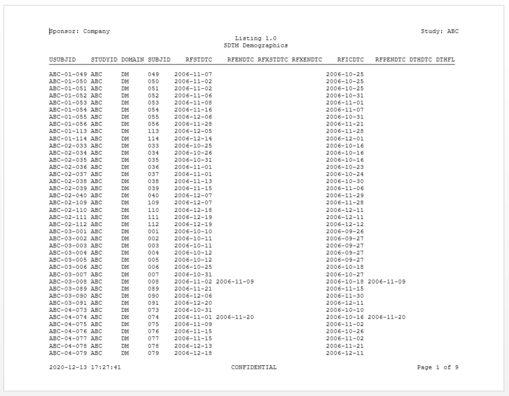

```{r setup, include = FALSE}
knitr::opts_chunk$set(
  collapse = TRUE,
  comment = "#>"
)
```

### Create a Listing 
Here is an example of a simple listing using the **sassy** system of 
functions.  The data used for these examples is included in the **sassy**
package, and also available for download 
<a href="https://github.com/dbosak01/sassy/blob/master/inst/extdata/sassy_data.zip">here</a>.  

#### Program

Note the following about this example:

  * The **[logr](https://logr.r-sassy.org)** package provides a simple, 
  convenient logging mechanism. 
  * The `sep()` function creates a nice separator in the log to help keep it 
  organized and readable. 
  * The `put()` function will write anything you want to the log, similar to a 
  SAS® `%put()` statement.
  * The `libname()` function from the **[libr](https://libr.r-sassy.org)** 
  package loads an entire directory 
  of data files, just like a SAS® `libname` statement.
  * The `lib_load()` function loads the data into the workspace for easy access,
  and gives you a two-level (&lt;library&gt;.&lt;dataset&gt;) dataset reference like SAS®.
  * The **[reporter](https://reporter.r-sassy.org)** package will set column 
  widths, page wraps, and page breaks automatically.

```{r eval=FALSE, echo=TRUE}    
library(sassy)

options("logr.autolog" = TRUE, 
        "logr.notes" = FALSE)

# Get path to temp directory
tmp <- tempdir() 

# Get path to sample data
pkg <- system.file("extdata", package = "sassy")

# Open log
lgpth <- log_open(file.path(tmp, "example1.log"))

sep("Get Data")

# Define data library
libname(sdtm, pkg, "csv") 

# Load library into workspace
lib_load(sdtm) 

sep("Write Report")

# Define table object
tbl <- create_table(sdtm.DM) |> 
  define(USUBJID, id_var = TRUE)

# Construct report path
pth <- file.path(tmp, "output/l_dm.rtf") 

# Define report object
rpt <- create_report(pth, output_type = "RTF", font = "Courier") |> 
  page_header("Sponsor: Company", "Study: ABC") |> 
  titles("Listing 1.0", "SDTM Demographics") |> 
  add_content(tbl, align = "left") |> 
  page_footer(Sys.time(), "CONFIDENTIAL", "Page [pg] of [tpg]")

# Write report to file system
write_report(rpt) 

# Unload data
lib_unload(sdtm)

# Close log
log_close()

# View report
# file.show(pth)

# View log
# file.show(lgpth)
```

#### Output

Here is an image of the first page of the RTF report produced by the
above listing example:




#### Log

Here is the log produced by the above listing example:

```
========================================================================= 
Log Path: C:/Users/User/AppData/Local/Temp/Rtmpum5T6o/log/example1.log 
Working Directory: C:/packages/Testing 
User Name: User 
R Version: 4.0.3 (2020-10-10) 
Machine: DESKTOP-1F27OR8 x86-64 
Operating System: Windows 10 x64 build 18363 
Log Start Time: 2021-01-05 08:05:09 
========================================================================= 

========================================================================= 
Get Data 
========================================================================= 

# library 'sdtm': 8 items
- attributes: csv not loaded
- path: C:/Users/User/Documents/R/win-library/4.0/sassy/extdata
- items:
  Name Extension Rows Cols     Size        LastModified
1   AE       csv  150   27  88.1 Kb 2020-12-27 23:21:55
2   DA       csv 3587   18 527.8 Kb 2020-12-27 23:21:55
3   DM       csv   87   24  45.2 Kb 2020-12-27 23:21:55
4   DS       csv  174    9  33.7 Kb 2020-12-27 23:21:55
5   EX       csv   84   11    26 Kb 2020-12-27 23:21:55
6   IE       csv    2   14    13 Kb 2020-12-27 23:21:55
7   SV       csv  685   10  69.9 Kb 2020-12-27 23:21:55
8   VS       csv 3358   17   467 Kb 2020-12-27 23:21:55

lib_load: library 'sdtm' loaded 

========================================================================= 
Write Report 
========================================================================= 

# A report specification: 9 pages
- file_path: 'C:\Users\User\AppData\Local\Temp\Rtmpum5T6o/output/l_dm.rtf'
- output_type: RTF
- units: inches
- orientation: landscape
- line size/count: 108/48
- page_header: left=Sponsor: Company right=Study: ABC
- title 1: 'Listing 1.0'
- title 2: 'SDTM Demographics'
- page_footer: left=2021-01-05 08:05:14 center=CONFIDENTIAL right=Page [pg] of [tpg]
- content: 
# A table specification:
- data: tibble 'sdtm.DM' 87 rows 24 cols
- show_cols: all
- use_attributes: all
- define: USUBJID id_var='TRUE' 

lib_sync: synchronized data in library 'sdtm' 

lib_unload: library 'sdtm' unloaded 

========================================================================= 
Log End Time: 2021-01-05 08:05:17 
Log Elapsed Time: 0 00:00:07 
========================================================================= 


```


Next: [Example 2: Demographics Table](sassy-dm.html)
