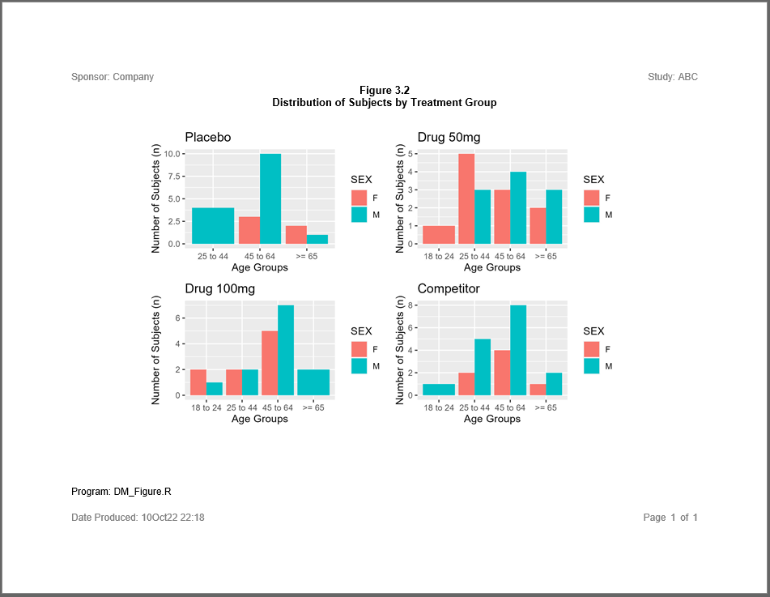

```{r setup, include = FALSE}
knitr::opts_chunk$set(
  collapse = TRUE,
  comment = "#>"
)
```
There are a few packages in R that can combine multiple figures into
a single image.  This image can then be embedded into a report
to create a combined figure. Here is an example using the **patchwork** package. 

## Program

Note the following about this example:

  * The **[patchwork](https://CRAN.R-project.org/package=patchwork)** 
  package creates combined plots.   
  * The **[reporter](https://reporter.r-sassy.org)** package can embed
  patchwork images into any output type that accepts images.  

```{r eval=FALSE, echo=TRUE}    
library(sassy)
library(ggplot2)
library(patchwork)


# Prepare Log -------------------------------------------------------------


options("logr.autolog" = TRUE,
        "logr.notes" = FALSE)

# Get path to temp directory
tmp <- tempdir() 

# Get sample data directory
dir <- system.file("extdata", package = "sassy")

# Open log
lgpth <- log_open(file.path(tmp, "example12.log"))


# Load and Prepare Data ---------------------------------------------------

sep("Prepare Data")

put("Define data library")
libname(sdtm, dir, "csv") 

put("Prepare format")
agefmt <- value(condition(x >= 18 & x <= 24, "18 to 24"),
                condition(x >= 25 & x <= 44, "25 to 44"),
                condition(x >= 45 & x <= 64, "45 to 64"),
                condition(x >= 65, ">= 65"))

put("Prepare data")
datastep(sdtm$DM, 
         keep = v(USUBJID, SEX, AGE, ARM, AGECAT),
         where = expression(ARM != "SCREEN FAILURE"),
  {

      AGECAT = fapply(AGE, agefmt)
    
  }) -> dm_mod


put("Convert agecat to factor it will sort correctly")
dm_mod$AGECAT <- factor(dm_mod$AGECAT, levels = levels(agefmt))

put("Split by ARM")
dm_sub <- split(dm_mod, factor(dm_mod$ARM))


# Create Plots ------------------------------------------------------------

sep("Create Plots")

put("Create plot for ARM A")
plt1 <- ggplot(dm_sub$`ARM A`, aes(x = AGECAT, fill = SEX)) + 
  geom_bar(position = "dodge") + 
  labs(x = "Age Groups", y = "Number of Subjects (n)", title = "Placebo")  

put("Create plot for ARM B")
plt2 <- ggplot(dm_sub$`ARM B`, aes(x = AGECAT, fill = SEX)) + 
  geom_bar(position = "dodge") + 
  labs(x = "Age Groups", y = "Number of Subjects (n)", title = "Drug 50mg")

put("Create plot for ARM C")
plt3 <- ggplot(dm_sub$`ARM C`, aes(x = AGECAT, fill = SEX)) + 
  geom_bar(position = "dodge") + 
  labs(x = "Age Groups", y = "Number of Subjects (n)", title = "Drug 100mg")

put("Create plot for ARM D")
plt4 <- ggplot(dm_sub$`ARM D`, aes(x = AGECAT, fill = SEX)) + 
  geom_bar(position = "dodge") + 
  labs(x = "Age Groups", y = "Number of Subjects (n)", title = "Competitor")


put("Combine 4 plots into 1 using patchwork")
plts <- (plt1 | plt2) / (plt3 | plt4)


# Report ------------------------------------------------------------------


sep("Create and print report")


pth <- file.path(tmp, "output/example12.rtf")


plt <- create_plot(plts, 4.5, 7) |> 
  titles("Figure 3.2", "Distribution of Subjects by Treatment Group", 
         font_size = 11, bold = TRUE)


rpt <- create_report(pth, output_type = "RTF", font = "Arial") |> 
  set_margins(top = 1, bottom = 1) |> 
  page_header("Sponsor: Company", "Study: ABC") |>  
  add_content(plt) |> 
  footnotes("Program: DM_Figure.R") |>  
  page_footer(paste0("Date Produced: ", fapply(Sys.time(), "%d%b%y %H:%M")), 
              right = "Page [pg] of [tpg]")

# Write report to file
res <- write_report(rpt)


# Clean Up ----------------------------------------------------------------

# Close log
log_close()

# Uncomment to view files
# file.show(pth)
# file.show(lgpth)
```

## Output

Here is an image  of the RTF report produced by the above example:




## Log

Here is the log produced by the above combined plot example:

```
=========================================================================
Log Path: C:/Users/dbosa/AppData/Local/Temp/RtmpkNnsUE/log/example12.log
Program Path: C:/packages/Testing/procs/ProcsCombinedFigure.R
Working Directory: C:/packages/Testing/procs
User Name: dbosa
R Version: 4.3.1 (2023-06-16 ucrt)
Machine: SOCRATES x86-64
Operating System: Windows 10 x64 build 22621
Base Packages: stats graphics grDevices utils datasets methods base Other
Packages: tidylog_1.0.2 ggplot2_3.4.2 patchwork_1.1.3 procs_1.0.3
reporter_1.4.1 libr_1.2.8 fmtr_1.5.9 logr_1.3.4 common_1.0.8 sassy_1.1.0
Log Start Time: 2023-09-06 21:06:40.53712
=========================================================================

=========================================================================
Prepare Data
=========================================================================

Define data library

# library 'sdtm': 7 items
- attributes: csv not loaded
- path: C:/Users/dbosa/AppData/Local/R/win-library/4.3/sassy/extdata
- items:
  Name Extension Rows Cols     Size        LastModified
1   AE       csv  150   27  88.5 Kb 2023-08-07 17:51:40
2   DM       csv   87   24  45.5 Kb 2023-08-07 17:51:40
3   DS       csv  174    9  34.1 Kb 2023-08-07 17:51:40
4   EX       csv   84   11  26.4 Kb 2023-08-07 17:51:40
5   IE       csv    2   14  13.4 Kb 2023-08-07 17:51:40
6   SV       csv  685   10  70.3 Kb 2023-08-07 17:51:40
7   VS       csv 3358   17 467.4 Kb 2023-08-07 17:51:40

Load data into workspace

lib_load: library 'sdtm' loaded

Prepare format

# A user-defined format: 4 conditions
  Name Type        Expression    Label Order
1  obj    U x >= 18 & x <= 24 18 to 24    NA
2  obj    U x >= 25 & x <= 44 25 to 44    NA
3  obj    U x >= 45 & x <= 64 45 to 64    NA
4  obj    U           x >= 65    >= 65    NA

Prepare data

datastep: columns decreased from 24 to 5

# A tibble: 85 × 5
   USUBJID    SEX     AGE ARM   AGECAT  
   <chr>      <chr> <dbl> <chr> <chr>   
 1 ABC-01-049 M        39 ARM D 25 to 44
 2 ABC-01-050 M        47 ARM B 45 to 64
 3 ABC-01-051 M        34 ARM A 25 to 44
 4 ABC-01-052 F        45 ARM C 45 to 64
 5 ABC-01-053 F        26 ARM B 25 to 44
 6 ABC-01-054 M        44 ARM D 25 to 44
 7 ABC-01-055 F        47 ARM C 45 to 64
 8 ABC-01-056 M        31 ARM A 25 to 44
 9 ABC-01-113 M        74 ARM D >= 65   
10 ABC-01-114 F        72 ARM B >= 65   
# ℹ 75 more rows
# ℹ Use `print(n = ...)` to see more rows

Convert agecat to factor it will sort correctly

Split by ARM

=========================================================================
Create Plots
=========================================================================

Create plot for ARM A

Create plot for ARM B

Create plot for ARM C

Create plot for ARM D

Combine 4 plots into 1 using patchwork

=========================================================================
Create and print report
=========================================================================

# A report specification: 1 pages
- file_path: 'C:\Users\dbosa\AppData\Local\Temp\RtmpkNnsUE/output/example12.rtf'
- output_type: RTF
- units: inches
- orientation: landscape
- margins: top 1 bottom 1 left 1 right 1
- line size/count: 9/36
- page_header: left=Sponsor: Company right=Study: ABC
- footnote 1: 'Program: DM_Figure.R'
- page_footer: left=Date Produced: 06Sep23 21:06 center= right=Page [pg] of [tpg]
- content: 
# A plot specification: 
- height: 4.5
- width: 7
- title 1: 'Figure 3.2'
- title 2: 'Distribution of Subjects by Treatment Group'

lib_sync: synchronized data in library 'sdtm'

lib_unload: library 'sdtm' unloaded

=========================================================================
Log End Time: 2023-09-06 21:06:43.938549
Log Elapsed Time: 0 00:00:03
=========================================================================


```

Next: [Example 13: Mean Change From Baseline](sassy-chgbase.html)
