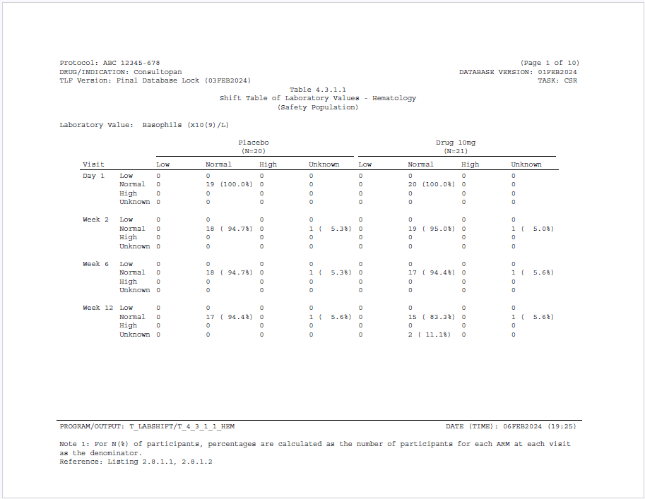

```{r setup, include = FALSE}
knitr::opts_chunk$set(
  collapse = TRUE,
  comment = "#>"
)
```
This example produces a shift table of lab values. A shift table is used to 
observe the change in lab values over visits, and is commonly used in the 
pharmaceutical industry.

## Program

```{r eval=FALSE, echo=TRUE}
library(sassy)

options("logr.notes" = FALSE,
        "logr.autolog" = TRUE,
        "procs.print" = FALSE)

# Get temp location for log and report output
tmp <- tempdir()

lf <- log_open(file.path(tmp, "example16.log"))


# Get data ----------------------------------------------------------------

sep("Get data")

# Get sample data path
pth <- system.file("extdata", package = "sassy")

put("Open data library")
libname(sdtm, pth, "csv")

# Create Formats ----------------------------------------------------------

sep("Create Formats")

put("Format for visits")
vfmt <- value(condition(x == "DAY 1", "Day 1"), 
              condition(x == "WEEK 2", "Week 2"),
              condition(x == "WEEK 6", "Week 6"),
              condition(x == "WEEK 12", "Week 12"),
              as.factor = TRUE)

put("Format for ARMs")
afmt <- value(condition(x == "ARM A", "Placebo"), 
              condition(x == "ARM B", "Drug (10mg)"), 
              condition(x == "ARM C", "Drug (20mg)"),
              condition(x == "ARM D", "Competitor"),
              as.factor = TRUE)

put("Format for Lab Result Indicator")
rfmt <- value(condition(x == "LOW", "Low"),
              condition(x == "NORMAL", "Normal"),
              condition(x == "HIGH", "High"),
              condition(x == "UNKNOWN", "Unknown"),
              as.factor = TRUE)


# Prepare data ------------------------------------------------------------

sep("Prepare data")

put("Pull out needed visits and columns")
lbsub1 <- subset(sdtm$LB, VISIT %in% toupper(levels(vfmt)), 
                 v(USUBJID, VISIT, VISITNUM, LBCAT, LBORRESU, LBTEST, 
                   LBTESTCD, LBBLFL, LBNRIND)) |> put()

put("Pull out baseline subset")
lbsub2 <- subset(lbsub1, LBBLFL == 'Y', 
                 v(USUBJID, VISIT, LBCAT, LBTESTCD, LBNRIND)) |> put()

put("Merge and append change from baseline")
datastep(lbsub1, merge = lbsub2, merge_by = v(USUBJID, LBCAT, LBTESTCD), 
         rename = v(LBNRIND.1 = LBNRIND, LBNRIND.2 = BLBNRIND, VISIT.1 = VISIT),
         drop = VISIT.2, {
           
           if (is.na(LBNRIND.1)) {
             
             LBNRIND.1 <- "UNKNOWN"
           }
           
           if (is.na(LBNRIND.2)) {
             
             LBNRIND.2 <- "UNKNOWN"
           }
           
         }) -> lbsub 

put("Pull needed ARMs and columns for DM")
dmsub <- subset(sdtm$DM, ARM != "SCREEN FAILURE" & is.na(ARM) == FALSE, 
                v(USUBJID, ARMCD, ARM)) |> put()

put("Merge DM with LB to get subject treatments")
datastep(lbsub, merge = dmsub, merge_by = USUBJID, 
         where = expression(toupper(VISIT) != 'SCREENING'), 
         {
           VISIT <- fapply(VISIT, vfmt)
         }) -> lbdat 


# Get population counts ---------------------------------------------------

sep("Get population counts")

proc_sort(lbdat, by = v(ARM, USUBJID),
          keep = v(ARM, USUBJID),
          options = nodupkey) -> lb_unique


put("Get population frequencies")
proc_freq(lb_unique, tables = ARM,
          output = long,
          options = v(nopercent, nonobs)) -> lb_pop


# Prepare lab test labels -------------------------------------------------

sep("Lab test labels")

put("Get lookup data for lab tests")
proc_sort(lbdat, by = v(LBTESTCD, LBTEST, LBORRESU), 
          keep = v(LBTESTCD, LBTEST, LBORRESU), 
          options = nodupkey) -> tcodes

put("Create test label with units")
datastep(tcodes, where = expression(is.na(LBORRESU) == FALSE),
         keep = v(LBTESTCD, LABEL), 
         {
           
           LABEL <- paste0(LBTEST, " (", LBORRESU, ")") 
           
         }) -> tfmtdat 

put("Create lab value lookup") 
tfmt <- tfmtdat$LABEL
names(tfmt) <- tfmtdat$LBTESTCD


# Calculate frequencies ----------------------------------------------------

sep("Calculate frequencies")

put("Apply formats")
lbdat$LBNRIND <- fapply(lbdat$LBNRIND, rfmt)
lbdat$BLBNRIND <- fapply(lbdat$BLBNRIND, rfmt)

put("Get freqs by ARM and visit")
proc_freq(lbdat, by = v(ARM, LBTESTCD, VISIT),
          tables = LBNRIND * BLBNRIND) -> lb_freq

put("Combine frequencies and percents")
datastep(lb_freq, 
         drop = v(VAR1, VAR2, CNT, PCT),
         {
           if (CNT == 0) {
             CNTPCT <- fapply(CNT, "%d", width = 10, justify = "left") 
           } else {
             CNTPCT <- fapply2(CNT, PCT, "%d", "(%5.1f%%)")
           }
         }) -> lb_comb


put("Transpose ARMs") 
proc_transpose(lb_comb, id = v(BY1, CAT2), copy = N,
               by = v(BY2, BY3, CAT1), var = CNTPCT,
               options = noname) -> lb_final

put("Apply formats")
lb_final$BY2 <- fapply(lb_final$BY2, tfmt)

put("Rename variables")
datastep(lb_final, 
         rename = c(BY2 = "LBTEST", BY3 = "VISIT", CAT1 = "RIND"), 
         {}) -> lb_final

put("Sort by lab test")
proc_sort(lb_final, by = v(LBTEST, VISIT)) -> lb_final


# Create report -----------------------------------------------------------

sep("Create report")

put("Create output path")
pth <- file.path(tmp, "output/example16.pdf") |> put()


tbl <- create_table(lb_final) |> 
  spanning_header(`ARM A.Low`, `ARM A.Unknown`, "Placebo", n = lb_pop["ARM A"]) |> 
  spanning_header(`ARM B.Low`, `ARM B.Unknown`, "Drug 10mg", n = lb_pop["ARM B"]) |> 
  spanning_header(`ARM C.Low`, `ARM C.Unknown`, "Drug 20mg", n = lb_pop["ARM C"]) |> 
  spanning_header(`ARM D.Low`, `ARM D.Unknown`, "Competitor", n = lb_pop["ARM D"]) |> 
  define(LBTEST, visible = FALSE) |> 
  define(VISIT, "Visit", format = vfmt, dedupe = TRUE, align = "left", 
         id_var = TRUE, blank_after = TRUE) |> 
  define(N, "n", visible = FALSE) |> 
  define(RIND, "", align = "left", id_var = TRUE) |> 
  define(`ARM A.Low`, "Low") |> 
  define(`ARM A.Normal`, "Normal") |> 
  define(`ARM A.High`, "High") |> 
  define(`ARM A.Unknown`, "Unknown") |> 
  define(`ARM B.Low`, "Low") |> 
  define(`ARM B.Normal`, "Normal") |> 
  define(`ARM B.High`, "High") |> 
  define(`ARM B.Unknown`, "Unknown") |> 
  define(`ARM C.Low`, "Low", page_wrap = TRUE) |> 
  define(`ARM C.Normal`, "Normal") |> 
  define(`ARM C.High`, "High") |> 
  define(`ARM C.Unknown`, "Unknown") |> 
  define(`ARM D.Low`, "Low") |> 
  define(`ARM D.Normal`, "Normal") |> 
  define(`ARM D.High`, "High") |> 
  define(`ARM D.Unknown`, "Unknown") |> 
  
  
  put("Create report")
rpt <- create_report(pth, output_type = "PDF",
                     font = "Courier", font_size = 9) |> 
  set_margins(top = 1, left = 1, right = 1, bottom = .5) |> 
  page_header(c("Protocol: ABC 12345-678", "DRUG/INDICATION: Consultopan", 
                "TLF Version: Final Database Lock (03FEB2024)"), 
              right = c("(Page [pg] of [tpg])", "DATABASE VERSION: 01FEB2024", 
                        "TASK: CSR")) |> 
  titles("Table 4.3.1.1", "", "Shift Table of Laboratory Values - Hematology", 
         "(Safety Population)", blank_row = "below") |> 
  page_by(LBTEST, "Laboratory Value: ") |> 
  add_content(tbl) |> 
  footnotes("PROGRAM/OUTPUT: T_LABSHIFT/T_4_3_1_1_HEM", 
            "DATE (TIME): " %p% toupper(fapply(Sys.time(), "%d%b%Y (%H:%M)")),
            columns = 2, borders = "top", blank_row = "below") |> 
  footnotes(paste("Note 1: For N(%) of participants, percentages are calculated",
                  "as the number of participants for each ARM at each visit",
                  "as the denominator."),
            "Reference: Listing 2.8.1.1, 2.8.1.2", blank_row = "none")


put("Write out report to file system")
res <- write_report(rpt)


# Clean Up ----------------------------------------------------------------

sep("Clean Up")

log_close()

# View report
# file.show(res$modified_path)

# View log
# file.show(lf)


```

## Output

Here is the output report:




## Log

Here is the log:

```
=========================================================================
Log Path: C:/Users/dbosa/AppData/Local/Temp/RtmpaGlETW/log/example16.log
Program Path: C:/packages/Testing/sassytests/ShiftTable2.R
Working Directory: C:/packages/Testing
User Name: dbosa
R Version: 4.3.2 (2023-10-31 ucrt)
Machine: SOCRATES x86-64
Operating System: Windows 10 x64 build 22621
Base Packages: stats graphics grDevices utils datasets methods base Other
Packages: tidylog_1.0.2 procs_1.0.5
reporter_1.4.3 libr_1.2.9 logr_1.3.5 fmtr_1.6.2 common_1.1.1 sassy_1.2.1
Log Start Time: 2024-02-06 14:52:04.476925
=========================================================================

=========================================================================
Get data
=========================================================================

Open data library

# library 'sdtm': 8 items
- attributes: csv not loaded
- path: C:/Users/dbosa/AppData/Local/R/win-library/4.4/sassy/extdata
- items:
  Name Extension Rows Cols     Size        LastModified
1   AE       csv  150   27  88.8 Kb 2024-05-03 08:12:15
2   DM       csv   87   24  45.8 Kb 2024-05-03 08:12:15
3   DS       csv  174    9  34.4 Kb 2024-05-03 08:12:15
4   EX       csv   84   11  26.7 Kb 2024-05-03 08:12:15
5   IE       csv    2   14  13.7 Kb 2024-05-03 08:12:15
6   LB       csv 1618   24 348.7 Kb 2024-05-03 08:12:15
7   SV       csv  685   10  70.6 Kb 2024-05-03 08:12:15
8   VS       csv 3358   17 467.7 Kb 2024-05-03 08:12:15

=========================================================================
Create Formats
=========================================================================

Format for visits

# A user-defined format: 4 conditions
- as.factor: TRUE
  Name Type     Expression   Label Order
1  obj    U   x == "DAY 1"   Day 1    NA
2  obj    U  x == "WEEK 2"  Week 2    NA
3  obj    U  x == "WEEK 6"  Week 6    NA
4  obj    U x == "WEEK 12" Week 12    NA

Format for ARMs

# A user-defined format: 4 conditions
- as.factor: TRUE
  Name Type   Expression       Label Order
1  obj    U x == "ARM A"     Placebo    NA
2  obj    U x == "ARM B" Drug (10mg)    NA
3  obj    U x == "ARM C" Drug (20mg)    NA
4  obj    U x == "ARM D"  Competitor    NA

Format for Lab Result Indicator

# A user-defined format: 4 conditions
- as.factor: TRUE
  Name Type     Expression   Label Order
1  obj    U     x == "LOW"     Low    NA
2  obj    U  x == "NORMAL"  Normal    NA
3  obj    U    x == "HIGH"    High    NA
4  obj    U x == "UNKNOWN" Unknown    NA

=========================================================================
Prepare data
=========================================================================

Pull out needed visits and columns

# A tibble: 1,578 × 9
   USUBJID    VISIT   VISITNUM LBCAT      LBORRESU LBTEST     LBTESTCD LBBLFL LBNRIND
   <chr>      <chr>      <dbl> <chr>      <chr>    <chr>      <chr>    <chr>  <chr>  
 1 ABC-01-049 DAY 1          1 HEMATOLOGY x10(9)/L Basophils  BASO     Y      NORMAL 
 2 ABC-01-049 WEEK 2         2 HEMATOLOGY x10(9)/L Basophils  BASO     <NA>   NORMAL 
 3 ABC-01-049 WEEK 6         6 HEMATOLOGY x10(9)/L Basophils  BASO     <NA>   NORMAL 
 4 ABC-01-049 WEEK 12       12 HEMATOLOGY x10(9)/L Basophils  BASO     <NA>   NORMAL 
 5 ABC-01-049 DAY 1          1 HEMATOLOGY x10(9)/L Eosinophi… EOS      Y      NORMAL 
 6 ABC-01-049 WEEK 2         2 HEMATOLOGY x10(9)/L Eosinophi… EOS      <NA>   NORMAL 
 7 ABC-01-049 WEEK 6         6 HEMATOLOGY x10(9)/L Eosinophi… EOS      <NA>   NORMAL 
 8 ABC-01-049 WEEK 12       12 HEMATOLOGY x10(9)/L Eosinophi… EOS      <NA>   NORMAL 
 9 ABC-01-049 DAY 1          1 HEMATOLOGY %        Hematocrit HCT      Y      NORMAL 
10 ABC-01-049 WEEK 2         2 HEMATOLOGY %        Hematocrit HCT      <NA>   NORMAL 
# ℹ 1,568 more rows
# ℹ Use `print(n = ...)` to see more rows

Pull out baseline subset

# A tibble: 409 × 5
   USUBJID    VISIT LBCAT      LBTESTCD LBNRIND
   <chr>      <chr> <chr>      <chr>    <chr>  
 1 ABC-01-049 DAY 1 HEMATOLOGY BASO     NORMAL 
 2 ABC-01-049 DAY 1 HEMATOLOGY EOS      NORMAL 
 3 ABC-01-049 DAY 1 HEMATOLOGY HCT      NORMAL 
 4 ABC-01-049 DAY 1 HEMATOLOGY HGB      NORMAL 
 5 ABC-01-049 DAY 1 HEMATOLOGY LYM      NORMAL 
 6 ABC-01-050 DAY 1 HEMATOLOGY BASO     NORMAL 
 7 ABC-01-050 DAY 1 HEMATOLOGY EOS      NORMAL 
 8 ABC-01-050 DAY 1 HEMATOLOGY HCT      NORMAL 
 9 ABC-01-050 DAY 1 HEMATOLOGY HGB      NORMAL 
10 ABC-01-050 DAY 1 HEMATOLOGY LYM      NORMAL 
# ℹ 399 more rows
# ℹ Use `print(n = ...)` to see more rows

Merge and append change from baseline

datastep: columns increased from 9 to 10

# A tibble: 1,578 × 10
   USUBJID    VISIT   VISITNUM LBCAT LBORRESU LBTEST LBTESTCD LBBLFL LBNRIND BLBNRIND
   <chr>      <chr>      <dbl> <chr> <chr>    <chr>  <chr>    <chr>  <chr>   <chr>   
 1 ABC-01-049 WEEK 12       12 HEMA… x10(9)/L Basop… BASO     <NA>   NORMAL  NORMAL  
 2 ABC-01-049 WEEK 2         2 HEMA… x10(9)/L Basop… BASO     <NA>   NORMAL  NORMAL  
 3 ABC-01-049 DAY 1          1 HEMA… x10(9)/L Basop… BASO     Y      NORMAL  NORMAL  
 4 ABC-01-049 WEEK 6         6 HEMA… x10(9)/L Basop… BASO     <NA>   NORMAL  NORMAL  
 5 ABC-01-049 WEEK 12       12 HEMA… x10(9)/L Eosin… EOS      <NA>   NORMAL  NORMAL  
 6 ABC-01-049 DAY 1          1 HEMA… x10(9)/L Eosin… EOS      Y      NORMAL  NORMAL  
 7 ABC-01-049 WEEK 2         2 HEMA… x10(9)/L Eosin… EOS      <NA>   NORMAL  NORMAL  
 8 ABC-01-049 WEEK 6         6 HEMA… x10(9)/L Eosin… EOS      <NA>   NORMAL  NORMAL  
 9 ABC-01-049 WEEK 12       12 HEMA… %        Hemat… HCT      <NA>   NORMAL  NORMAL  
10 ABC-01-049 WEEK 2         2 HEMA… %        Hemat… HCT      <NA>   NORMAL  NORMAL  
# ℹ 1,568 more rows
# ℹ Use `print(n = ...)` to see more rows

Pull needed ARMs and columns for DM

# A tibble: 85 × 3
   USUBJID    ARMCD ARM  
   <chr>      <chr> <chr>
 1 ABC-01-049 4     ARM D
 2 ABC-01-050 2     ARM B
 3 ABC-01-051 1     ARM A
 4 ABC-01-052 3     ARM C
 5 ABC-01-053 2     ARM B
 6 ABC-01-054 4     ARM D
 7 ABC-01-055 3     ARM C
 8 ABC-01-056 1     ARM A
 9 ABC-01-113 4     ARM D
10 ABC-01-114 2     ARM B
# ℹ 75 more rows
# ℹ Use `print(n = ...)` to see more rows

Merge DM with LB to get subject treatments

datastep: columns increased from 10 to 12

# A tibble: 1,578 × 12
   USUBJID    VISIT   VISITNUM LBCAT LBORRESU LBTEST LBTESTCD LBBLFL LBNRIND BLBNRIND
   <chr>      <ord>      <dbl> <chr> <chr>    <chr>  <chr>    <chr>  <chr>   <chr>   
 1 ABC-01-049 Week 12       12 HEMA… x10(9)/L Lymph… LYM      <NA>   NORMAL  NORMAL  
 2 ABC-01-049 Week 6         6 HEMA… x10(9)/L Lymph… LYM      <NA>   NORMAL  NORMAL  
 3 ABC-01-049 Week 2         2 HEMA… x10(9)/L Lymph… LYM      <NA>   NORMAL  NORMAL  
 4 ABC-01-049 Week 6         6 HEMA… x10(9)/L Basop… BASO     <NA>   NORMAL  NORMAL  
 5 ABC-01-049 Week 12       12 HEMA… x10(9)/L Eosin… EOS      <NA>   NORMAL  NORMAL  
 6 ABC-01-049 Week 12       12 HEMA… g/dL     Hemog… HGB      <NA>   NORMAL  NORMAL  
 7 ABC-01-049 Week 2         2 HEMA… x10(9)/L Eosin… EOS      <NA>   NORMAL  NORMAL  
 8 ABC-01-049 Week 6         6 HEMA… x10(9)/L Eosin… EOS      <NA>   NORMAL  NORMAL  
 9 ABC-01-049 Week 12       12 HEMA… %        Hemat… HCT      <NA>   NORMAL  NORMAL  
10 ABC-01-049 Day 1          1 HEMA… x10(9)/L Lymph… LYM      Y      NORMAL  NORMAL  
# ℹ 1,568 more rows
# ℹ 2 more variables: ARMCD <chr>, ARM <chr>
# ℹ Use `print(n = ...)` to see more rows

=========================================================================
Get population counts
=========================================================================

proc_sort: input data set 86 rows and 12 columns
           by: ARM USUBJID
           keep: ARM USUBJID
           order: a a
           options: nodupkey
           output data set 86 rows and 2 columns

# A tibble: 86 × 2
   ARM   USUBJID   
   <chr> <chr>     
 1 ARM A ABC-01-051
 2 ARM A ABC-01-056
 3 ARM A ABC-02-034
 4 ARM A ABC-02-038
 5 ARM A ABC-02-109
 6 ARM A ABC-03-002
 7 ARM A ABC-03-006
 8 ARM A ABC-03-091
 9 ARM A ABC-04-075
10 ARM A ABC-04-080
# ℹ 76 more rows
# ℹ Use `print(n = ...)` to see more rows

Get population frequencies

proc_freq: input data set 86 rows and 2 columns
           tables: ARM
           output: long
           view: TRUE
           output: 1 datasets

# A tibble: 1 × 6
  VAR   STAT  `ARM A` `ARM B` `ARM C` `ARM D`
  <chr> <chr>   <dbl>   <dbl>   <dbl>   <dbl>
1 ARM   CNT        20      21      20      23

=========================================================================
Lab test labels
=========================================================================

Get lookup data for lab tests

proc_sort: input data set 10 rows and 12 columns
           by: LBTESTCD LBTEST LBORRESU
           keep: LBTESTCD LBTEST LBORRESU
           order: a a a
           options: nodupkey
           output data set 10 rows and 3 columns

# A tibble: 10 × 3
   LBTESTCD LBTEST      LBORRESU
   <chr>    <chr>       <chr>   
 1 BASO     Basophils   x10(9)/L
 2 BASO     Basophils   <NA>    
 3 EOS      Eosinophils x10(9)/L
 4 EOS      Eosinophils <NA>    
 5 HCT      Hematocrit  %       
 6 HCT      Hematocrit  <NA>    
 7 HGB      Hemoglobin  g/dL    
 8 HGB      Hemoglobin  <NA>    
 9 LYM      Lymphocytes x10(9)/L
10 LYM      Lymphocytes <NA>    

Create test label with units

datastep: columns decreased from 3 to 2

# A tibble: 5 × 2
  LBTESTCD LABEL                 
  <chr>    <chr>                 
1 BASO     Basophils (x10(9)/L)  
2 EOS      Eosinophils (x10(9)/L)
3 HCT      Hematocrit (%)        
4 HGB      Hemoglobin (g/dL)     
5 LYM      Lymphocytes (x10(9)/L)

Create lab value lookup

=========================================================================
Calculate frequencies
=========================================================================

Apply formats

Get freqs by ARM and visit

proc_freq: input data set 1578 rows and 12 columns
           tables: LBNRIND * BLBNRIND
           by: ARM LBTESTCD VISIT
           view: TRUE
           output: 1 datasets

# A tibble: 1,280 × 10
   BY1   BY2   BY3   VAR1    VAR2     CAT1   CAT2        N   CNT   PCT
   <chr> <chr> <ord> <chr>   <chr>    <fct>  <fct>   <dbl> <dbl> <dbl>
 1 ARM A BASO  Day 1 LBNRIND BLBNRIND Low    Low        19     0     0
 2 ARM A BASO  Day 1 LBNRIND BLBNRIND Low    Normal     19     0     0
 3 ARM A BASO  Day 1 LBNRIND BLBNRIND Low    High       19     0     0
 4 ARM A BASO  Day 1 LBNRIND BLBNRIND Low    Unknown    19     0     0
 5 ARM A BASO  Day 1 LBNRIND BLBNRIND Normal Low        19     0     0
 6 ARM A BASO  Day 1 LBNRIND BLBNRIND Normal Normal     19    19   100
 7 ARM A BASO  Day 1 LBNRIND BLBNRIND Normal High       19     0     0
 8 ARM A BASO  Day 1 LBNRIND BLBNRIND Normal Unknown    19     0     0
 9 ARM A BASO  Day 1 LBNRIND BLBNRIND High   Low        19     0     0
10 ARM A BASO  Day 1 LBNRIND BLBNRIND High   Normal     19     0     0
# ℹ 1,270 more rows
# ℹ Use `print(n = ...)` to see more rows

Combine frequencies and percents

datastep: columns decreased from 10 to 7

# A tibble: 1,280 × 7
   BY1   BY2   BY3   CAT1   CAT2        N CNTPCT       
   <chr> <chr> <ord> <fct>  <fct>   <dbl> <chr>        
 1 ARM A BASO  Day 1 Low    Low        19 "0         " 
 2 ARM A BASO  Day 1 Low    Normal     19 "0         " 
 3 ARM A BASO  Day 1 Low    High       19 "0         " 
 4 ARM A BASO  Day 1 Low    Unknown    19 "0         " 
 5 ARM A BASO  Day 1 Normal Low        19 "0         " 
 6 ARM A BASO  Day 1 Normal Normal     19 "19 (100.0%)"
 7 ARM A BASO  Day 1 Normal High       19 "0         " 
 8 ARM A BASO  Day 1 Normal Unknown    19 "0         " 
 9 ARM A BASO  Day 1 High   Low        19 "0         " 
10 ARM A BASO  Day 1 High   Normal     19 "0         " 
# ℹ 1,270 more rows
# ℹ Use `print(n = ...)` to see more rows

Transpose ARMs

proc_transpose: input data set 1280 rows and 7 columns
                by: BY2 BY3 CAT1
                var: CNTPCT
                id: BY1 CAT2
                copy: N
                name: NAME
                output dataset 80 rows and 20 columns

# A tibble: 80 × 20
   BY2   BY3    CAT1      N `ARM A.Low`  `ARM A.Normal` `ARM A.High` `ARM A.Unknown`
   <chr> <ord>  <fct> <dbl> <chr>        <chr>          <chr>        <chr>          
 1 BASO  Day 1  Low      19 "0         " "0         "   "0         " "0         "   
 2 EOS   Day 1  Low      19 "3 ( 15.8%)" "0         "   "0         " "0         "   
 3 HCT   Day 1  Low      20 "3 ( 15.0%)" "0         "   "0         " "0         "   
 4 HGB   Day 1  Low      20 "3 ( 15.0%)" "0         "   "0         " "0         "   
 5 LYM   Day 1  Low      19 "0         " "0         "   "0         " "0         "   
 6 BASO  Week 2 Low      19 "0         " "0         "   "0         " "0         "   
 7 EOS   Week 2 Low      19 "1 (  5.3%)" "0         "   "0         " "0         "   
 8 HCT   Week 2 Low      20 "1 (  5.0%)" "1 (  5.0%)"   "0         " "0         "   
 9 HGB   Week 2 Low      20 "1 (  5.0%)" "1 (  5.0%)"   "0         " "0         "   
10 LYM   Week 2 Low      19 "0         " "0         "   "0         " "0         "   
# ℹ 70 more rows
# ℹ 12 more variables: `ARM B.Low` <chr>, `ARM B.Normal` <chr>, `ARM B.High` <chr>,
#   `ARM B.Unknown` <chr>, `ARM C.Low` <chr>, `ARM C.Normal` <chr>,
#   `ARM C.High` <chr>, `ARM C.Unknown` <chr>, `ARM D.Low` <chr>,
#   `ARM D.Normal` <chr>, `ARM D.High` <chr>, `ARM D.Unknown` <chr>
# ℹ Use `print(n = ...)` to see more rows

Apply formats

Rename variables

datastep: columns started with 20 and ended with 20

# A tibble: 80 × 20
   LBTEST   VISIT RIND      N `ARM A.Low` `ARM A.Normal` `ARM A.High` `ARM A.Unknown`
   <chr>    <ord> <fct> <dbl> <chr>       <chr>          <chr>        <chr>          
 1 Basophi… Day 1 Low      19 "0        … "0         "   "0         " "0         "   
 2 Eosinop… Day 1 Low      19 "3 ( 15.8%… "0         "   "0         " "0         "   
 3 Hematoc… Day 1 Low      20 "3 ( 15.0%… "0         "   "0         " "0         "   
 4 Hemoglo… Day 1 Low      20 "3 ( 15.0%… "0         "   "0         " "0         "   
 5 Lymphoc… Day 1 Low      19 "0        … "0         "   "0         " "0         "   
 6 Basophi… Week… Low      19 "0        … "0         "   "0         " "0         "   
 7 Eosinop… Week… Low      19 "1 (  5.3%… "0         "   "0         " "0         "   
 8 Hematoc… Week… Low      20 "1 (  5.0%… "1 (  5.0%)"   "0         " "0         "   
 9 Hemoglo… Week… Low      20 "1 (  5.0%… "1 (  5.0%)"   "0         " "0         "   
10 Lymphoc… Week… Low      19 "0        … "0         "   "0         " "0         "   
# ℹ 70 more rows
# ℹ 12 more variables: `ARM B.Low` <chr>, `ARM B.Normal` <chr>, `ARM B.High` <chr>,
#   `ARM B.Unknown` <chr>, `ARM C.Low` <chr>, `ARM C.Normal` <chr>,
#   `ARM C.High` <chr>, `ARM C.Unknown` <chr>, `ARM D.Low` <chr>,
#   `ARM D.Normal` <chr>, `ARM D.High` <chr>, `ARM D.Unknown` <chr>
# ℹ Use `print(n = ...)` to see more rows

Sort by lab test

proc_sort: input data set 80 rows and 20 columns
           by: LBTEST VISIT
           keep: LBTEST VISIT RIND N ARM A.Low ARM A.Normal ARM A.High ARM A.Unknown ARM B.Low ARM B.Normal ARM B.High ARM B.Unknown ARM C.Low ARM C.Normal ARM C.High ARM C.Unknown ARM D.Low ARM D.Normal ARM D.High ARM D.Unknown
           order: a a
           output data set 80 rows and 20 columns

# A tibble: 80 × 20
   LBTEST   VISIT RIND      N `ARM A.Low` `ARM A.Normal` `ARM A.High` `ARM A.Unknown`
   <chr>    <ord> <fct> <dbl> <chr>       <chr>          <chr>        <chr>          
 1 Basophi… Day 1 Low      19 "0        … "0         "   "0         " "0         "   
 2 Basophi… Day 1 Norm…    19 "0        … "19 (100.0%)"  "0         " "0         "   
 3 Basophi… Day 1 High     19 "0        … "0         "   "0         " "0         "   
 4 Basophi… Day 1 Unkn…    19 "0        … "0         "   "0         " "0         "   
 5 Basophi… Week… Low      19 "0        … "0         "   "0         " "0         "   
 6 Basophi… Week… Norm…    19 "0        … "18 ( 94.7%)"  "0         " "1 (  5.3%)"   
 7 Basophi… Week… High     19 "0        … "0         "   "0         " "0         "   
 8 Basophi… Week… Unkn…    19 "0        … "0         "   "0         " "0         "   
 9 Basophi… Week… Low      19 "0        … "0         "   "0         " "0         "   
10 Basophi… Week… Norm…    19 "0        … "18 ( 94.7%)"  "0         " "1 (  5.3%)"   
# ℹ 70 more rows
# ℹ 12 more variables: `ARM B.Low` <chr>, `ARM B.Normal` <chr>, `ARM B.High` <chr>,
#   `ARM B.Unknown` <chr>, `ARM C.Low` <chr>, `ARM C.Normal` <chr>,
#   `ARM C.High` <chr>, `ARM C.Unknown` <chr>, `ARM D.Low` <chr>,
#   `ARM D.Normal` <chr>, `ARM D.High` <chr>, `ARM D.Unknown` <chr>
# ℹ Use `print(n = ...)` to see more rows

=========================================================================
Create report
=========================================================================

Create output path

C:\Users\dbosa\AppData\Local\Temp\RtmpaGlETW/output/example16.pdf

# A table specification:
- data: tibble 'lb_final' 80 rows 20 cols
- show_cols: all
- use_attributes: all
- spanning_header: from='ARM A.Low' to='ARM A.Unknown' 'Placebo' level=1 
- spanning_header: from='ARM B.Low' to='ARM B.Unknown' 'Drug 10mg' level=1 
- spanning_header: from='ARM C.Low' to='ARM C.Unknown' 'Drug 20mg' level=1 
- spanning_header: from='ARM D.Low' to='ARM D.Unknown' 'Competitor' level=1 
- define: LBTEST visible='FALSE' 
- define: VISIT 'Visit' align='left' id_var='TRUE' dedupe='TRUE' 
- define: N visible='FALSE' 
- define: RIND '' align='left' id_var='TRUE' 
- define: ARM A.Low 'Low' 
- define: ARM A.Normal 'Normal' 
- define: ARM A.High 'High' 
- define: ARM A.Unknown 'Unknown' 
- define: ARM B.Low 'Low' 
- define: ARM B.Normal 'Normal' 
- define: ARM B.High 'High' 
- define: ARM B.Unknown 'Unknown' 
- define: ARM C.Low 'Low' page_wrap='TRUE' 
- define: ARM C.Normal 'Normal' 
- define: ARM C.High 'High' 
- define: ARM C.Unknown 'Unknown' 
- define: ARM D.Low 'Low' 
- define: ARM D.Normal 'Normal' 
- define: ARM D.High 'High' 
- define: ARM D.Unknown 'Unknown' 

Write out report to file system

# A report specification: 10 pages
- file_path: 'C:\Users\dbosa\AppData\Local\Temp\RtmpaGlETW/output/example16.pdf'
- output_type: PDF
- units: inches
- orientation: landscape
- margins: top 1 bottom 0.5 left 1 right 1
- line size/count: 9/46
- page by: LBTEST
- page_header: left=Protocol: ABC 12345-678, DRUG/INDICATION: Consultopan, TLF Version: Final Database Lock (03FEB2024) right=(Page [pg] of [tpg]), DATABASE VERSION: 01FEB2024, TASK: CSR
- title 1: 'Table 4.3.1.1'
- title 2: ''
- title 3: 'Shift Table of Laboratory Values - Hematology'
- title 4: '(Safety Population)'
- footnote 1: 'PROGRAM/OUTPUT: T_LABSHIFT/T_4_3_1_1_HEM'
- footnote 2: 'DATE (TIME): 06FEB2024 (14:52)'
- footnote 3: 'Note 1: For N(%) of participants, percentages are calculated as the number of participants for each ARM at each visit as the denominator.'
- footnote 4: 'Reference: Listing 2.8.1.1, 2.8.1.2'
- content: 
# A table specification:
- data: tibble 'lb_final' 80 rows 20 cols
- show_cols: all
- use_attributes: all
- spanning_header: from='ARM A.Low' to='ARM A.Unknown' 'Placebo' level=1 
- spanning_header: from='ARM B.Low' to='ARM B.Unknown' 'Drug 10mg' level=1 
- spanning_header: from='ARM C.Low' to='ARM C.Unknown' 'Drug 20mg' level=1 
- spanning_header: from='ARM D.Low' to='ARM D.Unknown' 'Competitor' level=1 
- define: LBTEST visible='FALSE' 
- define: VISIT 'Visit' align='left' id_var='TRUE' dedupe='TRUE' 
- define: N visible='FALSE' 
- define: RIND '' align='left' id_var='TRUE' 
- define: ARM A.Low 'Low' 
- define: ARM A.Normal 'Normal' 
- define: ARM A.High 'High' 
- define: ARM A.Unknown 'Unknown' 
- define: ARM B.Low 'Low' 
- define: ARM B.Normal 'Normal' 
- define: ARM B.High 'High' 
- define: ARM B.Unknown 'Unknown' 
- define: ARM C.Low 'Low' page_wrap='TRUE' 
- define: ARM C.Normal 'Normal' 
- define: ARM C.High 'High' 
- define: ARM C.Unknown 'Unknown' 
- define: ARM D.Low 'Low' 
- define: ARM D.Normal 'Normal' 
- define: ARM D.High 'High' 
- define: ARM D.Unknown 'Unknown' 

=========================================================================
Clean Up
=========================================================================

=========================================================================
Log End Time: 2024-02-06 14:52:16.546017
Log Elapsed Time: 0 00:00:12
=========================================================================


```

