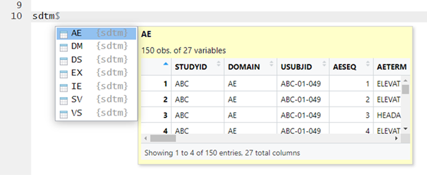
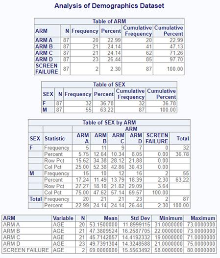
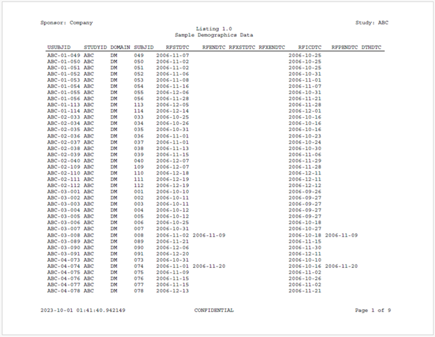

```{r, include = FALSE}
knitr::opts_chunk$set(
  collapse = TRUE,
  comment = "#>"
)
```

The **sassy** system is a coherent and well-designed 
ecosystem for managing and reporting on data in R.  The system was developed in the 
context of creating statistical reports in the pharmaceutical industry. 
However, the functions are generalized such that they can be used in any 
vertical. The goal of the system is to make R capable of producing any kind
of output that can be produced in SAS®.

The **sassy** system includes eight R packages.  While the packages 
can be installed and used individually, they were designed to complement 
each other. The following sections provide a brief overview of the system.

## Included Packages

The **sassy** package itself is a meta-package that contains the following packages.
Each of these packages contribute a needed area of functionality missing
from R:

* **[logr](https://logr.r-sassy.org)**: Produces a traceable log
* **[fmtr](https://fmtr.r-sassy.org)**: Provides functions for formatting 
data and a creating a format catalog
* **[libr](https://libr.r-sassy.org)**: Gives you the ability to define a 
libname, generate a data dictionary, and simulate a data step
* **[procs](https://procs.r-sassy.org)**: A set of functions that simulate
SAS® procedures.  Package includes simulations of PROC FREQ, PROC MEANS,
PROC TTEST, PROC TRANSPOSE, PROC SORT, and more.
* **[reporter](https://reporter.r-sassy.org)**: A reporting package with easy 
layout capabilities and the 
ability to write reports in TXT, RTF, PDF, HTML, and DOCX file formats
* **[common](https://common.r-sassy.org)**: A set of utility functions
shared across the **sassy** family of packages, and often 
useful in their own right. 
* **[macro](https://macro.r-sassy.org)**: A macro language for R that allows
easy, text-based meta-programming. 

Each of the packages is self-contained, and can be used in isolation. 
However, when used collectively, the packages work 
together to create an integrated and productive user experience.

## How to Use

Let's first get a basic 
understanding of how to use each package individually.

### Create a Log

Programmers coming from SAS are usually surprised to find there is no 
automatic logging in R.  The **logr** package was written to provide a simple 
logging system that anyone can use.

There are three steps to creating a log:

1)	Open the log
2)	Write to the log
3)	Close the log

Below is a minimal example that illustrates how to create a log with the 
**logr** package. The `put()` function writes any R object to the log, similar 
to a SAS %put statement:
```{r eval=FALSE, echo=TRUE}
library(sassy)

# Open the log
log_open("Example1.log")

# Write to the log
put("Here is something to send to the log.")

# Close the log
log_close()

```
The generated log looks like this:

```
=========================================================================
Log Path: ./log/Example1.log
Working Directory: C:/Projects/Archytas/WUSS/Code
User Name: dbosa
R Version: 4.3.1 (2023-06-16 ucrt)
Machine: SOCRATES x86-64
Operating System: Windows 10 x64 build 22621
Base Packages: stats graphics grDevices utils datasets methods base Other
Packages: procs_1.0.3 reporter_1.4.2 libr_1.2.8 logr_1.3.4 fmtr_1.6.0
common_1.0.9 sassy_1.2.1
Log Start Time: 2023-10-01 00:20:10.31621
=========================================================================

Here is something to send to the log.

NOTE: Log Print Time:  2023-10-01 00:20:10.491874
NOTE: Elapsed Time: 0.174062013626099 secs

=========================================================================
Log End Time: 2023-10-01 00:20:11.291764
Log Elapsed Time: 0 00:00:00
=========================================================================
```
For a complete explanation of the capabilities of the **logr** 
package, see the [logr](https://logr.r-sassy.org) documentation site.

### Create a Libname

The **sassy** system provides a `libname()` function that is quite similar to a 
SAS® libname statement.  The function will import a set of related datasets 
from a specified directory, and assign a name to the entire set.  The following 
code imports a set of related csv files and assigns them to the name “sdtm”:
```{r eval=FALSE, echo=TRUE}
library(sassy)

# Define library 
libname(sdtm, "./data", "csv") 
```
Once the datasets have been imported, the libname can be accessed 
using R list syntax.  That means the datasets are now available from the 
libname using the dollar sign ($).  In **RStudio®**, it looks like this:



The **libr** package not only allows you to easily access a directory of 
datasets.  It also allows you to add, remove, and edit datasets in the 
library.  The `libname()` function can import SAS datasets, CSV files, R 
data files, Excel files, and more.  See the [libr](https://libr.r-sassy.org)
documentation for additional information.

### Data Formatting

The idea of a *format* is another foundational concept in SAS software.
In R, formatting is spread over many functions.  The **fmtr** package aims to 
consolidate and simplify formatting in R, and make it more similar to the 
way you work with formats in SAS.  The package contains functions to 
create a user-defined format, apply formats to vectors and data frames, 
and create format catalogs.

The following example shows you how to create a user-defined format, 
and apply it to a column of data.  Notice that the `value()` function is 
similar to the statements inside a SAS PROC FORMAT procedure, and that 
the `fapply()` function is defined in a way that is reminiscent of a SAS 
data step `put()` function:

```{r eval=FALSE, echo=TRUE}
library(sassy)

#Create libname
libname(sdtm, "./data", "csv") 

# Copy DM dataset
dat <- sdtm$DM

# Create user-defined format
fmt_sex <- value(condition(is.na(x), "Missing"),
			           condition(x == "M", "Male"),
			           condition(x == "F", "Female"),
			           condition(TRUE, "Other"))

# Create a new column of formatted values
dat$SEXF <- fapply(dat$SEX, fmt_sex)

# View a few rows of data
print(dat[1:5, c("USUBJID", "SEX", "SEXF")])
# # A tibble: 5 x 3
#   USUBJID    SEX   SEXF  
#   <chr>      <chr> <chr> 
# 1 ABC-01-049 M     Male  
# 2 ABC-01-050 M     Male  
# 3 ABC-01-051 M     Male  
# 4 ABC-01-052 F     Female
# 5 ABC-01-053 F     Female

```
The `value()` and `fapply()` functions are a small part of the very capable 
**fmtr** package.  See the [fmtr](https://fmtr.r-sassy.org) documentation 
for a complete list of functions. 

### Perform a Datastep

In SAS, the data step is the go-to procedure for manipulating data. 
The data step provides row-by-row processing of a dataset.  In R, however, 
data processing is typically done column-by-column.  This change in 
orientation is difficult for SAS programmers to adjust to.  Also, there 
are some types of processing that are easy to do in a data step, but are 
quite difficult to do with column-wise processing.  

For these reasons, the **sassy** system offers a `datastep()` function. 
It is part of the **libr** package.  The `datastep()` function simulates the 
most basic functionality of a SAS data step.  Like a SAS data step, it 
allows you to reference data.frame variables unquoted, and to make up 
variables on the fly.  It also provides basic data shaping parameters 
like keep, drop, rename, and retain.  The example below demonstrates a 
simple data step that performs age categorization on the sdtm.DM dataset.

```{r eval=FALSE, echo=TRUE}
library(sassy)

#Create libname
libname(sdtm, "./data", "csv") 


# Perform data step
dm_mod <- datastep(sdtm$DM, keep = c("USUBJID", "AGE", "AGECAT"), {
	if (AGE >= 18 & AGE <= 24)
		AGECAT <- "18 to 24"
	else if (AGE >= 25 & AGE <= 44)
		AGECAT <- "25 to 44"
	else if (AGE >= 45 & AGE <= 64)
		AGECAT <- "45 to 64"
	else if (AGE >= 65)
		AGECAT <- ">= 65"
	})

# Print dm_mod to console
print(dm_mod)
# # A tibble: 87 x 3
#    USUBJID      AGE AGECAT  
#    <chr>      <dbl> <chr>   
#  1 ABC-01-049    39 25 to 44
#  2 ABC-01-050    47 45 to 64
#  3 ABC-01-051    34 25 to 44
#  4 ABC-01-052    45 45 to 64
#  5 ABC-01-053    26 25 to 44
#  6 ABC-01-054    44 25 to 44
#  7 ABC-01-055    47 45 to 64
#  8 ABC-01-056    31 25 to 44
#  9 ABC-01-113    74 >= 65   
# 10 ABC-01-114    72 >= 65   
# # ... with 77 more rows
```
The `datastep()` function, like the `libname()` function, is one of 
several powerful functions in the **libr** package.  See the 
[libr](https://libr.r-sassy.org) documentation for additional examples 
and extended discussion.

### Generate Statistics

One of the most frustrating things about working with R is that 
the statistics don’t always match SAS.  It is not that the R statistics 
are wrong.  It is that R functions often have different default settings 
or different algorithms, which lead to different results. Both tools 
are correct.  But they are correct in different ways.

The **procs** package was developed to give you an easy way to produce 
statistics in R that match SAS.  The statistical functions in the package 
include `proc_freq()`, `proc_means()`, `proc_ttest()`, and `proc_reg()`.
For convenience, the package also includes `proc_sort()`, 
`proc_transpose()`, and `proc_print()`.  Collectively, 
these functions represent the core of the **sassy** system.

Let us look at an example.  In this example, we will generate 
frequencies and means on some variables in the DM dataset, combine 
them into a single list, and print everything to the viewer:

```{r eval=FALSE, echo=TRUE}
library(sassy)

# Define data library
libname(sdtm, "./data", "csv")

# Generate Frequencies
res <- proc_freq(sdtm$DM, 
                 tables = c("ARM", "SEX", "SEX * ARM"),
                 output = "report")

# Generate Means and append to Frequencies
res[["AGE"]] <- proc_means(dat, var = "AGE", 
                           class = "ARM", 
                           output = "report")

# Print everything to viewer
proc_print(res, titles = "Analysis of Demographics Dataset")
```
When working in RStudio, the above code will send the following to the viewer:



Note that you may also print the report to a file.  Use the "file_path" 
and "output_type" parameters to specify where to print the report and what 
type of report to create. 
See the [procs](https://procs.r-sassy.org) package documentation for 
additional information.

### Write a Report

If you want to create an HTML report in R, there are many packages 
to choose from.  For paged file formats such as text, RTF, DOCX, and PDF, 
however, options are much more limited.  The **reporter** package provides 
easy page-based reporting with a choice of output types. It is currently 
the closest R package to matching the capabilities of SAS PROC REPORT and ODS.
There are four steps to creating a **reporter** report:

1) Create report content
2) Create report
3) Add content to report
4) Write the report

Below is an example of a simple data listing using the **libr** and **reporter** 
packages.  Observe that the **reporter** package will automatically set 
column widths, wrap pages, and put page breaks at the appropriate locations.
If you want to override the automatic settings, you can use the `define()` 
function. Also note the ability to set an ID variable that is 
repeated on every page:

```{r eval=FALSE, echo=TRUE}
library(sassy)

# Define data library
libname(sdtm, "./data", "csv")

# Create report content
tbl <- create_table(sdtm$DM) |> 
  define(RACE, width = 2.5) |> 
  define(ETHNIC, width = 2.5) |> 
  define(USUBJID, id_var = TRUE)

# Create report and add content
rpt <- create_report("./output/example.pdf", font = "Courier", 
                     output_type = "PDF") |> 
  page_header("Sponsor: Company", "Study: ABC") |> 
  titles("Listing 1.0", "Sample Demographics Data") |> 
  add_content(tbl) |> 
  page_footer(Sys.time(), "CONFIDENTIAL", "Page [pg] of [tpg]")

# Write out the report
write_report(rpt)

```
Here is the first page of the report created by the above example code:



See the [reporter](https://reporter.r-sassy.org) documentation site for 
more examples and complete function documentation.

### Useful Utilities

The above packages comprise the main body of the sassy system.
In addition, there is a package of utility functions called **common**.
The functions in this package perform useful tasks that are not 
easily done using Base R.  Here is a list of functions in the package 
and a short explanation of each:

* `v()`: A generalized NSE quoting function.
* `sort.data.frame()`: An overload to the sort function for data frames.
* `labels.data.frame()`: An overload to the labels function for data frames.
* `%p%`: An infix operator for the paste0() function.
* `%eq%`: An enhanced equality operator.
* `Sys.path()`: A function to return the path of the currently running program.
* `roundup()`: A rounding function that matches SAS® rounding.
* `file.find()`: A function to search for a file on the file system.
* `dir.find()`: A function to search for a directory on the file system.
* `find.names()`: A function to search for variable names on a data.frame.
* `copy.attributes()`: A function to copy column attributes from one data frame to another.
* `supsc()`: A function to get UTF-8 superscript characters.
* `subsc()`: A function to get UTF-8 subscript characters.
* `symbol()`: A function to lookup UTF-8 symbols.
* `spaces()`: A function to create a string of blank spaces.
* `changed()`: A function to identify changed values in a vector or data frame.

For more information, see the [common](https://common.r-sassy.org) package 
documentation.

### Write a Macro

The **sassy** system also contains a macro language. It is contained in a package
called **macro**, and mimics the basic functionality of the SAS macro language.
The macro commands are contained inside R code comments, but otherwise
resemble SAS macro functions.  Here is a simple example:

```
library(sassy)

#%let x <- 1

#%if (&x == 1)
  print("x is one!")
#%else
  print("x is something else!")
#%end

```
As shown above, the R macro language supports macro variable assignments
and macro conditions.  It also supports do loops, include, user-defined
macro functions, and several built-in macro functions.  See the 
[macro](https://macro.r-sassy.org) documentation for a complete
explanation of this interesting package.

## Validation

The **sassy** system is validated.  For the **procs** package, all functions 
have been compared to SAS.  The validation documentation is
[here](https://r-sassy.org/validation/Procs_Validation.pdf)

In addition, there are IQ and OQ validation routines built into 
the **sassy** package itself. These routines can be used for on-site 
qualification of the packages in your local environment.  See the 
`run_iq()` and `run_oq()` documentation in the **sassy** package.

## Next Steps

To explore the **sassy** system further, please see the following vignettes:

* [Program Gallery](sassy-gallery.html): A collection of sample programs written 
using the **sassy** system.
* [Papers and Training](sassy-training.html): Papers and training videos 
on different aspects of the ecosystem.


