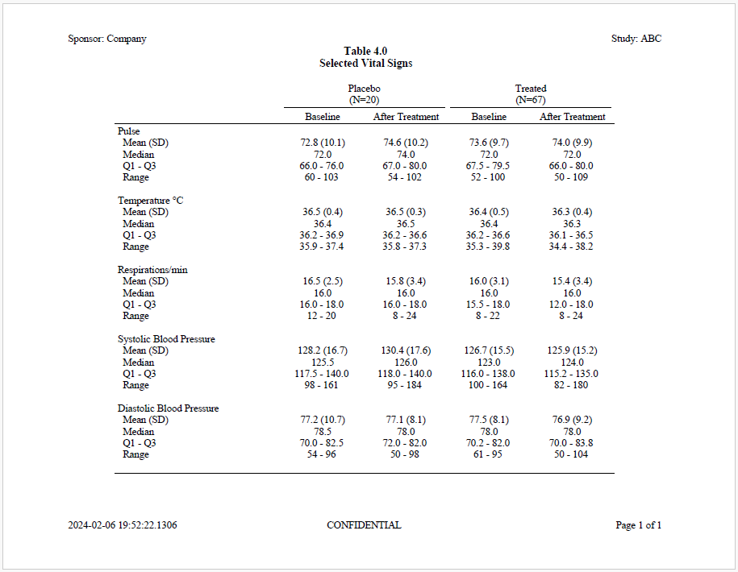
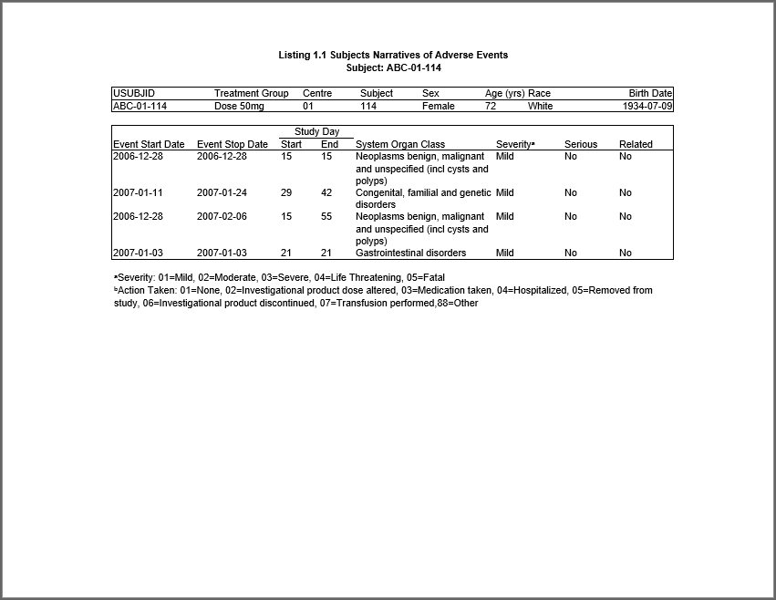

```{r, include = FALSE}
knitr::opts_chunk$set(
  collapse = TRUE,
  comment = "#>"
)
```

The **sassy** package is a meta-package that aims to make R easier for
everyone, especially people with a background in SAS®.
The package brings several useful SAS® concepts to R, including
data libraries, formats and format catalogs, data dictionaries, a data step,
a traceable log, and a reporting package with a variety of printable report types.

The **sassy** family of packages is meant to compliment the 
**tidyverse**.  While the **tidyverse** focuses mainly on data manipulation
and development tools, the **sassy** packages are focused more on 
formatting and reporting. For most projects, it is expected that users will 
load both the **tidyverse** and **sassy** meta-packages.  Between these two, 
the user will typically have everything they need to easily prepare and 
report on their data.  

### Included Packages
The **sassy** meta-package contains the following packages:

* **[logr](https://logr.r-sassy.org)**: Produces a traceable log
* **[fmtr](https://fmtr.r-sassy.org)**: Provides functions for formatting 
data and a creating a format catalog
* **[libr](https://libr.r-sassy.org)**: Gives you the ability to define a 
libname, generate a data dictionary, and simulate a data step
* **[reporter](https://reporter.r-sassy.org)**: A reporting package with easy 
layout capabilities and the 
ability to write reports in TXT, RTF, PDF, and DOCX file formats
* **[common](https://common.r-sassy.org)**: A set of utility functions
shared across the **sassy** family of packages, and often 
useful in their own right. 

The above links will take you into the respective packages for a deep
dive on their capabilities.  

### Next Steps
Before taking a deep dive into the **sassy** package documentation, please
look at some examples. These examples will give you a feel for the overall
flow of a **sassy**-enhanced program, and allow you to see how the functions 
work together.

The following examples are provided on this site:

* **[Example 1](sassy-listing.html)**: 
Creates a simple data listing and log
<a href="sassy-listing.html">
 
 </a>
<br>

* **[Example 2](sassy-dm.html)**: 
Creates a table of demographic characteristics  
<a href="sassy-dm.html">

</a>
<br>

* **[Example 3](sassy-figure.html)**: 
Creates a simple figure
<a href="sassy-figure.html">

</a>
<br>

* **[Example 4](sassy-ae.html)**: 
Creates an AE table with a page wrap
<a href="sassy-ae.html">

</a>
<br>

* **[Example 5](sassy-vs.html)**: 
Creates a table of vital signs statistics
<a href="sassy-vs.html">

</a>
<br>

* **[Example 6](sassy-figureby.html)**: 
Creates a figure with a by-group
<a href="sassy-figureby.html">

</a>
<br>

* **[Example 7](sassy-survival.html)**: 
Perform survival analysis.
<a href="sassy-survival.html">

</a>
<br>

* **[Example 8](sassy-profile.html)**: 
Create a patient profile report.
<a href="sassy-profile.html">

</a>
<br>

Once you review these examples, please proceed to the package links above to
explore the system further!


