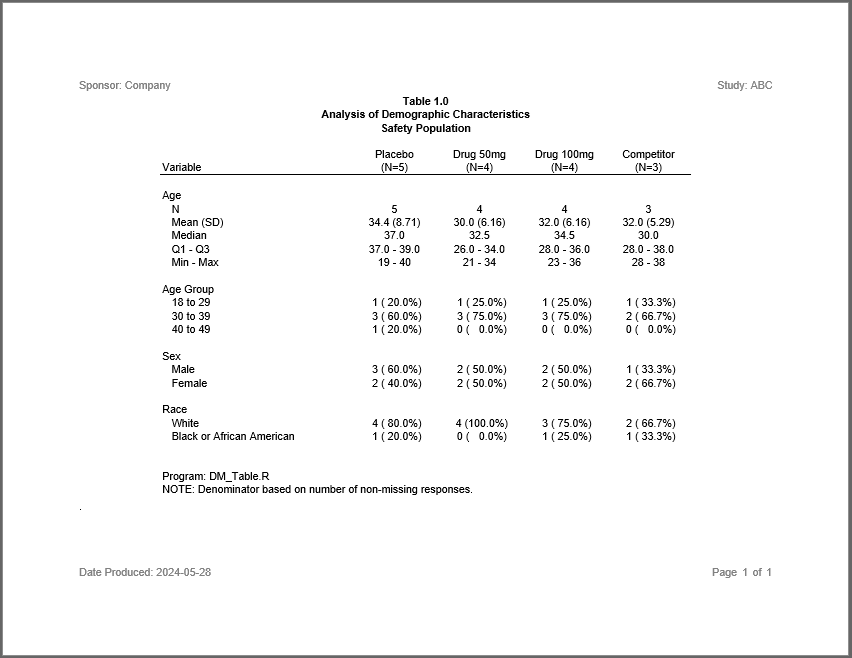
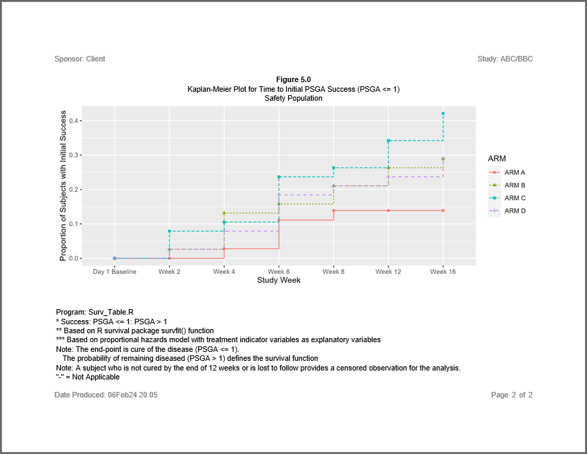

```{r, include = FALSE}
knitr::opts_chunk$set(
  collapse = TRUE,
  comment = "#>"
)
```

The **sassy** package is a meta-package that aims to make R easier for
everyone, especially people with a background in SAS®.
The package brings several useful SAS® concepts to R, including
data libraries, formats and format catalogs, data dictionaries, a data step,
a traceable log, and a reporting package with a variety of printable report types.

The core of the **sassy** system is the **procs** package.  This package contains 
replications of several SAS® procedures: `proc_freq()`, `proc_means()`,
`proc_transpose()`, and `proc_sort()`. Combined with the `datastep()` function
from the **libr** package, you can write code in R that very much resembles
what you would write in SAS®. These functions provide a higher-level programming
interface than is typically found in R, and can therefore make your analysis
more efficient and productive.

### Included Packages
The **sassy** meta-package contains the following packages:

* **[logr](https://logr.r-sassy.org)**: Produces a traceable log
* **[fmtr](https://fmtr.r-sassy.org)**: Provides functions for formatting 
data and a creating a format catalog
* **[libr](https://libr.r-sassy.org)**: Gives you the ability to define a 
libname, generate a data dictionary, and simulate a data step
* **[reporter](https://reporter.r-sassy.org)**: A reporting package with easy 
layout capabilities and the 
ability to write reports in TXT, RTF, PDF, and DOCX file formats
* **[common](https://common.r-sassy.org)**: A set of utility functions
shared across the **sassy** family of packages, and often 
useful in their own right. 
* **[procs](https://procs.r-sassy.org)**: A set of functions that simulate
SAS® procedures.  Package includes simulations of PROC FREQ, PROC MEANS,
PROC TRANSPOSE, PROC SORT, and PROC PRINT.

The above links will take you into the respective packages for a deep
dive on their capabilities.  

### Next Steps
Before taking a deep dive into the **sassy** package documentation, please
look at some examples. These examples will give you a feel for the overall
flow of a **sassy**-enhanced program, and allow you to see how the functions 
work together.

The following examples are provided on this site:

* **[Example 1](sassy-listing.html)**: 
Creates a simple data listing and log
<a href="sassy-listing.html">
 
 </a>
<br>

* **[Example 2](sassy-dm.html)**: 
Creates a table of demographic characteristics  
<a href="sassy-dm.html">

</a>
<br>

* **[Example 3](sassy-figure.html)**: 
Creates a simple figure
<a href="sassy-figure.html">

</a>
<br>

* **[Example 4](sassy-ae.html)**: 
Creates an AE table with a page wrap
<a href="sassy-ae.html">

</a>
<br>

* **[Example 5](sassy-vs.html)**: 
Creates a table of vital signs statistics
<a href="sassy-vs.html">

</a>
<br>

* **[Example 6](sassy-figureby.html)**: 
Creates a figure with a by-group
<a href="sassy-figureby.html">

</a>
<br>

* **[Example 7](sassy-survival.html)**: 
Perform survival analysis.
<a href="sassy-survival.html">

</a>
<br>

* **[Example 8](sassy-profile.html)**: 
Creates a patient profile report.
<a href="sassy-profile.html">

</a>
<br>

* **[Example 9](sassy-forest.html)**: 
Creates a figure with a forest plot.
<a href="sassy-forest.html">

</a>
<br>

* **[Example 10](sassy-ds.html)**: 
Creates a subject disposition table.
<a href="sassy-ds.html">

</a>
<br>

* **[Example 11](sassy-plisting.html)**: 
Creates a subject listing with vital signs by visit.
<a href="sassy-plisting.html">

</a>
<br>

* **[Example 12](sassy-pfigure.html)**: 
Creates a combined figure of age groups by treatment.
<a href="sassy-pfigure.html">

</a>
<br>

* **[Example 13](sassy-chgbase.html)**: 
Creates a Mean Change from Baseline figure for laboratory values.
<a href="sassy-chgbase.html">

</a>
<br>

* **[Example 14](sassy-ae2.html)**: 
Creates an AE table with severity grades in rows
<a href="sassy-ae2.html">

</a>
<br>

* **[Example 15](sassy-intext.html)**: 
Creates both stand-alone and "intext" versions of a demographics table. 
<a href="sassy-intext.html">

</a>
<br>


* **[Example 16](sassy-shift.html)**: 
Creates a shift table of lab values. 
<a href="sassy-shift.html">

</a>
<br>

Once you review these examples, please proceed to the package links above to
explore the system further!


